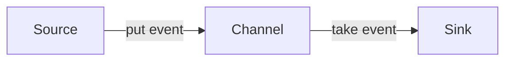
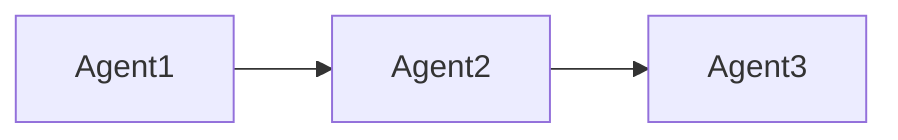
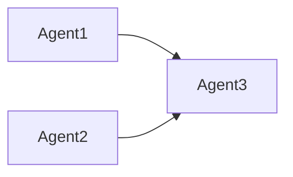
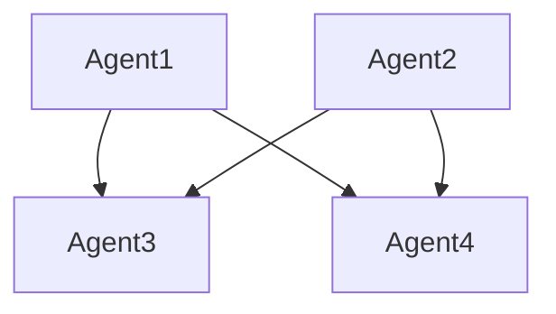

# Flume原理与代码实例讲解

## 1. 背景介绍
### 1.1 大数据日志收集面临的挑战
在大数据时代,海量的日志数据成为企业进行数据分析和决策的重要资源。然而,如何高效、可靠地收集和传输这些分布在各个服务器上的日志数据,成为大数据应用面临的一大挑战。传统的日志收集方式,如syslog、rsyslog等,在性能、可靠性和扩展性方面都难以满足大规模集群环境下的需求。
### 1.2 Flume的诞生
为了解决大数据日志收集的难题,Cloudera公司开发了Flume。Flume是一个分布式、可靠、高可用的海量日志聚合系统,它能够从多个数据源收集数据,经过聚合后发送到集中的存储系统中,如HDFS、HBase等。Flume采用基于事件流的数据传输方式,具有高吞吐、可扩展、容错等优点,已成为Hadoop生态圈中不可或缺的重要组件。
### 1.3 Flume的应用现状
目前,Flume被广泛应用于各种大数据场景,如日志收集、数据ETL、实时数据处理等。许多互联网公司都构建了基于Flume的日志收集平台,每天处理PB级的海量数据。Flume作为Apache顶级项目,拥有活跃的社区和完善的生态,在可预见的未来仍将是大数据领域的主流技术之一。

## 2. 核心概念与联系
### 2.1 基本概念
- Event:Flume数据传输的基本单元,包含header和body两部分。
- Source:数据收集组件,从外部数据源收集数据,并封装成Event。
- Channel:中转Event的临时存储,可以是内存或持久化存储。
- Sink:数据发送组件,将Channel中的Event发送到下一个Flume Agent或最终存储系统。
### 2.2 核心组件之间的关系
Flume采用Agent作为数据传输的基本单位。一个Agent由Source、Channel和Sink三个核心组件组成。它们之间的关系如下:

Source负责从外部数据源收集数据,将其封装成Event放入Channel中。Sink不断从Channel取出Event,发送到下一个Agent或存储系统。Channel在其中起到了缓冲和解耦的作用。
### 2.3 Flume拓扑结构
Flume支持多种拓扑结构,可以将多个Agent连接起来,组成复杂的数据传输管道。常见的拓扑结构有:
- 简单串联:

- 多路复用:

- 分层树状:

灵活的拓扑结构赋予了Flume极大的适应性,可以应对各种复杂的数据收集场景。

## 3. 核心算法原理与具体操作步骤
### 3.1 可靠性事务机制
Flume的一大特点是提供了端到端的事务机制,确保数据在各个环节都不丢失。其基本原理如下:
1. Source提交事务后,数据才被发送到Channel。
2. Channel采用两阶段提交协议,确保数据可靠存储。
3. Sink在完成数据发送后,向Channel提交事务。
4. 事务提交失败时,数据回滚,等待重传。
### 3.2 Failover机制
为了保证高可用,Flume提供了Failover机制。当某个Agent节点宕机时,系统能够自动切换到备用节点,避免数据丢失。
1. 热备:部署多个Agent,互相监控心跳。
2. 冷备:备用Agent定期同步数据,在故障时接管。
3. 推拉结合:上下游Agent通过推拉方式交互,实现负载均衡。
### 3.3 负载均衡
Flume支持多种负载均衡策略,将数据流量合理分配到多个Agent,充分利用系统资源。
1. 轮询:依次将Event发送到下游Agent。
2. 随机:随机选择一个下游Agent发送。
3. 权重:按照预设权重分配数据流量。

## 4. 数学模型与公式详解
### 4.1 泊松过程与指数分布
Flume的数据流可以看作一个泊松过程,即单位时间内事件发生次数服从泊松分布,事件之间的间隔时间服从指数分布。设单位时间内事件发生率为$\lambda$,则事件数$X$的概率分布为:

$$
P(X=k)=\frac{\lambda^k}{k!}e^{-\lambda} \quad k=0,1,2,...
$$

事件之间的间隔时间$T$的概率密度函数为:

$$
f_T(t)=\lambda e^{-\lambda t} \quad t \geq 0
$$

### 4.2 队列论与Little定律
Channel可以看作一个队列系统,服从Little定律。设到达率为$\lambda$,平均服务时间为$W$,平均队长为$L$,则有:

$$
L=\lambda W
$$

这意味着,增大Channel的容量或减小数据处理时间,可以缓解系统的压力,提高吞吐量。

## 5. 项目实践:代码实例与详解
下面通过一个简单的示例,演示如何使用Flume收集日志并存储到HDFS。
### 5.1 安装部署
1. 下载Flume安装包,解压到指定目录。
2. 配置环境变量FLUME_HOME,指向安装目录。
3. 修改配置文件flume-env.sh,设置JAVA_HOME。
### 5.2 配置文件
创建配置文件example.conf,定义Agent的组成:
```properties
# 定义Agent的组成
a1.sources = r1
a1.sinks = k1
a1.channels = c1

# 配置Source
a1.sources.r1.type = netcat
a1.sources.r1.bind = localhost
a1.sources.r1.port = 44444

# 配置Sink
a1.sinks.k1.type = hdfs
a1.sinks.k1.hdfs.path = /flume/events/%y-%m-%d/%H%M/
a1.sinks.k1.hdfs.filePrefix = events-
a1.sinks.k1.hdfs.round = true
a1.sinks.k1.hdfs.roundValue = 10
a1.sinks.k1.hdfs.roundUnit = minute

# 配置Channel
a1.channels.c1.type = memory
a1.channels.c1.capacity = 1000
a1.channels.c1.transactionCapacity = 100

# 连接组件
a1.sources.r1.channels = c1
a1.sinks.k1.channel = c1
```
### 5.3 启动Agent
```bash
flume-ng agent \
--conf conf \
--conf-file example.conf \
--name a1 \
-Dflume.root.logger=INFO,console
```
### 5.4 测试
在44444端口发送数据,观察HDFS目录,可以看到不断有文件生成,说明数据收集成功。
```bash
telnet localhost 44444
```

## 6. 实际应用场景
Flume在实际生产环境中有广泛的应用,下面列举几个典型场景:
### 6.1 Web服务器日志收集
Flume监听Web服务器的日志文件,实时收集访问日志、错误日志等,发送到HDFS或日志分析系统,进行流量分析、异常监控等。
### 6.2 业务数据ETL
Flume可以接入各种异构数据源,如关系数据库、NoSQL数据库、消息队列等,经过清洗、转换、聚合等操作,将数据加载到目标存储系统,完成ETL过程。
### 6.3 实时数据处理
Flume与Kafka、Spark Streaming等实时计算框架结合,可以实现端到端的实时数据处理管道,应用于实时推荐、风控等场景。

## 7. 工具与资源推荐
### 7.1 Flume官网
[http://flume.apache.org](http://flume.apache.org)
### 7.2 Flume用户手册
[http://flume.apache.org/FlumeUserGuide.html](http://flume.apache.org/FlumeUserGuide.html)
### 7.3 Flume Github仓库
[https://github.com/apache/flume](https://github.com/apache/flume)
### 7.4 Cloudera Flume架构剖析
[https://blog.cloudera.com/flume-architecture-of-flume-ng](https://blog.cloudera.com/flume-architecture-of-flume-ng)

## 8. 总结:未来发展与挑战
Flume作为一个成熟的分布式日志收集系统,已经在大数据领域得到了广泛应用。未来,Flume将在以下几个方向继续发展:
1. 云原生:提供更好的云环境支持,简化部署和运维。
2. 智能化:引入AI算法,实现数据流的智能调度和异常检测。
3. 实时化:与流计算引擎深度集成,提供端到端的实时处理能力。
4. 多样化:支持更多数据源和数据类型,如非结构化数据等。

同时,Flume也面临一些挑战:
1. 性能瓶颈:单个Agent的处理能力有限,大规模集群的性能优化难度大。
2. 运维复杂:Agent数量多,配置和监控工作量大。
3. 缺乏全局视图:多个Agent之间缺乏统一的协调和管理。

相信通过社区的不断努力,Flume将克服这些挑战,为大数据时代的数据收集架起更加高效、智能的桥梁。

## 9. 附录:常见问题与解答
### 9.1 Flume与Logstash的区别?
Flume和Logstash都是常用的日志收集工具,但各有侧重:
- Flume偏重于批处理,适合海量数据的离线收集。
- Logstash偏重于实时处理,适合数据的实时检索和分析。
- Flume使用Java开发,对接Hadoop生态。
- Logstash基于Ruby,与Elasticsearch配合紧密。
### 9.2 Flume Channel如何选型?
Flume提供了多种Channel,适用于不同的场景:
- Memory Channel:基于内存,速度快,但可靠性差,适合对数据质量要求不高的场景。
- File Channel:基于磁盘,速度慢,但可靠性高,适合对数据质量要求高的场景。
- Kafka Channel:以Kafka为中间存储,可靠性高,同时提供了解耦和缓冲。
### 9.3 Flume如何实现断点续传?
Flume本身不支持断点续传,但可以通过以下方式实现:
- 在Source端记录采集文件的偏移量,断点恢复时从上次偏移处继续。
- 在HDFS Sink指定恢复标记,断点恢复时会接着上次的文件继续写入。
- 将Event的唯一标识如时间戳保存到header中,去重时进行判断。

作者：禅与计算机程序设计艺术 / Zen and the Art of Computer Programming