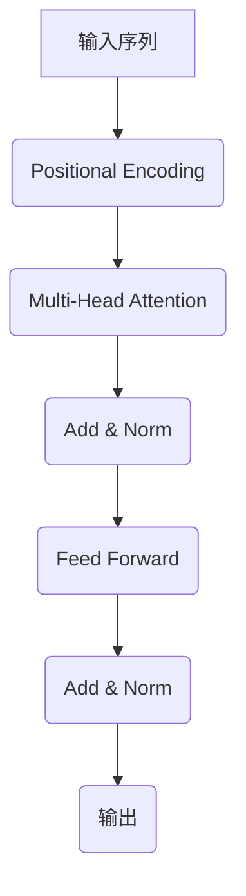

# GPT原理与代码实例讲解

## 1.背景介绍

在过去几年中,自然语言处理(NLP)领域取得了长足的进步,很大程度上归功于transformer模型和预训练语言模型(PLM)的出现。其中,GPT(Generative Pre-trained Transformer)无疑是最具影响力的预训练语言模型之一。GPT最初由OpenAI于2018年提出,旨在通过预训练的方式学习通用的语言表示,并将其应用于广泛的自然语言处理任务中。

GPT的核心思想是利用大规模的文本语料进行自监督预训练,捕捉语言的内在规律和语义关联。预训练阶段不需要人工标注的数据,而是通过掩码语言模型(Masked Language Modeling)和下一句预测(Next Sentence Prediction)等任务,学习文本的上下文语义表示。之后,可以在特定的下游任务上进行微调(Fine-tuning),使模型适应目标任务的特征。

GPT及其后续版本(GPT-2、GPT-3)展现出了惊人的语言生成能力,可以生成富有连贯性和创造性的文本内容。它们不仅在自然语言生成任务中表现出色,而且在机器翻译、文本摘要、问答系统等多个领域也有广泛的应用前景。

## 2.核心概念与联系

### 2.1 Transformer架构

GPT模型的核心架构是基于Transformer的,Transformer最初被设计用于机器翻译任务,但由于其强大的建模能力,很快被广泛应用于自然语言处理的各个领域。

Transformer的主要创新点在于完全摒弃了传统序列模型中的循环神经网络(RNN)和卷积神经网络(CNN),而是采用了自注意力(Self-Attention)机制来捕捉输入序列中任意两个位置之间的依赖关系。这种全局依赖建模方式使得Transformer能够更好地并行计算,提高了训练效率。

Transformer的编码器(Encoder)和解码器(Decoder)都是由多个相同的层组成,每一层包含了多头自注意力子层(Multi-Head Attention Sublayer)和前馈神经网络子层(Feed-Forward Neural Network Sublayer)。在GPT中,只使用了Transformer的解码器部分,因为它主要关注的是语言生成任务。

### 2.2 自注意力机制

自注意力机制是Transformer的核心部分,它能够捕捉输入序列中任意两个位置之间的依赖关系。对于给定的查询(Query)向量q、键(Key)向量k和值(Value)向量v,自注意力计算过程如下:

$$\mathrm{Attention}(Q, K, V) = \mathrm{softmax}(\frac{QK^T}{\sqrt{d_k}})V$$

其中,$$d_k$$是键向量的维度,用于缩放点积的值,防止过大的值导致softmax函数的梯度较小。

在实际应用中,通常会使用多头自注意力(Multi-Head Attention),它可以从不同的表示子空间捕捉不同的依赖关系,从而提高模型的表达能力。多头自注意力的计算过程如下:

$$\mathrm{MultiHead}(Q, K, V) = \mathrm{Concat}(head_1, ..., head_h)W^O$$
$$\text{where } head_i = \mathrm{Attention}(QW_i^Q, KW_i^K, VW_i^V)$$

其中,$$W_i^Q$$、$$W_i^K$$、$$W_i^V$$和$$W^O$$是可学习的线性变换矩阵。

### 2.3 掩码语言模型

掩码语言模型(Masked Language Modeling, MLM)是GPT预训练的核心任务之一。它的基本思想是在输入序列中随机掩码一部分单词,然后让模型基于上下文预测被掩码的单词。这种自监督的预训练方式可以让模型学习到丰富的语义和上下文信息。

在实现上,GPT采用了一种特殊的掩码策略,即只掩码连续的一段文本,而不是随机掩码单个单词。这种策略可以更好地捕捉长距离依赖关系,同时也更加接近实际的语言生成场景。

### 2.4 下一句预测

除了掩码语言模型,GPT还采用了下一句预测(Next Sentence Prediction, NSP)作为预训练任务之一。该任务的目标是判断两个给定的句子是否为连续的句子对。

通过下一句预测任务,GPT可以学习到更高层次的语义和逻辑关系,从而提高在下游任务(如问答系统、文本摘要等)中的表现。

## 3.核心算法原理具体操作步骤

GPT的训练过程可以分为两个阶段:预训练(Pre-training)和微调(Fine-tuning)。

### 3.1 预训练阶段

预训练阶段的目标是在大规模语料库上学习通用的语言表示,为后续的下游任务做好准备。GPT的预训练过程包括以下步骤:

1. **数据预处理**:将原始文本语料进行标记化(Tokenization)、填充(Padding)等预处理操作,转换为模型可以接受的输入格式。

2. **构建掩码**:根据掩码语言模型的策略,在输入序列中随机选择一段连续的文本,并用特殊的掩码符号(如[MASK])替换。

3. **前向传播**:将处理后的输入序列输入到GPT模型中,计算被掩码位置的单词概率分布。

4. **计算损失**:将模型预测的概率分布与真实的单词标签进行比较,计算掩码语言模型的交叉熵损失。

5. **下一句预测**:对于连续的两个句子对,将它们作为输入,让模型预测它们是否为连续的句子对,并计算相应的二分类损失。

6. **反向传播**:将掩码语言模型损失和下一句预测损失相加,作为总的损失值,并通过反向传播算法更新模型参数。

7. **模型更新**:使用优化算法(如Adam)根据计算出的梯度,更新GPT模型的参数。

8. **重复训练**:重复上述步骤,不断迭代训练,直到模型收敛或达到预设的训练轮次。

通过上述预训练过程,GPT可以学习到丰富的语言知识,捕捉语义和上下文信息,为后续的下游任务做好准备。

### 3.2 微调阶段

预训练完成后,GPT可以在特定的下游任务上进行微调(Fine-tuning),以适应目标任务的特征。微调的基本思路是:初始化模型参数为预训练得到的参数值,然后在标注的下游数据集上继续训练,使模型逐步适应目标任务。

以文本分类任务为例,微调阶段的步骤如下:

1. **数据准备**:准备标注好的文本分类数据集,将其划分为训练集、验证集和测试集。

2. **模型初始化**:将预训练得到的GPT模型参数作为初始参数。

3. **前向传播**:将输入文本序列输入到GPT模型中,获取最终的文本表示向量。

4. **分类头**:在GPT模型的输出上添加一个分类头(Classification Head),将文本表示向量映射到目标分类空间。

5. **计算损失**:将分类头的输出概率分布与真实标签进行比较,计算分类损失(如交叉熵损失)。

6. **反向传播**:根据分类损失,通过反向传播算法更新GPT模型和分类头的参数。

7. **模型评估**:在验证集上评估模型的性能,根据指标(如准确率、F1分数等)判断是否需要继续训练或调整超参数。

8. **重复训练**:重复上述步骤,直到模型在验证集上的性能不再提升为止。

9. **模型测试**:在保留的测试集上评估最终模型的性能。

通过微调过程,GPT模型可以逐步适应目标任务的特征,提高在该任务上的表现。值得注意的是,微调过程中只需要对部分参数(如输出层)进行更新,而大部分参数保持不变,这样可以在新任务上快速收敛,同时保留了预训练阶段学习到的通用语言知识。

## 4.数学模型和公式详细讲解举例说明

在GPT模型中,自注意力机制是核心的计算模块,它能够捕捉输入序列中任意两个位置之间的依赖关系。我们将详细介绍自注意力机制的数学原理和计算过程。

### 4.1 标量自注意力

给定一个查询向量$$q \in \mathbb{R}^{d_q}$$、一组键向量$$K = [k_1, k_2, \dots, k_n]$$,其中$$k_i \in \mathbb{R}^{d_k}$$,以及一组值向量$$V = [v_1, v_2, \dots, v_n]$$,其中$$v_i \in \mathbb{R}^{d_v}$$,标量自注意力的计算过程如下:

1. 计算查询向量与每个键向量的点积,得到一个注意力分数向量$$s$$:

$$s = [s_1, s_2, \dots, s_n], \quad s_i = q \cdot k_i$$

2. 对注意力分数向量$$s$$进行缩放处理,防止过大的值导致softmax函数的梯度较小:

$$\tilde{s} = [s_1 / \sqrt{d_k}, s_2 / \sqrt{d_k}, \dots, s_n / \sqrt{d_k}]$$

3. 对缩放后的注意力分数向量$$\tilde{s}$$应用softmax函数,得到注意力权重向量$$\alpha$$:

$$\alpha = \mathrm{softmax}(\tilde{s}) = \left[ \frac{e^{\tilde{s}_1}}{\sum_{j=1}^n e^{\tilde{s}_j}}, \frac{e^{\tilde{s}_2}}{\sum_{j=1}^n e^{\tilde{s}_j}}, \dots, \frac{e^{\tilde{s}_n}}{\sum_{j=1}^n e^{\tilde{s}_j}} \right]$$

4. 将注意力权重向量$$\alpha$$与值向量$$V$$进行加权求和,得到输出向量$$o$$:

$$o = \sum_{i=1}^n \alpha_i v_i$$

上述过程可以用公式$$\mathrm{Attention}(Q, K, V) = \mathrm{softmax}(\frac{QK^T}{\sqrt{d_k}})V$$来表示,其中$$Q$$是查询向量$$q$$的矩阵形式,$$K$$和$$V$$分别是键向量和值向量的矩阵形式。

### 4.2 多头自注意力

在实际应用中,通常会使用多头自注意力(Multi-Head Attention)机制,它可以从不同的表示子空间捕捉不同的依赖关系,从而提高模型的表达能力。

多头自注意力的计算过程如下:

1. 将查询向量$$Q$$、键向量$$K$$和值向量$$V$$分别线性映射到$$h$$个子空间,得到$$Q_i$$、$$K_i$$和$$V_i$$,其中$$i = 1, 2, \dots, h$$:

$$Q_i = QW_i^Q, \quad K_i = KW_i^K, \quad V_i = VW_i^V$$

其中,$$W_i^Q \in \mathbb{R}^{d_{\text{model}} \times d_q}$$、$$W_i^K \in \mathbb{R}^{d_{\text{model}} \times d_k}$$和$$W_i^V \in \mathbb{R}^{d_{\text{model}} \times d_v}$$是可学习的线性变换矩阵。

2. 对于每个子空间,分别计算标量自注意力,得到$$h$$个输出向量$$o_i$$:

$$o_i = \mathrm{Attention}(Q_i, K_i, V_i)$$

3. 将$$h$$个输出向量$$o_i$$拼接起来,并进行线性变换,得到最终的多头自注意力输出$$\mathrm{MultiHead}(Q, K, V)$$:

$$\mathrm{MultiHead}(Q, K, V) = \mathrm{Concat}(o_1, o_2, \dots, o_h)W^O$$

其中,$$W^O \in \mathbb{R}^{d_{\text{model}} \times d_v}$$是可学习的线性变换矩阵。

通过多头自注意力机制,GPT模型可以从不同