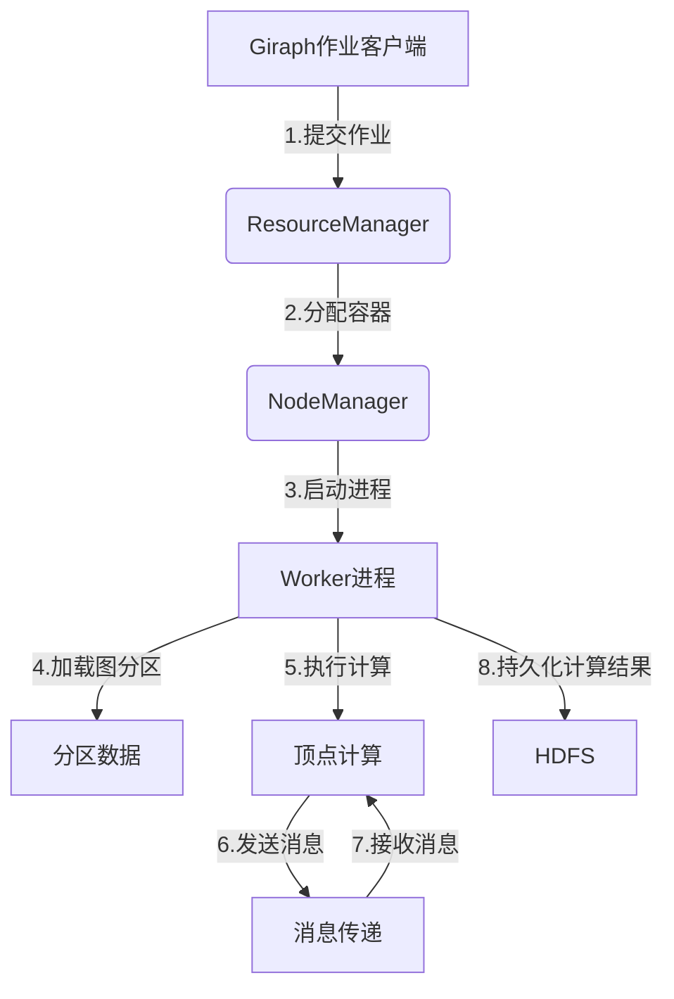

# Giraph原理与代码实例讲解

## 1.背景介绍

### 1.1 大数据时代的到来

随着互联网、物联网和云计算的快速发展,海量的结构化和非结构化数据不断产生。传统的数据处理方式已经无法满足大数据时代的需求。大数据时代对数据处理的要求是:高并发、高吞吐、高可扩展性和高容错性。

### 1.2 MapReduce计算模型

MapReduce是一种分布式计算模型,由Google提出,用于处理海量数据。它将计算过程分为两个阶段:Map阶段和Reduce阶段。MapReduce可以将大规模计算分解为多个小任务并行运行在大量廉价计算机集群上,从而实现高性能的大规模数据处理。

### 1.3 图计算的重要性

许多现实问题可以用图模型来表示,如社交网络、Web链接结构、交通路线规划等。图计算是大数据处理中一个非常重要的领域。然而,MapReduce模型并不适合高效处理图数据,因为它的计算模式是基于记录的。

### 1.4 Giraph的诞生

为了高效处理大规模图数据,Apache Giraph应运而生。Giraph是一个可扩展的、容错的、用于处理大规模图数据的分布式系统,它基于Hadoop的MapReduce实现,并采用Pregel的图计算模型。Giraph可以高效地执行诸如页面排名、社交网络分析等图计算任务。

## 2.核心概念与联系

### 2.1 Pregel计算模型

Pregel是一种大规模图并行计算模型,由Google提出。它将图计算过程分为一系列超级步(Superstep),每个超级步包含三个阶段:

1. 消息传递阶段:顶点之间传递消息
2. 顶点并行计算阶段:每个顶点并行执行用户定义的计算逻辑
3. 顶点投票阶段:每个顶点决定是否进入下一个超级步

Pregel模型的核心思想是将图分区存储在集群中,每个分区由一个Worker进程负责处理。Worker进程负责管理本地分区的顶点计算、消息传递和容错等。

### 2.2 Giraph的架构

Giraph的架构由以下几个主要组件组成:



1. **Giraph作业客户端**: 用户通过该客户端提交Giraph作业到Hadoop集群。
2. **ResourceManager**: Hadoop的资源管理器,负责分配和管理集群资源。
3. **NodeManager**: 运行在每个节点上的进程,负责启动和监控容器。
4. **Worker进程**: 执行图计算任务的进程,每个Worker负责一个图分区的计算。
5. **分区数据**: 图数据被划分为多个分区,存储在HDFS上。
6. **顶点计算**: 每个Worker执行本地分区的顶点计算逻辑。
7. **消息传递**: Worker之间传递消息,实现顶点之间的通信。
8. **HDFS**: 计算结果持久化存储在HDFS上。

### 2.3 Giraph的计算流程

Giraph的计算流程遵循Pregel模型,包括以下几个主要步骤:

1. **初始化**: 加载图数据,为每个顶点分配初始值。
2. **超级步迭代**:
   a. **消息传递阶段**: 顶点发送消息到其他顶点。
   b. **顶点计算阶段**: 每个顶点并行执行用户定义的计算逻辑,根据收到的消息更新自身状态。
   c. **顶点投票阶段**: 每个顶点决定是否进入下一个超级步。
3. **终止**: 当所有顶点投票停止时,计算结束。
4. **输出结果**: 将计算结果输出到HDFS。

## 3.核心算法原理具体操作步骤

### 3.1 图划分

Giraph采用范围分区(Range Partitioning)和哈希分区(Hash Partitioning)两种方式对图进行划分。

#### 3.1.1 范围分区

范围分区根据顶点ID的范围将顶点划分到不同的分区。例如,如果有4个分区,顶点ID范围为[0,100),则:

- 分区0: [0,25)
- 分区1: [25,50)
- 分区2: [50,75)
- 分区3: [75,100)

范围分区的优点是顶点ID连续,便于处理局部图计算。缺点是可能导致负载不均衡。

#### 3.1.2 哈希分区

哈希分区根据顶点ID的哈希值将顶点划分到不同的分区。例如,如果有4个分区,则:

- 分区0: hash(vertexId) % 4 = 0
- 分区1: hash(vertexId) % 4 = 1
- 分区2: hash(vertexId) % 4 = 2
- 分区3: hash(vertexId) % 4 = 3

哈希分区的优点是可以实现较好的负载均衡。缺点是顶点ID不连续,不利于局部图计算。

### 3.2 消息传递

Giraph采用"发送消息"的方式实现顶点之间的通信。每个顶点可以向其他顶点发送消息,消息将在下一个超级步中被接收。

消息传递过程如下:

1. 在超级步的消息传递阶段,每个Worker将本地分区的发送消息缓存到内存中。
2. 根据目标顶点ID,将消息分发到对应的Worker。
3. 在下一个超级步的顶点计算阶段,每个Worker将收到的消息传递给对应的顶点。

为了提高消息传递效率,Giraph采用了以下优化策略:

- **消息组合**: 将发送到同一个目标顶点的多条消息组合成一条消息,减少网络开销。
- **消息压缩**: 对发送的消息进行压缩,减少网络传输量。
- **消息缓存**: 在内存中缓存消息,避免频繁的磁盘IO操作。

### 3.3 容错机制

Giraph采用了CheckPoint和重新计算两种容错机制,以确保计算的可靠性和容错性。

#### 3.3.1 CheckPoint

CheckPoint是Giraph的主要容错机制。在每个超级步结束时,Giraph会将当前计算状态(包括顶点值、边值和消息等)持久化存储到HDFS上,形成一个CheckPoint。如果发生故障,Giraph可以从最近的CheckPoint恢复计算。

CheckPoint的优点是可以快速恢复计算,缺点是需要额外的存储空间和IO开销。

#### 3.3.2 重新计算

重新计算是Giraph的辅助容错机制。如果某个Worker进程发生故障,Giraph会将该Worker管理的图分区重新分配给其他Worker,并从头开始重新计算该分区。

重新计算的优点是不需要额外的存储空间,缺点是计算开销较大。

### 3.4 图计算示例

以下是一个简单的PageRank算法在Giraph中的实现示例:

```java
public static class PageRankVertex extends
    Vertex<LongWritable, DoubleWritable, DoubleWritable, MessageWritable> {

    @Override
    public void compute(Iterator<DoubleWritable> msgIterator) {
        double sum = 0;
        while (msgIterator.hasNext()) {
            sum += msgIterator.next().get();
        }
        
        // 计算PageRank值
        double pr = sum * ALPHA + (1 - ALPHA) / getTotalNumVertices();
        
        // 发送PageRank值给邻居
        sendMessageToAllEdges(new DoubleWritable(pr / getTotalNumEdges()));
        
        // 更新本地PageRank值
        setValue(new DoubleWritable(pr));
        
        // 投票决定是否进入下一个超级步
        voteToHalt();
    }
}
```

上述代码实现了PageRank算法的核心逻辑。在每个超级步中,顶点会接收来自邻居的PageRank值,计算自身的新PageRank值,并将新值发送给邻居。当所有顶点的PageRank值收敛时,算法终止。

## 4.数学模型和公式详细讲解举例说明

### 4.1 PageRank算法

PageRank是一种用于衡量网页重要性的算法,它是Google搜索引擎的核心算法之一。PageRank的基本思想是:一个网页的重要性不仅取决于它被多少其他网页链接,还取决于链接它的网页的重要性。

PageRank算法的数学模型如下:

$$PR(u) = \frac{1-d}{N} + d \sum_{v \in B_u} \frac{PR(v)}{L(v)}$$

其中:

- $PR(u)$表示网页$u$的PageRank值
- $B_u$是链接到网页$u$的网页集合
- $L(v)$是网页$v$的出链接数
- $N$是网页总数
- $d$是阻尼系数,通常取值0.85

PageRank算法的迭代过程如下:

1. 初始化所有网页的PageRank值为$\frac{1}{N}$。
2. 对每个网页$u$,计算其新的PageRank值$PR(u)$。
3. 重复步骤2,直到PageRank值收敛。

PageRank算法的收敛性可以通过线性代数理论证明。

### 4.2 PageRank算法在Giraph中的实现

在Giraph中实现PageRank算法的关键步骤如下:

1. 每个顶点代表一个网页,边代表网页之间的链接关系。
2. 初始化阶段,为每个顶点分配初始PageRank值$\frac{1}{N}$。
3. 在每个超级步的消息传递阶段,每个顶点将自身的PageRank值除以出链接数,发送给所有邻居顶点。
4. 在顶点计算阶段,每个顶点根据公式$PR(u) = \frac{1-d}{N} + d \sum_{v \in B_u} \frac{PR(v)}{L(v)}$计算新的PageRank值。
5. 在顶点投票阶段,如果顶点的PageRank值与上一个超级步相比变化很小,则投票停止。
6. 重复步骤3-5,直到所有顶点投票停止。

以下是Giraph中PageRank算法的示例代码:

```java
public static class PageRankVertex extends
    Vertex<LongWritable, DoubleWritable, DoubleWritable, MessageWritable> {
    
    private static final double ALPHA = 0.85;
    
    @Override
    public void compute(Iterator<DoubleWritable> msgIterator) {
        double sum = 0;
        while (msgIterator.hasNext()) {
            sum += msgIterator.next().get();
        }
        
        double pr = sum * ALPHA + (1 - ALPHA) / getTotalNumVertices();
        sendMessageToAllEdges(new DoubleWritable(pr / getTotalNumEdges()));
        setValue(new DoubleWritable(pr));
        voteToHalt();
    }
}
```

在上述代码中,`compute`方法实现了PageRank算法的核心逻辑。顶点首先计算收到的PageRank值之和,然后根据公式计算新的PageRank值,并将新值发送给邻居顶点。最后,顶点更新自身的PageRank值,并投票决定是否进入下一个超级步。

## 5.项目实践:代码实例和详细解释说明

本节将通过一个简单的示例项目,演示如何使用Giraph实现PageRank算法。

### 5.1 项目结构

```
giraph-pagerank/
├── pom.xml
├── src/
│   ├── main/
│   │   ├── java/
│   │   │   └── com/
│   │   │       └── example/
│   │   │           ├── PageRankVertex.java
│   │   │           └── PageRankRunner.java
│   │   └── resources/
│   │       └── sample-graph.txt
│   └── test/
└── README.md
```

- `pom.xml`: Maven项目配置文件
- `PageRankVertex.java`: 实现PageRank算法逻辑的顶点类
- `PageRankRunner.java`: 运行PageRank作业的主类
- `sample-graph.txt`: 示例图数据文件

### 5.2 实现PageRankVertex

`PageRankVertex`类实现了PageRank算法的核心逻辑,继承