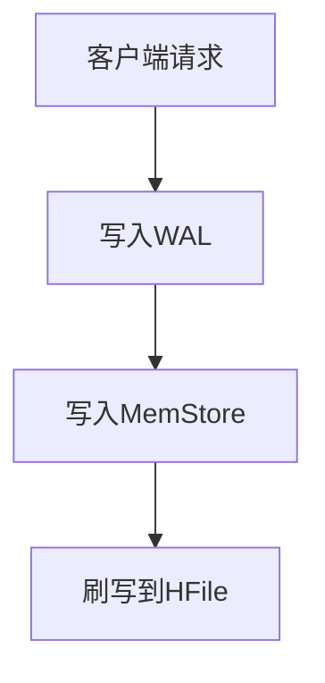
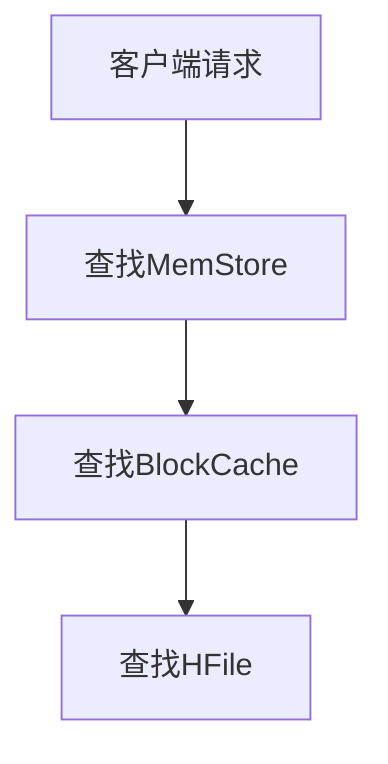

# HBase分布式列式数据库原理与代码实例讲解

## 1.背景介绍

在大数据时代，传统的关系型数据库在处理海量数据时显得力不从心。HBase作为一种分布式、列式存储的NoSQL数据库，因其高效的读写性能和良好的扩展性，成为了大数据处理领域的重要工具。HBase基于Hadoop HDFS构建，能够处理PB级别的数据，广泛应用于实时数据分析、日志处理、社交网络等场景。

## 2.核心概念与联系

### 2.1 HBase架构概述

HBase的架构主要包括以下几个核心组件：

- **HMaster**：负责管理HBase集群的元数据和RegionServer的负载均衡。
- **RegionServer**：负责存储和管理实际的数据。
- **Zookeeper**：用于协调和管理HBase集群的分布式环境。
- **HDFS**：HBase的数据存储基础，提供可靠的分布式文件系统。

### 2.2 数据模型

HBase的数据模型与传统的关系型数据库不同，采用了列式存储的方式。其核心概念包括：

- **表（Table）**：类似于关系型数据库中的表，但没有固定的模式。
- **行（Row）**：每行由一个行键（Row Key）唯一标识。
- **列族（Column Family）**：列的集合，列族中的列可以动态增加。
- **列限定符（Column Qualifier）**：具体的列名。
- **时间戳（Timestamp）**：每个单元格的数据版本。

### 2.3 数据存储与读取

HBase的数据存储在HDFS中，采用了LSM树（Log-Structured Merge-Tree）的结构。数据写入时，首先写入内存中的MemStore，然后定期刷写到磁盘上的HFile中。读取时，首先从MemStore中查找，再从HFile中查找。

## 3.核心算法原理具体操作步骤

### 3.1 数据写入流程

数据写入HBase的流程如下：

1. **客户端请求**：客户端通过HBase API发送写请求。
2. **写入WAL**：数据首先写入预写日志（WAL），确保数据的持久性。
3. **写入MemStore**：数据写入内存中的MemStore。
4. **刷写到HFile**：当MemStore达到一定大小时，数据刷写到磁盘上的HFile中。



### 3.2 数据读取流程

数据读取HBase的流程如下：

1. **客户端请求**：客户端通过HBase API发送读请求。
2. **查找MemStore**：首先从内存中的MemStore中查找数据。
3. **查找BlockCache**：如果MemStore中没有找到，从BlockCache中查找。
4. **查找HFile**：如果BlockCache中没有找到，从磁盘上的HFile中查找。



## 4.数学模型和公式详细讲解举例说明

### 4.1 LSM树模型

LSM树（Log-Structured Merge-Tree）是HBase数据存储的核心结构。LSM树通过将数据分批写入内存，并定期合并和刷写到磁盘，来提高写入性能和减少磁盘I/O。

LSM树的基本操作包括：

- **插入**：将数据写入内存中的MemTable。
- **合并**：当MemTable达到一定大小时，将其刷写到磁盘，并与已有的SSTable合并。
- **查询**：从MemTable和SSTable中查找数据。

### 4.2 数据写入公式

假设每次写入的数据量为 $D$，MemTable的大小为 $M$，刷写到磁盘的时间为 $T$，则数据写入的总时间 $T_{write}$ 可以表示为：

$$
T_{write} = \frac{D}{M} \times T
$$

### 4.3 数据读取公式

假设每次读取的数据量为 $R$，MemTable的查找时间为 $T_{mem}$，BlockCache的查找时间为 $T_{cache}$，HFile的查找时间为 $T_{file}$，则数据读取的总时间 $T_{read}$ 可以表示为：

$$
T_{read} = T_{mem} + T_{cache} + T_{file}
$$

## 5.项目实践：代码实例和详细解释说明

### 5.1 环境搭建

在进行HBase的项目实践之前，需要搭建HBase的运行环境。以下是HBase单节点模式的安装步骤：

1. 下载HBase安装包：

```bash
wget https://archive.apache.org/dist/hbase/2.4.9/hbase-2.4.9-bin.tar.gz
```

2. 解压安装包：

```bash
tar -zxvf hbase-2.4.9-bin.tar.gz
```

3. 配置HBase：

编辑 `hbase-2.4.9/conf/hbase-site.xml` 文件，添加以下配置：

```xml
<configuration>
    <property>
        <name>hbase.rootdir</name>
        <value>file:///path/to/hbase</value>
    </property>
    <property>
        <name>hbase.zookeeper.property.dataDir</name>
        <value>/path/to/zookeeper</value>
    </property>
</configuration>
```

4. 启动HBase：

```bash
./hbase-2.4.9/bin/start-hbase.sh
```

### 5.2 创建表和插入数据

以下是使用HBase Shell创建表和插入数据的示例：

```bash
# 进入HBase Shell
./hbase-2.4.9/bin/hbase shell

# 创建表
create 'test', 'cf'

# 插入数据
put 'test', 'row1', 'cf:a', 'value1'
put 'test', 'row2', 'cf:b', 'value2'
```

### 5.3 查询数据

以下是使用HBase Shell查询数据的示例：

```bash
# 查询单行数据
get 'test', 'row1'

# 扫描表
scan 'test'
```

### 5.4 Java API操作HBase

以下是使用Java API操作HBase的示例代码：

```java
import org.apache.hadoop.hbase.HBaseConfiguration;
import org.apache.hadoop.hbase.client.Connection;
import org.apache.hadoop.hbase.client.ConnectionFactory;
import org.apache.hadoop.hbase.client.Table;
import org.apache.hadoop.hbase.client.Put;
import org.apache.hadoop.hbase.util.Bytes;

public class HBaseExample {
    public static void main(String[] args) throws Exception {
        // 创建HBase配置
        org.apache.hadoop.conf.Configuration config = HBaseConfiguration.create();
        config.set("hbase.zookeeper.quorum", "localhost");
        config.set("hbase.zookeeper.property.clientPort", "2181");

        // 创建连接
        Connection connection = ConnectionFactory.createConnection(config);

        // 获取表
        Table table = connection.getTable(org.apache.hadoop.hbase.TableName.valueOf("test"));

        // 插入数据
        Put put = new Put(Bytes.toBytes("row1"));
        put.addColumn(Bytes.toBytes("cf"), Bytes.toBytes("a"), Bytes.toBytes("value1"));
        table.put(put);

        // 关闭连接
        table.close();
        connection.close();
    }
}
```

## 6.实际应用场景

### 6.1 实时数据分析

HBase在实时数据分析中表现出色，能够处理高吞吐量的读写请求。例如，电商平台可以使用HBase存储用户行为日志，并实时分析用户的购物习惯和偏好。

### 6.2 日志处理

HBase适用于大规模日志数据的存储和处理。通过将日志数据写入HBase，可以实现高效的日志查询和分析。例如，网络安全公司可以使用HBase存储和分析网络流量日志，检测潜在的安全威胁。

### 6.3 社交网络

社交网络平台需要处理海量的用户数据和关系数据。HBase的高扩展性和高性能使其成为存储和处理社交网络数据的理想选择。例如，社交媒体平台可以使用HBase存储用户的好友关系、消息记录和点赞数据。

## 7.工具和资源推荐

### 7.1 HBase管理工具

- **HBase Shell**：HBase自带的命令行工具，适用于基本的表操作和数据查询。
- **HBase UI**：HBase提供的Web界面，可以查看集群状态和表信息。
- **HBase Explorer**：第三方的HBase管理工具，提供图形化界面，方便用户管理和查询HBase数据。

### 7.2 资源推荐

- **HBase官方文档**：详细介绍了HBase的安装、配置和使用方法。
- **HBase权威指南**：一本全面介绍HBase原理和实践的书籍，适合深入学习HBase的读者。
- **Apache HBase社区**：HBase的开发者和用户社区，提供技术支持和交流平台。

## 8.总结：未来发展趋势与挑战

HBase作为一种高性能的分布式列式数据库，在大数据处理领域具有广泛的应用前景。未来，HBase的发展趋势主要包括以下几个方面：

- **性能优化**：进一步优化读写性能，减少延迟，提高吞吐量。
- **自动化运维**：增强自动化运维能力，降低运维成本和复杂度。
- **多模存储**：支持更多的数据模型和存储格式，满足不同应用场景的需求。

然而，HBase也面临一些挑战：

- **复杂性**：HBase的架构和配置较为复杂，需要专业的技术人员进行管理和维护。
- **一致性**：在分布式环境中，数据的一致性和可靠性是一个重要的挑战。
- **扩展性**：虽然HBase具有良好的扩展性，但在大规模集群中，仍然需要解决负载均衡和性能瓶颈问题。

## 9.附录：常见问题与解答

### 9.1 HBase与Hadoop的关系是什么？

HBase是基于Hadoop HDFS构建的分布式数据库，利用HDFS提供的分布式存储和容错能力，实现高效的数据存储和管理。

### 9.2 如何提高HBase的读写性能？

提高HBase读写性能的方法包括：

- 优化HBase配置参数，如MemStore大小、BlockCache大小等。
- 合理设计表结构，避免热点行和热点列。
- 使用预分区技术，均衡数据分布。
- 定期进行压缩和合并操作，减少数据碎片。

### 9.3 HBase支持哪些编程语言？

HBase提供了多种编程语言的API，包括Java、Python、Scala等。用户可以根据需要选择合适的编程语言进行开发。

### 9.4 如何进行HBase的备份和恢复？

HBase提供了多种备份和恢复方法，包括快照、导出导入工具等。用户可以根据数据量和业务需求选择合适的备份和恢复策略。

### 9.5 HBase的安全性如何保障？

HBase通过集成Kerberos认证、访问控制列表（ACL）和加密等技术，保障数据的安全性和隐私性。

---

作者：禅与计算机程序设计艺术 / Zen and the Art of Computer Programming