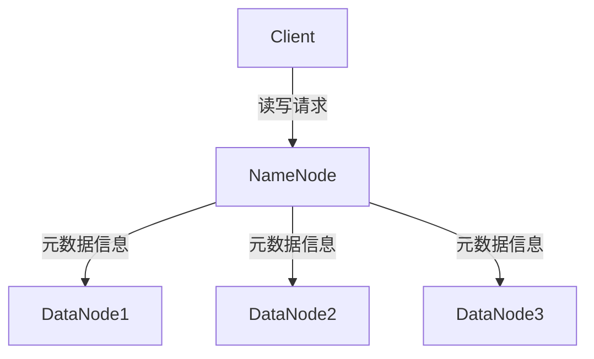

## 1. 背景介绍

HDFS（Hadoop Distributed File System）是Apache Hadoop生态系统中的一个分布式文件系统，它是Hadoop的核心组件之一。HDFS被设计用于存储和处理大规模数据集，它可以在廉价的硬件上运行，并且具有高容错性、高可靠性和高可扩展性的特点。HDFS的设计灵感来自于Google的GFS（Google File System），但是HDFS在GFS的基础上进行了一些改进和优化。

HDFS的主要目标是提供一个可靠的、高效的、可扩展的分布式文件系统，以满足大规模数据处理的需求。HDFS的设计理念是将数据分散存储在多个节点上，通过数据的冗余备份和数据块的分布式存储来提高数据的可靠性和可用性。同时，HDFS还提供了高效的数据访问接口，使得用户可以方便地对存储在HDFS上的数据进行读写操作。

## 2. 核心概念与联系

### 2.1 HDFS的架构

HDFS的架构由以下几个组件组成：

- NameNode：负责管理文件系统的命名空间和访问控制，维护文件系统的元数据信息，如文件名、文件属性、文件块的位置等。
- DataNode：负责存储文件系统的数据块，以及向客户端提供数据读写服务。
- Secondary NameNode：负责定期合并NameNode的编辑日志和镜像文件，以便恢复NameNode的状态。
- Client：负责向NameNode和DataNode发送请求，以读写文件系统中的数据。

HDFS的架构如下图所示：



### 2.2 HDFS的数据块

HDFS将文件划分为一个或多个数据块，每个数据块的大小通常为64MB或128MB。数据块是HDFS中的基本存储单元，它们被分散存储在多个DataNode上，以提高数据的可靠性和可用性。每个数据块都有一个唯一的标识符，称为Block ID。

### 2.3 HDFS的命名空间

HDFS的命名空间是由文件和目录组成的树形结构，它类似于传统的文件系统。每个文件和目录都有一个唯一的路径名，称为文件路径。文件路径由多个组件组成，每个组件之间用斜杠（/）分隔。

### 2.4 HDFS的副本机制

HDFS通过数据块的冗余备份来提高数据的可靠性和可用性。每个数据块通常会有多个副本，这些副本被存储在不同的DataNode上。当某个DataNode发生故障时，HDFS会自动将该DataNode上的数据块副本复制到其他DataNode上，以保证数据的可靠性和可用性。

## 3. 核心算法原理具体操作步骤

### 3.1 HDFS的读写流程

HDFS的读写流程如下：

1. 客户端向NameNode发送读写请求，NameNode返回包含文件元数据信息的响应。
2. 客户端根据元数据信息确定数据块的位置，向DataNode发送读写请求。
3. DataNode返回数据块的内容或写入数据块的内容。
4. 客户端将数据块的内容写入本地文件系统或从本地文件系统读取数据块的内容。

### 3.2 HDFS的元数据管理

HDFS的元数据管理是由NameNode负责的。NameNode维护了文件系统的命名空间和文件属性信息，以及数据块的位置信息。当客户端向NameNode发送读写请求时，NameNode会根据文件路径和数据块的位置信息返回相应的响应。

### 3.3 HDFS的数据块管理

HDFS的数据块管理是由DataNode负责的。DataNode存储了文件系统中的数据块，并向客户端提供数据读写服务。当客户端向DataNode发送读写请求时，DataNode会根据数据块的位置信息返回相应的响应。

## 4. 数学模型和公式详细讲解举例说明

HDFS的设计和实现涉及到了很多数学模型和算法，如数据块的分布式存储、数据块的冗余备份、数据块的位置计算等。这些数学模型和算法的详细讲解超出了本文的范围，读者可以参考相关的文献和资料进行深入学习。

## 5. 项目实践：代码实例和详细解释说明

### 5.1 HDFS的安装和配置

在进行HDFS的实践之前，需要先安装和配置Hadoop环境。Hadoop的安装和配置可以参考官方文档或相关的教程。

### 5.2 HDFS的基本操作

HDFS的基本操作包括文件的上传、下载、删除、重命名等。这些操作可以通过Hadoop的命令行工具或Java API来实现。

#### 5.2.1 文件上传

文件上传可以使用以下命令：

```bash
hadoop fs -put <src> <dst>
```

其中，`<src>`是本地文件路径，`<dst>`是HDFS文件路径。

#### 5.2.2 文件下载

文件下载可以使用以下命令：

```bash
hadoop fs -get <src> <dst>
```

其中，`<src>`是HDFS文件路径，`<dst>`是本地文件路径。

#### 5.2.3 文件删除

文件删除可以使用以下命令：

```bash
hadoop fs -rm <path>
```

其中，`<path>`是HDFS文件路径。

#### 5.2.4 文件重命名

文件重命名可以使用以下命令：

```bash
hadoop fs -mv <src> <dst>
```

其中，`<src>`是原始文件路径，`<dst>`是目标文件路径。

### 5.3 HDFS的Java API

HDFS的Java API提供了丰富的接口和类库，可以方便地进行文件的读写操作。以下是一个简单的Java程序，用于向HDFS中写入数据：

```java
import org.apache.hadoop.conf.Configuration;
import org.apache.hadoop.fs.FileSystem;
import org.apache.hadoop.fs.Path;
import org.apache.hadoop.io.IOUtils;
import org.apache.hadoop.io.SequenceFile;
import org.apache.hadoop.io.Text;

import java.io.IOException;
import java.net.URI;
import java.net.URISyntaxException;

public class HdfsWriter {
    public static void main(String[] args) throws IOException, URISyntaxException {
        String uri = "hdfs://localhost:9000/user/hadoop/test.txt";
        Configuration conf = new Configuration();
        FileSystem fs = FileSystem.get(new URI(uri), conf);
        Path path = new Path(uri);
        String data = "Hello, Hadoop!";
        SequenceFile.Writer writer = null;
        try {
            writer = SequenceFile.createWriter(fs, conf, path, Text.class, Text.class);
            writer.append(new Text("key"), new Text(data));
        } finally {
            IOUtils.closeStream(writer);
        }
    }
}
```

## 6. 实际应用场景

HDFS的应用场景非常广泛，主要包括以下几个方面：

- 大数据存储和处理：HDFS可以存储和处理大规模的数据集，如日志数据、传感器数据、图像数据等。
- 数据备份和恢复：HDFS的数据块冗余备份机制可以保证数据的可靠性和可用性，同时也可以用于数据的备份和恢复。
- 分布式计算：HDFS可以作为分布式计算框架的底层存储系统，如MapReduce、Spark等。
- 云存储：HDFS可以作为云存储服务的底层存储系统，如Amazon S3、Azure Blob Storage等。

## 7. 工具和资源推荐

以下是一些HDFS相关的工具和资源：

- Hadoop官方网站：https://hadoop.apache.org/
- Hadoop文档：https://hadoop.apache.org/docs/
- Hadoop命令行工具：https://hadoop.apache.org/docs/current/hadoop-project-dist/hadoop-common/CommandsManual.html
- Hadoop Java API文档：https://hadoop.apache.org/docs/current/api/
- Hadoop教程：https://www.tutorialspoint.com/hadoop/index.htm

## 8. 总结：未来发展趋势与挑战

HDFS作为Hadoop生态系统的核心组件之一，已经成为大数据存储和处理的重要基础设施。未来，随着大数据技术的不断发展和应用场景的不断扩展，HDFS仍然面临着一些挑战和发展趋势：

- 数据安全和隐私保护：随着数据泄露和隐私泄露事件的不断发生，数据安全和隐私保护成为了HDFS未来发展的重要方向。
- 数据访问效率和性能优化：随着数据量的不断增加，HDFS的数据访问效率和性能优化成为了HDFS未来发展的重要挑战。
- 多租户和多场景支持：随着大数据应用场景的不断扩展，HDFS需要支持多租户和多场景的需求，以满足不同用户和应用的需求。

## 9. 附录：常见问题与解答

以下是一些常见的HDFS问题和解答：

### 9.1 HDFS的数据块大小是多少？

HDFS的数据块大小通常为64MB或128MB。

### 9.2 HDFS的副本数是多少？

HDFS的副本数通常为3个。

### 9.3 HDFS的元数据信息存储在哪里？

HDFS的元数据信息存储在NameNode的内存中和磁盘上。

### 9.4 HDFS的数据块如何分布式存储？

HDFS的数据块通过分布式存储在多个DataNode上来提高数据的可靠性和可用性。

### 9.5 HDFS的数据块如何冗余备份？

HDFS的数据块通过冗余备份来提高数据的可靠性和可用性。每个数据块通常会有3个副本，这些副本被存储在不同的DataNode上。