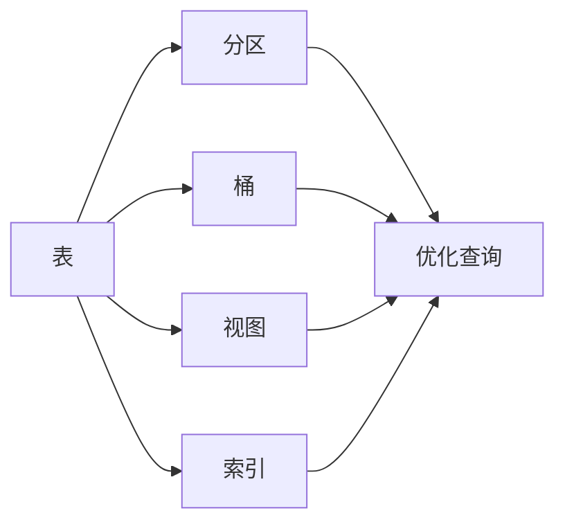

# HiveQL原理与代码实例讲解

## 1. 背景介绍
在大数据时代，数据仓库的概念变得越来越重要。Hive作为一个建立在Hadoop之上的数据仓库工具，可以将结构化的数据文件映射为一张数据库表，并提供完整的SQL查询功能，使得数据分析更加便捷。HiveQL是Hive中使用的SQL方言，它允许用户执行类似于SQL的查询语句来分析和处理存储在Hadoop文件系统中的大规模数据集。

## 2. 核心概念与联系
HiveQL的核心概念包括表、分区、桶、视图和索引。表是存储数据的基本单位，分区和桶是优化查询性能的物理组织结构，视图是虚拟表，而索引用于加速查询。这些概念之间的联系在于，它们共同构成了Hive的数据模型，并且相互作用以提高数据检索的效率。



## 3. 核心算法原理具体操作步骤
HiveQL的查询执行涉及到编译、优化和执行三个主要步骤。首先，HiveQL语句被编译成抽象语法树；其次，进行逻辑优化和物理优化；最后，生成执行计划并在Hadoop上执行。


## 4. 数学模型和公式详细讲解举例说明
HiveQL在查询优化中会使用到成本模型来估算不同执行计划的资源消耗。例如，对于JOIN操作，成本模型会考虑数据倾斜、网络传输和磁盘I/O等因素。数学公式可以表示为：

$$
Cost_{join} = f(DataSize_{left}, DataSize_{right}, Skewness, NetworkCost, DiskIOCost)
$$

其中，$DataSize_{left}$ 和 $DataSize_{right}$ 分别代表JOIN操作两侧的数据大小，$Skewness$ 表示数据倾斜程度，$NetworkCost$ 和 $DiskIOCost$ 分别代表网络传输和磁盘I/O的成本。

## 5. 项目实践：代码实例和详细解释说明
假设我们有一个销售数据表 `sales`，包含字段 `date`, `category`, `revenue`。以下是一个HiveQL查询示例，用于计算每个类别的总收入：

```sql
SELECT category, SUM(revenue) AS total_revenue
FROM sales
GROUP BY category;
```

这个查询首先会对 `sales` 表按 `category` 字段进行分组，然后计算每个组的 `revenue` 总和，并将结果命名为 `total_revenue`。

## 6. 实际应用场景
HiveQL广泛应用于电子商务、金融分析、社交网络数据处理等领域。例如，在电子商务中，HiveQL可以用来分析用户行为、产品销售趋势和库存管理。

## 7. 工具和资源推荐
- Apache Hive官方文档：提供最权威的HiveQL参考资料。
- Hadoop：Hive的底层支持，了解Hadoop有助于更好地理解Hive的工作原理。
- SQL Workbench/J：一个支持多种数据库的SQL查询工具，可以用来执行HiveQL语句。

## 8. 总结：未来发展趋势与挑战
随着数据量的不断增长，HiveQL需要不断优化执行效率，支持更复杂的数据分析任务。未来的发展趋势可能包括实时查询、更智能的查询优化器和更紧密的云服务集成。挑战在于如何平衡查询性能和系统资源消耗，以及如何保证数据的安全性和隐私。

## 9. 附录：常见问题与解答
Q1: HiveQL和SQL有什么区别？
A1: HiveQL是基于SQL的方言，它扩展了一些SQL的功能，特别是为了处理大数据和Hadoop生态系统。

Q2: HiveQL能否处理实时数据？
A2: HiveQL本身不是为实时处理设计的，但可以通过与其他技术如Apache Storm、Apache Flink集成来处理实时数据。

Q3: HiveQL查询慢怎么办？
A3: 可以通过优化HiveQL查询（如使用合适的分区和索引）、增加资源（如内存和CPU）或调整Hadoop集群配置来提高查询速度。

作者：禅与计算机程序设计艺术 / Zen and the Art of Computer Programming