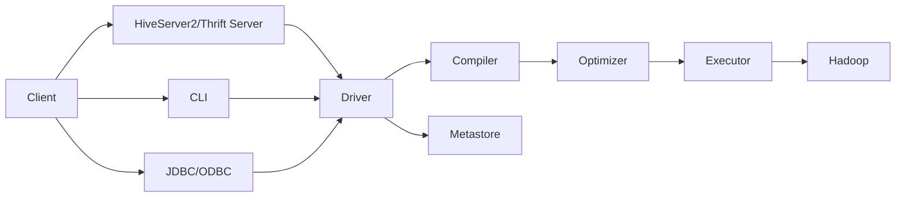

# Hive原理与代码实例讲解

## 1. 背景介绍

### 1.1 大数据处理的需求
随着互联网的飞速发展,数据量呈现爆炸式增长。企业每天产生海量的结构化、半结构化和非结构化数据。如何高效地存储、处理和分析这些海量数据,成为企业面临的重大挑战。传统的关系型数据库已经无法满足大数据时代的需求。

### 1.2 Hadoop生态系统
Hadoop作为开源的分布式计算平台,为大数据处理提供了良好的解决方案。Hadoop生态系统包括HDFS分布式文件系统、MapReduce分布式计算框架、Yarn资源管理系统等核心组件。然而,直接使用Hadoop进行数据分析仍然存在一定的门槛和不便。

### 1.3 Hive的诞生
为了让更多的数据分析人员能够便捷地利用Hadoop进行大数据分析,Facebook在2008年开发了Hive项目。Hive定位于基于Hadoop的数据仓库工具,提供类SQL查询语言HiveQL,将SQL语句转换为MapReduce任务运行,避免了编写复杂的MapReduce程序,大大简化了Hadoop数据分析的使用。

## 2. 核心概念与联系

### 2.1 Hive与传统数据库对比
Hive在很多方面与传统数据库类似,但也存在显著区别:
- 数据存储:Hive数据存储在HDFS,传统数据库多为本地磁盘。
- 计算模型:Hive底层执行引擎是MapReduce,传统数据库通常为独立的计算引擎。
- 执行延迟:Hive查询延迟较高,传统数据库查询延迟低。
- 数据规模:Hive适合海量数据的批处理分析,传统数据库适合实时交互式操作。

### 2.2 Hive体系架构
Hive的整体架构如下图所示:



- Client:包括CLI命令行、HiveServer2/Thrift Server、JDBC/ODBC等多种方式,用户通过这些方式提交HiveQL语句。
- Driver:Hive驱动器,用于接收Client提交的HiveQL语句,并调度Compiler、Optimizer和Executor执行。
- Compiler:将HiveQL编译成抽象语法树AST和查询块。
- Metastore:Hive元数据服务,存储Hive表、分区、字段等元信息。
- Optimizer:逻辑层优化器,对查询块进行逻辑优化。
- Executor:将逻辑查询计划转换为可执行的物理计划,并提交Hadoop执行。
- Hadoop:HDFS用于存储数据,MapReduce用于执行任务。

### 2.3 Hive与Hadoop生态系统
Hive与Hadoop生态系统的其他组件紧密集成,形成了完整的大数据分析平台:
- 数据采集:Sqoop、Flume等组件将外部数据导入HDFS。
- 数据存储:HDFS、HBase等组件存储结构化、半结构化和非结构化数据。
- 数据处理:MapReduce、Tez、Spark等计算引擎执行Hive生成的任务。
- 数据查询:Hive、Impala等工具提供类SQL交互式查询。
- 数据可视化:Zeppelin、Hue等工具实现数据可视化展现。

## 3. 核心算法原理具体操作步骤

### 3.1 HiveQL的编译过程

HiveQL的编译过程分为6个阶段:
1. 词法分析和语法分析:Antlr定义SQL的语法规则,完成SQL词法、语法解析,将SQL转化为抽象语法树AST Tree。
2. 语义分析:遍历AST Tree,抽象出查询的基本组成单元QueryBlock。
3. 生成逻辑执行计划:遍历QueryBlock,翻译为执行操作树OperatorTree,合并多个OperatorTree,并逻辑优化。
4. 优化逻辑执行计划:逻辑层优化器进行OperatorTree变换,合并不必要的ReduceSinkOperator,减少shuffle数据量。
5. 生成物理执行计划:遍历OperatorTree,翻译为MapReduce任务。
6. 优化物理执行计划:物理层优化器进行MapReduce任务的变换,生成最终的执行计划。

### 3.2 查询优化技术

Hive采用了一系列查询优化技术来提升查询效率,主要包括:
1. 列裁剪:去除查询中不需要的列,只读取需要的列,减少数据读取量。
2. 分区裁剪:根据查询中的分区过滤条件,忽略不需要的分区,只扫描需要的分区,避免全表扫描。
3. 谓词下推:将过滤条件尽可能下推到数据源,利用数据源的索引进行过滤,减少参与计算的数据量。
4. 多路Join:MapReduce只支持两表Join,Hive采用多路Join将多个表的Join在Map端进行,提高Join效率。
5. Map Join:适用于一个表很小、一个表很大的场景,将小表全部加载到内存,在Map端直接进行Join,避免Reduce。
6. Group By优化:Map端先进行局部聚合,Reduce端再进行全局聚合,提高聚合计算的并行度。
7. 数据倾斜优化:采用Map Join、随机前缀、数据分桶等方式,避免因某些Key数据量过大造成的数据倾斜。

## 4. 数学模型和公式详细讲解举例说明

Hive中涉及的数学模型和公式相对较少,主要体现在一些聚合函数和统计分析函数中,这里以Hive中常见的几个统计函数为例进行说明。

### 4.1 总体方差(Variance)

总体方差用于衡量一组数据的离散程度,反映数据的波动情况。设总体$X$含有$N$个数据,第$i$个数据是$x_i$,总体均值为$\mu=\frac{1}{N}\sum_{i=1}^N{x_i}$,则总体方差$\sigma^2$的计算公式为:

$$\sigma^2=\frac{1}{N}\sum_{i=1}^N{(x_i-\mu)^2}$$

在Hive中,可以使用`var_pop`函数计算总体方差:

```sql
SELECT var_pop(col) FROM table;
```

### 4.2 总体标准差(Standard Deviation) 

总体标准差是总体方差的平方根,用于衡量数据偏离程度。设总体方差为$\sigma^2$,则总体标准差$\sigma$的计算公式为:

$$\sigma=\sqrt{\sigma^2}=\sqrt{\frac{1}{N}\sum_{i=1}^N{(x_i-\mu)^2}}$$

在Hive中,可以使用`stddev_pop`函数计算总体标准差:

```sql
SELECT stddev_pop(col) FROM table;
```

### 4.3 样本方差(Sample Variance)

样本方差是基于样本数据计算的方差,当数据量很大时,可以用样本方差来近似总体方差。设样本含有$n$个数据,第$i$个数据是$x_i$,样本均值为$\bar{x}=\frac{1}{n}\sum_{i=1}^n{x_i}$,则样本方差$s^2$的计算公式为:

$$s^2=\frac{1}{n-1}\sum_{i=1}^n{(x_i-\bar{x})^2}$$

在Hive中,可以使用`var_samp`函数计算样本方差:

```sql
SELECT var_samp(col) FROM table;
```

### 4.4 样本标准差(Sample Standard Deviation)

样本标准差是样本方差的平方根。设样本方差为$s^2$,则样本标准差$s$的计算公式为:

$$s=\sqrt{s^2}=\sqrt{\frac{1}{n-1}\sum_{i=1}^n{(x_i-\bar{x})^2}}$$

在Hive中,可以使用`stddev_samp`函数计算样本标准差:

```sql
SELECT stddev_samp(col) FROM table;
```

以上就是Hive中常见的几个统计学函数的数学原理介绍,通过这些函数可以方便地对数据进行统计分析。在实际应用中,我们可以根据具体的业务需求,选择合适的统计函数对数据进行分析。

## 5. 项目实践:代码实例和详细解释说明

下面通过一个具体的项目实践,演示如何使用Hive进行数据分析。该项目以电商用户行为日志分析为例,通过Hive SQL分析用户的浏览、购买等行为特征。

### 5.1 数据准备

首先需要将用户行为日志数据上传到HDFS,数据格式如下:

```
timestamp  | user_id | item_id | behavior
---------------------------------------
2022-01-01 | 10001   | 111     | view
2022-01-01 | 10001   | 111     | cart
2022-01-01 | 10001   | 111     | buy
2022-01-01 | 10002   | 112     | view
```

其中每行表示一条用户行为,包括时间戳、用户ID、商品ID和行为类型。

### 5.2 创建Hive表

在Hive中创建对应的表来管理该数据:

```sql
CREATE TABLE user_behavior(
  timestamp STRING,
  user_id STRING,
  item_id STRING, 
  behavior STRING
)
ROW FORMAT DELIMITED FIELDS TERMINATED BY '\t';
```

### 5.3 加载数据到Hive表

使用`LOAD DATA`语句将HDFS上的数据文件加载到Hive表中:

```sql
LOAD DATA INPATH '/user_behavior.log' INTO TABLE user_behavior;
```

### 5.4 统计每种行为的总数

```sql
SELECT behavior, COUNT(*) AS cnt 
FROM user_behavior
GROUP BY behavior;
```

该查询使用`GROUP BY`对行为类型进行分组,并用`COUNT`统计每种行为的总数。

### 5.5 统计每个用户的浏览商品数

```sql
SELECT user_id, COUNT(DISTINCT item_id) AS view_cnt
FROM user_behavior 
WHERE behavior = 'view'
GROUP BY user_id;
```

该查询先过滤出浏览行为的记录,然后按用户分组,并用`COUNT(DISTINCT item_id)`统计每个用户浏览的不同商品数量。

### 5.6 统计浏览后购买的转化率

```sql
SELECT 
  round(
    COUNT(DISTINCT CASE WHEN behavior = 'buy' THEN user_id END) / 
    COUNT(DISTINCT CASE WHEN behavior = 'view' THEN user_id END),
    3
  ) AS view2buy_ratio
FROM user_behavior;  
```

该查询分别统计有浏览行为和有购买行为的不同用户数,然后计算两者的比值,得到浏览后购买的转化率。

### 5.7 查询用户购买商品的前N名

```sql
SELECT item_id, COUNT(*) AS buy_cnt
FROM user_behavior
WHERE behavior = 'buy'
GROUP BY item_id
ORDER BY buy_cnt DESC
LIMIT 10;
```

该查询先筛选出购买行为的记录,然后按商品分组统计购买次数,并按购买次数降序排序,最后取前10名。

以上就是一个电商用户行为分析的简单示例,通过Hive SQL可以方便地对海量用户行为数据进行统计分析,挖掘有价值的用户行为特征和规律。

## 6. 实际应用场景

Hive在各行各业都有广泛的应用,一些常见的应用场景包括:

### 6.1 电商行业
- 用户行为分析:分析用户的浏览、收藏、加购、购买等行为,挖掘用户画像和偏好。
- 商品分析:分析商品的浏览量、销量、评价等指标,优化商品排名和推荐。
- 交易分析:分析订单量、销售额、客单价等交易指标,制定营销策略。

### 6.2 金融行业
- 风险控制:分析用户的信用评级、贷款违约率等风险指标,优化风控模型。
- 反欺诈:分析交易行为特征,识别异常和欺诈交易。
- 客户画像:分析客户的资产、理财、消费等行为,实现精准营销。

### 6.3 电信行业
- 通话记录分析:分析用户的通话时长、频率、关系网络等,优化资费套餐。
- 流量分析:分析