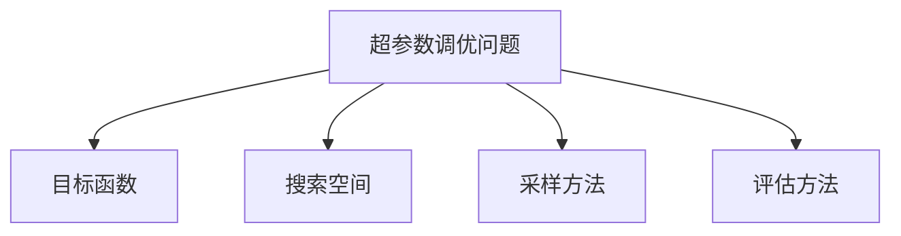

# Hyperparameter Tuning 原理与代码实战案例讲解

## 1. 背景介绍
### 1.1 什么是超参数
在机器学习和深度学习中,模型除了需要学习权重等参数外,还有一些需要人工设定的参数,如学习率、隐藏层数、隐藏层神经元个数等,这些参数被称为超参数(Hyperparameter)。与模型中的参数不同,超参数不能通过学习得到,需要人为设定。

### 1.2 超参数调优的重要性
超参数的选择对模型性能有很大影响。一组好的超参数能让模型更快收敛,得到更好的结果。相反,不合适的超参数会导致模型难以收敛,性能差。因此,如何选择合适的超参数,进行超参数优化就显得尤为重要。这个过程被称为超参数调优(Hyperparameter Tuning)。

### 1.3 常见的超参数调优方法
- 手动调参:根据经验手动选择超参数,测试模型性能,再不断调整,最终选出较优的超参数组合。
- 网格搜索(Grid Search):穷举搜索,在所有候选的参数组合中,通过循环遍历,尝试每一种可能性,从而找到最优参数组合。
- 随机搜索(Random Search):随机采样,在搜索空间中随机采样一组超参数,然后训练模型,再不断重复这一过程,最后选择模型性能最优的超参数组合。
- 贝叶斯优化(Bayesian Optimization):建立目标函数的概率模型,不断地更新先验,从而找到最优超参数组合。
- 启发式搜索:遗传算法、粒子群优化等启发式搜索算法,通过对搜索空间进行智能探索,找到最优超参数组合。

## 2. 核心概念与联系
### 2.1 目标函数
在超参数调优中,目标函数就是需要优化的模型性能评估指标,如准确率、AUC值、损失函数值等。给定一组超参数,代入模型训练后,我们就能得到相应的目标函数值。因此,超参数调优问题可以表述为一个优化问题:找到一组超参数,使得目标函数达到最大值或最小值。

### 2.2 搜索空间 
搜索空间定义了各个超参数的取值范围。例如学习率的取值范围可以是[0.0001, 0.1],隐藏层数的取值范围可以是[1, 5]等。搜索空间与目标函数共同定义了一个超参数优化问题。

### 2.3 采样方法
采样方法决定了如何从搜索空间中选取超参数组合。不同的超参数调优算法采用不同的采样策略,如网格搜索采用遍历式采样,随机搜索采用随机采样,贝叶斯优化根据先验分布进行采样等。

### 2.4 评估方法
评估方法决定了如何评估一组超参数的优劣。常见的评估方法有:
- 留出法:将数据集划分为训练集和验证集,用训练集训练模型,用验证集评估模型性能。
- 交叉验证:将数据集划分为k份,每次选其中1份作为验证集,其余作为训练集,循环k次,取k次评估指标的平均值。
- 自助采样:重复多次有放回地从数据集中采样,用采样得到的数据集训练评估模型,多次评估结果求平均。

核心概念间的关系如下图所示:


## 3. 核心算法原理具体操作步骤
这里我们重点介绍三种常用的超参数调优算法:网格搜索、随机搜索和贝叶斯优化。

### 3.1 网格搜索
网格搜索的基本思想是:在搜索空间中,将每个超参数的可能取值都提前设定好,形成一个"网格",然后将每个"格点"上的参数组合都带入模型中训练评估,最终选出模型性能最优的参数组合。

网格搜索的具体步骤如下:
1. 确定每个超参数的候选取值集合
2. 生成所有超参数组合,形成网格
3. 对每个超参数组合,代入模型训练并评估性能
4. 返回性能最优的超参数组合

网格搜索的优点是简单直观,缺点是计算开销大。如果超参数数量较多,候选取值也多,那么遍历所有组合将是一个非常耗时的过程。

### 3.2 随机搜索
随机搜索与网格搜索的思路类似,但它不是遍历搜索空间中的所有点,而是随机采样一些点,然后训练评估,不断重复这一过程,最终选出性能最优的超参数组合。

随机搜索的具体步骤如下:
1. 定义每个超参数的分布函数(如均匀分布、高斯分布等)
2. 从每个超参数的分布中随机采样一个值,组成超参数组合
3. 代入模型训练并评估性能
4. 重复步骤2和3,直到达到预设的采样次数
5. 返回性能最优的超参数组合

随机搜索通过随机采样避免了遍历式搜索的高计算成本,但它的缺点是没有利用之前的采样信息,可能会重复采样一些差的点。

### 3.3 贝叶斯优化
贝叶斯优化利用了之前的采样信息,建立超参数到目标函数的映射关系的概率模型,通过不断地更新这个概率模型来指导新的采样。贝叶斯优化在机器学习领域主要用到了高斯过程(Gaussian Process)。

贝叶斯优化的具体步骤如下:
1. 随机采样一些超参数点,代入模型评估,获得目标函数值
2. 用高斯过程拟合已采样数据,得到目标函数的后验分布(均值和方差)
3. 基于后验分布,计算每个未采样点的acquisition function值
4. 选择acquisition function值最大的点作为新的采样点
5. 代入模型评估新采样点,更新高斯过程模型
6. 重复步骤3-5,直到达到预设的采样次数
7. 返回性能最优的超参数组合

贝叶斯优化的关键是acquisition function的选择,常用的有:
- PI(Probability of Improvement):选择比当前最优值有改进的概率最大的点
- EI(Expected Improvement):选择期望改进值最大的点
- UCB(Upper Confidence Bound):选择置信区间上界最大的点

贝叶斯优化在超参数优化领域表现出色,能以较少的采样次数找到接近最优的超参数组合。但它对高斯过程的假设有一定局限性,且计算acquisition function的开销较大。

## 4. 数学模型和公式详细讲解举例说明
这里我们重点介绍贝叶斯优化中的高斯过程和常用的acquisition function。

### 4.1 高斯过程
高斯过程是一种随机过程,它的任意有限维度的边缘分布都是多元高斯分布。高斯过程可以看作是无限维度的多元高斯分布。我们用高斯过程来建模超参数到目标函数的映射关系。

假设我们有n个已采样的超参数点$\mathbf{X}=[\mathbf{x}_1,\ldots,\mathbf{x}_n]$和对应的目标函数值$\mathbf{y}=[y_1,\ldots,y_n]$,我们认为目标函数值是由一个高斯过程生成的,即:

$$f(\mathbf{x})\sim\mathcal{GP}(m(\mathbf{x}),k(\mathbf{x},\mathbf{x}'))$$

其中$m(\mathbf{x})$是均值函数,$k(\mathbf{x},\mathbf{x}')$是核函数(协方差函数)。通常我们取$m(\mathbf{x})=0$,常用的核函数有平方指数核(SE核):

$$k_{SE}(\mathbf{x},\mathbf{x}')=\sigma^2\exp(-\frac{1}{2l^2}\lVert\mathbf{x}-\mathbf{x}'\rVert^2)$$

其中$\sigma$和$l$是核函数的超参数。

根据高斯过程的定义,我们有:

$$\mathbf{y}\sim\mathcal{N}(\mathbf{0},\mathbf{K})$$

其中$\mathbf{K}$是核矩阵,$\mathbf{K}_{ij}=k(\mathbf{x}_i,\mathbf{x}_j)$。

现在我们要预测一个新的超参数点$\mathbf{x}_*$对应的目标函数值$f_*=f(\mathbf{x}_*)$。根据高斯过程的性质,我们有:

$$\begin{bmatrix}\mathbf{y}\\f_*\end{bmatrix}\sim\mathcal{N}\left(\mathbf{0},\begin{bmatrix}\mathbf{K}&\mathbf{k}_*\\\mathbf{k}_*^\top&k_{**}\end{bmatrix}\right)$$

其中$\mathbf{k}_*=[k(\mathbf{x}_*,\mathbf{x}_1),\ldots,k(\mathbf{x}_*,\mathbf{x}_n)]^\top$,$k_{**}=k(\mathbf{x}_*,\mathbf{x}_*)$。

根据多元高斯分布的条件分布公式,我们可以得到$f_*$的后验分布:

$$f_*|\mathbf{X},\mathbf{y},\mathbf{x}_*\sim\mathcal{N}(\mu_*,\sigma_*^2)$$

其中
$$\mu_*=\mathbf{k}_*^\top\mathbf{K}^{-1}\mathbf{y}$$
$$\sigma_*^2=k_{**}-\mathbf{k}_*^\top\mathbf{K}^{-1}\mathbf{k}_*$$

这就是高斯过程回归的结果,我们得到了新点$\mathbf{x}_*$处目标函数值的均值$\mu_*$和方差$\sigma_*^2$。

### 4.2 Acquisition Function
有了高斯过程回归的结果,我们就可以用acquisition function来选择下一个采样点。常用的acquisition function有:

#### 4.2.1 PI(Probability of Improvement)
PI计算了新点$\mathbf{x}_*$处目标函数值$f_*$超过当前最优值$f_{best}$的概率:

$$\text{PI}(\mathbf{x}_*)=P(f_*>f_{best}|\mathbf{X},\mathbf{y},\mathbf{x}_*)=\Phi(\frac{\mu_*-f_{best}}{\sigma_*})$$

其中$\Phi(\cdot)$是标准正态分布的累积分布函数。PI会选择PI值最大的点作为下一个采样点。

#### 4.2.2 EI(Expected Improvement)
EI计算了新点$\mathbf{x}_*$处目标函数值$f_*$相对于当前最优值$f_{best}$的期望提升:

$$\text{EI}(\mathbf{x}_*)=\mathbb{E}[\max(0,f_*-f_{best})|\mathbf{X},\mathbf{y},\mathbf{x}_*]=\begin{cases}(\mu_*-f_{best})\Phi(Z)+\sigma_*\phi(Z)&\text{if }\sigma_*>0\\0&\text{if }\sigma_*=0\end{cases}$$

其中$Z=\frac{\mu_*-f_{best}}{\sigma_*}$,$\phi(\cdot)$是标准正态分布的概率密度函数。EI会选择EI值最大的点作为下一个采样点。

#### 4.2.3 UCB(Upper Confidence Bound) 
UCB计算了新点$\mathbf{x}_*$处目标函数值$f_*$的后验均值加上一个探索项:

$$\text{UCB}(\mathbf{x}_*)=\mu_*+\kappa\sigma_*$$

其中$\kappa$是一个权衡因子。UCB会选择UCB值最大的点作为下一个采样点。UCB鼓励探索不确定性大的区域。

## 5. 项目实践：代码实例和详细解释说明
下面我们用Python实现贝叶斯优化算法,以优化SVM的两个超参数:$C$和$\gamma$为例。我们使用scikit-learn库中的高斯过程回归模型,以及scipy库中的优化函数。

```python
import numpy as np
from sklearn.gaussian_process import GaussianProcessRegressor
from sklearn.gaussian_process.kernels import Matern
from scipy.optimize import minimize
from scipy.stats import norm

class BayesianOptimization:
    def __