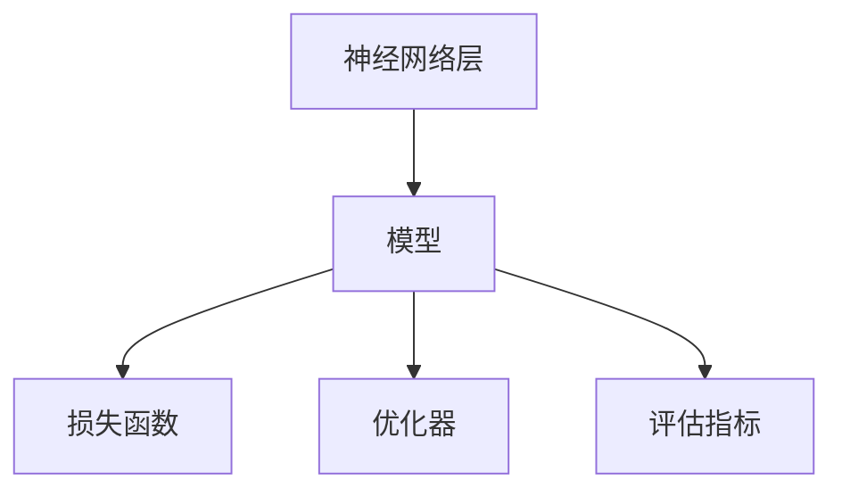

# Keras 原理与代码实战案例讲解

## 1.背景介绍

Keras 是一个高层神经网络 API，能够以极简的方式构建和训练深度学习模型。它最初由 François Chollet 开发，并在 2015 年首次发布。Keras 旨在简化深度学习的实现过程，使研究人员和开发者能够快速构建和实验各种神经网络模型。Keras 目前支持 TensorFlow、Theano 和 CNTK 作为后端，并且已经成为 TensorFlow 的官方高级 API。

Keras 的设计哲学包括以下几个方面：
- **用户友好**：Keras 提供了简洁且一致的 API，降低了深度学习的入门门槛。
- **模块化**：Keras 的各个组件（如神经网络层、损失函数、优化器等）都是独立的模块，可以灵活组合。
- **可扩展性**：Keras 允许用户自定义模块，满足特定需求。
- **支持多后端**：Keras 可以在多个深度学习框架上运行，提供了更大的灵活性。

## 2.核心概念与联系

在深入探讨 Keras 的原理和代码实战之前，我们需要了解一些核心概念和它们之间的联系。

### 2.1 神经网络层

神经网络层是构建深度学习模型的基本单元。Keras 提供了多种类型的层，如全连接层（Dense）、卷积层（Conv2D）、池化层（MaxPooling2D）等。

### 2.2 模型

Keras 提供了两种构建模型的方式：Sequential 模型和函数式 API。Sequential 模型是按顺序堆叠各层，而函数式 API 则允许构建更复杂的模型，如多输入多输出模型。

### 2.3 损失函数

损失函数用于衡量模型预测值与真实值之间的差距。Keras 提供了多种损失函数，如均方误差（MSE）、交叉熵（Cross-Entropy）等。

### 2.4 优化器

优化器用于更新模型的权重，以最小化损失函数。Keras 提供了多种优化器，如随机梯度下降（SGD）、Adam、RMSprop 等。

### 2.5 评估指标

评估指标用于衡量模型的性能。Keras 提供了多种评估指标，如准确率（Accuracy）、精确率（Precision）、召回率（Recall）等。

以下是 Keras 核心概念之间的联系图：



## 3.核心算法原理具体操作步骤

Keras 的核心算法主要包括前向传播和反向传播。前向传播用于计算模型的预测值，反向传播用于更新模型的权重。

### 3.1 前向传播

前向传播是指从输入层到输出层的计算过程。每一层的输出作为下一层的输入，最终得到模型的预测值。

### 3.2 反向传播

反向传播是指从输出层到输入层的权重更新过程。通过计算损失函数的梯度，优化器更新每一层的权重，以最小化损失函数。

### 3.3 具体操作步骤

1. **初始化模型**：选择模型类型（Sequential 或函数式 API），并添加所需的层。
2. **编译模型**：选择损失函数、优化器和评估指标。
3. **训练模型**：使用训练数据进行模型训练。
4. **评估模型**：使用测试数据评估模型性能。
5. **预测**：使用训练好的模型进行预测。

## 4.数学模型和公式详细讲解举例说明

在深度学习中，数学模型和公式是理解算法原理的关键。以下是一些常用的数学模型和公式。

### 4.1 线性回归

线性回归模型的目标是找到一个线性函数，使得预测值与真实值之间的均方误差最小。其数学公式为：

$$
\hat{y} = w \cdot x + b
$$

其中，$\hat{y}$ 是预测值，$w$ 是权重，$x$ 是输入，$b$ 是偏置。

### 4.2 损失函数

损失函数用于衡量模型预测值与真实值之间的差距。常用的损失函数包括均方误差（MSE）和交叉熵（Cross-Entropy）。

均方误差的公式为：

$$
L = \frac{1}{n} \sum_{i=1}^{n} (\hat{y}_i - y_i)^2
$$

其中，$L$ 是损失，$n$ 是样本数量，$\hat{y}_i$ 是第 $i$ 个样本的预测值，$y_i$ 是第 $i$ 个样本的真实值。

交叉熵的公式为：

$$
L = -\frac{1}{n} \sum_{i=1}^{n} [y_i \log(\hat{y}_i) + (1 - y_i) \log(1 - \hat{y}_i)]
$$

### 4.3 梯度下降

梯度下降是一种优化算法，用于最小化损失函数。其更新公式为：

$$
w = w - \eta \frac{\partial L}{\partial w}
$$

其中，$w$ 是权重，$\eta$ 是学习率，$L$ 是损失函数。

## 5.项目实践：代码实例和详细解释说明

为了更好地理解 Keras 的使用，我们将通过一个具体的项目实例来进行讲解。我们将构建一个简单的神经网络模型，用于分类任务。

### 5.1 数据准备

我们将使用经典的 MNIST 数据集，该数据集包含 60000 张训练图片和 10000 张测试图片，每张图片是一个 28x28 的灰度图像，表示手写数字（0-9）。

```python
import keras
from keras.datasets import mnist
from keras.utils import np_utils

# 加载数据
(x_train, y_train), (x_test, y_test) = mnist.load_data()

# 数据预处理
x_train = x_train.reshape(x_train.shape[0], 28, 28, 1).astype('float32') / 255
x_test = x_test.reshape(x_test.shape[0], 28, 28, 1).astype('float32') / 255
y_train = np_utils.to_categorical(y_train, 10)
y_test = np_utils.to_categorical(y_test, 10)
```

### 5.2 构建模型

我们将使用 Sequential 模型，并添加卷积层、池化层和全连接层。

```python
from keras.models import Sequential
from keras.layers import Conv2D, MaxPooling2D, Flatten, Dense

model = Sequential()
model.add(Conv2D(32, kernel_size=(3, 3), activation='relu', input_shape=(28, 28, 1)))
model.add(MaxPooling2D(pool_size=(2, 2)))
model.add(Flatten())
model.add(Dense(128, activation='relu'))
model.add(Dense(10, activation='softmax'))
```

### 5.3 编译模型

我们将选择交叉熵作为损失函数，Adam 作为优化器，准确率作为评估指标。

```python
model.compile(loss='categorical_crossentropy', optimizer='adam', metrics=['accuracy'])
```

### 5.4 训练模型

我们将使用训练数据进行模型训练。

```python
model.fit(x_train, y_train, batch_size=128, epochs=10, validation_data=(x_test, y_test))
```

### 5.5 评估模型

我们将使用测试数据评估模型性能。

```python
score = model.evaluate(x_test, y_test, verbose=0)
print('Test loss:', score[0])
print('Test accuracy:', score[1])
```

### 5.6 预测

我们将使用训练好的模型进行预测。

```python
predictions = model.predict(x_test)
```

## 6.实际应用场景

Keras 在多个领域有广泛的应用，包括但不限于以下几个方面：

### 6.1 图像分类

Keras 可以用于构建卷积神经网络（CNN），用于图像分类任务，如手写数字识别、物体检测等。

### 6.2 自然语言处理

Keras 可以用于构建循环神经网络（RNN）和长短期记忆网络（LSTM），用于自然语言处理任务，如文本分类、情感分析等。

### 6.3 生成对抗网络

Keras 可以用于构建生成对抗网络（GAN），用于图像生成、风格迁移等任务。

### 6.4 强化学习

Keras 可以与其他库（如 OpenAI Gym）结合，用于构建强化学习模型，解决复杂的决策问题。

## 7.工具和资源推荐

以下是一些推荐的工具和资源，帮助读者更好地学习和使用 Keras：

### 7.1 官方文档

Keras 的官方文档是学习 Keras 的最佳资源，提供了详细的 API 说明和示例代码。

### 7.2 在线课程

Coursera、Udacity 和 edX 等平台提供了多门关于深度学习和 Keras 的在线课程，适合不同水平的学习者。

### 7.3 开源项目

GitHub 上有许多开源项目使用 Keras，读者可以通过阅读和实践这些项目，深入理解 Keras 的应用。

### 7.4 社区论坛

Stack Overflow、Reddit 和 Keras 官方论坛是解决问题和交流经验的好地方。

## 8.总结：未来发展趋势与挑战

Keras 作为一个高层神经网络 API，已经在深度学习领域取得了广泛的应用和认可。未来，Keras 可能会在以下几个方面继续发展：

### 8.1 更好的性能

随着硬件和算法的不断进步，Keras 将继续优化其性能，以支持更大规模和更复杂的模型训练。

### 8.2 更强的可扩展性

Keras 将继续增强其可扩展性，支持更多的深度学习框架和硬件平台。

### 8.3 更友好的用户体验

Keras 将继续优化其 API 和文档，使其更加易于使用，降低深度学习的入门门槛。

### 8.4 持续的社区支持

Keras 的发展离不开社区的支持，未来 Keras 将继续依靠社区的力量，不断改进和创新。

## 9.附录：常见问题与解答

### 9.1 如何选择合适的模型类型？

选择模型类型取决于具体的任务和数据。对于简单的任务，可以使用 Sequential 模型；对于复杂的任务，可以使用函数式 API。

### 9.2 如何选择合适的损失函数和优化器？

选择损失函数和优化器取决于具体的任务和模型。对于分类任务，可以使用交叉熵作为损失函数；对于回归任务，可以使用均方误差作为损失函数。常用的优化器包括 SGD、Adam 和 RMSprop。

### 9.3 如何处理过拟合问题？

处理过拟合问题的方法包括使用正则化、增加训练数据、使用数据增强技术等。

### 9.4 如何提高模型的训练速度？

提高模型训练速度的方法包括使用更强的硬件（如 GPU）、优化模型结构、使用更高效的优化器等。

### 9.5 如何调试和优化模型？

调试和优化模型的方法包括使用可视化工具（如 TensorBoard）、调整超参数、使用交叉验证等。

---

作者：禅与计算机程序设计艺术 / Zen and the Art of Computer Programming