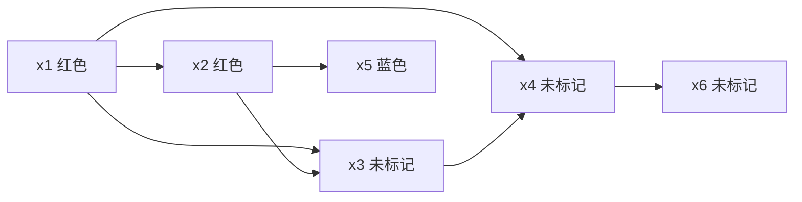

# Label Propagation标签传播算法原理与代码实例讲解

## 1.背景介绍

在机器学习和数据挖掘领域中,有许多任务需要对数据进行分类或聚类。标签传播算法(Label Propagation)是一种基于半监督学习的图分割算法,可以有效地将数据点划分为不同的簇或类别。它的核心思想是利用数据的相似性来预测未标记数据的标签,通过在数据集构建的相似性图上进行标签传播,最终实现数据的聚类或分类。

标签传播算法的应用场景非常广泛,包括但不限于:

- **社交网络分析**: 可用于发现社交网络中的社区结构、用户群体划分等。
- **图像分割**: 通过构建像素相似性图,可将图像分割为不同的区域或对象。
- **文本分类**: 利用文本之间的相似性关系进行文档聚类或主题分类。
- **推荐系统**: 根据用户之间的相似度为用户推荐感兴趣的物品。

相比于其他聚类算法,标签传播算法具有以下优势:

1. **无需指定聚类数量**: 不像K-Means等算法需要预先指定聚类数量,标签传播可自动确定合适的簇数。
2. **简单高效**: 算法原理简单,实现代码量小,计算效率较高。
3. **半监督学习**: 能够利用少量已标记数据提高聚类性能。
4. **可解释性强**: 通过分析相似性图结构,可解释聚类结果的合理性。

## 2.核心概念与联系

### 2.1 图表示

标签传播算法的核心思想是在数据集构建的相似性图上进行标签传播。因此,首先需要将数据集表示为一个加权无向图 $G=(V,E,W)$:

- $V$ 表示图中的节点集合,每个节点 $v_i \in V$ 对应数据集中的一个数据点 $x_i$。
- $E$ 表示图中的边集合,边 $e_{ij} \in E$ 连接节点 $v_i$ 和 $v_j$,表示数据点 $x_i$ 和 $x_j$ 之间存在相似性关系。
- $W$ 是边的权重矩阵,其中 $w_{ij}$ 表示边 $e_{ij}$ 的权重,通常用于度量数据点 $x_i$ 和 $x_j$ 之间的相似程度。

常用的相似性度量方法包括欧几里得距离、余弦相似度等。对于稀疏数据,也可以使用近邻图等方式构建相似性图。

### 2.2 标签矩阵

在标签传播算法中,我们使用一个标签矩阵 $Y$ 来表示每个数据点的标签分布。对于 $n$ 个数据点,标签矩阵 $Y \in \mathbb{R}^{n \times c}$,其中 $c$ 是可能的标签数量。

- 对于已标记的数据点 $x_i$,如果其标签为 $l$,则 $Y_{il}=1$,其余位置为 $0$。
- 对于未标记的数据点 $x_i$,初始时将其标签分布设为均匀分布,即 $Y_{ij}=\frac{1}{c},\forall j \in \{1,2,...,c\}$。

在算法迭代过程中,未标记数据点的标签分布将不断更新,最终收敛到其最可能的标签。

### 2.3 标签传播规则

标签传播算法的核心是在相似性图上传播标签信息。具体来说,对于每个未标记的数据点 $x_i$,我们根据其邻居节点的标签分布,更新 $x_i$ 的标签分布:

$$Y_i^{(t+1)} = \frac{\sum_{j \in \mathcal{N}(i)} w_{ij}Y_j^{(t)}}{\sum_{j \in \mathcal{N}(i)} w_{ij}}$$

其中:

- $Y_i^{(t)}$ 表示数据点 $x_i$ 在第 $t$ 次迭代时的标签分布。
- $\mathcal{N}(i)$ 表示节点 $v_i$ 的邻居节点集合。
- $w_{ij}$ 是边 $e_{ij}$ 的权重,表示数据点 $x_i$ 和 $x_j$ 之间的相似度。

这个更新规则本质上是对邻居节点的标签分布进行加权平均,权重由相似度决定。通过不断迭代,未标记数据点的标签分布将逐渐收敛到其最可能的标签。

算法在满足以下条件时终止:

1. 标签分布收敛,即 $\max_i \| Y_i^{(t+1)} - Y_i^{(t)} \| < \epsilon$,其中 $\epsilon$ 是事先设定的阈值。
2. 达到最大迭代次数。

最终,我们将每个数据点 $x_i$ 的标签预测为其标签分布 $Y_i$ 中概率最大的标签。

## 3.核心算法原理具体操作步骤

标签传播算法的具体步骤如下:

1. **构建相似性图**
    - 计算数据点之间的相似度,构建加权无向图 $G=(V,E,W)$。
    - 常用的相似度计算方法包括欧几里得距离、余弦相似度等。
    - 对于稀疏数据,可以使用 k 近邻图等方式构建相似性图。

2. **初始化标签矩阵**
    - 对于已标记的数据点,将其对应标签位置设为 1,其余位置设为 0。
    - 对于未标记的数据点,将其标签分布初始化为均匀分布。

3. **标签传播迭代**
    - 对于每个未标记的数据点 $x_i$,根据其邻居节点的标签分布,更新 $x_i$ 的标签分布:
    
    $$Y_i^{(t+1)} = \frac{\sum_{j \in \mathcal{N}(i)} w_{ij}Y_j^{(t)}}{\sum_{j \in \mathcal{N}(i)} w_{ij}}$$
    
    - 重复上述过程,直到标签分布收敛或达到最大迭代次数。

4. **标签预测**
    - 对于每个数据点 $x_i$,将其预测标签设为其标签分布 $Y_i$ 中概率最大的标签。

以上是标签传播算法的核心步骤,下面将通过一个简单的例子来说明算法的执行过程。

### 3.1 示例说明

假设我们有 6 个数据点,其中 2 个已标记为红色,1 个已标记为蓝色,剩余 3 个未标记。它们之间的相似度如下所示:

1. **初始化**

    初始标签矩阵如下:
    
    |数据点|红色|蓝色|
    |---|---|---|
    |x1|1|0|
    |x2|1|0|
    |x3|0.5|0.5|
    |x4|0.5|0.5|
    |x5|0|1|
    |x6|0.5|0.5|

2. **第一次迭代**

    - x3: $Y_3^{(1)} = \frac{0.5 \times (1+1) + 0.5 \times 0.5}{1+1+0.5} = \frac{2}{2.5} = 0.8$
    - x4: $Y_4^{(1)} = \frac{0.5 \times 1 + 0.5 \times 0.5}{1+0.5} = \frac{0.75}{1.5} = 0.5$
    - x6: $Y_6^{(1)} = \frac{0.5 \times 0.5}{0.5} = 0.5$

    更新后标签矩阵:

    |数据点|红色|蓝色|
    |---|---|---|
    |x1|1|0|
    |x2|1|0|
    |x3|0.8|0.2|
    |x4|0.5|0.5|
    |x5|0|1|
    |x6|0.5|0.5|

3. **第二次迭代**

    - x3: $Y_3^{(2)} = \frac{0.5 \times (1+1) + 0.5 \times 0.8}{1+1+0.5} = \frac{2.4}{2.5} = 0.96$
    - x4: $Y_4^{(2)} = \frac{0.5 \times (1+0.8) + 0.5 \times 0.5}{1+0.8+0.5} = \frac{1.15}{2.3} \approx 0.5$
    - x6: $Y_6^{(2)} = \frac{0.5 \times 0.5}{0.5} = 0.5$

    更新后标签矩阵:

    |数据点|红色|蓝色|
    |---|---|---|
    |x1|1|0|
    |x2|1|0|
    |x3|0.96|0.04|
    |x4|0.5|0.5|
    |x5|0|1|
    |x6|0.5|0.5|

4. **第三次迭代**

    - x3: $Y_3^{(3)} = \frac{0.5 \times (1+1) + 0.5 \times 0.96}{1+1+0.5} = \frac{2.48}{2.5} \approx 0.992$
    - x4: $Y_4^{(3)} = \frac{0.5 \times (1+0.992) + 0.5 \times 0.5}{1+0.992+0.5} \approx \frac{1.246}{2.492} \approx 0.5$
    - x6: $Y_6^{(3)} = \frac{0.5 \times 0.5}{0.5} = 0.5$

    更新后标签矩阵:

    |数据点|红色|蓝色|
    |---|---|---|
    |x1|1|0|
    |x2|1|0|
    |x3|0.992|0.008|
    |x4|0.5|0.5|
    |x5|0|1|
    |x6|0.5|0.5|

5. **标签预测**

    根据上述迭代结果,我们可以预测各个数据点的标签:
    - x1、x2 被预测为红色
    - x3 被预测为红色
    - x4、x6 无法确定标签
    - x5 被预测为蓝色

可以看出,算法正确地将 x3 预测为与 x1、x2 相同的红色标签,而对于 x4 和 x6 由于它们与红色和蓝色簇的相似度相同,无法确定其标签。

通过这个示例,我们可以直观地理解标签传播算法的工作原理:利用已标记数据点的标签信息,结合数据点之间的相似度关系,逐步更新未标记数据点的标签分布,最终实现数据的聚类或分类。

## 4.数学模型和公式详细讲解举例说明

在上一节中,我们已经介绍了标签传播算法的核心思想和迭代更新公式。现在,我们将从数学角度对算法进行更深入的分析。

### 4.1 矩阵形式

首先,我们将标签传播算法的迭代更新公式用矩阵形式表示。

令 $Y^{(t)} \in \mathbb{R}^{n \times c}$ 表示第 $t$ 次迭代时的标签矩阵,其中 $n$ 是数据点的个数,$ c$ 是可能的标签数量。令 $W \in \mathbb{R}^{n \times n}$ 表示相似性图的邻接矩阵,其中 $W_{ij}$ 表示节点 $v_i$ 和 $v_j$ 之间边的权重。

则标签传播算法的迭代更新公式可以写成:

$$Y^{(t+1)} = D^{-1}WY^{(t)}$$

其中,$ D$ 是一个对角矩阵,对角线元素为 $D_{ii} = \sum_j W_{ij}$,即节点 $v_i$ 的所有边权重之和。这一步骤实际上是对 $WY^{(t)}$ 进行了归一化,使得每一行的和为 1,从而确保 $Y^{(t+1)}$ 是一个合法的概率分布。

### 4.2 收敛性分析

接下来,我们分析标签传播算法的收敛性。

首先,我们定义一个新的矩阵 $P = D