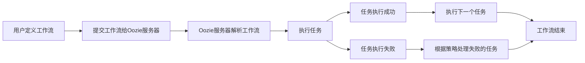

## 1.背景介绍

在大数据处理和分析的过程中，我们常常需要处理多个任务，这些任务之间可能存在依赖关系，需要按照特定的顺序执行。这时，我们就需要一个工作流调度系统来管理这些任务。Apache Oozie就是这样一款工作流调度系统，它可以帮助我们管理Hadoop上的任务，包括MapReduce、Pig、Hive等任务。

Oozie的出现，让我们可以更加方便的管理和调度任务，极大的提高了大数据处理的效率。本文将详细介绍Oozie的原理，并通过代码实例进行讲解。

## 2.核心概念与联系

在了解Oozie的原理之前，我们首先需要了解一些核心的概念：

- 工作流（Workflow）：工作流是一组有依赖关系的任务，它们按照特定的顺序执行。在Oozie中，工作流是通过XML文件来定义的。

- 任务（Action）：任务是工作流中的一个执行单元，它可以是一个MapReduce作业，一个Hive脚本，或者其他的Hadoop任务。

- 协调器（Coordinator）：协调器是一种特殊的工作流，它可以定时或者按照数据可用性来触发工作流的执行。

- 捆绑（Bundle）：捆绑是一组协调器的集合，可以同时管理多个协调器。

这些概念之间的关系可以通过下面的Mermaid流程图进行表示：


## 3.核心算法原理具体操作步骤

Oozie的工作流调度主要包括以下几个步骤：

1. 用户通过XML文件定义工作流，包括任务的定义和任务之间的依赖关系。

2. 用户提交工作流给Oozie服务器，Oozie服务器会解析XML文件，生成对应的工作流实例。

3. Oozie服务器根据工作流实例，依次执行每个任务。对于每个任务，Oozie服务器会提交给对应的Hadoop组件执行，并等待执行结果。

4. 如果一个任务执行成功，Oozie服务器会执行下一个依赖该任务的任务。如果一个任务执行失败，Oozie服务器会根据用户设定的策略，决定是重试任务，还是终止工作流。

5. 当所有的任务都执行完成后，工作流结束。

这个过程可以通过下面的Mermaid流程图进行表示：



## 4.数学模型和公式详细讲解举例说明

在Oozie的工作流调度中，我们需要处理的一个重要问题是任务的优先级问题。不同的任务可能有不同的优先级，我们需要确保高优先级的任务能够优先执行。

假设我们有n个任务，每个任务i有一个优先级$P_i$和一个执行时间$T_i$。我们的目标是最小化所有任务的总等待时间：

$$
W = \sum_{i=1}^{n} W_i = \sum_{i=1}^{n} (S_i - A_i)
$$

其中$W_i$是任务i的等待时间，$S_i$是任务i的开始时间，$A_i$是任务i的到达时间。

为了达到这个目标，我们可以使用优先级队列的方法。我们把所有的任务按照优先级排序，优先级高的任务先执行。这样，我们可以保证高优先级的任务能够尽快开始执行，从而减少等待时间。

## 5.项目实践：代码实例和详细解释说明

下面我们通过一个简单的例子来说明如何使用Oozie进行工作流调度。

首先，我们需要定义一个工作流，这个工作流包含两个任务：一个MapReduce作业和一个Hive脚本。我们通过一个XML文件来定义这个工作流：

```xml
<workflow-app name="myWorkflow" xmlns="uri:oozie:workflow:0.5">
    <start to="myMapReduceJob"/>
    <action name="myMapReduceJob">
        <map-reduce>
            <job-tracker>${jobTracker}</job-tracker>
            <name-node>${nameNode}</name-node>
            <configuration>
                <property>
                    <name>mapred.job.queue.name</name>
                    <value>${queueName}</value>
                </property>
            </configuration>
        </map-reduce>
        <ok to="myHiveScript"/>
        <error to="fail"/>
    </action>
    <action name="myHiveScript">
        <hive xmlns="uri:oozie:hive-action:0.2">
            <job-tracker>${jobTracker}</job-tracker>
            <name-node>${nameNode}</name-node>
            <script>${hiveScript}</script>
            <param>INPUT=${inputDir}</param>
            <param>OUTPUT=${outputDir}</param>
        </hive>
        <ok to="end"/>
        <error to="fail"/>
    </action>
    <kill name="fail">
        <message>Workflow failed, error message[${wf:errorMessage(wf:lastErrorNode())}]</message>
    </kill>
    <end name="end"/>
</workflow-app>
```

然后，我们可以通过Oozie的命令行工具提交这个工作流：

```bash
oozie job -oozie http://localhost:11000/oozie -config job.properties -run
```

在这个命令中，我们需要指定Oozie服务器的地址，以及一个包含了工作流参数的属性文件。

这个例子展示了如何使用Oozie进行工作流调度，但是在实际使用中，可能需要处理更复杂的情况，例如任务的重试、错误处理等。

## 6.实际应用场景

Oozie在大数据处理中有广泛的应用，例如：

- 数据清洗：我们可以使用Oozie来调度数据清洗的任务，例如删除重复的数据，填充缺失的数据等。

- 数据分析：我们可以使用Oozie来调度数据分析的任务，例如统计用户的行为数据，生成报表等。

- 数据同步：我们可以使用Oozie来调度数据同步的任务，例如将数据从Hadoop迁移到关系数据库等。

## 7.工具和资源推荐

如果你想要深入学习Oozie，我推荐以下的工具和资源：

- Oozie官方文档：这是Oozie的官方文档，包含了详细的使用说明和示例。

- Hadoop: The Definitive Guide：这本书详细介绍了Hadoop以及相关的工具，包括Oozie。

- Oozie源代码：如果你想要深入理解Oozie的工作原理，可以阅读Oozie的源代码。

## 8.总结：未来发展趋势与挑战

随着大数据技术的发展，工作流调度系统的需求越来越大。Oozie作为一款成熟的工作流调度系统，已经被广泛应用在各种大数据处理场景中。

然而，Oozie也面临着一些挑战。例如，Oozie的工作流定义语言是基于XML的，这使得工作流的定义变得复杂和冗长。此外，Oozie的错误处理机制也有待改进。

尽管如此，我相信Oozie的未来仍然充满希望。随着Oozie社区的不断发展，我期待看到Oozie在未来能够提供更多的功能，更好的性能，以及更友好的用户体验。

## 9.附录：常见问题与解答

1. 问题：我可以在Oozie中使用哪些类型的任务？

答：Oozie支持多种类型的任务，包括MapReduce、Pig、Hive、Sqoop、SSH等。

2. 问题：如何处理Oozie中的任务失败？

答：Oozie提供了错误处理机制，你可以在工作流定义中指定错误处理的策略，例如重试任务，或者终止工作流。

3. 问题：我可以在Oozie中定义并行的任务吗？

答：是的，你可以在Oozie中定义并行的任务。你可以使用fork和join节点来定义并行的任务。

作者：禅与计算机程序设计艺术 / Zen and the Art of Computer Programming