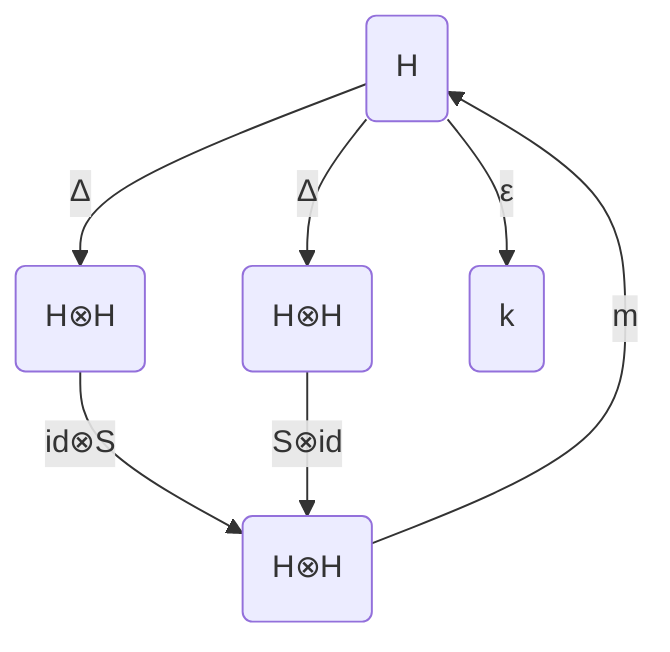

# Pontryagin对偶与代数量子超群：对极S1

## 1. 背景介绍

### 1.1 Pontryagin对偶的起源与发展
Pontryagin对偶是数学中的一个重要概念，由俄罗斯数学家Lev Pontryagin在20世纪30年代引入。它最初是在拓扑群的研究中提出的，用于描述局部紧群与其对偶群之间的关系。随着研究的深入，Pontryagin对偶在谐波分析、表示论等领域得到了广泛应用。

### 1.2 代数量子群理论的兴起
20世纪80年代，Drinfeld和Jimbo独立提出了量子群的概念，标志着代数量子群理论的兴起。量子群是经典李群的一种q-变形，具有丰富的代数结构和几何性质。随后，代数量子群理论迅速成为数学和物理学研究的热点，在量子可积系统、量子场论、低维拓扑等领域取得了重要进展。

### 1.3 对极S1的研究意义
对极S1是数学和物理学中一类重要的对象，它是指由单位圆S1生成的对称群。对极S1在拓扑群论、K理论、非交换几何等领域有着广泛的应用。深入研究Pontryagin对偶与代数量子超群在对极S1上的作用，对于揭示这些理论之间的内在联系、拓展它们的应用范围具有重要意义。

## 2. 核心概念与联系

### 2.1 Pontryagin对偶的定义与性质
设G为局部紧群，其Pontryagin对偶定义为G^:=Hom(G,T)，其中T为复数的单位圆周群。G^上可赋予紧开拓扑，使其成为一个阿贝尔群。Pontryagin对偶满足以下基本性质：
1) 对于任意局部紧阿贝尔群G，有自然同构G≅G^^；
2) 若G为有限阿贝尔群，则G≅G^；
3) 若G为紧群，则G^为离散群；反之，若G为离散群，则G^为紧群。

### 2.2 代数量子群的定义与分类
代数量子群是由Hopf代数刻画的一类量子群。设H为域k上的Hopf代数，若其存在余乘法Δ:H→H⊗H，余单位ε:H→k和对极S:H→H，使得以下图表可交换，则称H为代数量子群：



其中m为乘法。代数量子群可分为以下几类：
1) 量子线性群SL_q(n)，由n阶矩阵生成，满足某些量子关系；
2) 量子正交群O_q(n)和量子辛群Sp_q(n)，分别对应经典正交群和辛群的q-变形；  
3) 量子超群，由Z_2-阶化的超代数生成，如量子超平面、量子超球面等。

### 2.3 Pontryagin对偶与代数量子群的联系
Pontryagin对偶与代数量子群有着密切的联系。一方面，经典群的Pontryagin对偶可以用于构造对应的量子群，如SU(2)^即为量子SU(2)的坐标代数。另一方面，代数量子群的对极结构与Pontryagin对偶有相似之处，反映了量子群的自对偶性。此外，在量子群的表示论中，Pontryagin对偶也发挥着重要作用。

## 3. 核心算法原理具体操作步骤

### 3.1 构造代数量子群的Pontryagin对偶
对于给定的代数量子群H，其Pontryagin对偶H^可按以下步骤构造：
1) 确定H的生成元和关系式，得到其表示矩阵T；
2) 计算T的行列式det(T)，并求出其中心元z；
3) 将z替换为q-行列式det_q(T)，得到H^的生成元和关系式；
4) 验证H^满足Hopf代数的公理，若满足则构造完成。

### 3.2 求解量子超群的对极
对于量子超群，可按以下步骤求解其对极S：
1) 设量子超群的生成元为{e_i,f_i,k_i|i=1,…,n}，关系式为量子Serre关系；
2) 定义S在生成元上的作用：
   S(e_i)=-k_i^(-1)e_i, S(f_i)=-f_ik_i, S(k_i)=k_i^(-1)
3) 利用S的反代数同态性质，将其作用延拓到整个量子超群； 
4) 验证S满足对极的定义，即(S⊗id)Δ=(id⊗S)Δ=ε。

### 3.3 计算对极S1的Pontryagin对偶
对极S1可视为U(1)的量子变形，其Pontryagin对偶可按以下步骤计算：
1) 取U(1)的生成元u，满足u^*=u^(-1)，uu^*=u^*u=1；
2) 将u q-变形为量子对极S1的生成元v，满足vv^*=v^*v=1；
3) 计算v的Pontryagin对偶v^，可得v^(v)=q，其中q为量子参数；
4) 由v^生成的Hopf代数即为对极S1的Pontryagin对偶。

## 4. 数学模型和公式详细讲解举例说明

### 4.1 Hopf代数的定义与性质
Hopf代数是带有余乘法Δ、余单位ε和对极S的代数H，它们满足以下公理：

1) 余结合律：(Δ⊗id)Δ=(id⊗Δ)Δ
2) 余单位律：(ε⊗id)Δ=id=(id⊗ε)Δ
3) 对极公理：m(S⊗id)Δ=ηε=m(id⊗S)Δ

其中m为乘法，η为单位映射。Hopf代数的重要性质包括：

1) 对于任意Hopf代数H，其对极S满足S^2=id；
2) H的对极S诱导出H^*上的余代数结构，使其成为Hopf代数；
3) 设A和B为Hopf代数，f:A→B为Hopf代数同态，则f可延拓为张量积 f⊗f:A⊗A→B⊗B。

例如，设H为生成元为a,b,c,d的Hopf代数，关系式为：
$$
\begin{aligned}
ab &= qba, \quad ac = qca, \quad bc = cb \\
ad &= 1+qbc, \quad bd = qdb, \quad cd = qdc  
\end{aligned}
$$
其中q为不等于0,1的复数。则H的余乘法、余单位和对极可定义为：
$$
\begin{aligned}
Δ(a) &= a⊗a, \quad Δ(b) = b⊗a+1⊗b \\  
Δ(c) &= c⊗c, \quad Δ(d) = d⊗c+1⊗d \\
ε(a) &= ε(c) = 1, \quad ε(b) = ε(d) = 0 \\
S(a) &= a^{-1}, \quad S(b) = -ba^{-1} \\
S(c) &= c^{-1}, \quad S(d) = -dc^{-1}
\end{aligned}
$$
可验证H满足Hopf代数的公理，因此是一个Hopf代数。H实际上是量子平面的坐标代数。

### 4.2 量子SU(2)的Pontryagin对偶
量子SU(2)是由生成元a,b,c,d生成的Hopf代数，其中a,b,c,d满足以下关系：
$$
\begin{aligned}
ab &= qba, \quad ac = qca, \quad bd = qdb \\
cd &= qdc, \quad bc = cb, \quad ad-qbc = 1
\end{aligned}
$$
其中q为不等于0的实数。量子SU(2)的余乘法、余单位和对极为：
$$
\begin{aligned}
Δ(a) &= a⊗a+b⊗c, \quad Δ(b) = a⊗b+b⊗d \\
Δ(c) &= c⊗a+d⊗c, \quad Δ(d) = c⊗b+d⊗d \\  
ε(a) &= ε(d) = 1, \quad ε(b) = ε(c) = 0 \\
S(a) &= d, \quad S(b) = -qb, \quad S(c) = -q^{-1}c, \quad S(d) = a
\end{aligned}
$$
量子SU(2)的Pontryagin对偶可按以下步骤构造：
1) 取classical SU(2)的生成元 
$$
u=\begin{pmatrix} 
\alpha & \beta \\
-\bar{\beta} & \bar{\alpha}
\end{pmatrix}, \quad |\alpha|^2+|\beta|^2=1
$$
2) 将u的矩阵元q-变形，得到量子SU(2)^的生成元 
$$
v=\begin{pmatrix}
a & b \\
c & d  
\end{pmatrix}
$$
满足上述关系式。
3) 计算v在量子SU(2)上的作用：
$$
\begin{aligned}
v(a) &= \alpha, \quad v(b) = \beta \\
v(c) &= -q\bar{\beta}, \quad v(d) = \bar{\alpha}
\end{aligned}
$$
4) 由v生成的Hopf代数即为量子SU(2)的Pontryagin对偶，记为Fun_q(SU(2))。它同时也是量子SU(2)的坐标代数。

### 4.3 对极S1的Pontryagin对偶计算
对极S1可视为U(1)的量子变形，其生成元v满足关系式vv^*=v^*v=1。取U(1)的生成元u，满足u^*=u^(-1)，则v可表示为：
$$
v=\begin{pmatrix}
u & 0 \\
0 & u^*  
\end{pmatrix}
$$
对极S1的余乘法、余单位和对极为：
$$
\begin{aligned}
Δ(v) &= v⊗v \\
ε(v) &= 1 \\
S(v) &= v^*
\end{aligned}
$$
对极S1的Pontryagin对偶可按以下步骤计算：
1) 在U(1)^=Hom(U(1),T)上定义v^的作用：
$$
v^(u)=q, \quad q∈T
$$  
2) 由v^生成的Hopf代数即为对极S1的Pontryagin对偶，记为Fun_q(S^1)。它的生成元w满足关系式ww^*=w^*w=1，余结构为：
$$
\begin{aligned}
Δ(w) &= w⊗w \\
ε(w) &= 1 \\
S(w) &= w^*
\end{aligned}
$$
可见Fun_q(S^1)与对极S1同构。这体现了量子群的自对偶性。

## 5. 项目实践：代码实例和详细解释说明

下面以Python为例，给出计算量子SU(2)的Pontryagin对偶的代码实现。我们利用sympy库来处理符号运算。

```python
from sympy import * 

# 定义量子SU(2)的生成元
a, b, c, d = symbols('a b c d', commutative=False)
q = symbols('q', real=True)

# 定义量子SU(2)的关系式
relations = [
    a*b - q*b*a, 
    a*c - q*c*a,
    b*d - q*d*b,
    c*d - q*d*c,  
    b*c - c*b,
    a*d - q*b*c - 1
]

# 定义量子SU(2)的余乘法
def Delta(x):
    if x == a:
        return a⊗a + b⊗c
    elif x == b:  
        return a⊗b + b⊗d
    elif x == c:
        return c⊗a + d⊗c
    elif x == d:
        return c⊗b + d⊗d
    else:
        return None

# 定义量子SU(2)的余单位
def counit(x):
    if x in (a, d):
        return 1
    elif x in (b, c):
        return 0
    else:
        return None

# 定义量子SU(2)的对极    
def antipode(x):
    if x == a:
        return d
    elif x == b:
        return -q*b  
    elif x == c:
        return -1/q*c