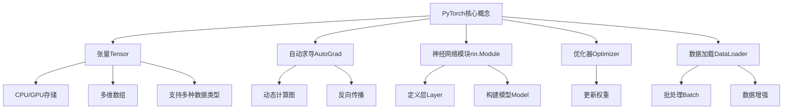

# PyTorch 原理与代码实战案例讲解

## 1.背景介绍

在当今的人工智能时代,深度学习已经成为各大科技公司和学术机构的研究热点。作为一种强大的机器学习技术,深度学习已被广泛应用于计算机视觉、自然语言处理、语音识别等诸多领域,取得了令人瞩目的成就。而PyTorch则是一个流行的开源深度学习框架,凭借其简洁易用的设计和高效的计算性能,受到了广大研究人员和工程师的青睐。

PyTorch由Facebook人工智能研究院(FAIR)开发,于2017年正式对外开源。它基于Torch库构建,使用Python作为主要编程语言,并支持GPU加速计算。PyTorch的设计理念是提供最大的灵活性和速度,使研究人员能够快速构建和训练深度神经网络模型。

与其他深度学习框架相比,PyTorch的主要优势在于其动态计算图和即时编码特性。动态计算图意味着模型可以在运行时构建和修改,这为实现复杂的神经网络架构提供了极大的灵活性。即时编码则允许用户在Python中直接编写张量操作,而无需构建静态计算图,这使得代码更加直观和易于调试。

PyTorch还提供了强大的GPU加速支持,可以充分利用现代硬件的并行计算能力,大幅提高深度学习模型的训练和推理速度。此外,PyTorch还具有丰富的库和工具,包括用于计算机视觉、自然语言处理和强化学习等领域的高级API,极大地简化了模型开发和部署的过程。

## 2.核心概念与联系

为了更好地理解PyTorch的原理和使用方法,我们需要先了解一些核心概念。PyTorch的核心数据结构是张量(Tensor),它是一个多维数组,类似于NumPy中的ndarray。PyTorch中的张量可以存储在CPU或GPU上,并支持多种数据类型,如浮点数、整数等。



自动求导(AutoGrad)是PyTorch的另一个核心特性。它通过动态计算图自动跟踪张量之间的操作,并在反向传播时自动计算梯度。这种自动微分机制极大地简化了深度神经网络的训练过程,使开发人员能够专注于模型架构和超参数调优。

PyTorch提供了nn.Module类,用于定义神经网络的各个层(Layer),并将它们组合成完整的模型(Model)。这种模块化设计使得模型构建过程更加清晰和可重用。

优化器(Optimizer)则负责根据计算出的梯度,更新神经网络中的可训练参数(权重和偏置)。PyTorch内置了多种优化算法,如随机梯度下降(SGD)、Adam等,也支持自定义优化器。

数据加载(DataLoader)是PyTorch中用于处理训练和测试数据的工具。它可以自动进行批处理(Batch)操作,并支持数据增强等预处理技术,极大地提高了数据处理效率。

## 3.核心算法原理具体操作步骤

PyTorch的核心算法原理可以概括为以下几个步骤:

1. **定义模型架构**

   使用PyTorch的nn.Module和各种层(Layer)定义神经网络的架构,例如卷积层(Conv2d)、全连接层(Linear)等。

2. **构建计算图**

   在前向传播(forward)过程中,PyTorch会自动构建动态计算图,记录张量之间的操作。

3. **计算损失函数**

   根据模型的输出和真实标签,计算损失函数(Loss Function),如交叉熵损失(CrossEntropyLoss)等。

4. **反向传播**

   调用loss.backward()函数,PyTorch会自动沿着计算图反向传播,计算每个参数的梯度。

5. **更新模型参数**

   使用优化器(Optimizer)根据计算出的梯度,更新模型的可训练参数(权重和偏置)。

6. **重复训练**

   重复执行步骤2-5,直到模型收敛或达到预期的性能。

下面是一个简单的示例,展示了如何使用PyTorch定义一个全连接神经网络,并进行训练:

```python
import torch
import torch.nn as nn
import torch.optim as optim

# 定义模型
class Net(nn.Module):
    def __init__(self):
        super(Net, self).__init__()
        self.fc1 = nn.Linear(10, 5)
        self.fc2 = nn.Linear(5, 2)

    def forward(self, x):
        x = torch.relu(self.fc1(x))
        x = self.fc2(x)
        return x

# 实例化模型
model = Net()

# 定义损失函数和优化器
criterion = nn.CrossEntropyLoss()
optimizer = optim.SGD(model.parameters(), lr=0.01)

# 训练循环
for epoch in range(100):
    # 前向传播
    outputs = model(inputs)
    loss = criterion(outputs, labels)

    # 反向传播和优化
    optimizer.zero_grad()
    loss.backward()
    optimizer.step()
```

在这个示例中,我们首先定义了一个简单的全连接神经网络Net,它包含两个线性层。接下来,我们实例化了模型、损失函数和优化器。在训练循环中,我们执行前向传播计算模型输出,然后计算损失函数。调用loss.backward()进行反向传播,计算梯度。最后,使用优化器根据梯度更新模型参数。

## 4.数学模型和公式详细讲解举例说明

在深度学习中,许多核心算法都基于数学模型和公式。理解这些数学原理有助于我们更好地掌握PyTorch的内在机制。

### 4.1 张量运算

PyTorch中的张量运算是基于NumPy的ndarray,支持广播(Broadcasting)、索引(Indexing)、切片(Slicing)等操作。

例如,给定两个张量$\mathbf{A}$和$\mathbf{B}$,它们的矩阵乘法可以表示为:

$$\mathbf{C} = \mathbf{A} \times \mathbf{B}$$

其中$\mathbf{C}$是结果张量。

### 4.2 自动求导

PyTorch的自动求导机制基于链式法则,通过动态计算图跟踪张量之间的操作,自动计算梯度。

假设我们有一个函数$y=f(x)$,其中$x$是输入张量,$y$是输出张量。我们希望计算$\frac{\partial y}{\partial x}$,也就是$y$对$x$的梯度。根据链式法则,我们有:

$$\frac{\partial y}{\partial x} = \prod_{k}\frac{\partial y}{\partial x_k}\frac{\partial x_k}{\partial x}$$

其中$x_k$是计算图中的中间张量。PyTorch会自动计算每个$\frac{\partial y}{\partial x_k}$和$\frac{\partial x_k}{\partial x}$,并将它们相乘得到最终的梯度$\frac{\partial y}{\partial x}$。

### 4.3 损失函数

损失函数(Loss Function)用于衡量模型输出与真实标签之间的差异。常见的损失函数包括均方误差(Mean Squared Error, MSE)和交叉熵损失(Cross Entropy Loss)等。

对于回归问题,均方误差可以表示为:

$$\text{MSE}(y, \hat{y}) = \frac{1}{n}\sum_{i=1}^{n}(y_i - \hat{y}_i)^2$$

其中$y$是真实标签,$\hat{y}$是模型预测输出,n是样本数量。

对于分类问题,交叉熵损失可以表示为:

$$\text{CrossEntropy}(y, p) = -\sum_{i=1}^{C}y_i\log(p_i)$$

其中$y$是one-hot编码的真实标签,$p$是模型预测的概率分布向量,C是类别数量。

### 4.4 优化算法

优化算法用于根据计算出的梯度,更新神经网络中的可训练参数。常见的优化算法包括随机梯度下降(Stochastic Gradient Descent, SGD)、动量优化(Momentum)、RMSProp和Adam等。

以SGD为例,参数更新规则如下:

$$\theta_{t+1} = \theta_t - \eta \cdot \nabla_\theta J(\theta_t)$$

其中$\theta$是可训练参数,$J(\theta)$是损失函数,$\eta$是学习率,用于控制更新步长。

Adam算法则结合了动量和自适应学习率的优势,更新规则为:

$$\begin{aligned}
m_t &= \beta_1 m_{t-1} + (1 - \beta_1)g_t \\
v_t &= \beta_2 v_{t-1} + (1 - \beta_2)g_t^2 \\
\hat{m}_t &= \frac{m_t}{1 - \beta_1^t} \\
\hat{v}_t &= \frac{v_t}{1 - \beta_2^t} \\
\theta_{t+1} &= \theta_t - \frac{\eta}{\sqrt{\hat{v}_t} + \epsilon}\hat{m}_t
\end{aligned}$$

其中$m_t$和$v_t$分别是一阶矩估计和二阶矩估计,$\beta_1$和$\beta_2$是衰减率,$\epsilon$是一个很小的常数,用于避免除以零。

通过理解这些数学模型和公式,我们可以更深入地掌握PyTorch的内部工作原理,从而更好地设计和优化深度神经网络模型。

## 5.项目实践:代码实例和详细解释说明

为了更好地理解PyTorch的使用方法,让我们通过一个实际的项目案例来进行实践。在这个案例中,我们将使用PyTorch构建一个卷积神经网络(CNN),用于手写数字识别任务。

### 5.1 导入必要的库

```python
import torch
import torch.nn as nn
import torch.optim as optim
import torchvision
import torchvision.transforms as transforms
```

我们首先导入PyTorch及其子模块,包括nn(神经网络模块)、optim(优化器模块)和torchvision(计算机视觉工具包)。

### 5.2 准备数据集

```python
# 下载并加载MNIST数据集
train_dataset = torchvision.datasets.MNIST(root='./data', train=True, transform=transforms.ToTensor(), download=True)
test_dataset = torchvision.datasets.MNIST(root='./data', train=False, transform=transforms.ToTensor())

# 创建数据加载器
train_loader = torch.utils.data.DataLoader(dataset=train_dataset, batch_size=64, shuffle=True)
test_loader = torch.utils.data.DataLoader(dataset=test_dataset, batch_size=64, shuffle=False)
```

在这里,我们使用torchvision.datasets.MNIST下载并加载著名的MNIST手写数字数据集。我们将数据集分为训练集和测试集,并对图像进行了ToTensor转换(将像素值缩放到0-1之间)。接下来,我们使用torch.utils.data.DataLoader创建数据加载器,用于在训练和测试过程中批量加载数据。

### 5.3 定义卷积神经网络模型

```python
class ConvNet(nn.Module):
    def __init__(self):
        super(ConvNet, self).__init__()
        self.conv1 = nn.Conv2d(1, 32, 3, 1)
        self.conv2 = nn.Conv2d(32, 64, 3, 1)
        self.dropout1 = nn.Dropout2d(0.25)
        self.dropout2 = nn.Dropout2d(0.5)
        self.fc1 = nn.Linear(9216, 128)
        self.fc2 = nn.Linear(128, 10)

    def forward(self, x):
        x = self.conv1(x)
        x = nn.relu(x)
        x = self.conv2(x)
        x = nn.relu(x)
        x = nn.max_pool2d(x, 2)
        x = self.dropout1(x)
        x = torch.flatten(x, 1)
        x = self.fc1(x)
        x = nn.relu(x)
        x = self.dropout2(x)
        x = self.fc2(x)
        output = nn.log_softmax(x, dim=1)
        return output
```

在这里,我们定义了一