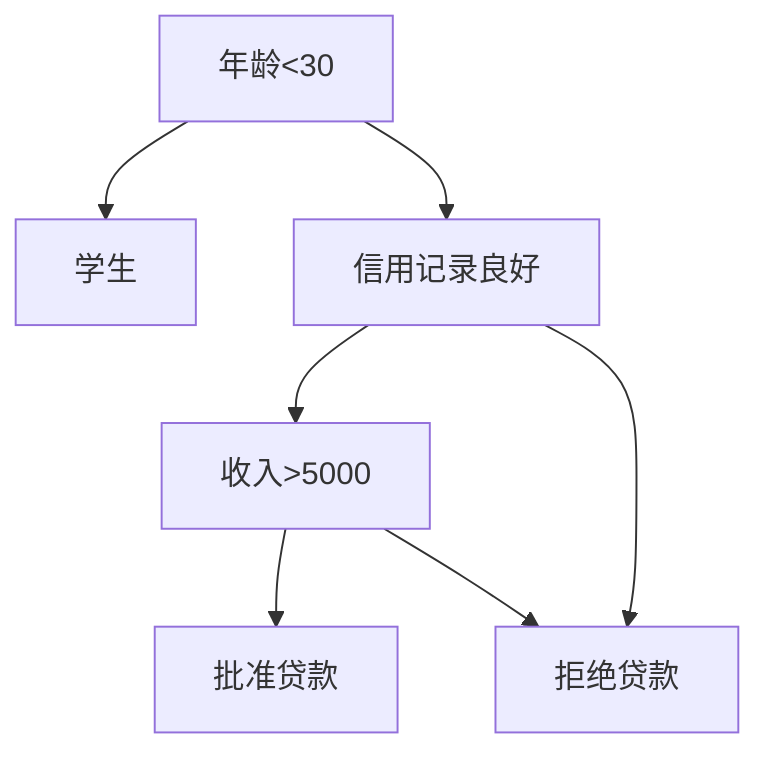

# Python机器学习实战：决策树算法原理及其在Python中的实现

## 1.背景介绍
### 1.1 机器学习概述
### 1.2 决策树算法在机器学习中的地位
### 1.3 决策树算法的发展历史

## 2.决策树算法核心概念与联系
### 2.1 决策树的定义与结构
#### 2.1.1 决策树的节点类型
#### 2.1.2 决策树的层次结构
#### 2.1.3 决策树的路径与决策
### 2.2 决策树算法的分类
#### 2.2.1 ID3算法
#### 2.2.2 C4.5算法
#### 2.2.3 CART算法
### 2.3 决策树算法的优缺点
#### 2.3.1 决策树算法的优点
#### 2.3.2 决策树算法的缺点
### 2.4 决策树与其他机器学习算法的关系
#### 2.4.1 决策树与朴素贝叶斯的比较
#### 2.4.2 决策树与支持向量机的比较
#### 2.4.3 决策树与神经网络的比较

## 3.决策树算法原理与具体操作步骤
### 3.1 决策树的构建过程
#### 3.1.1 特征选择
#### 3.1.2 决策树的生成
#### 3.1.3 决策树的剪枝
### 3.2 特征选择的度量方法
#### 3.2.1 信息增益
#### 3.2.2 增益率
#### 3.2.3 基尼指数
### 3.3 决策树的生成算法
#### 3.3.1 ID3算法的生成过程
#### 3.3.2 C4.5算法的生成过程
#### 3.3.3 CART算法的生成过程
### 3.4 决策树的剪枝策略
#### 3.4.1 预剪枝
#### 3.4.2 后剪枝

## 4.决策树算法的数学模型和公式详解
### 4.1 信息熵与条件熵
#### 4.1.1 信息熵的定义与计算
#### 4.1.2 条件熵的定义与计算
#### 4.1.3 信息增益的计算公式
### 4.2 基尼指数的计算
#### 4.2.1 基尼指数的定义
#### 4.2.2 基尼指数的计算公式
### 4.3 决策树算法中的数学推导
#### 4.3.1 ID3算法的数学推导
#### 4.3.2 C4.5算法的数学推导
#### 4.3.3 CART算法的数学推导

## 5.决策树算法的Python实现
### 5.1 使用scikit-learn库实现决策树
#### 5.1.1 数据集的准备
#### 5.1.2 决策树模型的训练
#### 5.1.3 决策树模型的评估
### 5.2 从零开始实现决策树算法
#### 5.2.1 构建决策树的数据结构
#### 5.2.2 实现特征选择的度量方法
#### 5.2.3 实现决策树的生成算法
#### 5.2.4 实现决策树的剪枝策略
### 5.3 决策树算法的优化技巧
#### 5.3.1 特征工程的应用
#### 5.3.2 参数调优的方法
#### 5.3.3 集成学习的应用

## 6.决策树算法的实际应用场景
### 6.1 金融领域的应用
#### 6.1.1 信用评分
#### 6.1.2 风险评估
#### 6.1.3 反欺诈检测
### 6.2 医疗领域的应用
#### 6.2.1 疾病诊断
#### 6.2.2 药物推荐
#### 6.2.3 医疗图像分析
### 6.3 营销领域的应用
#### 6.3.1 客户分群
#### 6.3.2 购买行为预测
#### 6.3.3 个性化推荐

## 7.决策树相关工具和资源推荐
### 7.1 开源库和框架
#### 7.1.1 scikit-learn
#### 7.1.2 TensorFlow Decision Forests
#### 7.1.3 XGBoost
### 7.2 可视化工具
#### 7.2.1 Graphviz
#### 7.2.2 dtreeviz
#### 7.2.3 sklearn-tree-plotting
### 7.3 在线学习资源
#### 7.3.1 Coursera机器学习课程
#### 7.3.2 Google机器学习速成课程
#### 7.3.3 决策树算法专题博客

## 8.总结与展望
### 8.1 决策树算法的优势与局限
### 8.2 决策树算法的未来发展趋势
### 8.3 决策树算法面临的挑战与机遇

## 9.附录：常见问题与解答
### 9.1 决策树算法适用于哪些类型的问题？
### 9.2 决策树算法如何处理缺失值和异常值？
### 9.3 决策树算法容易出现过拟合的原因是什么？
### 9.4 决策树算法的时间复杂度和空间复杂度如何？
### 9.5 决策树算法与随机森林算法有何区别？

决策树是一种常用的机器学习算法，它通过对数据进行递归划分，构建一个树状结构的决策模型。决策树算法易于理解和解释，能够处理数值型和类别型特征，对缺失值有很好的鲁棒性。本文将深入探讨决策树算法的原理，并介绍如何使用Python实现决策树算法。

决策树由节点和有向边组成。节点分为内部节点和叶节点，内部节点表示一个特征或属性的判断条件，叶节点表示决策结果。从根节点到叶节点的每一条路径都对应着一个判断规则。



决策树算法主要包括三个步骤：特征选择、决策树的生成和决策树的剪枝。

特征选择是决定用哪个特征来划分数据集，常用的度量方法有信息增益、增益率和基尼指数。以信息增益为例，它衡量了一个特征对数据集的分类能力。设数据集D的信息熵为H(D)，特征A将D划分为V个子集$\{D_1,D_2,...,D_V\}$，则信息增益为：

$$
Gain(D,A)=H(D)-\sum_{v=1}^V \frac{|D_v|}{|D|}H(D_v)
$$

其中，$H(D)=-\sum_{k=1}^K \frac{|C_k|}{|D|} \log_2 \frac{|C_k|}{|D|}$，$C_k$是D中属于第k类的样本子集。

决策树的生成是一个递归过程，从根节点开始，选择最优特征进行划分，生成子节点，再对子节点递归地调用以上过程，直到满足停止条件。常见的决策树生成算法有ID3、C4.5和CART。

决策树的剪枝是为了避免过拟合，提高泛化能力。预剪枝是在决策树生成过程中，对每个节点在划分前进行评估，若不能带来泛化性能提升则停止划分。后剪枝则是先生成一棵完整的决策树，然后自底向上对非叶节点进行评估，若将其替换为叶节点能带来泛化性能提升则进行剪枝。

下面是使用scikit-learn库实现决策树的示例代码：

```python
from sklearn.datasets import load_iris
from sklearn.model_selection import train_test_split
from sklearn.tree import DecisionTreeClassifier
from sklearn.metrics import accuracy_score

# 加载鸢尾花数据集
iris = load_iris()
X = iris.data
y = iris.target

# 划分训练集和测试集
X_train, X_test, y_train, y_test = train_test_split(X, y, test_size=0.2, random_state=42)

# 创建决策树分类器
clf = DecisionTreeClassifier(criterion='gini', max_depth=3, random_state=42)

# 训练决策树模型
clf.fit(X_train, y_train)

# 在测试集上进行预测
y_pred = clf.predict(X_test)

# 计算准确率
accuracy = accuracy_score(y_test, y_pred)
print("Accuracy: {:.2f}".format(accuracy))
```

输出结果：
```
Accuracy: 0.97
```

决策树算法在实际应用中有广泛的用途，如金融领域的信用评分和风险评估、医疗领域的疾病诊断和药物推荐、营销领域的客户分群和购买行为预测等。

总的来说，决策树算法是一种简单而强大的机器学习算法，易于理解和实现。但它也存在一些局限性，如对连续型特征的处理不够灵活、容易过拟合等。未来的发展趋势可能是将决策树与其他算法相结合，如随机森林和梯度提升决策树，以进一步提高性能和泛化能力。

希望本文能够帮助读者深入理解决策树算法的原理，掌握使用Python实现决策树的方法，并了解其在实际应用中的广泛用途。决策树算法虽然已有多年的发展历史，但仍然是机器学习领域的重要工具之一，值得我们深入研究和学习。

作者：禅与计算机程序设计艺术 / Zen and the Art of Computer Programming