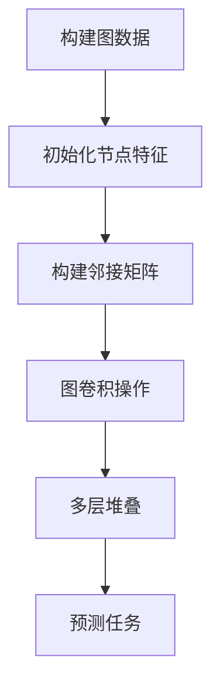

# Python机器学习实战：实战图神经网络(GNN)在社交网络分析中的应用

## 1.背景介绍

在当今时代,社交网络已经成为人们日常生活中不可或缺的一部分。无论是保持联系、分享信息还是寻找新的机会,社交网络都扮演着重要角色。随着社交网络的快速发展,海量的网络数据被生成,这为研究人员提供了一个独特的机会,可以通过分析这些数据来揭示隐藏其中的宝贵见解。

然而,社交网络数据具有复杂的结构性特征,传统的机器学习方法往往难以有效地捕捉这些特征。幸运的是,图神经网络(Graph Neural Networks,GNN)的出现为解决这一挑战提供了一种全新的方法。作为一种新兴的深度学习架构,GNN专门设计用于处理具有图结构的数据,例如社交网络、蛋白质互作网络和交通网络等。

本文将探讨如何使用Python实现GNN,并将其应用于社交网络分析中。我们将介绍GNN的核心概念、算法原理,并通过实际案例展示其在社交网络分析中的实践应用。无论您是数据科学家、研究人员还是对GNN感兴趣的开发人员,本文都将为您提供宝贵的见解和实用的技能。

## 2.核心概念与联系

在深入探讨GNN在社交网络分析中的应用之前,让我们先了解一些核心概念和它们之间的联系。

### 2.1 图数据结构

图是一种非常重要的数据结构,由节点(或称为顶点)和连接节点的边组成。在社交网络中,节点可以表示用户,而边则表示用户之间的关系(如朋友关系或关注关系)。图数据结构能够自然地捕捉社交网络中的拓扑结构和节点之间的相互作用。

### 2.2 图神经网络(GNN)

图神经网络(GNN)是一种专门设计用于处理图数据的深度学习架构。与传统的神经网络不同,GNN能够直接处理图结构数据,并通过神经网络模型来学习节点表示和预测节点属性或图属性。

GNN的核心思想是通过聚合邻居节点的信息来更新每个节点的表示。这种邻居聚合过程会在图上递归进行,直到达到所需的聚合深度。通过这种方式,GNN可以有效地捕捉图数据中的拓扑结构和节点特征信息。

### 2.3 节点嵌入(Node Embedding)

节点嵌入是GNN的一个重要概念,它指的是将每个节点映射到一个低维连续向量空间中的向量表示。这种低维向量表示能够捕捉节点的结构和属性信息,并可用于各种下游任务,如节点分类、链接预测和社区检测等。

GNN通过学习节点嵌入,可以自动捕捉社交网络中的复杂模式和结构,从而为各种分析任务提供有价值的输入特征。

### 2.4 消息传递机制

消息传递机制是GNN中的一种核心操作,它描述了如何在图上传递和聚合信息。在每个传递步骤中,每个节点会收集来自其邻居节点的"消息",并根据这些消息更新自身的表示。这种消息传递过程会在整个图上递归进行,直到达到所需的聚合深度。

不同的GNN模型可能采用不同的消息传递机制,但它们都旨在捕捉图数据中的拓扑结构和节点特征信息。

### 2.5 图级别和节点级别任务

在社交网络分析中,我们通常会遇到两种类型的任务:图级别任务和节点级别任务。

- 图级别任务:这些任务旨在对整个图进行预测或分析,例如预测社交网络中的病毒传播模式或检测网络中的社区结构。
- 节点级别任务:这些任务关注于对单个节点进行预测或分析,例如预测用户的兴趣爱好或识别影响力用户。

GNN能够同时处理这两种类型的任务,为社交网络分析提供了强大的工具。

## 3.核心算法原理具体操作步骤

在了解了GNN的核心概念之后,让我们深入探讨其算法原理和具体操作步骤。本节将介绍一种广为人知的GNN模型:图卷积网络(Graph Convolutional Network,GCN)。

### 3.1 图卷积网络(GCN)概述

图卷积网络(GCN)是一种流行的GNN模型,它通过卷积操作在图上传递和聚合信息。GCN的核心思想是利用图的拓扑结构来定义卷积操作,从而学习节点的表示。

在GCN中,每个节点的表示是通过聚合来自其邻居节点的信息而获得的。这种聚合过程会在整个图上递归进行,直到达到所需的聚合深度。通过这种方式,GCN可以有效地捕捉图数据中的拓扑结构和节点特征信息。

### 3.2 GCN算法步骤

GCN算法的具体步骤如下:

1. **构建图数据**:首先,我们需要将社交网络数据转换为图数据结构,其中节点表示用户,边表示用户之间的关系。

2. **初始化节点特征**:为每个节点分配一个初始特征向量,这些特征可以是节点的属性(如年龄、性别等)或者随机初始化的向量。

3. **构建邻接矩阵**:计算图的邻接矩阵,用于表示节点之间的连接关系。

4. **图卷积操作**:执行图卷积操作,将每个节点的特征向量与其邻居节点的特征向量进行聚合。这个过程可以通过以下公式表示:

$$H^{(l+1)} = \sigma(\tilde{D}^{-\frac{1}{2}}\tilde{A}\tilde{D}^{-\frac{1}{2}}H^{(l)}W^{(l)})$$

其中:
- $H^{(l)}$是第$l$层的节点特征矩阵
- $\tilde{A}$是加入自环后的邻接矩阵
- $\tilde{D}$是度矩阵,用于归一化
- $W^{(l)}$是第$l$层的权重矩阵
- $\sigma$是非线性激活函数,如ReLU

5. **多层堆叠**:通过堆叠多个图卷积层,可以捕捉更高阶的邻居信息和更复杂的图结构。

6. **预测任务**:根据具体的任务(如节点分类或链接预测),在最后一层添加相应的输出层,并使用监督学习来训练模型。

### 3.3 GCN算法流程图

为了更好地理解GCN算法的工作原理,我们使用Mermaid绘制了一个流程图:

在这个流程图中,我们可以清晰地看到GCN算法的各个步骤及其相互关系。从构建图数据开始,经过初始化节点特征、构建邻接矩阵、图卷积操作和多层堆叠,最终达到预测任务的目标。

## 4.数学模型和公式详细讲解举例说明

在上一节中,我们介绍了GCN算法的核心步骤,其中涉及到一些重要的数学模型和公式。现在,让我们更深入地探讨这些数学模型和公式,并通过具体的例子来说明它们的作用和应用。

### 4.1 邻接矩阵

邻接矩阵是一种表示图结构的重要数学模型。对于一个包含$N$个节点的图$G$,其邻接矩阵$A$是一个$N \times N$的矩阵,其中$A_{ij}$表示节点$i$和节点$j$之间是否存在边连接。

具体来说,如果节点$i$和节点$j$之间存在边,则$A_{ij} = 1$,否则$A_{ij} = 0$。对于无向图,邻接矩阵是对称的,即$A_{ij} = A_{ji}$。

例如,考虑一个包含4个节点的社交网络图,其邻接矩阵可能如下所示:

$$
A = \begin{pmatrix}
0 & 1 & 0 & 1\\
1 & 0 & 1 & 0\\
0 & 1 & 0 & 1\\
1 & 0 & 1 & 0
\end{pmatrix}
$$

在这个例子中,节点1与节点2和节点4相连,节点2与节点3和节点1相连,节点3与节点2和节点4相连,节点4与节点1和节点3相连。

邻接矩阵在GCN算法中扮演着重要的角色,它用于表示节点之间的连接关系,并在图卷积操作中起到了关键作用。

### 4.2 度矩阵和归一化

在GCN算法中,我们还需要引入度矩阵和归一化操作,以确保图卷积操作的稳定性和可靠性。

度矩阵$D$是一个对角矩阵,其中$D_{ii}$表示节点$i$的度数,即与节点$i$相连的边的数量。对于无向图,度数等于入度和出度之和。

具体来说,对于邻接矩阵$A$,度矩阵$D$可以计算如下:

$$
D_{ii} = \sum_{j} A_{ij}
$$

接下来,我们需要对邻接矩阵进行归一化,以确保每个节点的特征向量在聚合过程中具有相同的缩放比例。这可以通过以下公式实现:

$$
\tilde{A} = D^{-\frac{1}{2}}AD^{-\frac{1}{2}}
$$

其中$\tilde{A}$是归一化后的邻接矩阵,$D^{-\frac{1}{2}}$是度矩阵$D$的负平方根。

通过这种归一化操作,我们可以确保每个节点的特征向量在聚合过程中得到适当的缩放,从而提高模型的稳定性和性能。

### 4.3 图卷积操作

图卷积操作是GCN算法的核心部分,它定义了如何在图上传递和聚合信息。在GCN中,图卷积操作可以通过以下公式表示:

$$H^{(l+1)} = \sigma(\tilde{D}^{-\frac{1}{2}}\tilde{A}\tilde{D}^{-\frac{1}{2}}H^{(l)}W^{(l)})$$

其中:
- $H^{(l)}$是第$l$层的节点特征矩阵,每一行表示一个节点的特征向量
- $\tilde{A}$是归一化后的邻接矩阵
- $\tilde{D}$是度矩阵,用于进一步归一化
- $W^{(l)}$是第$l$层的权重矩阵,用于线性变换
- $\sigma$是非线性激活函数,如ReLU

这个公式描述了如何将每个节点的特征向量与其邻居节点的特征向量进行聚合,并通过线性变换和非线性激活函数来获得新的节点表示。

让我们通过一个简单的例子来说明图卷积操作的工作原理。假设我们有一个包含3个节点的图,其邻接矩阵如下:

$$
A = \begin{pmatrix}
0 & 1 & 1\\
1 & 0 & 0\\
1 & 0 & 0
\end{pmatrix}
$$

初始节点特征矩阵$H^{(0)}$如下:

$$
H^{(0)} = \begin{pmatrix}
1 & 2\\
3 & 4\\
5 & 6
\end{pmatrix}
$$

权重矩阵$W^{(0)}$为:

$$
W^{(0)} = \begin{pmatrix}
0.1 & 0.2\\
0.3 & 0.4
\end{pmatrix}
$$

经过一次图卷积操作后,我们可以获得新的节点特征矩阵$H^{(1)}$:

$$
H^{(1)} = \sigma\left(\begin{pmatrix}
\frac{1}{\sqrt{2}} & 0 & 0\\
0 & \frac{1}{\sqrt{1}} & 0\\
0 & 0 & \frac{