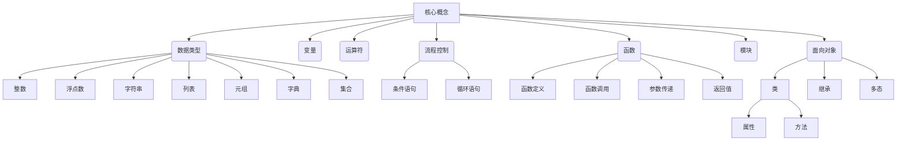
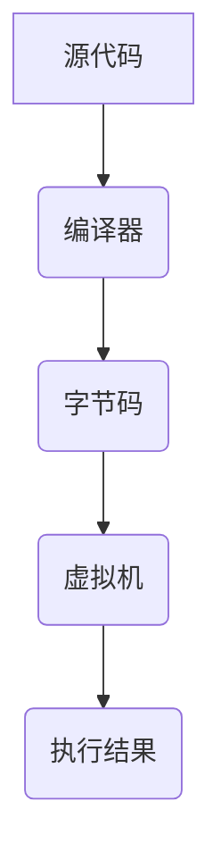

# Python语言基础原理与代码实战案例讲解

## 1.背景介绍

Python是一种广泛使用的通用编程语言,它的设计理念强调代码可读性和简洁性。Python语言由荷兰人Guido van Rossum于1989年发明,第一个公开发行版发行于1991年。Python的语法简单,且被设计成可以轻松阅读的格式,使用英文关键字频率高,其他大多数语言所用的语法符号被剔除了。

Python支持多种编程范式,包括面向对象、命令式、函数式和过程式,其本身有着动态的数据类型和动态内存管理,支持自动垃圾回收功能。Python解释器本身被编写为C语言,可以在大多数操作系统上运行。

Python的应用非常广泛,可用于Web开发、数据分析、人工智能、自动化运维、游戏开发等多个领域。它也是目前最受欢迎的编程语言之一,在学术界和工业界都有着广泛的应用。

## 2.核心概念与联系

Python作为一种解释型语言,其核心概念涵盖了数据类型、变量、运算符、流程控制、函数、模块、面向对象编程等多个方面。这些概念相互关联,构建了Python语言的基础框架。



### 2.1 数据类型

Python支持多种内置数据类型,包括整数、浮点数、字符串、列表、元组、字典和集合等。这些数据类型可以存储各种类型的数据,并支持相应的操作和方法。

### 2.2 变量

变量是用于存储数据值的命名存储空间。Python中的变量是动态类型的,无需预先声明数据类型,在赋值时会自动推断类型。变量名命名需遵循一定规则。

### 2.3 运算符

Python支持各种运算符,包括算术运算符、比较运算符、赋值运算符、逻辑运算符、位运算符和成员运算符等。这些运算符可用于执行不同的操作和计算。

### 2.4 流程控制

流程控制语句用于控制程序的执行流程,包括条件语句(如if、elif和else)和循环语句(如for和while)。这些语句可以根据特定条件执行不同的代码块。

### 2.5 函数

函数是可重用的代码块,用于封装特定的功能。Python支持函数的定义、调用、参数传递和返回值。函数可以提高代码的模块化和可维护性。

### 2.6 模块

模块是Python中的代码组织单元,包含了变量、函数、类等代码元素。Python提供了大量内置模块,也支持导入自定义模块,以实现代码的复用和模块化。

### 2.7 面向对象编程

Python全面支持面向对象编程范式。在Python中,类是对象的蓝图,包含属性和方法。对象是类的实例,可以访问和修改类中定义的属性和方法。Python还支持继承、多态等面向对象概念。

## 3.核心算法原理具体操作步骤

Python作为一种解释型语言,其核心算法原理涉及到解释器的工作原理、内存管理、垃圾回收等方面。下面将详细介绍Python解释器的工作流程。



### 3.1 源代码

Python程序的源代码是以`.py`文件的形式存在的,包含了程序员编写的Python语言代码。

### 3.2 编译器

Python解释器内置了一个编译器,用于将源代码编译成字节码。编译器会对源代码进行词法分析、语法分析和语义分析,生成对应的字节码。

### 3.3 字节码

字节码是一种中间代码形式,可以被Python虚拟机直接执行。字节码是一种紧凑的二进制格式,可以提高执行效率。

### 3.4 虚拟机

Python虚拟机(PVM)是Python解释器的核心部分,负责执行字节码。虚拟机会对字节码进行解释和执行,并管理内存分配、垃圾回收等任务。

### 3.5 执行结果

经过上述步骤,Python程序最终会产生相应的执行结果,如输出、文件写入等。

Python的核心算法原理体现了解释型语言的特点,通过编译-解释的方式执行代码。这种设计使得Python具有可移植性和动态特性,但也可能会牺牲一定的执行效率。

## 4.数学模型和公式详细讲解举例说明

Python提供了强大的数学支持,包括内置的数学函数和第三方数学库,如NumPy、SciPy等。下面将介绍一些常用的数学模型和公式。

### 4.1 线性代数

线性代数是数学的一个重要分支,在科学计算和数据分析中有着广泛的应用。Python中可以使用NumPy库进行线性代数计算。

#### 4.1.1 矩阵乘法

矩阵乘法是线性代数中的一个基本运算,用于计算两个矩阵的乘积。在NumPy中,可以使用`np.matmul()`函数进行矩阵乘法计算。

设有两个矩阵$A$和$B$,其矩阵乘积$C$可以表示为:

$$C = AB$$

其中$A$是$m \times n$矩阵,$B$是$n \times p$矩阵,$C$是$m \times p$矩阵。

```python
import numpy as np

A = np.array([[1, 2], [3, 4]])
B = np.array([[5, 6], [7, 8]])

C = np.matmul(A, B)
print(C)
```

输出结果:

```
[[19, 22],
 [43, 50]]
```

#### 4.1.2 矩阵求逆

矩阵求逆是线性代数中的一个重要操作,用于求解线性方程组。在NumPy中,可以使用`np.linalg.inv()`函数计算矩阵的逆。

设有一个$n \times n$矩阵$A$,其逆矩阵$A^{-1}$满足:

$$AA^{-1} = A^{-1}A = I$$

其中$I$是$n \times n$的单位矩阵。

```python
import numpy as np

A = np.array([[1, 2], [3, 4]])
A_inv = np.linalg.inv(A)
print(A_inv)
```

输出结果:

```
[[-2.   1. ],
 [ 1.5 -0.5]]
```

### 4.2 统计学

统计学是一门研究数据收集、整理、分析和解释的学科,在数据分析和机器学习中有着广泛的应用。Python提供了多个统计学库,如SciPy、Pandas等。

#### 4.2.1 均值和方差

均值和方差是描述数据集中心趋势和离散程度的两个重要指标。在SciPy中,可以使用`scipy.stats.mean()`和`scipy.stats.var()`函数计算均值和方差。

设有一个数据集$X = \{x_1, x_2, \ldots, x_n\}$,其均值$\mu$和方差$\sigma^2$可以表示为:

$$\mu = \frac{1}{n}\sum_{i=1}^{n}x_i$$

$$\sigma^2 = \frac{1}{n}\sum_{i=1}^{n}(x_i - \mu)^2$$

```python
import numpy as np
from scipy import stats

data = np.array([1, 2, 3, 4, 5])
mean = stats.mean(data)
var = stats.var(data)
print(f"Mean: {mean}, Variance: {var}")
```

输出结果:

```
Mean: 3.0, Variance: 2.5
```

#### 4.2.2 正态分布

正态分布是统计学中一种重要的概率分布,广泛应用于自然科学和社会科学领域。在SciPy中,可以使用`scipy.stats.norm`模块计算正态分布相关参数。

设有一个正态分布$N(\mu, \sigma^2)$,其概率密度函数为:

$$f(x) = \frac{1}{\sqrt{2\pi\sigma^2}}e^{-\frac{(x-\mu)^2}{2\sigma^2}}$$

其中$\mu$是均值,$\sigma^2$是方差。

```python
import numpy as np
from scipy import stats
import matplotlib.pyplot as plt

mu = 0
sigma = 1
x = np.linspace(-5, 5, 100)
y = stats.norm.pdf(x, mu, sigma)

plt.plot(x, y)
plt.title("Normal Distribution")
plt.show()
```

上述代码将绘制一个均值为0,标准差为1的正态分布曲线。

## 5.项目实践:代码实例和详细解释说明

在这一部分,我们将通过一个实际的项目案例,来演示Python语言在实践中的应用。我们将构建一个简单的Web应用程序,使用Flask框架和SQLite数据库。

### 5.1 项目概述

我们将构建一个简单的博客应用程序,允许用户创建、阅读、更新和删除博客文章。这个项目将涵盖以下几个方面:

- 使用Flask框架构建Web应用程序
- 使用SQLite数据库存储博客文章
- 实现CRUD(创建、读取、更新、删除)操作
- 使用HTML模板渲染页面
- 使用Bootstrap进行基本样式美化

### 5.2 项目设置

首先,我们需要安装所需的Python包:

```
pip install flask
```

创建一个新的Python文件`app.py`,并导入所需的模块:

```python
from flask import Flask, render_template, request, redirect, url_for
import sqlite3

app = Flask(__name__)
```

### 5.3 数据库设置

我们将使用SQLite数据库来存储博客文章。创建一个新的`blog.db`文件,并在`app.py`中添加以下代码来连接数据库:

```python
def get_db_connection():
    conn = sqlite3.connect('blog.db')
    conn.row_factory = sqlite3.Row
    return conn

def init_db():
    conn = get_db_connection()
    conn.execute('CREATE TABLE IF NOT EXISTS posts (id INTEGER PRIMARY KEY AUTOINCREMENT, title TEXT, content TEXT)')
    conn.close()

init_db()
```

### 5.4 路由和视图函数

接下来,我们将定义路由和视图函数来处理不同的HTTP请求。

#### 5.4.1 列出所有文章

```python
@app.route('/')
def index():
    conn = get_db_connection()
    posts = conn.execute('SELECT * FROM posts').fetchall()
    conn.close()
    return render_template('index.html', posts=posts)
```

这个视图函数将从数据库中获取所有博客文章,并将它们渲染到`index.html`模板中。

#### 5.4.2 创建新文章

```python
@app.route('/create', methods=['GET', 'POST'])
def create():
    if request.method == 'POST':
        title = request.form['title']
        content = request.form['content']

        conn = get_db_connection()
        conn.execute('INSERT INTO posts (title, content) VALUES (?, ?)', (title, content))
        conn.commit()
        conn.close()

        return redirect(url_for('index'))

    return render_template('create.html')
```

这个视图函数将处理创建新博客文章的请求。如果是GET请求,它将渲染`create.html`模板,显示一个表单。如果是POST请求,它将从表单中获取标题和内容,并将新文章插入到数据库中。

#### 5.4.3 更新文章

```python
@app.route('/update/<int:id>', methods=['GET', 'POST'])
def update(id):
    conn = get_db_connection()
    post = conn.execute('SELECT * FROM posts WHERE id = ?', (id,)).fetchone()
    conn.close()

    if request.method == 'POST':
        title = request.form['title']
        content = request.form['content']

        conn = get_db_connection()
        conn.execute('UPDATE posts SET title = ?, content