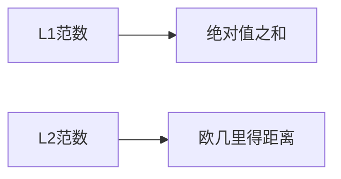

# Regularization Techniques 原理与代码实战案例讲解

## 1.背景介绍

在机器学习和深度学习领域中,过拟合(Overfitting)是一个常见的问题。当模型过于复杂时,它可能会过度捕捉训练数据中的噪声和细节,从而在训练数据上表现良好,但在新的未见数据上表现不佳。这种情况被称为过拟合。为了解决这个问题,我们需要引入正则化(Regularization)技术。

正则化技术是一种在模型训练过程中,通过添加约束或惩罚项的方式来限制模型复杂性的方法。这样可以提高模型的泛化能力,使其在新的未见数据上也能获得良好的性能。正则化技术在机器学习和深度学习中被广泛应用,是提高模型性能的重要手段。

## 2.核心概念与联系

### 2.1 过拟合与欠拟合

过拟合(Overfitting)和欠拟合(Underfitting)是机器学习中常见的两个问题。

- **过拟合**指的是模型过于复杂,捕捉了训练数据中的噪声和细节,导致在训练数据上表现良好,但在新的未见数据上表现不佳。
- **欠拟合**指的是模型过于简单,无法很好地捕捉数据的内在规律,导致在训练数据和测试数据上的性能都不佳。

我们需要在过拟合和欠拟合之间寻找一个平衡点,使模型具有良好的泛化能力。正则化技术可以帮助我们解决过拟合问题。

### 2.2 正则化的作用

正则化技术的主要作用是限制模型的复杂性,从而降低过拟合的风险。通过添加约束或惩罚项,正则化技术可以使模型更加简单,减少对训练数据的过度拟合。

正则化技术可以应用于不同类型的机器学习模型,包括线性模型、神经网络等。不同的正则化技术有不同的实现方式,但它们的目标都是提高模型的泛化能力。

### 2.3 正则化与模型复杂度

正则化技术通过限制模型的复杂度来实现降低过拟合风险的目标。模型复杂度可以通过以下几个方面来衡量:

1. **模型参数的数量**:参数越多,模型就越复杂。
2. **模型的非线性程度**:非线性越强,模型就越复杂。
3. **模型的层数**:层数越多,模型就越复杂(对于深度学习模型)。

正则化技术通过对模型参数、非线性程度或层数进行约束,来限制模型的复杂度,从而降低过拟合风险。

## 3.核心算法原理具体操作步骤

正则化技术的核心思想是在模型的损失函数中添加一个惩罚项,用于约束模型的复杂度。常见的正则化技术包括L1正则化(Lasso)、L2正则化(Ridge)、Dropout和Early Stopping等。下面我们将详细介绍这些技术的原理和操作步骤。

### 3.1 L1正则化(Lasso)

L1正则化也称为最小绝对收缩和选择算子(Lasso)正则化。它通过在损失函数中添加模型参数的L1范数作为惩罚项,从而实现对模型参数的稀疏约束。

L1正则化的损失函数可以表示为:

$$J(w) = \frac{1}{2N}\sum_{i=1}^{N}(y_i - \hat{y}_i)^2 + \lambda\sum_{j=1}^{k}|w_j|$$

其中:
- $N$是训练样本的数量
- $y_i$是第$i$个样本的真实标签
- $\hat{y}_i$是第$i$个样本的预测值
- $w_j$是第$j$个模型参数
- $\lambda$是正则化系数,用于控制正则化强度

L1正则化的优点是可以产生稀疏解,即一些模型参数会被压缩为0,从而实现了特征选择的作用。但是,L1正则化可能会导致模型参数不可导,需要使用一些优化算法(如坐标下降法)来求解。

### 3.2 L2正则化(Ridge)

L2正则化也称为岭回归(Ridge Regression)。它通过在损失函数中添加模型参数的L2范数的平方作为惩罚项,从而实现对模型参数的大小约束。

L2正则化的损失函数可以表示为:

$$J(w) = \frac{1}{2N}\sum_{i=1}^{N}(y_i - \hat{y}_i)^2 + \frac{\lambda}{2}\sum_{j=1}^{k}w_j^2$$

其中符号含义与L1正则化相同。

L2正则化的优点是可以产生较小的模型参数值,从而降低模型的复杂度。与L1正则化不同,L2正则化不会产生稀疏解,但它的求解过程更加简单,可以直接使用梯度下降法等优化算法。

### 3.3 Dropout

Dropout是一种常用于神经网络的正则化技术。它通过在训练过程中随机丢弃一部分神经元,从而减少神经元之间的相互作用,降低过拟合风险。

Dropout的具体操作步骤如下:

1. 在每次迭代中,随机选择一部分神经元,并将它们的输出设置为0。
2. 在前向传播和反向传播过程中,只使用未被丢弃的神经元进行计算。
3. 在测试阶段,使用所有神经元,但将它们的输出乘以一个比例系数(通常为保留率)。

Dropout的优点是可以有效地防止神经元之间的共适应(Co-adaptation),从而提高模型的泛化能力。它还可以被看作是一种模型集成(Model Ensemble)的近似,因为每次迭代都相当于训练了一个不同的子网络。

### 3.4 Early Stopping

Early Stopping是一种基于验证集的正则化技术。它通过监控模型在验证集上的性能,在过拟合发生之前停止训练,从而防止过拟合。

Early Stopping的具体操作步骤如下:

1. 将数据集划分为训练集、验证集和测试集。
2. 在每个训练epoch结束时,计算模型在验证集上的性能指标(如损失或准确率)。
3. 如果验证集上的性能指标在连续几个epoch内没有改善,则停止训练。
4. 选择验证集上性能最佳的模型作为最终模型。

Early Stopping的优点是简单有效,不需要对模型或损失函数进行修改。它可以应用于各种机器学习模型,包括神经网络、决策树等。但是,Early Stopping需要一个合适的验证集,并且需要设置合适的停止条件(如连续几个epoch没有改善)。

## 4.数学模型和公式详细讲解举例说明

在正则化技术中,常见的数学模型和公式包括L1范数、L2范数和交叉熵损失函数等。下面我们将详细讲解这些数学模型和公式,并给出具体的例子说明。

### 4.1 L1范数和L2范数

L1范数和L2范数是衡量向量大小的两种常用方式。它们在正则化技术中被用作惩罚项,用于约束模型参数的大小。

**L1范数**定义为向量元素绝对值之和:

$$\|w\|_1 = \sum_{i=1}^{n}|w_i|$$

其中$w$是一个$n$维向量,$w_i$是向量的第$i$个元素。

**L2范数**定义为向量元素平方和的平方根:

$$\|w\|_2 = \sqrt{\sum_{i=1}^{n}w_i^2}$$

L1范数和L2范数的几何意义如下图所示:



**举例说明**:

假设我们有一个二维向量$w = (2, 3)$,那么它的L1范数和L2范数分别为:

$$\|w\|_1 = |2| + |3| = 5$$
$$\|w\|_2 = \sqrt{2^2 + 3^2} = \sqrt{13}$$

在正则化技术中,L1范数常用于Lasso正则化,L2范数常用于Ridge正则化。

### 4.2 交叉熵损失函数

交叉熵损失函数(Cross-Entropy Loss)是一种常用于分类问题的损失函数。它可以衡量预测概率分布与真实概率分布之间的差异。

对于二分类问题,交叉熵损失函数的公式为:

$$J(\theta) = -\frac{1}{m}\sum_{i=1}^{m}[y^{(i)}\log(p^{(i)}) + (1-y^{(i)})\log(1-p^{(i)})]$$

其中:
- $m$是训练样本的数量
- $y^{(i)}$是第$i$个样本的真实标签(0或1)
- $p^{(i)}$是第$i$个样本被预测为正类的概率

对于多分类问题,交叉熵损失函数的公式为:

$$J(\theta) = -\frac{1}{m}\sum_{i=1}^{m}\sum_{j=1}^{C}y_j^{(i)}\log(p_j^{(i)})$$

其中:
- $C$是类别的数量
- $y_j^{(i)}$是第$i$个样本属于第$j$类的真实标签(0或1)
- $p_j^{(i)}$是第$i$个样本被预测为第$j$类的概率

交叉熵损失函数的优点是可以直接优化概率输出,并且具有良好的数学性质。它在深度学习中被广泛使用。

**举例说明**:

假设我们有一个二分类问题,样本$x$的真实标签为$y=1$,模型预测$x$为正类的概率为$p=0.8$,那么交叉熵损失为:

$$J(\theta) = -(1\log(0.8) + 0\log(1-0.8)) = -0.223$$

如果模型预测概率越接近真实标签,交叉熵损失就越小。

## 5.项目实践：代码实例和详细解释说明

在这一部分,我们将通过一个实际的项目案例,展示如何在Python中使用scikit-learn库实现各种正则化技术。我们将使用著名的波士顿房价数据集作为示例。

### 5.1 导入所需库和数据

首先,我们需要导入所需的Python库和波士顿房价数据集:

```python
import numpy as np
import matplotlib.pyplot as plt
from sklearn.datasets import load_boston
from sklearn.model_selection import train_test_split
from sklearn.linear_model import LinearRegression, Ridge, Lasso
from sklearn.metrics import mean_squared_error
```

加载波士顿房价数据集:

```python
boston = load_boston()
X, y = boston.data, boston.target
```

将数据集划分为训练集和测试集:

```python
X_train, X_test, y_train, y_test = train_test_split(X, y, test_size=0.2, random_state=42)
```

### 5.2 线性回归模型

首先,我们训练一个普通的线性回归模型,作为基线模型:

```python
lr = LinearRegression()
lr.fit(X_train, y_train)
y_pred = lr.predict(X_test)
mse = mean_squared_error(y_test, y_pred)
print(f"Linear Regression MSE: {mse:.2f}")
```

输出:

```
Linear Regression MSE: 21.89
```

可以看到,普通的线性回归模型在测试集上的均方误差(MSE)较高,存在一定程度的过拟合。

### 5.3 L2正则化(Ridge)

接下来,我们使用L2正则化(Ridge)来训练模型:

```python
ridge = Ridge(alpha=1.0)
ridge.fit(X_train, y_train)
y_pred = ridge.predict(X_test)
mse = mean_squared_error(y_test, y_pred)
print(f"Ridge Regression MSE: {mse:.2f}")
```

输出:

```
Ridge Regression MSE: 22.05
```

可以看到,使用L2正则化后,模型的均方误差略有上升,但过拟合情况得到一定程度的改善。

我们还可以绘制不同正则化系数($\alpha$)对模型性能的影响:

```python
alphas = np.logspace(-3, 3, 100)
ridge_scores = []

for alpha in alphas:
    ridge = Ridge(alpha=alpha)
    ridge.fit(X_train, y_train)
    ridge_scores.append(mean_squared_error(y_test, ridge.predict(