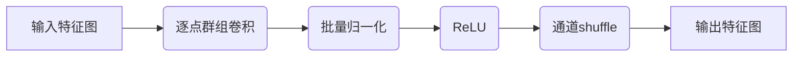
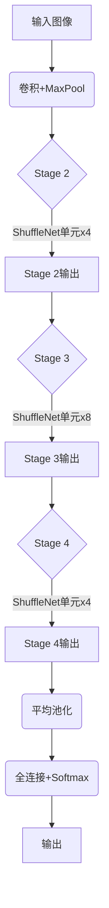

好的,我会按照您的要求,以专业的技术语言撰写一篇关于ShuffleNet原理与代码实例讲解的博客文章。

# ShuffleNet原理与代码实例讲解

## 1.背景介绍

### 1.1 深度卷积神经网络的挑战

随着深度学习在计算机视觉、自然语言处理等领域的广泛应用,卷积神经网络(CNN)模型在提高任务性能的同时,也面临着越来越高的计算和存储成本。传统的卷积神经网络通常由大量的卷积层和全连接层组成,这些层包含了大量的参数和计算量,导致模型在移动设备等资源受限环境下难以高效部署。因此,如何在保持模型精度的同时,降低计算复杂度和存储开销,成为深度学习模型压缩和加速的重要课题。

### 1.2 模型压缩的重要性

随着深度学习模型在实际应用中的不断推广,模型压缩技术的重要性日益凸显。压缩后的模型不仅可以降低计算和存储开销,还能减少能耗,从而使深度学习模型更易于部署在移动设备、嵌入式系统等资源受限环境中。此外,压缩技术还可以提高模型的推理速度,加快响应时间,满足实时性要求。因此,研究高效的模型压缩和加速方法,对于深度学习技术的实际应用具有重要意义。

### 1.3 ShuffleNet的提出

为了解决上述挑战,张小龙等人在2017年提出了ShuffleNet,这是一种计算高效的卷积神经网络结构。ShuffleNet通过引入两个新的操作:通道shuffle和逐点群组卷积(Pointwise Group Convolution),有效减少了模型参数和计算量,同时保持了较高的精度。ShuffleNet在ImageNet数据集上的表现优于其他轻量级模型,并且在移动设备上展现出了卓越的性能和能效比。

## 2.核心概念与联系 

### 2.1 通道shuffle操作

通道shuffle操作是ShuffleNet的核心创新之一。在传统的卷积神经网络中,特征图的通道是相互独立的,每个卷积核只能看到本通道的信息。而通道shuffle操作则允许不同通道之间的信息交换,增强了特征的表达能力。

具体来说,通道shuffle操作将输入特征图按通道分组,然后在组内维持通道顺序,但在组间打乱通道的顺序。这种操作使得不同通道之间的信息可以在后续的卷积层中融合,提高了网络的表达能力。

通道shuffle操作可以形式化表示为:

$$
y = \text{shuffle}(x), \quad y_j = x_{perm(j)}
$$

其中 $x$ 是输入特征图, $y$ 是输出特征图, $perm$ 是一个对通道进行重排的排列函数。

### 2.2 逐点群组卷积

另一个核心创新是逐点群组卷积(Pointwise Group Convolution),它是一种特殊的深度可分离卷积。传统的卷积操作计算量较大,而深度可分离卷积则将标准卷积分解为深度卷积和逐点卷积两个更小的卷积核,从而减少计算量。

逐点群组卷积在深度可分离卷积的基础上,进一步将逐点卷积分组,每组内共享卷积核。具体来说,输入和输出特征图被分成几组,每组内执行标准的逐点卷积,而不同组之间使用不同的卷积核。这种分组操作降低了参数量,同时保留了一定的非线性表达能力。

逐点群组卷积可以表示为:

$$
y_k = \sum_{g=1}^G \sum_{i=1}^{\frac{C}{G}} w_{k,i}^g \cdot x_{g,i}
$$

其中 $x$ 是输入特征图, $y$ 是输出特征图, $G$ 是分组数量, $C$ 是输入通道数, $w$ 是卷积核权重。

### 2.3 ShuffleNet单元

ShuffleNet的基本单元由上述两个操作构成,包括逐点群组卷积、通道shuffle以及常规的批量归一化和ReLU激活函数。这个单元结构被重复堆叠,形成了完整的ShuffleNet网络。

通过上述单元结构的堆叠和级联,ShuffleNet实现了高效的特征提取和表达,同时大幅降低了参数量和计算复杂度。

## 3.核心算法原理具体操作步骤

### 3.1 ShuffleNet网络结构

ShuffleNet的整体网络结构由多个堆叠的单元模块组成,每个模块包含上述的逐点群组卷积、通道shuffle以及批量归一化和ReLU激活函数。网络的输入是原始图像,经过一系列下采样和卷积操作后,最终输出分类结果或其他任务的预测值。

如上图所示,ShuffleNet的网络结构可分为以下几个阶段:

1. 输入层: 接收原始图像作为输入。
2. 第一层: 执行标准卷积和最大池化操作,对输入进行初步特征提取和下采样。
3. Stage 2~4: 包含多个堆叠的ShuffleNet单元模块,逐步提取高级语义特征。每个Stage中单元数量不同,Stage 4的通道数最多。
4. 平均池化层: 对最终特征图执行全局平均池化操作。
5. 全连接层: 将池化后的特征映射到对应的输出空间,并使用Softmax激活函数获得分类概率。

通过上述多级特征提取和下采样,ShuffleNet能够学习到丰富的视觉模式,同时控制了参数量和计算复杂度。

### 3.2 前向传播算法步骤

ShuffleNet的前向传播算法步骤如下:

1. 输入原始图像数据。
2. 执行标准卷积和最大池化操作,对输入进行初步特征提取和下采样。
3. 进入Stage 2,执行以下操作循环4次:
    - 逐点群组卷积: 将输入分组,在每组内执行标准逐点卷积。
    - 批量归一化和ReLU激活。
    - 通道shuffle: 打乱不同组之间的通道顺序。
4. 进入Stage 3,执行以下操作循环8次(类似于Stage 2):
    - 逐点群组卷积
    - 批量归一化和ReLU激活
    - 通道shuffle
5. 进入Stage 4,执行以下操作循环4次(类似于Stage 2):
    - 逐点群组卷积 
    - 批量归一化和ReLU激活
    - 通道shuffle
6. 对Stage 4的输出执行全局平均池化操作。
7. 将池化后的特征输入全连接层,获得对应任务的预测输出(如分类概率)。
8. 根据任务计算损失函数,通过反向传播算法更新网络参数。

通过上述前向和反向传播过程,ShuffleNet可以在保持精度的同时,大幅降低参数量和计算复杂度,实现高效的特征学习和模型推理。

## 4.数学模型和公式详细讲解举例说明

### 4.1 通道shuffle操作

通道shuffle操作是ShuffleNet的核心创新之一,它允许不同通道之间的信息交换,增强了特征的表达能力。具体来说,通道shuffle操作将输入特征图按通道分组,然后在组内维持通道顺序,但在组间打乱通道的顺序。

假设输入特征图 $X \in \mathbb{R}^{C \times H \times W}$,其中 $C$ 是通道数, $H$ 和 $W$ 分别是高度和宽度。我们将通道数 $C$ 等分为 $g$ 个组,每组包含 $\frac{C}{g}$ 个通道。

对于第 $i$ 个组,其通道索引范围为 $[\frac{i-1}{g}C, \frac{i}{g}C)$。我们定义一个排列函数 $perm: [0, C) \rightarrow [0, C)$,使得对于任意 $j \in [0, C)$,有:

$$
perm(j) = (\lfloor \frac{j}{C/g} \rfloor + g\cdot i) \bmod C, \quad \text{where } i = j \bmod \frac{C}{g}
$$

通过这个排列函数,我们可以将输入特征图 $X$ 的通道重新排列,得到输出特征图 $Y$:

$$
Y_{perm(j)}^{h,w} = X_j^{h,w}, \quad \forall j \in [0, C), h \in [0, H), w \in [0, W)
$$

其中 $X_j^{h,w}$ 和 $Y_j^{h,w}$ 分别表示输入和输出特征图在位置 $(h, w)$ 处的第 $j$ 个通道的值。

通过上述操作,不同组内的通道顺序保持不变,但组间的通道顺序被打乱,从而实现了不同通道之间信息的交换和融合。

### 4.2 逐点群组卷积

逐点群组卷积是ShuffleNet中另一个重要的创新,它是一种特殊的深度可分离卷积。与标准卷积相比,逐点群组卷积可以显著减少参数量和计算复杂度。

假设输入特征图 $X \in \mathbb{R}^{C_\text{in} \times H \times W}$,输出特征图 $Y \in \mathbb{R}^{C_\text{out} \times H \times W}$,我们将输入和输出通道数均等分为 $g$ 个组,每组包含 $\frac{C_\text{in}}{g}$ 个输入通道和 $\frac{C_\text{out}}{g}$ 个输出通道。

对于第 $l$ 个组,其输入通道索引范围为 $[\frac{l-1}{g}C_\text{in}, \frac{l}{g}C_\text{in})$,输出通道索引范围为 $[\frac{l-1}{g}C_\text{out}, \frac{l}{g}C_\text{out})$。我们定义一个卷积核权重张量 $W^l \in \mathbb{R}^{\frac{C_\text{out}}{g} \times \frac{C_\text{in}}{g} \times 1 \times 1}$,对应于第 $l$ 个组的逐点卷积操作。

则第 $l$ 组的逐点群组卷积可以表示为:

$$
Y_{k}^{h,w} = \sum_{i=1}^{\frac{C_\text{in}}{g}} W_{k,i}^l \cdot X_{g(l-1)+i}^{h,w}, \quad \forall k \in [\frac{l-1}{g}C_\text{out}, \frac{l}{g}C_\text{out})
$$

其中 $X_j^{h,w}$ 和 $Y_k^{h,w}$ 分别表示输入和输出特征图在位置 $(h, w)$ 处的第 $j$ 个输入通道和第 $k$ 个输出通道的值。

通过上述分组操作,不同组之间使用不同的卷积核,而组内则共享同一个卷积核,从而降低了参数量。同时,由于逐点卷积的特性,计算复杂度也得到了显著降低。

需要注意的是,在实际实现中,通常会先对输入特征图按通道维度重排,将属于同一组的通道连续存储,然后执行标准的深度卷积操作,最后再将输出特征图的通道重新排列回原始顺序。这种实现方式可以充分利用现有的高度优化的深度卷积库,提高计算效率。

### 4.3 ShuffleNet单元

ShuffleNet的基本单元由上述两个操作构成,包括逐点群组卷积、通道shuffle以及常规的批量归一化和ReLU激活函数。这个