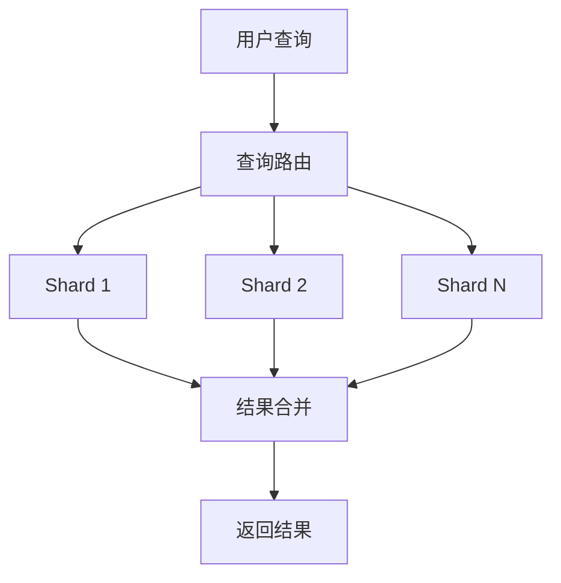

# Solr原理与代码实例讲解

## 1.背景介绍

Apache Solr 是一个开源的搜索平台，基于 Apache Lucene 构建，专为高效的全文搜索和索引而设计。Solr 提供了强大的功能，如分布式搜索、容错、实时索引等，广泛应用于企业搜索、网站搜索、日志分析等领域。本文将深入探讨 Solr 的核心概念、算法原理、数学模型，并通过代码实例展示其实际应用。

## 2.核心概念与联系

### 2.1 Solr 核心组件

Solr 的核心组件包括：

- **索引（Index）**：存储文档的结构化数据，支持快速检索。
- **文档（Document）**：Solr 中的基本数据单元，每个文档包含多个字段。
- **字段（Field）**：文档的属性，如标题、内容、作者等。
- **查询（Query）**：用户输入的搜索请求，Solr 根据查询条件返回匹配的文档。

### 2.2 Solr 与 Lucene 的关系

Solr 是基于 Lucene 构建的，Lucene 提供了底层的索引和搜索功能，而 Solr 则在此基础上增加了许多高级特性，如：

- **RESTful API**：通过 HTTP 请求进行操作。
- **分布式搜索**：支持大规模数据的分布式处理。
- **管理界面**：提供友好的 Web 管理界面。

### 2.3 SolrCloud

SolrCloud 是 Solr 的分布式部署模式，支持高可用性和扩展性。其核心组件包括：

- **ZooKeeper**：用于集群管理和配置。
- **Shard**：数据分片，每个 Shard 是一个独立的索引。
- **Replica**：Shards 的副本，用于容错和负载均衡。

## 3.核心算法原理具体操作步骤

### 3.1 索引创建

索引创建是 Solr 的核心操作之一，主要步骤包括：

1. **文档解析**：将原始数据解析为 Solr 文档。
2. **字段分析**：对文档字段进行分词、过滤等处理。
3. **索引构建**：将处理后的文档添加到索引中。

### 3.2 查询处理

查询处理是 Solr 的另一核心操作，主要步骤包括：

1. **查询解析**：将用户输入的查询字符串解析为查询对象。
2. **查询执行**：在索引中查找匹配的文档。
3. **结果排序**：根据相关性评分对结果进行排序。

### 3.3 分布式搜索

分布式搜索是 SolrCloud 的关键特性，主要步骤包括：

1. **查询路由**：将查询请求路由到相关的 Shard。
2. **并行查询**：在多个 Shard 上并行执行查询。
3. **结果合并**：将各 Shard 的查询结果合并为最终结果。

以下是 Solr 分布式搜索的 Mermaid 流程图：



## 4.数学模型和公式详细讲解举例说明

### 4.1 TF-IDF 模型

TF-IDF（Term Frequency-Inverse Document Frequency）是 Solr 用于计算文档相关性的重要模型。其公式如下：

$$
\text{TF-IDF}(t, d) = \text{TF}(t, d) \times \text{IDF}(t)
$$

其中，$\text{TF}(t, d)$ 表示词项 $t$ 在文档 $d$ 中的出现频率，$\text{IDF}(t)$ 表示词项 $t$ 的逆文档频率，计算公式为：

$$
\text{IDF}(t) = \log \left( \frac{N}{\text{DF}(t)} \right)
$$

其中，$N$ 是文档总数，$\text{DF}(t)$ 是包含词项 $t$ 的文档数。

### 4.2 BM25 模型

BM25 是另一种常用的相关性计算模型，其公式如下：

$$
\text{BM25}(t, d) = \frac{\text{TF}(t, d) \cdot (k_1 + 1)}{\text{TF}(t, d) + k_1 \cdot (1 - b + b \cdot \frac{|d|}{\text{avgdl}})} \cdot \log \left( \frac{N - \text{DF}(t) + 0.5}{\text{DF}(t) + 0.5} \right)
$$

其中，$k_1$ 和 $b$ 是调节参数，$|d|$ 是文档 $d$ 的长度，$\text{avgdl}$ 是文档的平均长度。

## 5.项目实践：代码实例和详细解释说明

### 5.1 环境搭建

首先，下载并安装 Solr：

```bash
wget https://downloads.apache.org/lucene/solr/8.11.1/solr-8.11.1.tgz
tar xzf solr-8.11.1.tgz
cd solr-8.11.1
bin/solr start
```

### 5.2 创建核心

创建一个名为 `mycore` 的核心：

```bash
bin/solr create -c mycore
```

### 5.3 添加文档

向核心中添加文档：

```bash
curl http://localhost:8983/solr/mycore/update?commit=true -d '
[
  {"id": "1", "title": "Solr 入门", "content": "Solr 是一个开源的搜索平台"},
  {"id": "2", "title": "Solr 高级", "content": "Solr 提供了强大的分布式搜索功能"}
]'
```

### 5.4 查询文档

查询包含 "Solr" 的文档：

```bash
curl http://localhost:8983/solr/mycore/select?q=Solr
```

### 5.5 代码解释

上述代码首先启动 Solr 服务，然后创建一个名为 `mycore` 的核心。接着，向核心中添加了两个文档，最后执行查询操作，返回包含 "Solr" 的文档。

## 6.实际应用场景

### 6.1 企业搜索

企业内部文档、邮件、知识库等数据量巨大，Solr 可以提供高效的全文搜索功能，帮助员工快速找到所需信息。

### 6.2 网站搜索

电商网站、新闻网站等需要提供快速、准确的搜索功能，Solr 可以处理大规模数据，提供高性能的搜索服务。

### 6.3 日志分析

运维人员需要对大量日志数据进行分析，Solr 可以对日志进行索引和搜索，帮助快速定位问题。

## 7.工具和资源推荐

### 7.1 Solr 官方文档

Solr 官方文档是学习和使用 Solr 的最佳资源，提供了详细的使用指南和 API 参考。

### 7.2 Solr 管理界面

Solr 提供了友好的 Web 管理界面，可以方便地进行索引管理、查询调试等操作。

### 7.3 Solr 社区

Solr 社区活跃，提供了丰富的资源和支持，可以通过邮件列表、论坛等渠道获取帮助。

## 8.总结：未来发展趋势与挑战

Solr 作为一个成熟的搜索平台，已经在多个领域得到了广泛应用。未来，随着大数据和人工智能技术的发展，Solr 也将面临新的挑战和机遇：

- **大数据处理**：如何更高效地处理海量数据，将是 Solr 未来的重要课题。
- **智能搜索**：结合机器学习和自然语言处理技术，提升搜索的智能化水平。
- **云原生架构**：随着云计算的发展，Solr 需要更好地适应云原生架构，提供更高的可扩展性和可靠性。

## 9.附录：常见问题与解答

### 9.1 如何提高 Solr 的查询性能？

- **优化索引**：使用合适的字段类型和分词器，减少不必要的字段。
- **缓存**：启用查询缓存和过滤缓存，减少重复查询的开销。
- **分片**：将数据分片，分散到多个节点上，提升并行处理能力。

### 9.2 Solr 和 Elasticsearch 有何区别？

- **架构**：Solr 基于 Lucene，Elasticsearch 基于 Lucene 和 Apache Lucene。
- **功能**：Elasticsearch 提供了更多的分布式功能，如自动分片和副本管理。
- **社区**：Elasticsearch 社区更为活跃，提供了更多的插件和扩展。

### 9.3 如何处理 Solr 的故障？

- **日志分析**：通过分析 Solr 的日志，定位问题原因。
- **备份恢复**：定期备份索引数据，出现故障时可以快速恢复。
- **监控报警**：使用监控工具，实时监控 Solr 的运行状态，及时发现和处理问题。

---

作者：禅与计算机程序设计艺术 / Zen and the Art of Computer Programming