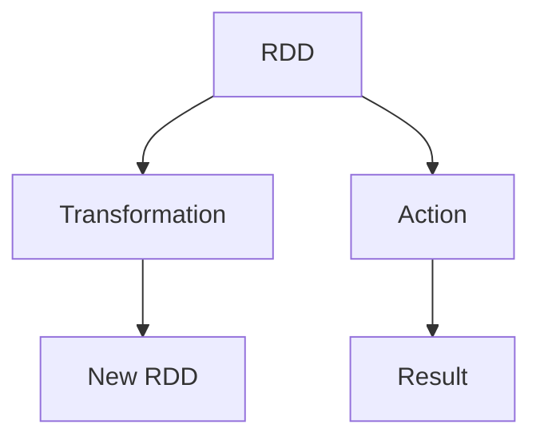
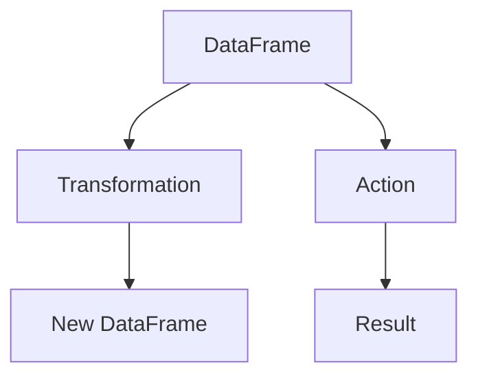
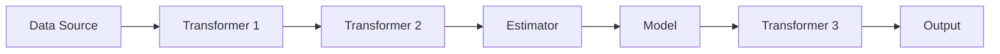

# Spark MLlib机器学习库原理与代码实例讲解

## 1. 背景介绍

### 1.1 大数据时代的机器学习需求

在当今大数据时代，数据的规模和复杂性都在不断增长。传统的机器学习算法和工具往往难以有效处理如此庞大的数据集。因此，需要一种能够高效并行处理大规模数据的机器学习解决方案。Apache Spark MLlib 应运而生，它是 Spark 生态系统中的机器学习库，旨在提供可扩展的机器学习算法，以满足大数据环境下的需求。

### 1.2 Apache Spark 简介

Apache Spark 是一个开源的大数据处理框架，它提供了一种快速、通用的集群计算引擎。Spark 采用内存计算模型,可以显著提高大数据处理的性能。它支持多种编程语言,包括 Java、Scala、Python 和 R,并且提供了丰富的库,涵盖了从 SQL 到机器学习、流处理等多个领域。

### 1.3 Spark MLlib 的优势

Spark MLlib 是 Spark 生态系统中的机器学习库,它具有以下优势:

- **可扩展性**:MLlib 能够利用 Spark 的分布式计算能力,在大规模数据集上高效运行机器学习算法。
- **易用性**:MLlib 提供了统一的 API,支持多种编程语言,使得开发人员可以轻松地构建和部署机器学习应用程序。
- **丰富的算法库**:MLlib 包含了广泛的机器学习算法,涵盖了分类、回归、聚类、协同过滤等多个领域。
- **管道化工作流**:MLlib 支持构建端到端的机器学习管道,从数据准备到模型评估,提供了一种流畅的工作流程。
- **持久化模型**:MLlib 允许将训练好的模型持久化,以便于后续的模型加载和评分。

## 2. 核心概念与联系

### 2.1 Spark RDD

Resilient Distributed Dataset (RDD) 是 Spark 的核心数据结构。它是一个不可变、分区的记录集合,可以并行操作。RDD 是 Spark 中所有数据操作的基础,也是 MLlib 构建机器学习算法的基石。



### 2.2 Spark DataFrame

DataFrame 是一种以分布式方式组织的数据集,类似于关系数据库中的表格。它提供了一种更加结构化和高效的数据表示方式,并支持 SQL 查询。在 MLlib 中,DataFrame 常被用于数据预处理和特征工程。



### 2.3 Spark ML Pipeline

ML Pipeline 是 MLlib 中的一个重要概念,它允许将多个数据预处理和机器学习算法组合成一个工作流。Pipeline 提供了一种声明式的方式来构建端到端的机器学习应用程序,使得代码更加模块化和可维护。



### 2.4 Spark ML算法

MLlib 提供了广泛的机器学习算法,包括:

- **分类**:逻辑回归、决策树、随机森林等。
- **回归**:线性回归、决策树回归、生存回归等。
- **聚类**:K-Means、高斯混合模型、层次聚类等。
- **协同过滤**:交替最小二乘法 (ALS)。
- **降维**:主成分分析 (PCA)、奇异值分解 (SVD)等。
- **特征工程**:TF-IDF、Word2Vec、标准化等。

这些算法都是基于 Spark 的分布式计算框架,可以高效地处理大规模数据集。

## 3. 核心算法原理具体操作步骤

在本节中,我们将探讨 MLlib 中一些核心算法的原理和具体操作步骤。

### 3.1 逻辑回归

逻辑回归是一种常用的监督学习算法,用于解决二分类问题。它通过拟合数据,估计每个输入实例属于正类的概率。

#### 3.1.1 算法原理

逻辑回归模型的数学表达式为:

$$
P(Y=1|X) = \frac{1}{1 + e^{-(\beta_0 + \beta_1X_1 + \beta_2X_2 + ... + \beta_nX_n)}}
$$

其中,Y 是二元响应变量 (0 或 1),X 是输入特征向量,β 是模型参数。

逻辑回归使用最大似然估计来学习模型参数。目标是找到一组参数值,使得观测数据的似然函数最大化。

#### 3.1.2 操作步骤

1. **导入所需库**

```python
from pyspark.ml.classification import LogisticRegression
```

2. **准备数据**

```python
# 从数据源创建 DataFrame
data = spark.createDataFrame([...])
```

3. **构建Pipeline**

```python
# 创建逻辑回归估计器
lr = LogisticRegression(featuresCol='features', labelCol='label')

# 创建Pipeline
pipeline = Pipeline(stages=[..., lr])
```

4. **训练模型**

```python
# 拟合Pipeline
model = pipeline.fit(data)
```

5. **评估模型**

```python
# 在测试集上评估模型
predictions = model.transform(test_data)
evaluator = BinaryClassificationEvaluator(...)
metric = evaluator.evaluate(predictions)
```

6. **使用模型进行预测**

```python
# 对新数据进行预测
new_data = spark.createDataFrame([...])
predictions = model.transform(new_data)
```

### 3.2 K-Means聚类

K-Means 是一种常用的无监督学习算法,用于将数据划分为 K 个簇。它通过迭代优化来找到最佳的簇中心。

#### 3.2.1 算法原理

K-Means 算法的目标是最小化所有点到其所属簇中心的距离的平方和:

$$
J = \sum_{i=1}^{K} \sum_{x \in C_i} \left \| x - \mu_i \right \|^2
$$

其中,K 是簇的数量,C_i 是第 i 个簇,μ_i 是第 i 个簇的中心。

算法通过以下步骤进行迭代:

1. 随机初始化 K 个簇中心。
2. 将每个数据点分配到最近的簇中心。
3. 重新计算每个簇的中心,作为该簇中所有点的均值。
4. 重复步骤 2 和 3,直到簇分配不再发生变化。

#### 3.2.2 操作步骤

1. **导入所需库**

```python
from pyspark.ml.clustering import KMeans
```

2. **准备数据**

```python
# 从数据源创建 DataFrame
data = spark.createDataFrame([...])
```

3. **训练 K-Means 模型**

```python
# 创建 KMeans 估计器
kmeans = KMeans(featuresCol='features', k=3)

# 拟合模型
model = kmeans.fit(data)
```

4. **获取簇中心**

```python
# 获取簇中心
centers = model.clusterCenters()
```

5. **对新数据进行聚类**

```python
# 对新数据进行聚类
new_data = spark.createDataFrame([...])
predictions = model.transform(new_data)
```

6. **评估聚类结果**

```python
# 计算聚类评估指标,如 Silhouette 分数
evaluator = ClusteringEvaluator(...)
score = evaluator.evaluate(predictions)
```

## 4. 数学模型和公式详细讲解举例说明

在本节中,我们将详细讲解一些 MLlib 中常用算法的数学模型和公式,并给出具体的示例说明。

### 4.1 线性回归

线性回归是一种常用的监督学习算法,用于解决回归问题。它通过拟合数据,估计输入特征与目标变量之间的线性关系。

#### 4.1.1 数学模型

线性回归模型的数学表达式为:

$$
y = \beta_0 + \beta_1x_1 + \beta_2x_2 + ... + \beta_nx_n + \epsilon
$$

其中,y 是目标变量,x_i 是输入特征,β_i 是模型参数,ε 是误差项。

线性回归使用最小二乘法来学习模型参数,目标是最小化残差平方和:

$$
J(\beta) = \sum_{i=1}^{n} (y_i - \hat{y_i})^2
$$

其中,y_i 是实际目标值,ŷ_i 是预测值。

#### 4.1.2 示例说明

假设我们有一个数据集,包含房屋面积和价格。我们希望构建一个线性回归模型,预测房屋价格。

```python
# 导入所需库
from pyspark.ml.regression import LinearRegression

# 准备数据
data = spark.createDataFrame([
    (600, 150000),
    (700, 200000),
    ...
], ["area", "price"])

# 创建线性回归估计器
lr = LinearRegression(featuresCol='area', labelCol='price')

# 训练模型
model = lr.fit(data)

# 打印模型参数
print("Intercept: " + str(model.intercept))
print("Coefficients: " + str(model.coefficients))

# 对新数据进行预测
new_data = spark.createDataFrame([
    (800,)
], ["area"])
predictions = model.transform(new_data)
predictions.show()
```

在这个示例中,我们使用房屋面积作为输入特征,房屋价格作为目标变量。通过拟合线性回归模型,我们可以估计出模型参数 (截距和系数),并用于预测新房屋的价格。

### 4.2 决策树

决策树是一种常用的监督学习算法,可用于解决分类和回归问题。它通过构建一棵决策树,根据输入特征的值进行决策,最终得到预测结果。

#### 4.2.1 数学模型

决策树的构建过程可以看作是一个递归的分裂过程。在每个节点,算法选择一个最优特征及其分裂点,将数据集划分为两个子集。这个过程一直重复,直到满足某个停止条件。

常用的决策树算法包括 ID3、C4.5 和 CART。它们使用不同的指标来选择最优特征和分裂点,例如信息增益、信息增益比和基尼系数。

以 CART 算法为例,它使用基尼系数作为分裂准则。对于二分类问题,给定一个节点 m,其基尼系数定义为:

$$
G_m = 1 - \sum_{i=1}^{C} p_{m,i}^2
$$

其中,C 是类别数,p_m,i 是第 i 类在节点 m 中的比例。

算法选择能够最小化加权基尼系数的特征和分裂点进行分裂。

#### 4.2.2 示例说明

假设我们有一个数据集,包含客户的年龄、收入和是否购买产品的标签。我们希望构建一个决策树模型,预测客户是否会购买产品。

```python
# 导入所需库
from pyspark.ml.classification import DecisionTreeClassifier

# 准备数据
data = spark.createDataFrame([
    (30, 50000, 0),
    (40, 80000, 1),
    ...
], ["age", "income", "label"])

# 创建决策树估计器
dt = DecisionTreeClassifier(featuresCol='features', labelCol='label')

# 训练模型
model = dt.fit(data)

# 可视化决策树
display(model.toDebugString)

# 对新数据进行预测
new_data = spark.createDataFrame([
    (35, 60000)
], ["age", "income"])
predictions = model.transform(new_data)
predictions.show()
```

在这个示例中,我们使用客户的年龄和收入作为输入特征,是否购买产品作为目标标签。通过拟合决策树模型,我们可以构建一棵决策树,根据输入特征的值进行决策,最终预测客户是否会购买产品。

## 5. 项目实践:代码实例和详细解释说明

在本节中,我们将通过一个实际项目的代码实例,详细解释如何使用 Spark MLlib 进行机器学习建模。

### 5.1 项目背景

假设我们有一个包含客户信息和购买记录的数据集。我们希望构建一个推荐系统,根据客户的