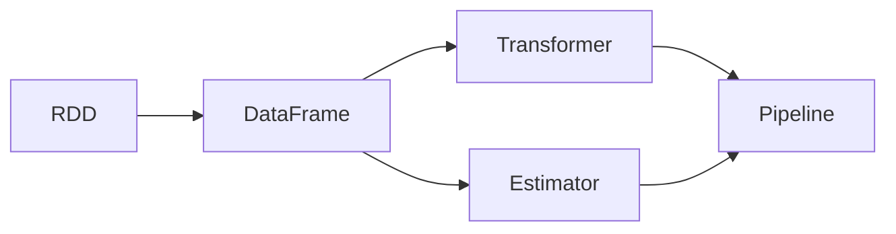

# Spark MLlib机器学习库原理与代码实例讲解

## 1. 背景介绍
在大数据时代，数据分析和机器学习成为了获取信息、洞察趋势、预测未来的关键技术。Apache Spark作为一个强大的分布式数据处理框架，其内置的机器学习库MLlib提供了一系列高效的算法和工具，使得在大规模数据集上进行机器学习成为可能。MLlib不仅支持常见的机器学习算法，还提供了数据处理、特征提取、模型评估等功能，是处理大规模数据机器学习问题的理想选择。

## 2. 核心概念与联系
在深入MLlib之前，我们需要理解一些核心概念及其相互之间的联系。

- **RDD（弹性分布式数据集）**: Spark的基本数据结构，可以高效地进行分布式计算。
- **DataFrame**: 以RDD为基础，提供了更高级的数据操作接口，类似于数据库中的表。
- **Transformer**: 转换器，用于将一个DataFrame转换为另一个DataFrame。
- **Estimator**: 估计器，用于拟合或训练模型，输出Transformer。
- **Pipeline**: 管道，将多个步骤（如数据预处理、模型训练）串联起来，简化机器学习工作流程。



## 3. 核心算法原理具体操作步骤
MLlib提供了多种机器学习算法，包括分类、回归、聚类、协同过滤等。每种算法都遵循以下操作步骤：

1. 数据准备与加载
2. 数据预处理与特征工程
3. 选择合适的算法和参数
4. 训练模型
5. 模型评估与调优
6. 预测与应用

## 4. 数学模型和公式详细讲解举例说明
以线性回归为例，其数学模型可以表示为：

$$
y = \beta_0 + \beta_1 x_1 + \beta_2 x_2 + ... + \beta_n x_n + \epsilon
$$

其中，$y$ 是响应变量，$x_1, x_2, ..., x_n$ 是解释变量，$\beta_0, \beta_1, ..., \beta_n$ 是模型参数，$\epsilon$ 是误差项。

在Spark MLlib中，线性回归的参数估计通常使用最小二乘法：

$$
\hat{\beta} = (X^TX)^{-1}X^Ty
$$

## 5. 项目实践：代码实例和详细解释说明
以下是一个使用Spark MLlib进行线性回归的简单示例：

```scala
import org.apache.spark.ml.regression.LinearRegression
import org.apache.spark.sql.SparkSession

val spark = SparkSession.builder.appName("LinearRegressionExample").getOrCreate()

// 加载数据
val training = spark.read.format("libsvm").load("data/mllib/sample_linear_regression_data.txt")

// 创建线性回归对象
val lr = new LinearRegression()
  .setMaxIter(10)
  .setRegParam(0.3)
  .setElasticNetParam(0.8)

// 训练模型
val lrModel = lr.fit(training)

// 输出模型参数
println(s"Coefficients: ${lrModel.coefficients} Intercept: ${lrModel.intercept}")

spark.stop()
```

在这个例子中，我们首先创建了一个SparkSession，然后加载了数据，创建了一个线性回归模型，并设置了迭代次数、正则化参数等。最后，我们训练了模型并输出了模型参数。

## 6. 实际应用场景
MLlib在多个领域都有广泛的应用，例如：

- 金融领域的风险评估
- 电商的推荐系统
- 医疗健康的疾病预测
- 能源领域的需求预测

## 7. 工具和资源推荐
为了更好地使用Spark MLlib，以下是一些推荐的工具和资源：

- **Apache Spark官方文档**: 提供了详细的API文档和用户指南。
- **Databricks**: 提供了Spark的托管服务和丰富的学习资源。
- **Jupyter Notebook**: 用于交互式数据分析和可视化。

## 8. 总结：未来发展趋势与挑战
随着技术的发展，MLlib也在不断进化。未来的趋势可能包括更多的算法支持、更好的性能优化、更紧密的云集成等。同时，挑战也存在，如处理更大规模的数据、保证模型的可解释性和安全性等。

## 9. 附录：常见问题与解答
- Q: MLlib支持哪些机器学习算法？
- A: MLlib支持多种算法，包括分类、回归、聚类、协同过滤等。

- Q: 如何在Spark中进行模型的参数调优？
- A: 可以使用MLlib提供的交叉验证和网格搜索功能进行参数调优。

- Q: MLlib和其他机器学习库相比有什么优势？
- A: MLlib的主要优势在于其分布式计算能力，可以在大规模数据集上进行高效的机器学习。

作者：禅与计算机程序设计艺术 / Zen and the Art of Computer Programming