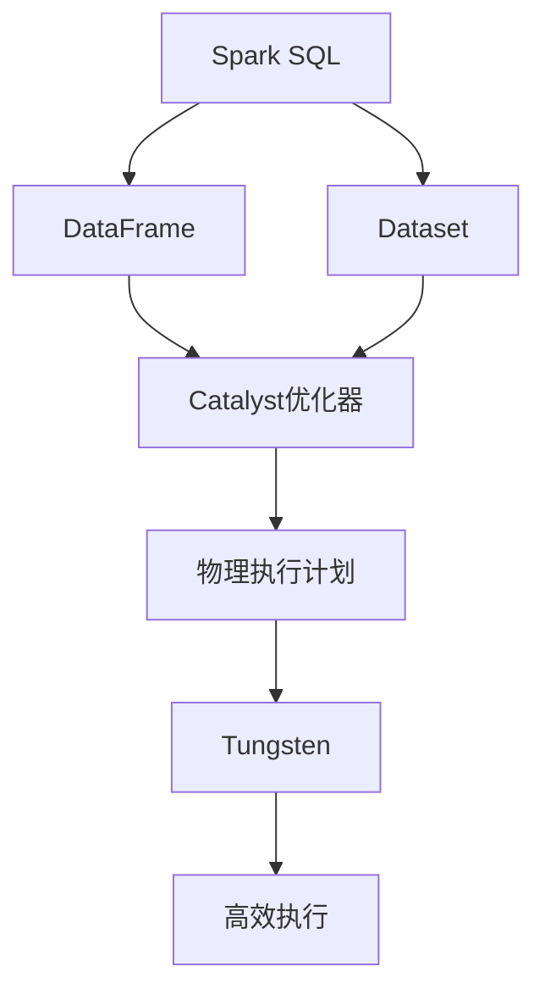

# Spark SQL结构化数据处理原理与代码实例讲解

## 1.背景介绍

在当今大数据时代，数据量的快速增长对传统数据处理系统带来了巨大挑战。Apache Spark作为一种新兴的大数据处理框架,凭借其高性能、易用性和通用性,已经成为处理结构化和非结构化数据的首选工具之一。Spark SQL作为Spark的一个重要模块,为结构化数据处理提供了强大的功能支持。

Spark SQL可以高效地处理各种格式的结构化数据,如CSV、JSON、Parquet等,并支持SQL查询和DataFrame/Dataset API。它采用了Spark的分布式计算模型,能够充分利用集群资源,实现高效的并行处理。此外,Spark SQL还提供了与Hive、Kafka等其他大数据组件的无缝集成,使得构建端到端的大数据应用程序变得更加简单。

## 2.核心概念与联系

### 2.1 DataFrame

DataFrame是Spark SQL中处理结构化数据的核心数据结构。它是一种分布式的数据集合,类似于关系型数据库中的表格,由行和列组成。每一行都是一个结构化的记录,每一列都是特定类型的数据。DataFrame支持类似SQL的操作,如选择、过滤、聚合等,并且可以与Spark的RDD(Resilient Distributed Dataset)进行无缝转换。

### 2.2 Dataset

Dataset是Spark 1.6引入的新数据结构,它是DataFrame的一种类型化版本。与DataFrame相比,Dataset提供了更好的性能和更强的类型安全性。在使用Dataset时,可以直接操作特定的对象,而不需要进行反序列化和序列化操作,从而提高了效率。

### 2.3 Catalyst优化器

Catalyst优化器是Spark SQL的查询优化器,它负责将逻辑查询计划转换为高效的物理执行计划。Catalyst优化器采用了多种优化技术,如谓词下推、连接重排序、常量折叠等,以提高查询性能。此外,它还支持代码生成,可以在运行时动态生成优化的字节码,从而进一步提升执行效率。

### 2.4 Tungsten

Tungsten是Spark SQL的另一个重要组件,它专注于提高内存计算和CPU效率。Tungsten引入了多种优化技术,如缓存数据布局、字节码生成、SIMD向量化等,以减少内存开销和提高CPU利用率。这些优化措施使得Spark SQL在处理结构化数据时能够获得接近于手写代码的性能。

### 2.5 Mermaid流程图



上图展示了Spark SQL的核心概念及其之间的关系。用户可以通过DataFrame或Dataset来处理结构化数据,Catalyst优化器会将逻辑查询计划转换为高效的物理执行计划,最后由Tungsten执行优化后的计算任务。

## 3.核心算法原理具体操作步骤

### 3.1 DataFrame/Dataset API

Spark SQL提供了两种主要的API:DataFrame API和Dataset API。DataFrame API更加灵活,支持各种类型的数据源,而Dataset API则提供了更好的类型安全性和性能。

以下是使用DataFrame API进行数据处理的基本步骤:

1. 创建SparkSession
2. 从数据源创建DataFrame
3. 对DataFrame执行转换和操作
4. 触发执行并获取结果

```scala
// 创建SparkSession
val spark = SparkSession.builder()
  .appName("DataFrameExample")
  .getOrCreate()

// 从JSON文件创建DataFrame
val df = spark.read.json("path/to/file.json")

// 执行转换和操作
val result = df.select("column1", "column2")
  .filter($"column1" > 10)
  .groupBy("column2")
  .count()

// 触发执行并获取结果
result.show()
```

Dataset API的使用方式类似,但需要提供数据的Schema信息:

```scala
// 定义案例类
case class Person(name: String, age: Int)

// 从JSON文件创建Dataset
val ds = spark.read.json("path/to/file.json").as[Person]

// 执行转换和操作
val result = ds.filter(_.age > 30)
  .map(p => (p.name, p.age))

// 触发执行并获取结果
result.show()
```

### 3.2 Catalyst优化器

Catalyst优化器的工作流程如下:

1. 解析SQL查询或DataFrame/Dataset操作,生成逻辑查询计划
2. 对逻辑查询计划进行一系列规则优化,如谓词下推、常量折叠等
3. 根据优化后的逻辑计划生成物理执行计划
4. 对物理执行计划进行代码生成优化,生成高效的字节码

以下是一个简单的示例,展示了Catalyst优化器如何优化一个简单的查询:

```sql
SELECT count(*) FROM table WHERE col1 > 10 AND col2 < 20;
```

1. 解析查询,生成初始逻辑计划:
   `LogicalRDD(table.filter(col1 > 10 && col2 < 20), statistics=None)`

2. 应用谓词下推优化规则:
   `LogicalRDD(table, statistics=None).filter(col1 > 10 && col2 < 20)`

3. 生成物理执行计划:
   `PhysicalRDD(table, statistics=None).filter(col1 > 10 && col2 < 20).aggregate(count(1))`

4. 代码生成优化:
   生成高效的字节码,避免不必要的对象创建和虚拟函数调用。

通过上述优化步骤,Catalyst优化器能够生成高效的执行计划,从而提高查询性能。

### 3.3 Tungsten

Tungsten主要采用以下几种优化技术:

1. **缓存数据布局**
   Tungsten使用高效的内存数据布局,如列式存储和二进制编码,减少内存开销和提高CPU缓存利用率。

2. **字节码生成**
   Tungsten在运行时动态生成优化的字节码,避免不必要的对象创建和虚拟函数调用,提高执行效率。

3. **SIMD向量化**
   对于某些操作,Tungsten会利用CPU的SIMD(单指令多数据)指令集,实现数据级并行计算,提高计算密集型任务的性能。

4. **内存管理优化**
   Tungsten采用了高效的内存管理策略,如对象池和内存复用,减少内存分配和垃圾回收的开销。

以下是一个简单的示例,展示了Tungsten如何优化一个简单的聚合操作:

```scala
val data = Seq(1, 2, 3, 4, 5)
val rdd = spark.sparkContext.parallelize(data)
val result = rdd.map(x => x * 2).reduce(_ + _)
```

在执行上述代码时,Tungsten会执行以下优化:

1. 使用高效的内存数据布局存储RDD分区数据
2. 为`map`和`reduce`操作生成优化的字节码
3. 对`reduce`操作使用SIMD向量化优化
4. 使用对象池和内存复用策略,减少内存分配和垃圾回收开销

通过这些优化措施,Tungsten能够显著提高Spark SQL的内存计算和CPU效率,为结构化数据处理提供接近于手写代码的性能。

## 4.数学模型和公式详细讲解举例说明

在Spark SQL中,一些核心算法和优化技术都涉及到了数学模型和公式。以下是一些重要的数学模型和公式,以及它们在Spark SQL中的应用。

### 4.1 代价模型

Spark SQL的查询优化器在选择最优执行计划时,需要估计不同计划的代价。代价模型用于计算每个操作的代价,并基于这些代价选择最优计划。

Spark SQL采用了基于向量的代价模型,它将操作的代价表示为一个代价向量$\vec{c} = (c_1, c_2, \ldots, c_n)$,其中$c_i$表示操作在第$i$个维度上的代价。常见的代价维度包括CPU代价、IO代价、内存代价等。

对于每个操作,代价模型会根据其特性和输入数据的统计信息,计算出相应的代价向量。例如,对于扫描操作,其代价向量可以表示为:

$$\vec{c}_{scan} = (c_{cpu}, c_{io}, 0, \ldots, 0)$$

其中$c_{cpu}$和$c_{io}$分别表示CPU代价和IO代价。

在选择最优执行计划时,查询优化器会将每个操作的代价向量相加,得到整个计划的总代价向量。然后,它会根据一定的代价函数(如加权和)比较不同计划的总代价,选择代价最小的计划作为最优计划。

### 4.2 数据采样

为了获取准确的数据统计信息,Spark SQL需要对输入数据进行采样。采样过程涉及到了概率论和统计学中的一些概念和公式。

假设我们需要估计一个数据集$D$中满足条件$\phi$的元组数量$N_\phi$。我们可以从$D$中抽取一个样本$S$,计算$S$中满足$\phi$的元组数量$n_\phi$,然后根据以下公式估计$N_\phi$:

$$\hat{N}_\phi = \frac{n_\phi}{|S|} \cdot |D|$$

其中$|S|$和$|D|$分别表示样本和数据集的大小。

为了提高估计的准确性,Spark SQL采用了基于假设检验的自适应采样算法。该算法根据初始样本的估计值和置信度,动态调整样本大小,直到达到预期的置信度。

设置初始样本大小为$n_0$,置信度为$1-\alpha$,则样本估计值$\hat{N}_\phi$的置信区间为:

$$\hat{N}_\phi \pm z_{\alpha/2} \cdot \sqrt{\frac{\hat{N}_\phi(1-\hat{N}_\phi/|D|)}{n_0}}$$

其中$z_{\alpha/2}$是标准正态分布的$\alpha/2$分位数。如果置信区间的半径大于预期的误差bound,则需要增加样本大小:

$$n_{new} = \left\lceil \frac{z_{\alpha/2}^2 \cdot \hat{N}_\phi(1-\hat{N}_\phi/|D|)}{bound^2} \right\rceil$$

通过自适应采样,Spark SQL能够获取足够准确的数据统计信息,从而为查询优化器提供更好的决策依据。

### 4.3 代数重写

Spark SQL的Catalyst优化器会对逻辑查询计划进行代数重写,以生成更优的等价计划。这些重写规则常常涉及到代数运算和等式推导。

例如,考虑以下查询:

```sql
SELECT col1, col2 FROM table WHERE col3 > 10 AND col4 < 20;
```

初始的逻辑计划可能是:

$$\Pi_{col1, col2}(\sigma_{col3 > 10 \wedge col4 < 20}(table))$$

其中$\Pi$表示投影操作,而$\sigma$表示选择操作。

通过代数重写,我们可以将选择操作下推到投影之前,从而减少不必要的数据传输:

$$\sigma_{col3 > 10 \wedge col4 < 20}(\Pi_{col1, col2, col3, col4}(table))$$

这个重写规则可以表示为:

$$\Pi_X(\sigma_P(R)) \equiv \sigma_P(\Pi_{X \cup \mathrm{attrs}(P)}(R))$$

其中$X$是投影列集合,$P$是选择谓词,而$\mathrm{attrs}(P)$表示谓词$P$中涉及的列集合。

通过这种代数重写,Spark SQL能够生成更优的逻辑查询计划,从而提高查询性能。

## 5.项目实践:代码实例和详细解释说明

在本节中,我们将通过一个实际的项目案例,演示如何使用Spark SQL进行结构化数据处理。我们将使用一个开源的航空数据集,并基于该数据集实现几个常见的数据分析任务。

### 5.1 数据集介绍

我们将使用来自美国交通统计局的航空数据集,该数据集包含了2008年1月至2008年12月期间所有商业航班的详细信息,如航班号、起飞时间、到达时间、延误时间等。数据集的格式为CSV,可以从以下链接下载:

```
https://transtats.bts.gov/PREMAIL/On_Time_Reporting/On_Time_Performance_2008_1.zip
```

下载并解压缩后,我们将得到