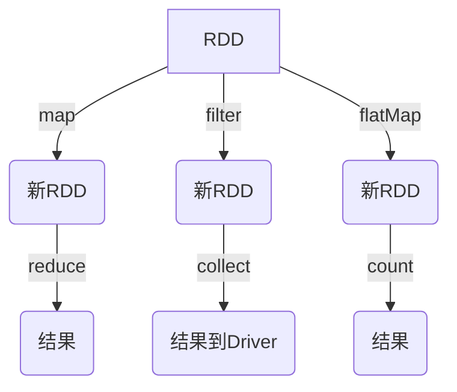
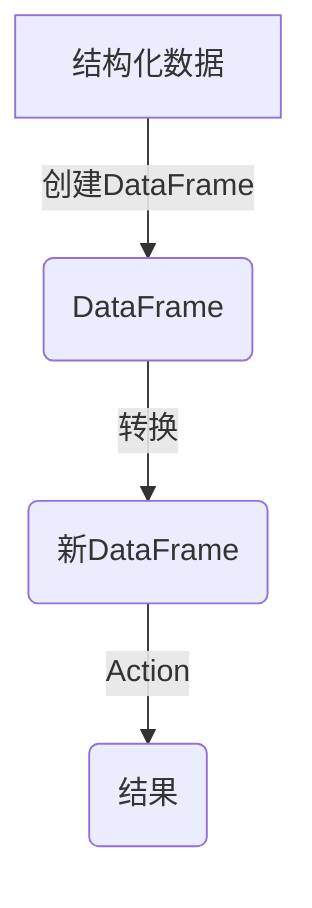
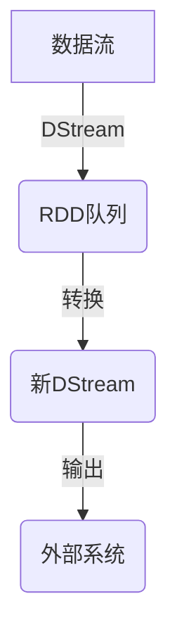
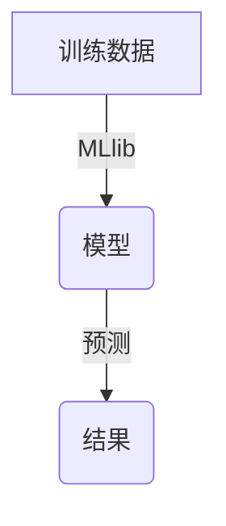
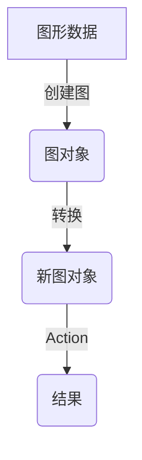

# Spark 原理与代码实例讲解

## 1.背景介绍

Apache Spark 是一种用于大规模数据处理的统一分析引擎。它由加州大学伯克利分校的AMPLab所开发,并于2014年正式发布1.0版本。Spark在保留MapReduce的可扩展性的同时,它还提供了更加富有表现力和高效的数据集抽象,使其能够支持复杂的数据分析应用,包括交互式查询和流处理。

Spark的核心设计思想是提供一种通用的集群计算框架,使用户能够使用统一的API来编写并行应用程序。它支持多种编程语言,如Java、Scala、Python和R等,并提供了丰富的高级API,如Spark SQL用于结构化数据处理、MLlib用于机器学习、GraphX用于图形处理以及Spark Streaming用于流式数据处理。

Spark的主要优势在于其内存计算模型。与Hadoop MapReduce框架不同,Spark会将数据缓存在内存中,从而避免了不必要的磁盘I/O操作,大大提高了计算效率。此外,Spark还引入了RDD(Resilient Distributed Dataset)的概念,使得程序能够以容错的方式在集群中并行运行。

总的来说,Spark凭借其高效、通用和易用的特性,已经成为大数据处理领域最受欢迎的开源项目之一,广泛应用于各种数据密集型应用场景,如交互式数据挖掘、机器学习、实时流处理等。

## 2.核心概念与联系

### 2.1 RDD (Resilient Distributed Dataset)

RDD是Spark最基础的数据抽象,它是一个不可变、分区的记录集合。RDD可以从HDFS、HBase或者本地文件系统中创建,也可以通过现有的RDD转换而来。RDD支持两种操作:transformation(从现有数据集创建一个新的数据集)和action(对数据集进行计算后将结果返回到驱动器程序)。



### 2.2 Spark SQL

Spark SQL是用于结构化数据处理的Spark模块。它提供了一种类似于传统数据库的查询方式,支持SQL语法以及HiveQL,并且可以无缝地集成Hive元数据。Spark SQL还支持复杂的分析功能,如子查询、连接等,并且可以使用Catalyst优化器对查询进行优化。



### 2.3 Spark Streaming

Spark Streaming是Spark用于流式数据处理的组件。它将流数据切分为一系列的小批量,然后使用Spark引擎对这些小批量进行处理。Spark Streaming提供了高度抽象的API,可以通过transformation和output操作来构建流处理管道。



### 2.4 MLlib

MLlib是Spark提供的机器学习库,它支持多种常见的机器学习算法,如分类、回归、聚类、协同过滤等。MLlib利用了Spark的分布式内存计算框架,可以高效地并行化机器学习任务,从而加快模型训练和评估的速度。



### 2.5 GraphX

GraphX是Spark提供的图形处理框架,它支持对大规模图形数据进行并行操作和计算。GraphX提供了一组基本的图形运算符,如subgraph、mapVertices等,用户可以基于这些运算符构建复杂的图形分析算法。



上述核心概念相互关联,共同构成了Spark的完整生态系统。RDD为整个系统提供了基础的数据抽象和并行计算模型,而Spark SQL、Spark Streaming、MLlib和GraphX等高级组件则在此基础上提供了针对不同应用场景的专用API和功能。通过这些组件的有机结合,Spark可以支持包括交互式查询、流处理、机器学习和图形计算在内的多种数据分析工作负载。

## 3.核心算法原理具体操作步骤

### 3.1 RDD的创建

RDD可以通过以下几种方式创建:

1. 从文件系统(如HDFS、本地文件系统等)创建:

```scala
val rdd = sc.textFile("hdfs://...")
```

2. 从集合(如Array、List等)并行化创建:

```scala
val rdd = sc.parallelize(List(1,2,3,4))
```

3. 从其他RDD进行转换创建:

```scala
val rdd2 = rdd.map(x => x * 2)
```

### 3.2 RDD的转换操作

转换操作会从现有的RDD创建一个新的RDD,常见的转换操作包括:

- `map(func)`: 对RDD中的每个元素应用函数`func`
- `filter(func)`: 返回RDD中满足函数`func`的元素
- `flatMap(func)`: 对RDD中的每个元素应用函数`func`,并将结果打平
- `union(otherRDD)`: 返回一个新的RDD,包含源RDD和`otherRDD`的所有元素
- `join(otherRDD)`: 对源RDD和`otherRDD`执行内连接操作

### 3.3 RDD的Action操作

Action操作会触发实际的计算,并将结果返回到Driver程序,常见的Action操作包括:

- `reduce(func)`: 使用函数`func`聚合RDD中的所有元素
- `collect()`: 将RDD中的所有元素拉取到Driver程序
- `count()`: 返回RDD中元素的个数
- `take(n)`: 返回RDD中的前n个元素
- `saveAsTextFile(path)`: 将RDD的元素以文本文件的形式保存到指定路径

### 3.4 RDD的依赖关系

RDD之间存在着依赖关系,Spark会根据这些依赖关系构建出DAG(Directed Acyclic Graph),并基于DAG进行任务调度和容错。Spark支持两种依赖关系:

- 窄依赖(Narrow Dependency): 每个父RDD的分区最多被子RDD的一个分区使用,如`map`、`filter`等。
- 宽依赖(Wide Dependency): 每个父RDD的分区可能被多个子RDD的分区使用,如`groupByKey`、`reduceByKey`等。

窄依赖允许Spark进行流水线计算,而宽依赖会导致数据的shuffle过程。

### 3.5 RDD的容错机制

Spark通过RDD的线性化计算过程来实现容错。当某个分区的数据出错时,Spark可以根据血统关系(lineage)重新计算出这个分区的数据,而不需要从头开始重新计算整个RDD。这种基于数据转换的容错机制,使得Spark在出错时可以高效地恢复数据,从而提高了系统的容错能力和可用性。

## 4.数学模型和公式详细讲解举例说明

### 4.1 PageRank算法

PageRank是一种用于计算网页权重的算法,它被广泛应用于网页排名。PageRank的核心思想是,一个网页的权重取决于链接到它的其他网页的权重。具体来说,如果一个网页被许多高权重网页链接,那么它的权重也会很高。

PageRank算法可以用以下公式表示:

$$PR(p_i) = \frac{1-d}{N} + d \sum_{p_j \in M(p_i)} \frac{PR(p_j)}{L(p_j)}$$

其中:

- $PR(p_i)$表示页面$p_i$的PageRank值
- $N$是网络中所有页面的总数
- $M(p_i)$是链接到页面$p_i$的所有页面的集合
- $L(p_j)$是页面$p_j$的出链接数
- $d$是一个阻尼系数,通常取值0.85

该公式可以解释为:一个页面的PageRank值由两部分组成。第一部分$(1-d)/N$是所有页面初始时均匀分配的基础权重。第二部分是该页面从链接到它的其他页面那里获得的权重的总和,这部分权重又与链接页面自身的权重和出链接数有关。

PageRank算法通常使用迭代方法来计算每个页面的PR值,直到收敛或达到最大迭代次数为止。在Spark中,我们可以使用Pregel API来实现PageRank算法。

### 4.2 协同过滤算法

协同过滤是一种常用的推荐系统算法,它基于用户对项目的评分数据,通过计算用户或项目之间的相似度,为用户推荐感兴趣的项目。

常见的相似度计算方法包括:

1. 基于欧几里得距离的相似度:

$$sim(x, y) = 1 - \sqrt{\sum_{i=1}^{n}(x_i - y_i)^2}$$

2. 基于皮尔逊相关系数的相似度:

$$sim(x, y) = \frac{\sum_{i=1}^{n}(x_i - \overline{x})(y_i - \overline{y})}{\sqrt{\sum_{i=1}^{n}(x_i - \overline{x})^2}\sqrt{\sum_{i=1}^{n}(y_i - \overline{y})^2}}$$

3. 基于余弦相似度:

$$sim(x, y) = \frac{\sum_{i=1}^{n}x_iy_i}{\sqrt{\sum_{i=1}^{n}x_i^2}\sqrt{\sum_{i=1}^{n}y_i^2}}$$

其中$x$和$y$分别表示两个用户或项目的评分向量,$n$是评分的维数。

在Spark MLlib中,我们可以使用`ALS`(Alternating Least Squares)算法来训练协同过滤模型。ALS算法通过最小化用户-项目评分矩阵与模型预测评分之间的均方误差,来学习用户和项目的潜在因子向量。

## 5.项目实践:代码实例和详细解释说明

### 5.1 WordCount示例

WordCount是一个经典的大数据示例程序,它统计给定文本文件中每个单词出现的次数。下面是使用Spark进行WordCount的Scala代码示例:

```scala
import org.apache.spark.SparkContext

object WordCount {
  def main(args: Array[String]) {
    val sc = new SparkContext("local", "WordCount")
    val input = sc.textFile("data.txt")
    val words = input.flatMap(line => line.split(" "))
    val wordCounts = words.map(word => (word, 1)).reduceByKey(_ + _)
    wordCounts.saveAsTextFile("output")
  }
}
```

代码解释:

1. 首先创建一个`SparkContext`对象,用于连接到Spark集群。
2. 使用`textFile`方法从文件系统中读取输入文件`data.txt`,创建一个RDD `input`。
3. 对`input`RDD执行`flatMap`转换,将每行文本拆分为单词,得到一个新的RDD `words`。
4. 对`words`RDD执行`map`转换,将每个单词映射为元组(word, 1),得到一个新的RDD `wordCounts`。
5. 对`wordCounts`RDD执行`reduceByKey`操作,将相同单词的计数值累加,得到最终的(word, count)对。
6. 将最终结果RDD保存到文件系统中的`output`目录下。

### 5.2 Spark SQL示例

下面是一个使用Spark SQL进行数据查询和分析的示例:

```scala
import org.apache.spark.sql.SparkSession

object SparkSQLExample {
  case class Person(name: String, age: Int)

  def main(args: Array[String]) {
    val spark = SparkSession.builder()
      .appName("SparkSQLExample")
      .getOrCreate()

    import spark.implicits._

    val people = Seq(
      Person("Alice", 35),
      Person("Bob", 28),
      Person("Charlie", 42)
    ).toDS()

    people.createOrReplaceTempView("people")

    val youngPeople = spark.sql("SELECT name, age FROM people WHERE age < 30")
    youngPeople.show()

    spark.stop()
  }
}
```

代码解释:

1. 创建一个`SparkSession`对象,用于创建Spark SQL上下文。
2.