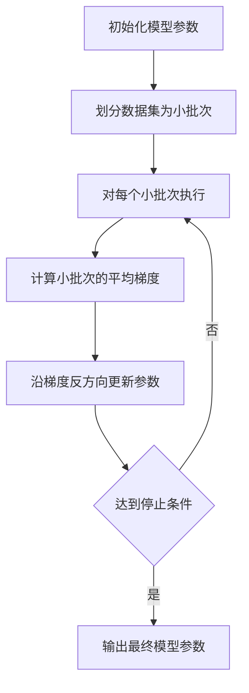

# Stochastic Gradient Descent (SGD) 原理与代码实战案例讲解

## 1.背景介绍

在机器学习和深度学习领域中,优化算法扮演着至关重要的角色。它们用于调整模型参数,以最小化损失函数,从而提高模型的预测精度。其中,Stochastic Gradient Descent (SGD) 是一种广泛使用的优化算法,因其简单、高效且易于并行化而备受青睐。

SGD 源于传统的梯度下降算法,但与后者相比,它在每次迭代中仅使用一个或一小批数据样本来计算梯度,而非使用整个数据集。这种随机采样的方式不仅减少了计算开销,还有助于模型避免陷入局部最优解。

## 2.核心概念与联系

### 2.1 梯度下降

梯度下降是一种基于导数的优化算法,用于找到函数的最小值。在机器学习中,我们希望通过调整模型参数来最小化损失函数,从而提高模型的预测性能。

梯度下降的基本思想是沿着损失函数的负梯度方向移动参数,直到达到局部最小值。具体来说,在每次迭代中,我们计算损失函数关于模型参数的梯度,然后沿着该梯度的反方向更新参数。

$$
\theta_{t+1} = \theta_t - \eta \nabla_\theta J(\theta_t)
$$

其中,$ \theta_t $表示第 t 次迭代时的参数值,$ \eta $是学习率,$ \nabla_\theta J(\theta_t) $是损失函数 J 关于参数 $ \theta_t $的梯度。

虽然梯度下降算法简单有效,但它需要在每次迭代中计算整个数据集的梯度,这在数据量很大时会变得计算量过大。

### 2.2 随机梯度下降

为了解决梯度下降算法的计算瓶颈,我们引入了随机梯度下降 (SGD) 算法。SGD 的核心思想是在每次迭代中,仅使用一个或一小批数据样本来估计梯度,而不是使用整个数据集。

具体来说,在每次迭代中,SGD 会从数据集中随机选择一个或一小批数据样本,计算这些样本的损失函数梯度,然后沿着该梯度的反方向更新参数。

$$
\theta_{t+1} = \theta_t - \eta \nabla_\theta J(\theta_t; x^{(i)}; y^{(i)})
$$

其中,$ (x^{(i)}, y^{(i)}) $表示第 i 个数据样本及其对应的标签。

由于 SGD 只需要计算一小部分数据的梯度,因此它的计算开销远小于传统的梯度下降算法。此外,SGD 的随机性还有助于模型避免陷入局部最小值。

然而,SGD 也存在一些缺陷,例如收敛速度较慢、需要仔细调整学习率等。为了解决这些问题,研究人员提出了多种 SGD 的变体算法,如动量 SGD、Nesterov 加速 SGD、AdaGrad、RMSProp 和 Adam 等。

## 3.核心算法原理具体操作步骤

SGD 算法的具体操作步骤如下:

1. **初始化模型参数**:首先,我们需要为模型参数 $ \theta $赋予初始值,通常使用小的随机值。

2. **划分数据集**:将整个数据集划分为多个小批次 (mini-batch),每个小批次包含一定数量的数据样本。

3. **对每个小批次执行以下操作**:
   a. **计算小批次的梯度**:对于小批次中的每个数据样本 $ (x^{(i)}, y^{(i)}) $,计算损失函数 $ J(\theta; x^{(i)}; y^{(i)}) $关于参数 $ \theta $的梯度 $ \nabla_\theta J(\theta; x^{(i)}; y^{(i)}) $。然后,将这些梯度求平均,得到该小批次的平均梯度 $ \bar{\nabla}_\theta J(\theta) $。
   b. **更新参数**:沿着平均梯度的反方向,使用学习率 $ \eta $更新参数:
      $$
      \theta_{t+1} = \theta_t - \eta \bar{\nabla}_\theta J(\theta_t)
      $$

4. **重复步骤 3**,直到达到停止条件 (如最大迭代次数或损失函数值小于阈值)。

需要注意的是,SGD 算法的性能很大程度上取决于学习率 $ \eta $的选择。一个较小的学习率可能导致收敛速度变慢,而一个较大的学习率可能导致算法发散。因此,通常需要对学习率进行仔细调整,或采用自适应学习率算法 (如 AdaGrad 或 Adam) 来自动调整学习率。

### 3.1 Mermaid 流程图



## 4.数学模型和公式详细讲解举例说明

在深入探讨 SGD 算法之前,我们先回顾一下机器学习中的基本概念和数学符号。

### 4.1 机器学习基本概念

在监督学习任务中,我们的目标是学习一个从输入 $ \mathbf{x} $到输出 $ \mathbf{y} $的映射函数 $ f_\theta (\mathbf{x}) $,其中 $ \theta $表示模型参数。为了找到最优的参数值,我们定义了一个损失函数 $ J(\theta) $,用于衡量模型预测值与真实值之间的差异。

$$
J(\theta) = \frac{1}{N} \sum_{i=1}^N L(f_\theta(\mathbf{x}^{(i)}), \mathbf{y}^{(i)})
$$

其中,$ L $是某种损失函数 (如均方误差或交叉熵损失),$ N $是数据集的大小,$ (\mathbf{x}^{(i)}, \mathbf{y}^{(i)}) $是第 i 个数据样本及其对应的标签。

我们的目标是找到参数 $ \theta $,使得损失函数 $ J(\theta) $最小化。这就是优化算法要解决的问题。

### 4.2 梯度下降

梯度下降是一种广泛使用的优化算法,它通过沿着损失函数的负梯度方向移动参数,逐步减小损失函数的值。具体来说,在每次迭代中,我们计算损失函数关于参数的梯度,然后沿着该梯度的反方向更新参数:

$$
\theta_{t+1} = \theta_t - \eta \nabla_\theta J(\theta_t)
$$

其中,$ \eta $是学习率,控制着每次更新的步长。$ \nabla_\theta J(\theta_t) $是损失函数关于参数 $ \theta_t $的梯度,可以通过链式法则计算得到:

$$
\nabla_\theta J(\theta) = \frac{1}{N} \sum_{i=1}^N \nabla_\theta L(f_\theta(\mathbf{x}^{(i)}), \mathbf{y}^{(i)})
$$

虽然梯度下降算法简单有效,但它需要在每次迭代中计算整个数据集的梯度,这在数据量很大时会变得计算量过大。

### 4.3 随机梯度下降

为了解决梯度下降算法的计算瓶颈,我们引入了随机梯度下降 (SGD) 算法。SGD 的核心思想是在每次迭代中,仅使用一个或一小批数据样本来估计梯度,而不是使用整个数据集。

具体来说,在每次迭代中,SGD 会从数据集中随机选择一个或一小批数据样本,计算这些样本的损失函数梯度,然后沿着该梯度的反方向更新参数:

$$
\theta_{t+1} = \theta_t - \eta \nabla_\theta J(\theta_t; \mathcal{B}_t)
$$

其中,$ \mathcal{B}_t $是第 t 次迭代中选择的小批次数据样本,$ \nabla_\theta J(\theta_t; \mathcal{B}_t) $是基于这些样本计算的梯度估计值。

由于 SGD 只需要计算一小部分数据的梯度,因此它的计算开销远小于传统的梯度下降算法。此外,SGD 的随机性还有助于模型避免陷入局部最小值。

然而,SGD 也存在一些缺陷,例如收敛速度较慢、需要仔细调整学习率等。为了解决这些问题,研究人员提出了多种 SGD 的变体算法,如动量 SGD、Nesterov 加速 SGD、AdaGrad、RMSProp 和 Adam 等。

### 4.4 实例说明

为了更好地理解 SGD 算法,我们来看一个简单的线性回归示例。

假设我们有一个数据集 $ \mathcal{D} = \{(\mathbf{x}^{(i)}, y^{(i)})\}_{i=1}^N $,其中 $ \mathbf{x}^{(i)} \in \mathbb{R}^d $是 d 维输入特征向量,$ y^{(i)} \in \mathbb{R} $是对应的标量输出。我们的目标是找到一个线性模型 $ f_\theta(\mathbf{x}) = \theta_0 + \theta_1 x_1 + \cdots + \theta_d x_d $,使得模型预测值与真实值之间的均方误差最小。

在这种情况下,我们的损失函数为:

$$
J(\theta) = \frac{1}{N} \sum_{i=1}^N (f_\theta(\mathbf{x}^{(i)}) - y^{(i)})^2
$$

我们可以使用 SGD 算法来优化模型参数 $ \theta $。在每次迭代中,我们从数据集中随机选择一个小批次数据样本 $ \mathcal{B}_t $,计算这些样本的梯度估计值:

$$
\nabla_\theta J(\theta_t; \mathcal{B}_t) = \frac{1}{|\mathcal{B}_t|} \sum_{(\mathbf{x}, y) \in \mathcal{B}_t} (f_{\theta_t}(\mathbf{x}) - y) \nabla_\theta f_{\theta_t}(\mathbf{x})
$$

其中,$ |\mathcal{B}_t| $是小批次的大小,$ \nabla_\theta f_{\theta_t}(\mathbf{x}) $是线性模型关于参数 $ \theta_t $的梯度,可以直接计算得到。

然后,我们沿着梯度的反方向,使用学习率 $ \eta $更新参数:

$$
\theta_{t+1} = \theta_t - \eta \nabla_\theta J(\theta_t; \mathcal{B}_t)
$$

重复上述过程,直到达到停止条件 (如最大迭代次数或损失函数值小于阈值)。

通过这个示例,我们可以清楚地看到 SGD 算法是如何工作的。它通过随机采样数据,并基于这些数据估计梯度,从而有效地减少了计算开销,同时保留了梯度下降算法的优点。

## 5.项目实践:代码实例和详细解释说明

为了更好地理解 SGD 算法,我们将通过一个实际的代码示例来演示如何使用 SGD 来训练线性回归模型。我们将使用 Python 和 NumPy 库来实现这个示例。

### 5.1 生成数据集

首先,我们需要生成一个用于训练的数据集。在这个示例中,我们将生成一个线性数据集,其中输入特征 $ \mathbf{x} $是一维的,输出 $ y $是一个线性函数加上一些噪声。

```python
import numpy as np

# 生成数据集
np.random.seed(42)  # 设置随机种子,以保证结果可重复
X = np.random.rand(1000, 1)  # 生成 1000 个 1 维输入特征
y = 2 + 3 * X + np.random.randn(1000, 1)  # 生成线性输出加噪声
```

### 5.2 定义模型和损失函数

接下来,我们定义线性回归模型和均方误差损失函数。

```python
# 定义线性回归模型
def linear_model(X, theta):
    return np.dot(X, theta)

# 定义均方误