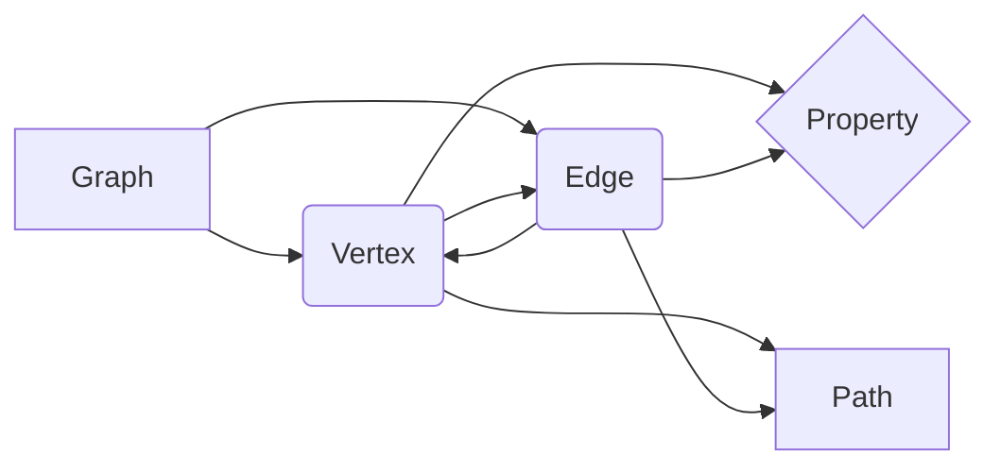

# TinkerPop原理与代码实例讲解

## 1. 背景介绍

### 1.1 图数据库的兴起

在当今大数据时代,传统的关系型数据库在处理高度关联的复杂数据时往往力不从心。图数据库作为一种新兴的 NoSQL 数据库,以图这种数据结构存储和管理数据,天然适合处理高度关联的数据。近年来,图数据库得到了广泛的关注和应用。

### 1.2 Apache TinkerPop 简介 

Apache TinkerPop 是一个开源的图计算框架,为图数据库提供了一套标准的 API 和查询语言 Gremlin。TinkerPop 的目标是提供一个通用的、可扩展的图计算框架,让开发者能够方便地使用图数据库进行图数据的存储、查询和分析。

### 1.3 本文的主要内容

本文将深入探讨 Apache TinkerPop 的原理,并通过代码实例讲解如何使用 TinkerPop 进行图数据的建模、查询和分析。通过本文,读者将对图数据库和 TinkerPop 有更深入的认识,掌握使用 TinkerPop 进行图数据开发的实践技能。

## 2. 核心概念与联系

### 2.1 Property Graph 属性图模型

TinkerPop 采用属性图(Property Graph)模型来表示图数据。属性图由顶点(Vertex)和边(Edge)组成,顶点和边都可以包含属性(Property)。属性图模型简单灵活,适合表达现实世界中的各种关联数据。

### 2.2 顶点 Vertex

顶点表示图中的实体对象,例如人、地点、事物等。每个顶点都有一个唯一标识符,以及一组属性来描述顶点的特征。

### 2.3 边 Edge

边表示顶点之间的关系,例如人与人之间的朋友关系,人与地点之间的位置关系等。每条边都有一个唯一标识符,以及起点顶点、终点顶点、边的类型和一组属性。边可以是有向的,也可以是无向的。

### 2.4 属性 Property 

属性是附加在顶点或边上的键值对,用于描述顶点或边的特征。例如一个人顶点可以有 name、age 等属性,一条朋友关系边可以有 since 属性表示成为朋友的时间。

### 2.5 路径 Path

路径由一系列顶点和边首尾相连组成,表示顶点之间的一条遍历序列。利用路径可以表达顶点之间的复杂关联关系,例如查找两个人之间最短的关系路径。

### 2.6 核心概念之间的关系

下面是一个用 Mermaid 绘制的示意图,展示了 TinkerPop 中几个核心概念之间的关系:



一个图(Graph)由多个顶点(Vertex)和边(Edge)组成。顶点之间通过边建立关联。顶点和边都可以包含多个属性(Property)。多个顶点和边首尾相连形成路径(Path)。

## 3. 核心算法原理和具体操作步骤

### 3.1 图的遍历算法

图的遍历是图数据库最常见的操作之一,主要分为深度优先遍历和广度优先遍历两种。

#### 3.1.1 深度优先遍历 Depth-First Search

深度优先遍历从起点顶点开始,沿着一条路径向前探索直到无法继续,然后回溯到上一个顶点,再从另一条路径开始探索,直到所有顶点都被访问到。

深度优先遍历的具体步骤如下:

1. 从起点顶点开始,标记该顶点为已访问
2. 获取当前顶点的一个未访问的邻接顶点,标记为已访问,将其压入栈中
3. 重复步骤2,直到当前顶点没有未访问的邻接顶点
4. 如果栈不为空,从栈中弹出一个顶点,将其设置为当前顶点,转到步骤2
5. 遍历结束

#### 3.1.2 广度优先遍历 Breadth-First Search

广度优先遍历从起点顶点开始,先访问起点顶点的所有邻接顶点,再访问这些邻接顶点的所有邻接顶点,以此类推,直到所有顶点都被访问到。

广度优先遍历的具体步骤如下:

1. 从起点顶点开始,标记该顶点为已访问,将其加入队列
2. 如果队列不为空,取出队头顶点,获取该顶点所有未访问的邻接顶点,标记为已访问并加入队列
3. 重复步骤2,直到队列为空
4. 遍历结束

### 3.2 最短路径算法

最短路径算法用于查找图中两个顶点之间的最短路径,常见的有 Dijkstra 算法和 A* 算法。

#### 3.2.1 Dijkstra 算法

Dijkstra 算法适用于边权重非负的有向图,用于查找单源最短路径。

Dijkstra 算法的具体步骤如下:

1. 初始化距离数组 dist,起点到自身距离为0,到其他顶点距离为无穷大
2. 初始化访问数组 visited,所有顶点初始为未访问
3. 遍历所有未访问顶点,选择 dist 最小的顶点 u,标记为已访问
4. 遍历顶点 u 的所有未访问邻接顶点 v,如果 dist[u]+w(u,v)<dist[v],则更新 dist[v]=dist[u]+w(u,v)
5. 重复步骤3、4,直到所有顶点被访问
6. 距离数组 dist 即为起点到其他所有顶点的最短距离

#### 3.2.2 A* 算法

A* 算法在 Dijkstra 算法的基础上引入了启发函数,适用于求解带权有向图的单源最短路径问题。

A* 算法的具体步骤如下:

1. 初始化开放列表和关闭列表,起点加入开放列表
2. 如果开放列表为空,则失败,退出
3. 从开放列表中选取 f 值最小的顶点 n,如果 n 为目标顶点,则找到目标,退出 
4. 将 n 移到关闭列表,遍历 n 的所有邻接顶点:
   - 如果该顶点在关闭列表,忽略
   - 如果该顶点不在开放列表,计算该顶点的 f 值,加入开放列表
   - 如果该顶点在开放列表,判断经过 n 到达该顶点的 g 值是否小于原 g 值,如果是则更新 g 值和 f 值,修改该顶点的父顶点为 n
5. 回到步骤2

其中 f=g+h。g 表示从起点到当前顶点的实际代价,h 表示从当前顶点到目标顶点的预估代价,由启发函数计算得到。

### 3.3 图的中心性算法

图的中心性算法用于度量图中顶点或边的重要程度,常见的有 PageRank 算法和 Betweenness Centrality 算法。

#### 3.3.1 PageRank 算法

PageRank 最初用于度量网页的重要性,后来被推广到图数据分析领域。PageRank 的基本思想是,一个顶点的重要性由指向它的其他重要顶点决定。

PageRank 算法的具体步骤如下:

1. 初始化所有顶点的 PageRank 值为 1/N,N 为顶点数
2. 对每个顶点 u,将其 PageRank 值平均分配给所有出边指向的顶点
3. 对每个顶点 v,将所有指向它的顶点分配的 PageRank 值求和,乘以阻尼系数 d(一般取0.85),再加上(1-d)/N,得到新的 PageRank 值
4. 重复步骤2、3,直到 PageRank 值收敛
5. 输出所有顶点的 PageRank 值

#### 3.3.2 Betweenness Centrality 算法

Betweenness Centrality 度量一个顶点在图中的中介作用,处于越多最短路径上的顶点,Betweenness Centrality 值越高。

Betweenness Centrality 算法的具体步骤如下:

1. 初始化所有顶点的 Betweenness Centrality 值为0
2. 对每一对顶点 s 和 t,计算 s 到 t 的最短路径条数 $\sigma_{st}$,以及 s 到 t 经过顶点 v 的最短路径条数 $\sigma_{st}(v)$
3. 对每个顶点 v,计算 $\sum_{s \neq v \neq t}\frac{\sigma_{st}(v)}{\sigma_{st}}$
4. 将步骤3的值除以2(如果图为无向图),得到顶点 v 的 Betweenness Centrality 值
5. 输出所有顶点的 Betweenness Centrality 值

## 4. 数学模型和公式详细讲解举例说明

### 4.1 图的数学表示

图可以用邻接矩阵或邻接表来表示。设图 $G=(V,E)$,其中 $V$ 为顶点集合,$E$ 为边集合。

邻接矩阵 $A$ 是一个 $|V| \times |V|$ 的方阵,定义为:

$$
A_{ij}=\begin{cases}
1 & (v_i,v_j) \in E \\
0 & (v_i,v_j) \notin E
\end{cases}
$$

邻接表是一个长度为 $|V|$ 的数组,每个元素是一个链表,存储该顶点的所有邻接顶点。

例如,有向图 $G=(V,E),V=\{1,2,3\},E=\{(1,2),(1,3),(2,3)\}$,其邻接矩阵为:

$$
A=
\begin{bmatrix} 
0 & 1 & 1 \\
0 & 0 & 1 \\
0 & 0 & 0
\end{bmatrix}
$$

其邻接表为:

```
1: [2, 3]
2: [3]
3: []
```

### 4.2 最短路径算法的数学原理

以 Dijkstra 算法为例,设起点为 $s$,距离数组为 $dist$,visitied 数组标记顶点是否被访问过。

初始化:

$$
dist[v]=
\begin{cases}
0 & v=s \\
\infty & v \neq s
\end{cases}
$$

$$
visited[v]=false, \forall v \in V
$$

每次选择未访问顶点中 $dist$ 最小的顶点 $u$,则有:

$$
dist[u]=\min\{dist[v]|visited[v]=false\}
$$

然后更新 $u$ 的所有邻接顶点 $v$ 的 $dist$ 值:

$$
dist[v]=\min\{dist[v],dist[u]+w(u,v)\}
$$

重复上述过程,直到所有顶点都被访问,最终 $dist$ 数组即为起点到其他所有顶点的最短距离。

### 4.3 PageRank 的数学原理

PageRank 的计算公式为:

$$
PR(v)=\frac{1-d}{N}+d \sum_{u \in B_v}\frac{PR(u)}{L(u)}
$$

其中 $PR(v)$ 为顶点 $v$ 的 PageRank 值,$N$ 为顶点总数,$d$ 为阻尼系数,$B_v$ 为指向 $v$ 的顶点集合,$L(u)$ 为顶点 $u$ 的出度。

上述公式可以写成矩阵形式:

$$
\vec{PR}=\frac{1-d}{N}\vec{1}+dM\vec{PR}
$$

其中 $\vec{PR}$ 为 PageRank 值组成的列向量,$\vec{1}$ 为所有元素为1的列向量,$M$ 为转移矩阵,定义为:

$$
M_{ij}=
\begin{cases}
\frac{1}{L(v_j)} & (v_j,v_i) \in E \\
0 & (v_j,v_i) \notin E
\end{cases}
$$

不断迭代上述公式,最终 $\vec{PR}$ 会收敛到一个稳定值,即为所有顶点的 PageRank 值。

## 5. 项目实践：代码实例和详细解释说明

下面以