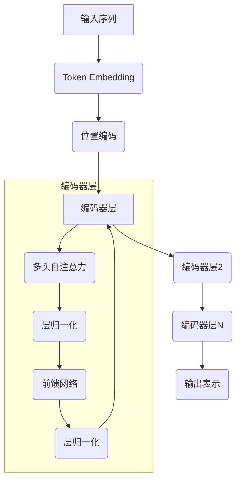
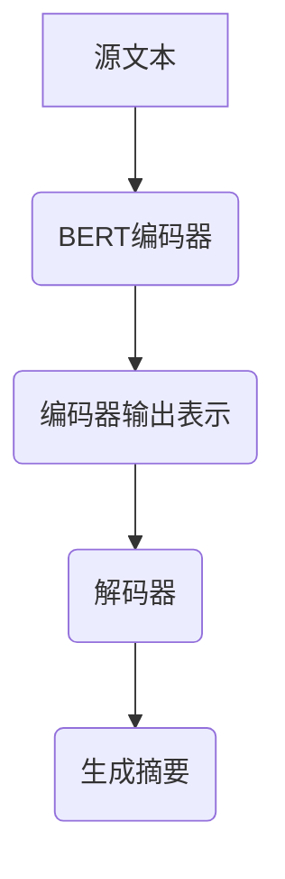

# Transformer大模型实战 为文本摘要任务微调BERT模型

## 1.背景介绍

### 1.1 文本摘要任务概述

文本摘要是自然语言处理(NLP)领域的一个核心任务,旨在自动生成一段文本的简洁摘要。它广泛应用于新闻报道、法律文件、科技论文等各个领域,可以帮助人们快速获取文本的核心内容。随着信息时代的到来,海量的文本数据不断涌现,传统的人工摘要方式已经无法满足需求,因此自动文本摘要技术变得越来越重要。

### 1.2 文本摘要任务的挑战

文本摘要任务面临着诸多挑战:

1. **语义理解**:准确捕捉文本的语义内涵并提取关键信息点是最大的难题。
2. **信息冗余**:如何有效地去除冗余和次要信息,提炼出高度概括的摘要内容。
3. **语言生成**:生成通顺、连贯且语义准确的摘要文本并非易事。
4. **领域迁移**:不同领域的文本在语言风格和知识背景上存在差异,模型需要具备很强的迁移能力。

### 1.3 BERT在文本摘要任务中的应用

伴随着预训练语言模型(PLM)的兴起,BERT(Bidirectional Encoder Representations from Transformers)模型在NLP任务中展现出了卓越的性能表现。BERT采用了Transformer的编码器结构,通过自注意力机制捕捉文本的长程依赖关系,在大规模无监督语料库上预训练后,可以在下游任务上通过微调(fine-tuning)的方式快速收敛并取得优异的结果。

由于BERT模型在语义理解和生成方面的强大能力,将其应用于文本摘要任务是一个很自然的选择。本文将重点介绍如何针对文本摘要任务对BERT模型进行微调,并分享一些实践经验和技巧。

## 2.核心概念与联系

### 2.1 BERT模型架构

BERT模型的核心是基于Transformer的编码器结构,由多层编码器块堆叠而成。每个编码器块包含了多头自注意力(Multi-Head Attention)和前馈神经网络(Feed-Forward Neural Network)两个子层。

自注意力机制能够捕捉输入序列中任意两个位置之间的关系,从而建模长程依赖。前馈神经网络则对每个位置的表示进行非线性映射,提供了足够的模型容量。位置编码(Positional Encoding)则赋予了序列的位置信息。

BERT在预训练阶段采用了两个无监督任务:遮蔽语言模型(Masked Language Model)和下一句预测(Next Sentence Prediction),通过这两个任务学习到了通用的语义表示能力。

### 2.2 文本摘要任务形式化

文本摘要任务可以形式化为:给定一个源文本序列 $X = (x_1, x_2, ..., x_n)$,目标是生成一个简洁的目标摘要序列 $Y = (y_1, y_2, ..., y_m)$,其中 $m \ll n$。

根据输入输出的形式,文本摘要任务可以分为:

1. **抽取式摘要(Extractive Summarization)**: 直接从源文本中抽取出一些句子或短语作为摘要,不改变原文的词序。
2. **生成式摘要(Abstractive Summarization)**: 需要对源文本进行理解和重新表述,生成一个全新的摘要文本。

生成式摘要任务更加复杂和具有挑战性,需要模型具备强大的语义理解和生成能力。本文将重点介绍如何将BERT应用于生成式文本摘要任务。

### 2.3 BERT在文本摘要任务中的应用

由于BERT在预训练阶段已经学习到了通用的语义表示能力,因此可以通过在下游任务上进行微调(fine-tuning)的方式,快速地将这些知识迁移到文本摘要任务上。

具体来说,我们可以将BERT的编码器作为文本编码模块,对源文本进行编码,得到其语义表示;然后将这些表示作为输入,接一个解码器(Decoder)模块,负责生成目标摘要文本。解码器模块通常也采用基于Transformer的架构。

在训练阶段,我们将源文本和目标摘要文本作为输入,以最小化生成的摘要与真实摘要之间的损失(如交叉熵损失)作为目标函数,对整个模型(编码器+解码器)进行端到端的微调训练。在预测时,我们只需要给定源文本,模型就能够生成对应的摘要文本。

通过这种编码器-解码器的架构,BERT模型可以充分利用其在语义理解方面的优势,同时结合解码器的生成能力,实现高质量的文本摘要。

## 3.核心算法原理具体操作步骤

### 3.1 数据预处理

在对BERT模型进行微调之前,需要对训练数据进行适当的预处理,以满足模型的输入格式要求。典型的预处理步骤包括:

1. **标记化(Tokenization)**: 将文本按字符或词元(word piece)的粒度切分成一个个token。BERT使用的是WordPiece tokenizer。
2. **添加特殊标记(Special Tokens)**: 在输入序列的开头添加`[CLS]`标记,在结尾添加`[SEP]`标记,用于区分不同的输入段落。
3. **填充和截断(Padding & Truncating)**: 由于BERT对输入长度有限制(通常为512个token),因此需要对过长的序列进行截断,对过短的序列进行填充。
4. **构建注意力掩码(Attention Mask)**: 用于指示哪些位置是实际的token,哪些是填充的位置,以避免计算填充位置的注意力权重。

对于文本摘要任务,我们需要将源文本和目标摘要文本拼接在一起作为BERT的输入,中间使用`[SEP]`标记分隔。在训练时,标签(label)为目标摘要文本对应的token id序列。

### 3.2 模型微调

经过数据预处理后,我们可以将处理好的数据输入到BERT模型中进行微调训练。具体步骤如下:

1. **初始化BERT编码器**: 从预训练好的BERT模型中加载编码器部分的权重作为初始化参数。
2. **构建解码器**: 根据任务需求,选择合适的解码器架构,例如基于Transformer的解码器。解码器的输入是BERT编码器的输出表示,输出则是生成的摘要token序列。
3. **定义损失函数**: 通常采用交叉熵损失(Cross-Entropy Loss)作为训练目标,将生成的摘要与真实标签之间的差异作为损失值。
4. **训练模型**: 使用优化算法(如Adam)对模型的所有可训练参数(编码器和解码器)进行端到端的微调,以最小化损失函数。
5. **模型评估**: 在验证集上评估模型的性能表现,根据指标(如ROUGE分数)进行模型选择。
6. **模型预测**: 对于新的输入文本,将其输入到微调好的BERT+Decoder模型中,模型将生成对应的摘要文本。

在训练过程中,还可以采用一些技巧来提升模型性能,例如:

- **梯度裁剪(Gradient Clipping)**: 防止梯度爆炸的问题。
- **标签平滑(Label Smoothing)**: 改善模型的泛化能力。
- **梯度累积(Gradient Accumulation)**: 有效利用大批量训练数据。
- **预测时的束搜索(Beam Search)**: 生成多个候选摘要,并选择最优的一个作为输出。

### 3.3 模型部署

在完成模型训练和评估后,我们需要将模型部署到生产环境中,以便为下游应用提供文本摘要服务。典型的部署方式包括:

1. **本地部署**: 在本地服务器或个人计算机上运行模型,为本地应用程序提供服务。
2. **云部署**: 将模型打包为Docker镜像,部署到云平台(如AWS、GCP等)上,提供在线API服务。
3. **边缘部署**: 将模型部署到边缘设备(如手机、物联网设备等)上,实现本地化的推理和服务。

无论采用何种部署方式,都需要考虑模型的性能、可扩展性、安全性等多个方面。同时,还需要设计合理的API接口,方便上游应用程序调用文本摘要服务。

## 4.数学模型和公式详细讲解举例说明

### 4.1 Transformer自注意力机制

Transformer模型中的自注意力(Self-Attention)机制是一种全新的注意力计算方式,它能够捕捉输入序列中任意两个位置之间的关系,从而建模长程依赖。

给定一个输入序列 $X = (x_1, x_2, ..., x_n)$,我们首先将其映射到一个矩阵 $Q, K, V$ 中,分别表示 Query、Key 和 Value。然后,自注意力机制的计算公式如下:

$$\mathrm{Attention}(Q, K, V) = \mathrm{softmax}\left(\frac{QK^T}{\sqrt{d_k}}\right)V$$

其中,$ \sqrt{d_k} $是一个缩放因子,用于防止点积过大导致的梯度饱和问题。

具体来说,对于每个查询向量 $q_i$,我们计算它与所有键向量 $k_j$ 的点积,得到一个注意力分数向量 $e_{ij}$。然后,通过 softmax 函数将其归一化为概率分布 $\alpha_{ij}$,最后将这些概率分布与值向量 $v_j$ 相乘并求和,得到最终的注意力表示 $z_i$:

$$
\begin{aligned}
e_{ij} &= q_i^Tk_j \\
\alpha_{ij} &= \mathrm{softmax}(e_{ij}) = \frac{\exp(e_{ij})}{\sum_k \exp(e_{ik})} \\
z_i &= \sum_j \alpha_{ij}v_j
\end{aligned}
$$

这种注意力机制能够自适应地为每个位置分配不同的权重,从而捕捉输入序列中的重要信息。

在实际应用中,通常采用多头自注意力(Multi-Head Attention)的方式,将注意力机制分成多个并行的"头部",每个头部学习不同的注意力表示,最后将它们拼接起来,从而提高模型的表达能力。

### 4.2 Transformer解码器

在文本摘要任务中,我们需要一个解码器模块来生成目标摘要序列。Transformer解码器的结构与编码器类似,也是由多个解码器层堆叠而成,每个解码器层包含三个子层:

1. **掩蔽多头自注意力(Masked Multi-Head Attention)**
2. **编码器-解码器注意力(Encoder-Decoder Attention)**
3. **前馈神经网络(Feed-Forward Neural Network)**

掩蔽多头自注意力子层用于捕捉解码器输入序列中的依赖关系,但与编码器不同的是,它采用了"掩蔽"机制,即在计算注意力时,每个位置只能关注之前的位置,而不能关注之后的位置。这种约束保证了模型在生成序列时,每个时刻的预测只依赖于之前的输出,从而避免了展望偏移(Lookahead Bias)的问题。

编码器-解码器注意力子层则用于将解码器的状态与编码器的输出表示进行关联,从而融合源文本的语义信息。

前馈神经网络子层与编码器中的结构相同,用于对每个位置的表示进行非线性映射,