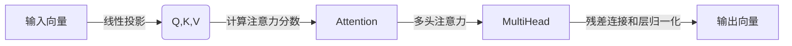

# Transformer大模型实战 多头注意力层

## 1.背景介绍

随着深度学习技术的不断发展,Transformer模型在自然语言处理(NLP)和计算机视觉(CV)等领域取得了卓越的成就。作为Transformer模型的核心组件,多头注意力机制(Multi-Head Attention)已成为当前最流行的注意力机制之一。

传统的序列模型如RNN和LSTM存在梯度消失、无法并行化等问题,而Transformer完全基于注意力机制,摒弃了递归结构,可以高效并行计算,在长序列建模任务上表现优异。2017年,Transformer被提出并应用于机器翻译任务,取得了令人瞩目的成绩,随后在NLP各个领域广泛使用,成为主流模型结构。

## 2.核心概念与联系

### 2.1 注意力机制

注意力机制的本质是对输入序列中不同位置的向量赋予不同的权重,使模型能够关注对当前任务更加重要的部分信息,忽略不太相关的部分。这种选择性集中机制与人类认知方式相似,也是模型获取长期依赖信息的关键。

### 2.2 多头注意力

多头注意力将注意力机制进行了拓展,通过并行计算多个注意力子层,再将它们拼接起来,捕获不同的子空间表示,最终形成更加丰富的特征表示。多头注意力不仅提高了模型的表达能力,还具有可解释性,不同的头可以学习到不同的注意力行为。

### 2.3 Transformer架构

Transformer是第一个完全基于注意力机制的序列模型,主要由编码器(Encoder)和解码器(Decoder)两部分组成。编码器将输入序列映射为中间表示,解码器则基于输入和中间表示生成输出序列。编码器和解码器内部都采用了多头注意力层和前馈神经网络层。

## 3.核心算法原理具体操作步骤

多头注意力层的核心步骤如下:

1. **线性投影**: 将输入向量 $\boldsymbol{x}$ 分别投影到查询(Query)、键(Key)和值(Value)空间,得到 $\boldsymbol{Q}$、$\boldsymbol{K}$、$\boldsymbol{V}$。
   $$\begin{aligned}
   \boldsymbol{Q} &= \boldsymbol{x}\boldsymbol{W}^Q \\
   \boldsymbol{K} &= \boldsymbol{x}\boldsymbol{W}^K \\
   \boldsymbol{V} &= \boldsymbol{x}\boldsymbol{W}^V
   \end{aligned}$$

2. **计算注意力分数**: 通过查询与键的点积计算注意力分数,对分数进行缩放处理,然后使用Softmax函数获得注意力权重。
   $$\text{Attention}(\boldsymbol{Q}, \boldsymbol{K}, \boldsymbol{V}) = \text{softmax}\left(\frac{\boldsymbol{Q}\boldsymbol{K}^\top}{\sqrt{d_k}}\right)\boldsymbol{V}$$

3. **多头注意力**: 将注意力机制复制 $h$ 次(多头),每一个注意力头都对输入进行独立的线性投影,然后将它们的结果拼接起来。
   $$\text{MultiHead}(\boldsymbol{Q}, \boldsymbol{K}, \boldsymbol{V}) = \text{Concat}(\text{head}_1, \dots, \text{head}_h)\boldsymbol{W}^O$$
   其中 $\text{head}_i = \text{Attention}(\boldsymbol{Q}\boldsymbol{W}_i^Q, \boldsymbol{K}\boldsymbol{W}_i^K, \boldsymbol{V}\boldsymbol{W}_i^V)$

4. **残差连接和层归一化**: 对多头注意力的输出进行残差连接,然后进行层归一化处理,得到最终输出。



## 4.数学模型和公式详细讲解举例说明

### 4.1 缩放点积注意力

在计算注意力分数时,Transformer采用了缩放点积注意力(Scaled Dot-Product Attention),其公式为:

$$\text{Attention}(\boldsymbol{Q}, \boldsymbol{K}, \boldsymbol{V}) = \text{softmax}\left(\frac{\boldsymbol{Q}\boldsymbol{K}^\top}{\sqrt{d_k}}\right)\boldsymbol{V}$$

其中 $d_k$ 为键向量的维度。引入 $\sqrt{d_k}$ 的目的是为了防止点积的值过大导致Softmax函数的梯度较小,从而使模型难以收敛。

例如,假设查询向量为 $\boldsymbol{q} = [0.1, 0.2, 0.3]^\top$,键向量为 $\boldsymbol{k} = [0.4, 0.5, 0.6]^\top$,值向量为 $\boldsymbol{v} = [1.0, 2.0, 3.0]^\top$,则注意力输出为:

$$\begin{aligned}
\text{score} &= \frac{\boldsymbol{q}^\top\boldsymbol{k}}{\sqrt{3}} = \frac{0.1\times0.4 + 0.2\times0.5 + 0.3\times0.6}{\sqrt{3}} \approx 0.2598 \\
\alpha &= \text{softmax}(\text{score}) = 1.0 \\
\text{output} &= \alpha\boldsymbol{v} = [1.0, 2.0, 3.0]^\top
\end{aligned}$$

### 4.2 多头注意力

多头注意力的公式为:

$$\text{MultiHead}(\boldsymbol{Q}, \boldsymbol{K}, \boldsymbol{V}) = \text{Concat}(\text{head}_1, \dots, \text{head}_h)\boldsymbol{W}^O$$
$$\text{head}_i = \text{Attention}(\boldsymbol{Q}\boldsymbol{W}_i^Q, \boldsymbol{K}\boldsymbol{W}_i^K, \boldsymbol{V}\boldsymbol{W}_i^V)$$

其中 $h$ 为头数, $\boldsymbol{W}_i^Q \in \mathbb{R}^{d_\text{model} \times d_k}$, $\boldsymbol{W}_i^K \in \mathbb{R}^{d_\text{model} \times d_k}$, $\boldsymbol{W}_i^V \in \mathbb{R}^{d_\text{model} \times d_v}$ 为可学习的权重矩阵, $\boldsymbol{W}^O \in \mathbb{R}^{hd_v \times d_\text{model}}$ 为输出权重矩阵。

例如,假设输入为 $\boldsymbol{x} = [1.0, 2.0, 3.0]^\top$,头数 $h=2$,查询/键/值的维度均为 $d_k = d_v = 2$,模型维度 $d_\text{model} = 3$,则多头注意力的计算过程为:

$$\begin{aligned}
\boldsymbol{Q}_1 &= \boldsymbol{x}\boldsymbol{W}_1^Q = [1.0, 2.0, 3.0]\begin{bmatrix}0.1 & 0.2 \\ 0.3 & 0.4 \\ 0.5 & 0.6\end{bmatrix} = [2.3, 3.5]^\top \\
\boldsymbol{K}_1 &= \boldsymbol{x}\boldsymbol{W}_1^K = [1.0, 2.0, 3.0]\begin{bmatrix}0.7 & 0.8 \\ 0.9 & 1.0 \\ 1.1 & 1.2\end{bmatrix} = [6.6, 7.8]^\top \\
\boldsymbol{V}_1 &= \boldsymbol{x}\boldsymbol{W}_1^V = [1.0, 2.0, 3.0]\begin{bmatrix}1.3 & 1.4 \\ 1.5 & 1.6 \\ 1.7 & 1.8\end{bmatrix} = [10.9, 12.1]^\top \\
\text{head}_1 &= \text{Attention}(\boldsymbol{Q}_1, \boldsymbol{K}_1, \boldsymbol{V}_1) = \text{softmax}\left(\frac{\boldsymbol{Q}_1\boldsymbol{K}_1^\top}{\sqrt{2}}\right)\boldsymbol{V}_1 = [11.8, 13.2]^\top \\
\boldsymbol{Q}_2 &= \boldsymbol{x}\boldsymbol{W}_2^Q = [1.0, 2.0, 3.0]\begin{bmatrix}1.9 & 2.0 \\ 2.1 & 2.2 \\ 2.3 & 2.4\end{bmatrix} = [13.7, 14.3]^\top \\
\boldsymbol{K}_2 &= \boldsymbol{x}\boldsymbol{W}_2^K = [1.0, 2.0, 3.0]\begin{bmatrix}2.5 & 2.6 \\ 2.7 & 2.8 \\ 2.9 & 3.0\end{bmatrix} = [17.1, 17.7]^\top \\
\boldsymbol{V}_2 &= \boldsymbol{x}\boldsymbol{W}_2^V = [1.0, 2.0, 3.0]\begin{bmatrix}3.1 & 3.2 \\ 3.3 & 3.4 \\ 3.5 & 3.6\end{bmatrix} = [20.5, 21.1]^\top \\
\text{head}_2 &= \text{Attention}(\boldsymbol{Q}_2, \boldsymbol{K}_2, \boldsymbol{V}_2) = \text{softmax}\left(\frac{\boldsymbol{Q}_2\boldsymbol{K}_2^\top}{\sqrt{2}}\right)\boldsymbol{V}_2 = [20.9, 21.5]^\top \\
\text{MultiHead} &= \text{Concat}(\text{head}_1, \text{head}_2)\boldsymbol{W}^O \\
&= [11.8, 13.2, 20.9, 21.5]^\top\begin{bmatrix}
3.7 & 3.8 & 3.9 & 4.0 \\
4.1 & 4.2 & 4.3 & 4.4 \\
4.5 & 4.6 & 4.7 & 4.8
\end{bmatrix} \\
&= [197.5, 208.7, 220.0]^\top
\end{aligned}$$

可以看出,多头注意力通过不同的线性投影,捕获了输入向量在不同子空间的表示,并将它们融合在一起,形成了更加丰富的特征表示。

## 5.项目实践: 代码实例和详细解释说明

以下是使用PyTorch实现多头注意力层的代码示例:

```python
import math
import torch
import torch.nn as nn

class MultiHeadAttention(nn.Module):
    def __init__(self, d_model, num_heads):
        super(MultiHeadAttention, self).__init__()
        self.d_model = d_model
        self.num_heads = num_heads
        self.head_dim = d_model // num_heads
        
        self.q_linear = nn.Linear(d_model, d_model)
        self.k_linear = nn.Linear(d_model, d_model)
        self.v_linear = nn.Linear(d_model, d_model)
        self.out_linear = nn.Linear(d_model, d_model)
        
    def forward(self, query, key, value, mask=None):
        batch_size = query.size(0)
        
        # 线性投影
        query = self.q_linear(query).view(batch_size, -1, self.num_heads, self.head_dim).permute(0, 2, 1, 3)
        key = self.k_linear(key).view(batch_size, -1, self.num_heads, self.head_dim).permute(0, 2, 1, 3)
        value = self.v_linear(value).view(batch_size, -1, self.num_heads, self.head_dim).permute(0, 2, 1, 3)
        
        # 计算注意力分数
        scores = torch.matmul(query, key.permute(0, 1, 3, 2)) / math.sqrt(self.head_dim)
        if mask is not None:
            scores = scores.masked_fill(mask == 0, -1e9)
        attention_weights = torch.softmax(scores, dim=-1)
        
        # 计算注意力加权和
        attention_output = torch.matmul(attention_weights, value)
        attention_output = attention_output.permute(0, 2, 1, 3).contiguous().view(batch_size, -1, self.d_model)
        
        # 残差连接和层归一化
        output = self.out_linear(attention_output)
        
        return output, attention_weights
```

代码解释:

1. 初始化时定义了线性投影层和输出线性层,其中 `d_model` 为模型维度,`num_heads` 为头数