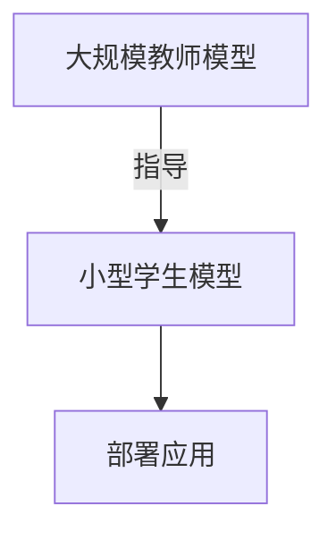

# Transformer大模型实战 知识蒸馏简介

## 1.背景介绍

### 1.1 大规模预训练模型的兴起

近年来,自然语言处理(NLP)领域出现了一股"大规模预训练模型"的热潮。这些模型通过在大量无标注文本数据上进行预训练,学习通用的语言表示,再通过在特定任务上的微调(fine-tuning),获得出色的性能表现。代表性的大规模预训练模型有GPT、BERT、XLNet、RoBERTa等。

其中,Transformer是这些大规模预训练模型的核心架构。Transformer完全基于注意力机制构建,摒弃了传统序列模型中的循环神经网络和卷积神经网络结构,大大提升了并行计算能力,成为构建大规模预训练模型的主流选择。

### 1.2 大规模预训练模型的挑战

尽管大规模预训练模型取得了巨大成功,但其庞大的模型参数量和计算资源需求,给实际应用带来了严峻挑战:

1. **硬件资源消耗大**:大规模预训练模型往往包含数十亿甚至上百亿参数,对GPU等硬件资源的需求极高,给部署和推理带来很大压力。
2. **推理效率低下**:大规模模型的推理过程通常很慢,难以满足实时响应的需求。
3. **隐私和安全顾虑**:在一些场景下,将用户数据上传到云端进行推理可能会引发隐私和安全问题。

为了在保持模型性能的同时,降低计算资源消耗,提高推理效率,知识蒸馏(Knowledge Distillation)应运而生。

## 2.核心概念与联系

### 2.1 知识蒸馏的概念

知识蒸馏是一种模型压缩技术,其核心思想是:使用一个大型的"教师模型"(Teacher Model)去指导训练一个小型的"学生模型"(Student Model),使得小模型在性能上接近或超过大模型,同时参数量和计算量大幅减小。



这种"教师指导学生"的过程,借鉴了人类教育中"师徒传承"的理念,因而叫做"知识蒸馏"。

### 2.2 知识蒸馏与模型压缩

知识蒸馏属于"模型压缩"的一种技术,旨在将大模型中的知识迁移到小模型中。模型压缩主要包括:

1. **参数剪枝(Pruning)**: 将模型中冗余的权重连接剪掉,压缩模型大小。
2. **量化(Quantization)**: 将权重和激活值从32位浮点数压缩到8位或更低的定点数表示。
3. **低秩分解(Low-Rank Decomposition)**: 将权重矩阵分解为若干低秩矩阵的乘积。
4. **知识蒸馏(Knowledge Distillation)**: 使用教师模型指导训练小型学生模型。

其中,知识蒸馏与其他压缩方法相比,压缩率更高,性能损失更小,因此受到广泛关注。

### 2.3 知识蒸馏的优势

与直接训练小模型相比,知识蒸馏技术具有以下优势:

1. **参数量大幅减少**:学生模型可以比教师模型小数个数量级,大大降低了计算和存储开销。
2. **推理速度加快**:小模型的推理速度通常比大模型快很多,有利于部署到终端设备上。
3. **泛化能力增强**:学生模型能从教师模型中学习到很多有益的知识,泛化能力往往优于直接训练的小模型。
4. **隐私和安全性提高**:在一些场景下,无需将数据上传到云端,可在本地部署小型学生模型进行推理。

因此,知识蒸馏技术为大规模预训练模型在资源受限环境中的应用铺平了道路。

## 3.核心算法原理具体操作步骤

知识蒸馏的核心思路是:在训练学生模型时,除了使用硬标签(Hard Label)作为监督信号外,还融合了来自教师模型的"软标签"(Soft Label),以传递教师模型掌握的知识。

### 3.1 硬标签与软标签

- **硬标签(Hard Label)**:指数据集中的一热编码标签,如对于一个分类任务,若样本属于第i类,则其硬标签为[0,0,...,1,0,...,0]。
- **软标签(Soft Label)**:指模型输出的预测概率分布,如[0.1,0.2,0.6,0.05,0.05]。相比硬标签,软标签保留了更多的类别概率信息。

教师模型在大数据上训练获得的预测分布,可以看作是对真实标签分布的一个更精细的编码,包含了更丰富的知识。因此,在训练学生模型时,融合教师模型的软标签有助于知识迁移。

### 3.2 基本知识蒸馏算法步骤

1. **训练教师模型**:在大规模数据集上训练一个高容量的教师模型,获得其输出的软标签概率分布。
2. **计算知识蒸馏损失**:使用教师模型的软标签概率分布和学生模型的预测概率分布之间的损失,作为知识蒸馏的损失函数。常用的损失函数有KL散度、MSE损失等。
3. **融合硬标签和软标签**:将知识蒸馏损失与硬标签的交叉熵损失相结合,作为学生模型的总损失函数。
4. **训练学生模型**:使用总损失函数在训练数据上训练小型的学生模型。

知识蒸馏的数学表达式如下:

$$\mathcal{L}_{kd} = (1-\alpha)\mathcal{H}(y, p_s) + \alpha\tau^2\mathcal{H}(p_t, p_s)$$

其中:
- $\mathcal{L}_{kd}$是知识蒸馏的总损失函数
- $\mathcal{H}$是交叉熵损失函数
- $y$是硬标签
- $p_s$是学生模型的预测概率分布(软标签)
- $p_t$是教师模型的预测概率分布(软标签)
- $\alpha$是平衡两个损失项的超参数
- $\tau$是软标签温度超参数,用于调节软标签的熵

通过不断优化总损失函数,学生模型就能在学习硬标签的基础上,进一步吸收教师模型中蕴含的知识。

### 3.3 知识蒸馏算法优化

基本的知识蒸馏算法存在一些缺陷,后续研究提出了多种改进方法:

1. **注意力映射**:利用教师模型和学生模型之间注意力权重的相似性,作为额外的正则化损失项。
2. **特征映射**:最小化教师模型和学生模型在中间隐层的特征映射差异,以更好地传递中间知识。
3. **关系映射**:除了学习单个实例的知识,还学习实例之间的关系知识。
4. **数据扩增**:通过对输入进行变换(如crop、翻转等)生成新数据,增强模型的泛化能力。
5. **在线蒸馏**:在每个训练batch上同步更新教师模型和学生模型的参数。
6. **自蒸馏**:使用同一模型的不同版本之间进行蒸馏,避免训练大型教师模型。
...

这些优化方法从不同角度增强了知识传递,提高了知识蒸馏的效果。

## 4.数学模型和公式详细讲解举例说明

知识蒸馏中常用的损失函数主要有以下几种:

### 4.1 KL散度损失

KL散度(Kullback-Leibler Divergence)用于衡量两个概率分布之间的差异,公式如下:

$$\mathcal{L}_{KL}(p_t,p_s) = \sum_{i=1}^{C}p_t(i)\log\frac{p_t(i)}{p_s(i)}$$

其中:
- $p_t$是教师模型的预测概率分布
- $p_s$是学生模型的预测概率分布 
- $C$是类别数量

KL散度满足非负性,当两个分布完全一致时,其值为0。在知识蒸馏中,我们希望最小化学生模型与教师模型之间的KL散度,以使学生模型的预测概率分布尽可能接近教师模型。

但是,原始的KL散度损失函数存在一些缺陷,如对于低熵的教师分布,梯度会变小,不利于学习。因此通常会引入温度参数 $\tau$ 对软标签进行调节:

$$p_s^\tau = \text{softmax}(\frac{1}{\tau}\log p_s)$$

其中,当 $\tau>1$ 时,软标签的熵会增大;当 $\tau<1$ 时,软标签的熵会减小。适当增大温度参数有助于提高梯度,加快学习速度。

### 4.2 MSE损失

均方误差损失(Mean Squared Error)是另一种常用的知识蒸馏损失函数,公式如下:

$$\mathcal{L}_{MSE}(p_t,p_s) = \frac{1}{C}\sum_{i=1}^{C}(p_t(i)-p_s(i))^2$$

MSE损失直接最小化教师模型和学生模型预测概率分布之间的均方差,相比KL散度更简单直观。但在实践中,KL散度往往表现更好。

### 4.3 其他损失函数

除了KL散度和MSE损失外,知识蒸馏中还使用了其他损失函数,如:

- 交叉熵损失(Cross Entropy): $\mathcal{L}_{CE}(p_t,p_s) = -\sum_{i=1}^{C}p_t(i)\log p_s(i)$
- 核矩阵损失(Kernel Matrix): $\mathcal{L}_{KM}(p_t,p_s) = \|K_t - K_s\|_F^2$
- 关系损失(Relation Loss): $\mathcal{L}_{rel}(p_t,p_s) = \|R_t - R_s\|_F^2$

其中,核矩阵损失和关系损失分别从实例和实例对之间的相似性角度,对知识进行传递。

通常,知识蒸馏会将多种损失函数线性组合,以获得更好的效果。

## 5.项目实践:代码实例和详细解释说明

为了更好地理解知识蒸馏的原理和实现,我们以一个基于PyTorch的图像分类任务为例,展示知识蒸馏的具体代码实现。

### 5.1 准备工作

首先,我们需要导入所需的Python库:

```python
import torch
import torch.nn as nn
import torch.nn.functional as F
import torchvision
import torchvision.transforms as transforms
```

接下来,定义数据转换和加载CIFAR-10数据集:

```python
transform = transforms.Compose([transforms.ToTensor(), transforms.Normalize((0.5, 0.5, 0.5), (0.5, 0.5, 0.5))])

trainset = torchvision.datasets.CIFAR10(root='./data', train=True, download=True, transform=transform)
trainloader = torch.utils.data.DataLoader(trainset, batch_size=128, shuffle=True)

testset = torchvision.datasets.CIFAR10(root='./data', train=False, download=True, transform=transform)
testloader = torch.utils.data.DataLoader(testset, batch_size=100, shuffle=False)
```

### 5.2 定义教师模型和学生模型

我们使用ResNet作为教师模型,而学生模型则是一个简单的卷积神经网络:

```python
# 教师模型
class TeacherModel(nn.Module):
    def __init__(self):
        super(TeacherModel, self).__init__()
        self.model = torchvision.models.resnet18(pretrained=False, num_classes=10)

    def forward(self, x):
        return self.model(x)

# 学生模型
class StudentModel(nn.Module):
    def __init__(self):
        super(StudentModel, self).__init__()
        self.conv1 = nn.Conv2d(3, 16, kernel_size=3, padding=1)
        self.conv2 = nn.Conv2d(16, 32, kernel_size=3, padding=1)
        self.conv3 = nn.Conv2d(32, 64, kernel_size=3, padding=1)
        self.pool = nn.MaxPool2d(2, 2)
        self.fc1 = nn.Linear(64