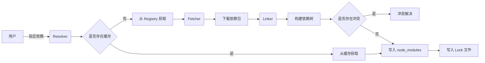

# Yarn 原理与代码实例讲解

## 1.背景介绍
### 1.1 Yarn 诞生背景
### 1.2 Yarn 在前端工程化中的地位
### 1.3 Yarn 与 npm 的异同点

## 2.核心概念与联系
### 2.1 包管理器的核心概念
#### 2.1.1 依赖管理
#### 2.1.2 版本控制
#### 2.1.3 脚本执行
### 2.2 Yarn 的核心组件
#### 2.2.1 Resolver
#### 2.2.2 Fetcher 
#### 2.2.3 Linker
### 2.3 Yarn 与其他工具的关系
#### 2.3.1 Yarn 与 npm
#### 2.3.2 Yarn 与 pnpm
#### 2.3.3 Yarn 与 Lerna

## 3.核心算法原理具体操作步骤
### 3.1 依赖解析算法
#### 3.1.1 依赖树构建
#### 3.1.2 版本冲突解决
#### 3.1.3 扁平化 node_modules
### 3.2 缓存机制
#### 3.2.1 本地缓存
#### 3.2.2 全局缓存
#### 3.2.3 缓存失效与更新
### 3.3 Plug'n'Play 原理
#### 3.3.1 传统 node_modules 问题
#### 3.3.2 PnP 的解决方案
#### 3.3.3 PnP 的优缺点

## 4.数学模型和公式详细讲解举例说明
### 4.1 语义化版本控制
#### 4.1.1 版本号格式
#### 4.1.2 版本范围表示
#### 4.1.3 版本优先级计算
### 4.2 依赖图的数学表示  
#### 4.2.1 有向无环图 DAG
#### 4.2.2 邻接表与邻接矩阵
#### 4.2.3 拓扑排序算法

## 5.项目实践：代码实例和详细解释说明
### 5.1 常用命令示例
#### 5.1.1 yarn init
#### 5.1.2 yarn add
#### 5.1.3 yarn remove 
#### 5.1.4 yarn upgrade
### 5.2 配置文件详解
#### 5.2.1 package.json
#### 5.2.2 yarn.lock
#### 5.2.3 .yarnrc
### 5.3 自定义脚本
#### 5.3.1 定义脚本
#### 5.3.2 传递参数
#### 5.3.3 串行与并行
### 5.4 Monorepo 项目管理
#### 5.4.1 Workspace 配置
#### 5.4.2 子项目依赖管理
#### 5.4.3 统一构建发布

## 6.实际应用场景
### 6.1 项目初始化
### 6.2 日常开发
### 6.3 持续集成
### 6.4 生产部署

## 7.工具和资源推荐 
### 7.1 常用插件
### 7.2 CI/CD 工具集成
### 7.3 学习资源

## 8.总结：未来发展趋势与挑战
### 8.1 Yarn 2 新特性
### 8.2 包管理器的发展方向 
### 8.3 面临的挑战

## 9.附录：常见问题与解答
### 9.1 如何处理 Yarn 与 npm 共存的情况？
### 9.2 Lock 文件的作用是什么？
### 9.3 Yarn 安装速度慢怎么办？
### 9.4 如何选择适合自己项目的包管理工具？

Yarn 是现代化的 JavaScript 项目标准的包管理工具。它提供了速度、安全性和一致性方面的诸多优势，已成为前端工程化不可或缺的利器。本文将深入剖析 Yarn 的原理，结合代码实例讲解其核心概念和实践应用。

Yarn 诞生于 npm 饱受诟病的年代。npm 存在安装速度慢、版本不一致等问题。Facebook 在 2016 年发布了 Yarn，旨在解决 npm 的痛点，提供更优秀的包管理方案。如今 Yarn 已被广泛应用于各种规模的项目中。

包管理的核心职责包括依赖管理、版本控制和脚本执行。Yarn 围绕这些职责设计了 Resolver、Fetcher、Linker 等组件。Resolver 负责解析依赖关系，处理版本冲突；Fetcher 负责从远程仓库获取依赖包；Linker 负责将依赖包链接到本地目录。

在依赖解析过程中，Yarn 采用了高效的算法来构建依赖树，并解决潜在的版本冲突。同时，Yarn 还引入了离线镜像缓存，极大提升了安装速度和稳定性。

语义化版本控制是 Yarn 进行版本管理的基础。版本号由主版本号、次版本号和修订号组成，通过 semver 规范定义了版本的优先级。在实际项目中，我们通过 package.json 文件声明依赖，并使用 add/upgrade 等命令安装和升级依赖包。

Yarn 提供了灵活的脚本执行能力，可在 package.json 中自定义各种脚本，并通过 run 命令执行。这为项目的构建、测试和部署提供了统一的入口。

除了基本的单项目管理，Yarn 还支持 Monorepo 的多项目管理模式。通过 Workspace 机制，可在一个仓库中组织多个相关联的子项目，统一管理依赖和构建流程。

综上所述，Yarn 凭借其先进的设计理念和优秀的性能表现，已成为现代 JavaScript 项目的首选包管理方案。展望未来，Yarn 2 引入了 PnP 等新特性，进一步优化了性能和开发体验。面对日益复杂的前端生态，包管理工具还需要在易用性、性能和功能方面持续创新，为开发者提供更加智能化的服务。

作者：禅与计算机程序设计艺术 / Zen and the Art of Computer Programming