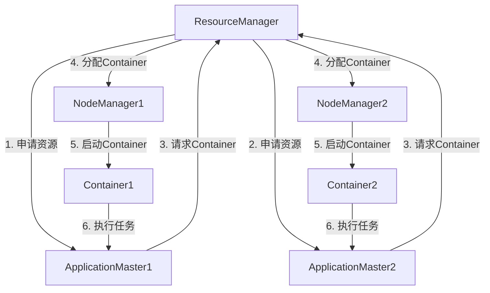

# 【AI大数据计算原理与代码实例讲解】ApplicationMaster

## 1. 背景介绍

在当今大数据时代,数据的规模和复杂性都呈现出前所未有的增长趋势。为了有效地处理和分析这些海量数据,Apache Hadoop生态系统应运而生,成为了大数据处理的核心基础设施之一。在Hadoop生态系统中,YARN (Yet Another Resource Negotiator)作为一个资源管理和调度框架,负责管理整个集群的计算资源,并为各种类型的应用程序提供服务。而ApplicationMaster则是YARN中的一个关键组件,负责监控和管理应用程序的生命周期。

## 2. 核心概念与联系

### 2.1 YARN架构

YARN的架构主要由ResourceManager、NodeManager、ApplicationMaster和Container等组件组成。其中:

- **ResourceManager(RM)**: 集群资源管理和调度的总控制器,负责监控可用资源、调度应用程序并分配资源。
- **NodeManager(NM)**: 运行在每个节点上的代理,负责管理节点上的资源并监控容器的运行状态。
- **ApplicationMaster(AM)**: 为每个应用程序进程分配一个AM实例,负责与RM协商获取资源,并监控应用程序的执行。
- **Container**: 资源抽象的单位,封装了CPU、内存等多种资源,用于运行应用程序的任务。



### 2.2 ApplicationMaster职责

ApplicationMaster作为应用程序的"大脑",负责管理整个应用程序的生命周期,主要职责包括:

1. **资源协商**: 与ResourceManager协商,获取运行应用程序所需的资源(CPU、内存等)。
2. **任务调度**: 根据应用程序的需求,将任务分发到分配的Container中执行。
3. **容错处理**: 监控任务的执行状态,自动重新调度失败的任务。
4. **进度监控**: 跟踪应用程序的整体执行进度,并将进度信息报告给ResourceManager。
5. **日志管理**: 收集和管理应用程序的日志信息。

## 3. 核心算法原理具体操作步骤

ApplicationMaster的核心算法主要包括资源协商算法和任务调度算法,具体操作步骤如下:

### 3.1 资源协商算法

ApplicationMaster通过与ResourceManager进行资源协商,获取运行应用程序所需的资源。资源协商算法的主要步骤如下:

1. **启动ApplicationMaster**: ResourceManager为应用程序分配一个Container,并在其中启动ApplicationMaster进程。

2. **注册ApplicationMaster**: ApplicationMaster向ResourceManager注册自身,获取应用程序的上下文信息。

3. **资源请求**: ApplicationMaster根据应用程序的需求,向ResourceManager发送资源请求。

4. **资源分配**: ResourceManager根据集群的资源状况和调度策略,为ApplicationMaster分配所需的资源(Container)。

5. **资源使用**: ApplicationMaster在分配的Container中启动任务,利用分配的资源执行应用程序。

6. **资源释放**: 当任务执行完毕或出现异常时,ApplicationMaster将不再使用的资源释放回ResourceManager。

7. **应用程序完成**: 当所有任务执行完毕后,ApplicationMaster向ResourceManager报告应用程序已完成,并退出。

### 3.2 任务调度算法

ApplicationMaster需要将应用程序的任务合理地分发到分配的Container中执行。任务调度算法的主要步骤如下:

1. **任务划分**: 将应用程序划分为多个任务,每个任务都可以独立执行。

2. **资源评估**: 评估每个任务所需的资源(CPU、内存等),以便合理地分配资源。

3. **优先级排序**: 根据任务的优先级、数据局部性等因素,对待执行的任务进行排序。

4. **资源匹配**: 将排序后的任务与可用的Container进行匹配,将任务分发到合适的Container中执行。

5. **容错处理**: 监控任务的执行状态,如果发现任务失败,则自动重新调度该任务。

6. **进度跟踪**: 跟踪应用程序的整体执行进度,并将进度信息报告给ResourceManager。

7. **动态调整**: 根据应用程序的实际运行情况,动态调整资源分配和任务调度策略。

## 4. 数学模型和公式详细讲解举例说明

在任务调度过程中,ApplicationMaster需要考虑多种因素,如任务优先级、数据局部性、资源利用率等,以实现高效的资源利用和任务执行。下面我们将介绍一些常用的数学模型和公式,用于指导任务调度决策。

### 4.1 任务优先级模型

我们可以为每个任务分配一个优先级值,用于指导任务的执行顺序。优先级值可以根据多种因素计算,例如任务的重要性、紧急程度、依赖关系等。

设任务$t_i$的优先级为$p_i$,我们可以使用加权求和的方式计算优先级值:

$$p_i = \sum_{j=1}^{n} w_j \cdot f_j(t_i)$$

其中:
- $n$是考虑的因素个数
- $w_j$是第$j$个因素的权重,满足$\sum_{j=1}^{n} w_j = 1$
- $f_j(t_i)$是第$j$个因素对于任务$t_i$的评分函数

例如,我们可以将任务的重要性作为一个因素,并设置相应的权重和评分函数。对于紧急任务,可以给予较高的重要性评分,从而提高其优先级值。

### 4.2 数据局部性模型

在大数据场景下,数据通常是分布式存储的,因此任务的执行位置对于数据传输开销有很大影响。我们可以使用数据局部性模型来评估将任务分配到某个节点执行时的数据传输开销。

设任务$t_i$需要访问的数据块集合为$D_i$,节点$n_j$上存储的数据块集合为$S_j$,我们可以定义数据局部性评分函数如下:

$$l(t_i, n_j) = \frac{|D_i \cap S_j|}{|D_i|}$$

该函数表示将任务$t_i$分配到节点$n_j$执行时,可以直接访问的数据块占所需数据块的比例。数据局部性评分越高,意味着数据传输开销越小,执行效率越高。

在任务调度过程中,ApplicationMaster可以优先将任务分配到数据局部性评分较高的节点上,以减少数据传输开销。

### 4.3 资源利用率模型

为了提高集群资源的利用率,ApplicationMaster需要合理地将任务分配到不同的节点上执行,避免出现资源浪费的情况。我们可以使用资源利用率模型来评估将任务分配到某个节点执行时的资源利用情况。

设节点$n_j$的可用CPU资源为$c_j$,可用内存资源为$m_j$,任务$t_i$所需的CPU资源为$c_i$,所需的内存资源为$m_i$,我们可以定义资源利用率评分函数如下:

$$u(t_i, n_j) = \alpha \cdot \frac{c_i}{c_j} + \beta \cdot \frac{m_i}{m_j}$$

其中$\alpha$和$\beta$是CPU资源和内存资源的权重系数,满足$\alpha + \beta = 1$。

该函数表示将任务$t_i$分配到节点$n_j$执行时,对CPU资源和内存资源的利用率。资源利用率评分越高,意味着资源利用越充分,集群资源利用率越高。

在任务调度过程中,ApplicationMaster可以优先将任务分配到资源利用率评分较高的节点上,以提高集群资源的利用效率。

通过综合考虑任务优先级、数据局部性和资源利用率等多个因素,ApplicationMaster可以做出更加合理的任务调度决策,提高应用程序的执行效率和资源利用率。

## 5. 项目实践:代码实例和详细解释说明

为了更好地理解ApplicationMaster的工作原理,我们将通过一个简单的示例项目来进行实践。该项目使用Apache Hadoop YARN框架,实现一个简单的WordCount应用程序。

### 5.1 项目结构

```
wordcount-yarn/
├── pom.xml
├── src/
│   ├── main/
│   │   ├── java/
│   │   │   └── com/
│   │   │       └── example/
│   │   │           ├── WordCount.java
│   │   │           ├── WordCountMapper.java
│   │   │           ├── WordCountReducer.java
│   │   │           └── WordCountAM.java
│   │   └── resources/
│   │       └── log4j.properties
│   └── test/
│       └── java/
│           └── com/
│               └── example/
│                   └── WordCountTest.java
└── README.md
```

该项目使用Maven进行构建,主要包含以下几个核心类:

- `WordCount.java`: 应用程序的入口点,用于提交YARN作业。
- `WordCountMapper.java`: MapReduce作业的Mapper类,用于对输入数据进行单词统计。
- `WordCountReducer.java`: MapReduce作业的Reducer类,用于合并Mapper的输出结果。
- `WordCountAM.java`: 自定义的ApplicationMaster实现类,用于管理WordCount应用程序的生命周期。

### 5.2 ApplicationMaster实现

我们将重点关注`WordCountAM`类的实现,该类继承自`ApplicationMaster`抽象类,并覆盖了几个核心方法。

#### 5.2.1 初始化

在`init`方法中,我们需要获取应用程序的配置信息和上下文信息,并初始化一些必要的变量。

```java
@Override
public void init(String[] strings) {
    conf = new YarnConfiguration();
    fs = FileSystem.get(conf);
    appAttemptId = ApplicationAttemptId.fromString(strings[0]);
    appContext = ApplicationMasterServiceUtil.createApplicationContext(conf, appAttemptId);
}
```

#### 5.2.2 资源协商

在`start`方法中,我们需要向ResourceManager请求资源,并启动ApplicationMaster的主循环。

```java
@Override
public void start() {
    // 向ResourceManager注册ApplicationMaster
    RegisterApplicationMasterResponse response = registerApplicationMaster();

    // 获取最大可用资源
    Resource maxResource = response.getMaximumResourceCapability();

    // 请求Container资源
    for (int i = 0; i < numContainers; i++) {
        ContainerRequest containerRequest = new ContainerRequest(
                maxResource, null, null, RM_REQUEST_PRIORITY);
        amRmClient.addContainerRequest(containerRequest);
    }

    // 启动ApplicationMaster主循环
    runApplicationMasterLoop();
}
```

在主循环中,我们会不断检查是否有新的Container资源分配,并启动相应的任务。

```java
private void runApplicationMasterLoop() {
    while (!done) {
        AllocateResponse allocateResponse = sendContainerRequest();
        List<Container> newContainers = allocateResponse.getAllocatedContainers();
        if (!newContainers.isEmpty()) {
            // 启动新的Container
            for (Container container : newContainers) {
                launchContainer(container);
            }
        }
        // 处理其他逻辑...
    }
}
```

#### 5.2.3 任务调度

在`launchContainer`方法中,我们需要为分配的Container启动相应的任务。在WordCount应用程序中,我们将启动一个MapReduce任务。

```java
private void launchContainer(Container container) {
    ContainerLaunchContext ctx = ContainerLaunchContext.newInstance(
            null, null, null, null, null, null);

    // 设置MapReduce任务的命令行参数
    String command = "$JAVA_HOME/bin/java"
            + " -Xmx256M"
            + " com.example.WordCount"
            + " /input/data.txt"
            + " /output";
    ctx.setCommands(Collections.singletonList(command));

    // 启动Container
    nmClient.startContainerAsync(container, ctx);
}
```

在实际应用中,ApplicationMaster还需要实现更加复杂的任务调度算法,例如考虑任务优先级、数据局部性和资源利用率等因素。

#### 5.2