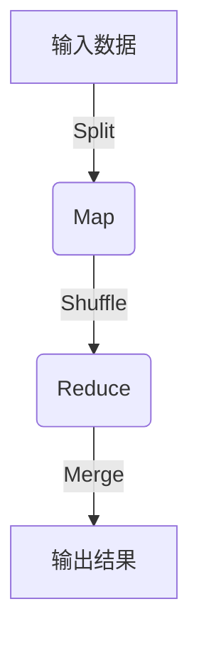
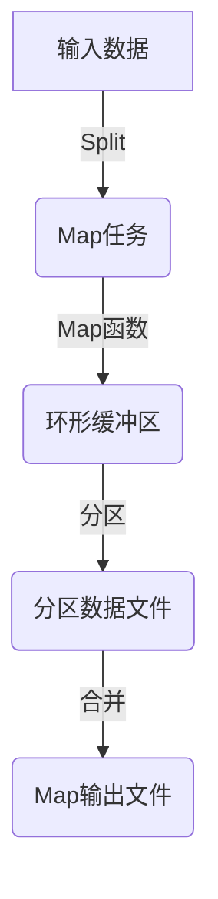
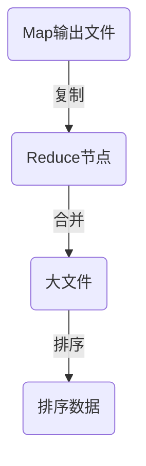
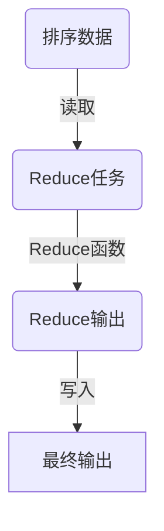

# 【AI大数据计算原理与代码实例讲解】MapReduce

## 1.背景介绍

### 1.1 大数据时代的到来

在当今时代,随着互联网、移动设备和物联网的快速发展,海量的数据正以前所未有的规模和速度被产生。这些数据来自于各种来源,如社交媒体、在线交易、物联网传感器等。传统的数据处理方式已经无法有效地处理如此庞大的数据量。因此,大数据技术应运而生,以解决存储、管理和分析这些海量数据的挑战。

### 1.2 大数据处理的挑战

大数据处理面临着诸多挑战,包括:

1. **数据量大**:需要处理PB级别的海量数据
2. **数据种类多**:需要处理结构化、半结构化和非结构化数据
3. **处理速度快**:需要实时或近实时处理数据
4. **数据价值密度低**:有价值的数据占比很小

传统的数据处理系统无法满足这些挑战,因此需要一种全新的计算模型来解决大数据处理问题。

### 1.3 MapReduce的诞生

MapReduce是一种分布式计算模型,由Google于2004年提出,用于在大规模计算集群上并行处理大数据。它将计算过程分为两个阶段:Map(映射)和Reduce(归约),从而将一个复杂的计算任务分解为多个相对简单的子任务,并行执行在多台机器上,最后将结果合并。MapReduce的出现极大地简化了大数据处理的复杂性,成为大数据处理的事实标准。

## 2.核心概念与联系

### 2.1 MapReduce计算模型概述

MapReduce计算模型由两个主要函数组成:Map和Reduce。

1. **Map函数**:将输入数据集拆分为多个小块,并对每个小块数据执行用户自定义的Map操作,生成中间键值对数据。
2. **Reduce函数**:对Map阶段生成的中间数据进行合并,对具有相同键的值进行用户自定义的Reduce操作,生成最终结果。



### 2.2 MapReduce数据流程

MapReduce作业的执行过程如下:

1. **Split**:输入数据集被拆分为多个数据块
2. **Map**:每个Map任务处理一个数据块,生成键值对数据
3. **Shuffle**:将Map输出的数据按键值对分组,分发到不同的Reduce任务
4. **Reduce**:每个Reduce任务处理一组键值对数据,执行用户自定义的Reduce操作
5. **Merge**:将Reduce输出的结果合并,生成最终输出


### 2.3 MapReduce优势

MapReduce具有以下优势:

1. **高度并行化**:可以在大量廉价机器上并行执行
2. **容错性强**:可以自动处理机器故障
3. **可扩展性好**:可以通过增加机器来线性扩展计算能力
4. **简单编程模型**:开发人员只需关注Map和Reduce函数的实现

## 3.核心算法原理具体操作步骤  

### 3.1 Map阶段

Map阶段的主要步骤如下:

1. **输入拆分**:输入数据集被拆分为固定大小的数据块(通常为64MB)
2. **Map任务调度**:MapReduce框架为每个数据块分配一个Map任务,并将任务分发到集群中的工作节点上执行
3. **用户自定义Map函数执行**:每个Map任务读取对应的数据块,执行用户自定义的Map函数,生成键值对数据
4. **环形缓冲区**:Map输出的键值对数据先存储在内存的环形缓冲区中
5. **分区**:当环形缓冲区达到一定阈值时,数据会按照分区函数进行分区,生成分区数据文件
6. **合并**:对同一个分区内的数据进行合并,生成最终的Map输出文件



### 3.2 Shuffle阶段

Shuffle阶段的主要步骤如下:

1. **Map输出复制**:将Map输出文件复制到Reduce任务所在的节点
2. **合并**:对同一个Reduce任务的所有Map输出进行合并,生成一个大文件
3. **排序**:对合并后的数据按键进行排序,为Reduce阶段做准备



### 3.3 Reduce阶段

Reduce阶段的主要步骤如下:

1. **Reduce任务调度**:MapReduce框架为每个Reduce任务分配一个工作节点
2. **用户自定义Reduce函数执行**:每个Reduce任务读取对应的排序数据,执行用户自定义的Reduce函数,生成最终结果
3. **输出**:Reduce输出的结果被写入HDFS或其他存储系统



## 4.数学模型和公式详细讲解举例说明

MapReduce的数学模型可以用以下公式表示:

$$
\begin{align*}
\text{Map} &: (k_1, v_1) \rightarrow \text{list}(k_2, v_2) \\
\text{Reduce} &: (k_2, \text{list}(v_2)) \rightarrow \text{list}(v_3)
\end{align*}
$$

其中:

- $(k_1, v_1)$表示Map输入的键值对
- $\text{list}(k_2, v_2)$表示Map输出的中间键值对列表
- $(k_2, \text{list}(v_2))$表示Reduce输入的键值对,其中值是一个列表
- $\text{list}(v_3)$表示Reduce输出的结果列表

让我们以单词计数为例,来详细解释MapReduce的数学模型:

1. **Map阶段**:
   - 输入: $(doc_id, \text{document})$
   - Map函数: $\text{Map}(doc_id, \text{document}) \rightarrow \text{list}(word, 1)$
   - 输出: $\text{list}(word, 1)$

   在Map阶段,输入是文档ID和文档内容的键值对。Map函数将文档拆分为单词,并为每个单词生成一个$(word, 1)$的键值对,表示该单词出现了一次。

2. **Reduce阶段**:
   - 输入: $(word, \text{list}(1, 1, \ldots, 1))$
   - Reduce函数: $\text{Reduce}(word, \text{list}(1, 1, \ldots, 1)) \rightarrow \text{list}(word, count)$
   - 输出: $\text{list}(word, count)$

   在Reduce阶段,输入是单词和一个包含多个1的列表,表示该单词在不同文档中出现的次数。Reduce函数对列表中的1进行求和,得到该单词的总计数,生成$(word, count)$的键值对作为输出。

通过这个示例,我们可以看到MapReduce如何将复杂的单词计数任务分解为简单的Map和Reduce操作,并行执行在多台机器上,从而实现高效的大数据处理。

## 5.项目实践:代码实例和详细解释说明

### 5.1 Python实现WordCount

下面是使用Python实现WordCount的代码示例,基于Apache Hadoop MapReduce框架:

```python
# mapper.py
import sys

# Map函数
for line in sys.stdin:
    line = line.strip()
    words = line.split()
    for word in words:
        print(f"{word}\t1")

# reducer.py
import sys

current_word = None
current_count = 0
word = None

# Reduce函数
for line in sys.stdin:
    line = line.strip()
    word, count = line.split("\t", 1)
    count = int(count)

    if current_word == word:
        current_count += count
    else:
        if current_word:
            print(f"{current_word}\t{current_count}")
        current_count = count
        current_word = word

if current_word == word:
    print(f"{current_word}\t{current_count}")
```

**代码解释**:

1. `mapper.py`实现Map函数:
   - 读取标准输入的每一行文本
   - 将每一行拆分为单词
   - 为每个单词输出一个`(word, 1)`的键值对

2. `reducer.py`实现Reduce函数:
   - 读取标准输入的每一行键值对
   - 将具有相同键(单词)的值(计数)累加
   - 输出`(word, total_count)`的键值对

**运行方式**:

1. 将输入数据存储在HDFS上,例如`/user/input/data.txt`
2. 运行MapReduce作业:

```bash
hadoop jar /path/to/hadoop-streaming.jar \
    -files mapper.py,reducer.py \
    -mapper mapper.py \
    -reducer reducer.py \
    -input /user/input/data.txt \
    -output /user/output
```

3. 查看输出结果:

```bash
hdfs dfs -cat /user/output/part-00000
```

通过这个示例,你可以了解如何使用Python编写MapReduce程序,并在Hadoop集群上运行WordCount作业。

### 5.2 Java实现WordCount

下面是使用Java实现WordCount的代码示例,基于Apache Hadoop MapReduce框架:

```java
// WordCount.java
import java.io.IOException;
import org.apache.hadoop.conf.Configuration;
import org.apache.hadoop.fs.Path;
import org.apache.hadoop.io.IntWritable;
import org.apache.hadoop.io.Text;
import org.apache.hadoop.mapreduce.Job;
import org.apache.hadoop.mapreduce.Mapper;
import org.apache.hadoop.mapreduce.Reducer;
import org.apache.hadoop.mapreduce.lib.input.FileInputFormat;
import org.apache.hadoop.mapreduce.lib.output.FileOutputFormat;

public class WordCount {

    // Map类
    public static class TokenizerMapper extends Mapper<Object, Text, Text, IntWritable> {
        private final static IntWritable one = new IntWritable(1);
        private Text word = new Text();

        public void map(Object key, Text value, Context context) throws IOException, InterruptedException {
            String[] tokens = value.toString().split("\\s+");
            for (String token : tokens) {
                word.set(token);
                context.write(word, one);
            }
        }
    }

    // Reduce类
    public static class IntSumReducer extends Reducer<Text, IntWritable, Text, IntWritable> {
        private IntWritable result = new IntWritable();

        public void reduce(Text key, Iterable<IntWritable> values, Context context)
                throws IOException, InterruptedException {
            int sum = 0;
            for (IntWritable val : values) {
                sum += val.get();
            }
            result.set(sum);
            context.write(key, result);
        }
    }

    public static void main(String[] args) throws Exception {
        Configuration conf = new Configuration();
        Job job = Job.getInstance(conf, "word count");
        job.setJarByClass(WordCount.class);
        job.setMapperClass(TokenizerMapper.class);
        job.setCombinerClass(IntSumReducer.class);
        job.setReducerClass(IntSumReducer.class);
        job.setOutputKeyClass(Text.class);
        job.setOutputValueClass(IntWritable.class);
        FileInputFormat.addInputPath(job, new Path(args[0]));
        FileOutputFormat.setOutputPath(job, new Path(args[1]));
        System.exit(job.waitForCompletion(true) ? 0 : 1);
    }
}
```

**代码解释**:

1. `TokenizerMapper`类实现Map函数:
   - 将输入文本拆分为单词
   - 为每个单词输出一个`(word, 1)`的键值对

2. `IntSumReducer`类实现Reduce函数:
   - 将具有相同键(单词)的值(计数)累加
   - 输出`(word, total_count)`的键值对

3. `main`方法设置MapReduce作业的配置和参数

**运行方式**:

1. 将输入数据存储在HDFS上,例如`/user/input/data.txt`
2. 编译Java代码,生成JAR文件
3. 运行MapReduce作业:

```bash
hadoop jar /path/to/wordcount.jar WordCount /user/input/data.txt /user/output
```

4. 查看输出结果:

```bash
hdfs dfs -cat /user/output/part