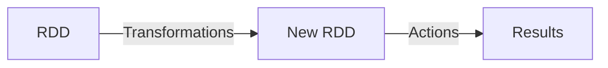

# 【AI大数据计算原理与代码实例讲解】Spark

## 1. 背景介绍
在大数据时代，数据的爆炸式增长对计算框架提出了前所未有的挑战。Apache Spark，作为一种内存计算框架，应运而生，它以其高效的分布式数据处理能力在业界获得了广泛的认可。Spark不仅能够处理批量数据，还能够进行流处理、图计算和机器学习等多种计算任务，是现代大数据处理的重要工具之一。

## 2. 核心概念与联系
Spark的核心概念包括弹性分布式数据集（RDD）、Directed Acyclic Graph（DAG）、Transformations和Actions等。RDD是Spark的基石，它是一个不可变的分布式数据集合，能够在内存中进行计算。DAG是Spark中任务调度的基础，它记录了RDD之间的依赖关系。Transformations是对RDD的转换操作，而Actions则是触发计算的操作。



## 3. 核心算法原理具体操作步骤
Spark的核心算法原理是基于RDD的不可变性和DAG的任务调度机制。具体操作步骤包括：创建RDD、对RDD进行Transformations操作、通过Actions操作获取计算结果。在这个过程中，Spark会优化计算过程，减少数据的移动，提高整体的计算效率。

## 4. 数学模型和公式详细讲解举例说明
Spark的计算可以用数学模型来表达。例如，MapReduce模型是Spark中常用的计算模型之一，它包括两个主要的函数：Map函数和Reduce函数。Map函数对数据集中的每个元素进行转换，而Reduce函数则是对Map函数的输出进行合并。

$$
\text{Map}: x \rightarrow f(x) \\
\text{Reduce}: \{f(x_1), f(x_2), ..., f(x_n)\} \rightarrow g(f(x_1), f(x_2), ..., f(x_n))
$$

## 5. 项目实践：代码实例和详细解释说明
在项目实践中，我们将通过一个简单的Word Count示例来展示Spark的使用。代码如下：

```scala
val textFile = spark.read.textFile("hdfs://...")
val counts = textFile.flatMap(line => line.split(" "))
                     .map(word => (word, 1))
                     .reduceByKey(_ + _)
counts.saveAsTextFile("hdfs://...")
```

这段代码首先从HDFS读取文本文件，然后使用flatMap和map函数进行单词拆分和计数，最后通过reduceByKey函数进行单词计数的累加，并将结果保存回HDFS。

## 6. 实际应用场景
Spark在多个领域都有广泛的应用，包括实时数据分析、机器学习、图计算等。例如，在金融领域，Spark可以用于实时交易分析；在电商领域，Spark可以用于推荐系统的构建。

## 7. 工具和资源推荐
为了更好地使用Spark，以下是一些推荐的工具和资源：
- Apache Spark官方文档
- Databricks社区版（免费的Spark集群）
- Spark Summit会议视频和资料
- 相关书籍，如《Learning Spark》和《Advanced Analytics with Spark》

## 8. 总结：未来发展趋势与挑战
Spark作为一个成熟的大数据处理框架，未来的发展趋势将更加注重性能优化、易用性提升以及生态系统的完善。同时，随着数据规模的不断扩大，如何进一步提高计算效率、降低资源消耗将是Spark面临的主要挑战。

## 9. 附录：常见问题与解答
Q1: Spark和Hadoop的区别是什么？
A1: Spark是基于内存计算的，而Hadoop MapReduce是基于磁盘的计算。Spark在处理速度上比Hadoop MapReduce快很多。

Q2: Spark如何保证数据的容错性？
A2: Spark通过RDD的不可变性和DAG的任务调度机制来保证数据的容错性。当某个节点失败时，Spark可以重新计算丢失的数据分区。

Q3: Spark是否支持SQL查询？
A3: 是的，Spark提供了Spark SQL模块，可以让用户使用SQL语句进行数据查询。

作者：禅与计算机程序设计艺术 / Zen and the Art of Computer Programming