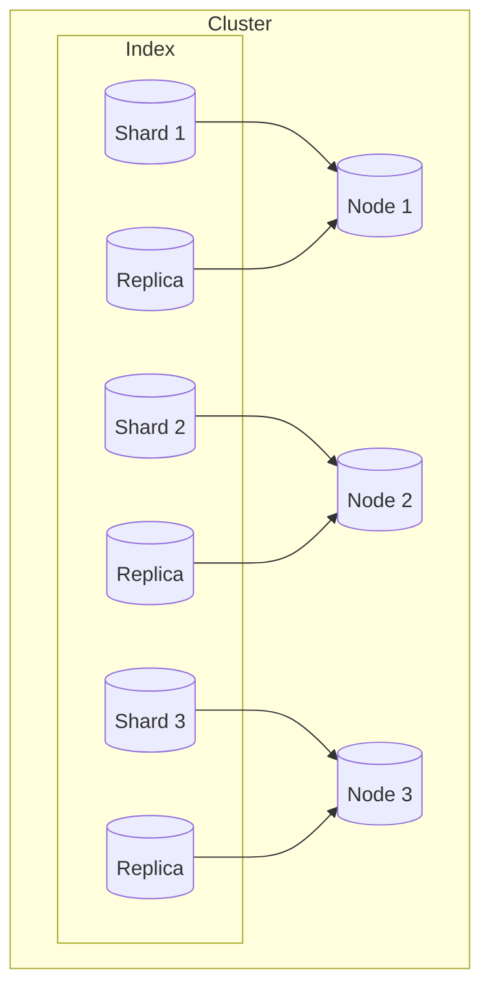

# 【AI大数据计算原理与代码实例讲解】分布式搜索

## 1.背景介绍

### 1.1 大数据时代的到来

在当今时代,随着互联网、物联网、云计算等新兴技术的迅猛发展,数据量呈现爆炸式增长。根据国际数据公司(IDC)的预测,到2025年,全球数据总量将达到175ZB(1ZB=1万亿TB)。这些海量数据来自于各个领域,包括社交媒体、电子商务、物联网设备等。传统的集中式数据处理和存储方式已经无法满足当前大数据应用的需求,因此分布式系统应运而生。

### 1.2 分布式系统的重要性

分布式系统是指将单一的任务分解为多个子任务,并将这些子任务分配到多台计算机上并行执行,最终汇总结果的系统。相比集中式系统,分布式系统具有以下优势:

1. **高可扩展性**: 可以通过增加计算节点来线性扩展系统的计算能力和存储容量。
2. **高可用性**: 单个节点发生故障不会导致整个系统瘫痪。
3. **负载均衡**: 可以将计算任务均匀分配到各个节点,避免单点过载。

分布式系统已广泛应用于大数据处理、搜索引擎、推荐系统、内容分发网络等领域。其中,分布式搜索引擎是大数据时代不可或缺的核心基础设施。

### 1.3 分布式搜索引擎概述

分布式搜索引擎是一种能够高效处理海量数据的搜索系统,它将数据分散存储在多台服务器上,并通过分布式索引和查询等技术实现快速搜索。常见的分布式搜索引擎包括Elasticsearch、Solr、Sphinx等。

本文将重点介绍Elasticsearch,它是目前最流行的开源分布式搜索和分析引擎之一。Elasticsearch基于Lucene构建,提供了分布式多租户能力、分布式实时文件存储能力,并支持PB级别的结构化或非结构化数据的快速搜索和分析。

## 2.核心概念与联系

在深入探讨分布式搜索引擎的原理和实现之前,我们需要先了解一些核心概念及其相互关系。

### 2.1 倒排索引(Inverted Index)

倒排索引是文档搜索系统中最核心、最基本的数据结构。与其他数据结构不同,倒排索引是通过文档中的"单词"和"单词所在文档的地址"两个维度来进行索引的。

以下是一个简单的倒排索引示例:

```
Term    Doc_ID
---------------
大数据    1, 2
分布式    1, 3
搜索     2, 3
引擎     2, 3
```

可以看出,倒排索引能够快速定位某个单词在哪些文档中出现过。这种索引结构非常高效,是分布式搜索引擎的基石。

### 2.2 文档(Document)

在搜索引擎中,文档是指被索引和搜索的基本数据单元,通常是结构化的文本文件,如网页、电子邮件、PDF等。每个文档都会被赋予一个唯一的ID。

### 2.3 分片(Shard)

由于单个节点的资源是有限的,无法存储全部数据,因此需要将全部数据切分为多个分片(Shard),分布在不同的节点上。分片的概念不仅能提高系统的可扩展性,还能提高系统的容错性和高可用性。

### 2.4 副本(Replica)

为了防止分片发生故障导致部分数据无法访问,我们可以为每个分片创建多个副本(Replica),副本会自动进行数据同步,从而保证高可用性。



上图展示了一个Elasticsearch集群,包含3个节点,每个索引被分为3个主分片,并为每个主分片创建了一个副本分片,副本分片分布在其他节点上。

## 3.核心算法原理具体操作步骤

### 3.1 数据索引

在分布式搜索引擎中,首先需要将数据文档进行索引,以构建倒排索引。索引的过程包括以下几个步骤:

1. **文本分析(Text Analysis)**: 将文档内容转换为一个个词条(Term),包括分词、去除停用词、大小写转换等。
2. **创建倒排索引**: 遍历每个词条,为其创建一个倒排索引项,记录该词条出现在哪些文档中。
3. **分片和副本**: 将倒排索引切分为多个分片,并为每个分片创建副本分布在不同节点上。

### 3.2 数据查询

当用户发起一个查询请求时,分布式搜索引擎需要高效地从海量数据中检索出与查询相关的文档。查询的步骤如下:

1. **查询解析**: 将查询字符串解析为查询对象,确定查询类型(如全文查询、短语查询等)。
2. **查询重写**: 对查询对象进行规范化和优化,如查询重写、查询分析等。
3. **分布式查询**: 将查询请求分发到各个分片上,分布式地执行查询。
4. **相关性算分**: 对检索出的文档进行相关性评分,根据评分结果排序。
5. **查询合并**: 将各个分片的查询结果进行合并,得到全局有序的查询结果集。

### 3.3 相关性算分

相关性算分是分布式搜索引擎的核心功能,它决定了查询结果的排序质量。Elasticsearch使用基于TF-IDF的BM25算法进行相关性算分,该算法考虑了以下几个因素:

- **词频(Term Frequency)**: 词条在文档中出现的频率。
- **反向文档频率(Inverse Document Frequency)**: 词条在整个文档集中的稀有程度。
- **字段长度规范化**: 较长的文档不应该比较短的文档得分高。
- **查询子句贡献度**: 不同的查询子句对最终得分的贡献不同。

BM25算法的具体公式如下:

$$
\mathrm{Score}(D, Q) = \sum_{q \in Q} \mathrm{IDF}(q) \cdot \frac{f(q, D) \cdot (k_1 + 1)}{f(q, D) + k_1 \cdot (1 - b + b \cdot \frac{|D|}{avgdl})}
$$

其中:

- $D$ 表示文档
- $Q$ 表示查询
- $q$ 表示查询中的词条
- $f(q, D)$ 表示词条 $q$ 在文档 $D$ 中的词频
- $|D|$ 表示文档 $D$ 的长度
- $avgdl$ 表示文档集的平均长度
- $k_1$ 和 $b$ 是用于调节词频和长度规范化的常量

通过这个公式,我们可以计算出每个文档对于查询的相关性得分,并按得分高低对结果进行排序。

## 4.数学模型和公式详细讲解举例说明

在分布式搜索引擎中,相关性算分是一个非常重要的环节,它决定了查询结果的质量。Elasticsearch使用了基于TF-IDF的BM25算法进行相关性算分,下面我们将详细讲解BM25算法的数学原理和公式。

### 4.1 TF-IDF

TF-IDF(Term Frequency-Inverse Document Frequency)是一种统计方法,用于评估一个词条对于一个文档集或一个语料库的重要程度。TF-IDF由两部分组成:

1. **词频(Term Frequency, TF)**: 词条在文档中出现的频率。一个词条在文档中出现的次数越多,则该词条对该文档的重要性就越高。

   $$
   \mathrm{TF}(t, d) = \frac{f_{t, d}}{\sum_{t' \in d} f_{t', d}}
   $$

   其中 $f_{t, d}$ 表示词条 $t$ 在文档 $d$ 中出现的次数。

2. **反向文档频率(Inverse Document Frequency, IDF)**: 词条在整个文档集中的稀有程度。一个词条在文档集中出现的次数越少,则该词条的区分能力就越强,重要性就越高。

   $$
   \mathrm{IDF}(t, D) = \log \frac{N}{|\{d \in D: t \in d\}|}
   $$

   其中 $N$ 表示文档集 $D$ 中文档的总数,分母表示包含词条 $t$ 的文档数量。

综合 TF 和 IDF,我们可以得到 TF-IDF 公式:

$$
\mathrm{TF\text-IDF}(t, d, D) = \mathrm{TF}(t, d) \cdot \mathrm{IDF}(t, D)
$$

TF-IDF 可以很好地反映一个词条对文档的重要程度。在搜索引擎中,我们可以使用 TF-IDF 来评估一个文档对于查询的相关性。

### 4.2 BM25 算法

BM25 算法是一种基于 TF-IDF 的相关性算分算法,它在 TF-IDF 的基础上引入了一些改进,以更好地适应搜索场景。BM25 算法的公式如下:

$$
\mathrm{Score}(D, Q) = \sum_{q \in Q} \mathrm{IDF}(q) \cdot \frac{f(q, D) \cdot (k_1 + 1)}{f(q, D) + k_1 \cdot (1 - b + b \cdot \frac{|D|}{avgdl})}
$$

其中:

- $D$ 表示文档
- $Q$ 表示查询
- $q$ 表示查询中的词条
- $f(q, D)$ 表示词条 $q$ 在文档 $D$ 中的词频
- $|D|$ 表示文档 $D$ 的长度
- $avgdl$ 表示文档集的平均长度
- $k_1$ 和 $b$ 是用于调节词频和长度规范化的常量,通常取值为 $k_1 = 1.2$, $b = 0.75$

BM25 算法相比 TF-IDF 有以下改进:

1. **词频饱和调节**: 在 TF-IDF 中,词频是线性增长的,但实际上,一个词条在文档中出现的次数超过一定阈值后,对文档的重要性贡献就会趋于饱和。BM25 引入了 $k_1$ 参数来调节这种饱和效应。

2. **长度规范化**: 较长的文档不应该比较短的文档得分高。BM25 引入了 $b$ 参数来对文档长度进行规范化。

3. **查询子句贡献度**: 不同的查询子句对最终得分的贡献不同,BM25 通过 IDF 来体现这种差异。

下面我们通过一个具体的例子来说明 BM25 算法的计算过程。

假设我们有一个包含 3 个文档的文档集,以及一个查询 "大数据 分布式"。文档集的信息如下:

- 文档 1: "大数据时代,分布式系统是解决方案"
- 文档 2: "大数据处理需要分布式架构"
- 文档 3: "云计算和大数据是未来趋势"

我们将计算每个文档对于该查询的相关性得分。

首先,我们需要计算每个词条的 IDF:

- $\mathrm{IDF}(\text{"大数据"}) = \log \frac{3}{3} = 0$
- $\mathrm{IDF}(\text{"分布式"}) = \log \frac{3}{2} = 0.176$

接下来,我们计算每个文档对于每个词条的 TF:

- 文档 1:
  - $\mathrm{TF}(\text{"大数据"}, \text{文档 1}) = \frac{1}{5} = 0.2$
  - $\mathrm{TF}(\text{"分布式"}, \text{文档 1}) = \frac{1}{5} = 0.2$
- 文档 2:
  - $\mathrm{TF}(\text{"