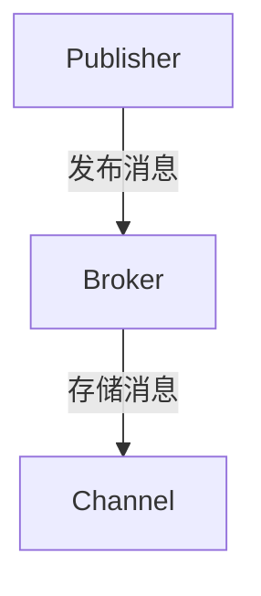
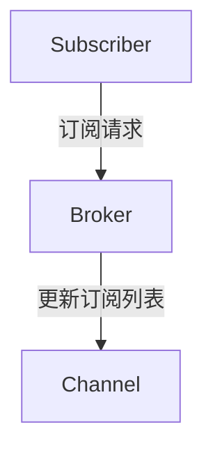
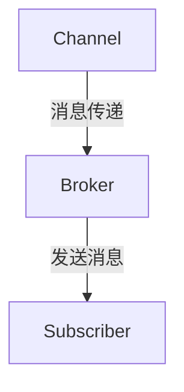
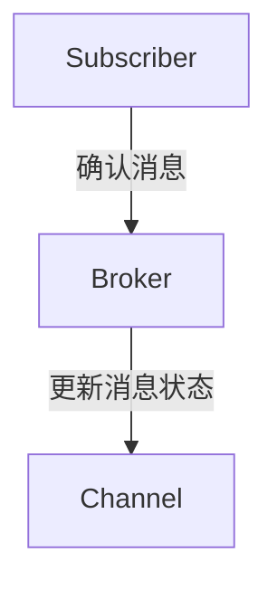

# 【AI大数据计算原理与代码实例讲解】发布订阅

## 1.背景介绍

在现代信息技术的飞速发展中，数据的产生和处理能力达到了前所未有的高度。大数据和人工智能（AI）技术的结合，正在改变各行各业的运作方式。发布订阅（Publish-Subscribe，简称Pub-Sub）模式作为一种高效的数据处理和传输机制，广泛应用于大数据处理和AI系统中。本文将深入探讨发布订阅模式的原理、算法、数学模型、实际应用及其未来发展趋势。

## 2.核心概念与联系

### 2.1 发布订阅模式简介

发布订阅模式是一种消息传递范式，发布者（Publisher）发送消息而不需要知道订阅者（Subscriber）的存在，订阅者接收消息而不需要知道发布者的存在。消息通过一个中间代理（Broker）进行传递。

### 2.2 发布者与订阅者

- **发布者（Publisher）**：负责生成和发送消息。
- **订阅者（Subscriber）**：负责接收和处理消息。
- **代理（Broker）**：负责管理消息的传递，确保消息从发布者到达订阅者。

### 2.3 主题与通道

- **主题（Topic）**：消息的分类标签，订阅者可以订阅特定主题的消息。
- **通道（Channel）**：消息传递的路径，发布者将消息发送到通道，订阅者从通道接收消息。

### 2.4 发布订阅模式的优点

- **解耦**：发布者和订阅者之间的解耦，提高系统的灵活性和可扩展性。
- **扩展性**：支持多发布者和多订阅者，适应大规模分布式系统。
- **异步通信**：支持异步消息传递，提高系统的响应速度和吞吐量。

## 3.核心算法原理具体操作步骤

### 3.1 发布消息

发布者将消息发送到代理，代理根据消息的主题将其存储在相应的通道中。



### 3.2 订阅消息

订阅者向代理注册订阅请求，代理将订阅者添加到相应主题的订阅列表中。



### 3.3 消息传递

代理根据订阅列表，将消息从通道传递给相应的订阅者。



### 3.4 消息确认

订阅者接收到消息后，向代理发送确认消息，代理更新消息状态。



## 4.数学模型和公式详细讲解举例说明

### 4.1 消息传递模型

设 $P$ 为发布者集合，$S$ 为订阅者集合，$T$ 为主题集合，$M$ 为消息集合。消息传递过程可以表示为：

$$
M = \{m_1, m_2, \ldots, m_n\}
$$

每个消息 $m_i$ 具有一个主题 $t_i \in T$，发布者 $p_i \in P$ 发送消息 $m_i$，订阅者 $s_j \in S$ 订阅主题 $t_i$。

### 4.2 消息传递概率

设 $P(m_i \rightarrow s_j)$ 为消息 $m_i$ 传递到订阅者 $s_j$ 的概率，$P(t_i \rightarrow s_j)$ 为主题 $t_i$ 传递到订阅者 $s_j$ 的概率，则有：

$$
P(m_i \rightarrow s_j) = P(t_i \rightarrow s_j) \cdot P(m_i \mid t_i)
$$

其中，$P(m_i \mid t_i)$ 为消息 $m_i$ 属于主题 $t_i$ 的条件概率。

### 4.3 消息确认模型

设 $A(m_i)$ 为消息 $m_i$ 的确认状态，$A(m_i) = 1$ 表示消息已确认，$A(m_i) = 0$ 表示消息未确认。订阅者 $s_j$ 接收到消息 $m_i$ 后，发送确认消息：

$$
A(m_i) = 1 \quad \text{if} \quad s_j \text{ received } m_i
$$

## 5.项目实践：代码实例和详细解释说明

### 5.1 使用Python实现发布订阅模式

以下是一个简单的Python实现，使用`paho-mqtt`库进行消息传递。

#### 5.1.1 安装依赖

```bash
pip install paho-mqtt
```

#### 5.1.2 发布者代码

```python
import paho.mqtt.client as mqtt

def on_publish(client, userdata, mid):
    print("Message Published...")

client = mqtt.Client()
client.on_publish = on_publish
client.connect("broker.hivemq.com", 1883, 60)
client.loop_start()

topic = "test/topic"
message = "Hello, World!"
client.publish(topic, message)
client.loop_stop()
```

#### 5.1.3 订阅者代码

```python
import paho.mqtt.client as mqtt

def on_message(client, userdata, message):
    print(f"Received message: {message.payload.decode()} on topic {message.topic}")

client = mqtt.Client()
client.on_message = on_message
client.connect("broker.hivemq.com", 1883, 60)
client.subscribe("test/topic")
client.loop_forever()
```

### 5.2 代码解释

- **发布者**：连接到MQTT代理，发布消息到指定主题。
- **订阅者**：连接到MQTT代理，订阅指定主题，接收并处理消息。

## 6.实际应用场景

### 6.1 物联网（IoT）

在物联网中，传感器设备作为发布者，发送数据到代理，应用程序作为订阅者，接收并处理数据。例如，智能家居系统中的温度传感器发布温度数据，空调系统订阅并调整温度。

### 6.2 实时数据分析

在金融市场中，股票交易系统作为发布者，发布实时交易数据，分析系统作为订阅者，接收并分析数据，提供实时交易建议。

### 6.3 分布式系统

在分布式系统中，微服务作为发布者和订阅者，通过发布订阅模式进行通信，实现服务之间的解耦和高效数据传递。

## 7.工具和资源推荐

### 7.1 MQTT

MQTT是一种轻量级的发布订阅消息传递协议，适用于物联网和移动应用。推荐使用`paho-mqtt`库进行开发。

### 7.2 Apache Kafka

Kafka是一个分布式流处理平台，支持高吞吐量的消息传递和存储，适用于大规模数据处理和实时分析。

### 7.3 RabbitMQ

RabbitMQ是一个开源的消息代理，支持多种消息传递协议，适用于企业级应用和分布式系统。

## 8.总结：未来发展趋势与挑战

### 8.1 发展趋势

- **边缘计算**：发布订阅模式将在边缘计算中发挥重要作用，实现边缘设备之间的高效通信和数据处理。
- **5G网络**：随着5G网络的普及，发布订阅模式将支持更高的传输速度和更低的延迟，推动物联网和智能城市的发展。
- **AI集成**：发布订阅模式将与AI技术深度融合，实现智能数据处理和自动化决策。

### 8.2 挑战

- **安全性**：确保消息传递的安全性和隐私保护，防止数据泄露和攻击。
- **可扩展性**：在大规模分布式系统中，确保发布订阅模式的可扩展性和高可用性。
- **标准化**：推动发布订阅模式的标准化，确保不同系统和平台之间的互操作性。

## 9.附录：常见问题与解答

### 9.1 发布订阅模式与点对点模式的区别？

发布订阅模式支持多发布者和多订阅者，消息通过代理进行传递，实现解耦和异步通信。点对点模式是直接通信，消息从发送者直接传递到接收者，适用于一对一通信。

### 9.2 如何处理消息丢失问题？

可以使用消息确认机制，订阅者接收到消息后发送确认消息，代理更新消息状态，确保消息传递的可靠性。

### 9.3 发布订阅模式的性能如何优化？

可以通过以下方法优化性能：
- 使用高效的消息传递协议，如MQTT和Kafka。
- 优化代理的存储和处理能力，使用分布式存储和负载均衡。
- 减少消息的大小和频率，优化消息的格式和内容。

---

作者：禅与计算机程序设计艺术 / Zen and the Art of Computer Programming