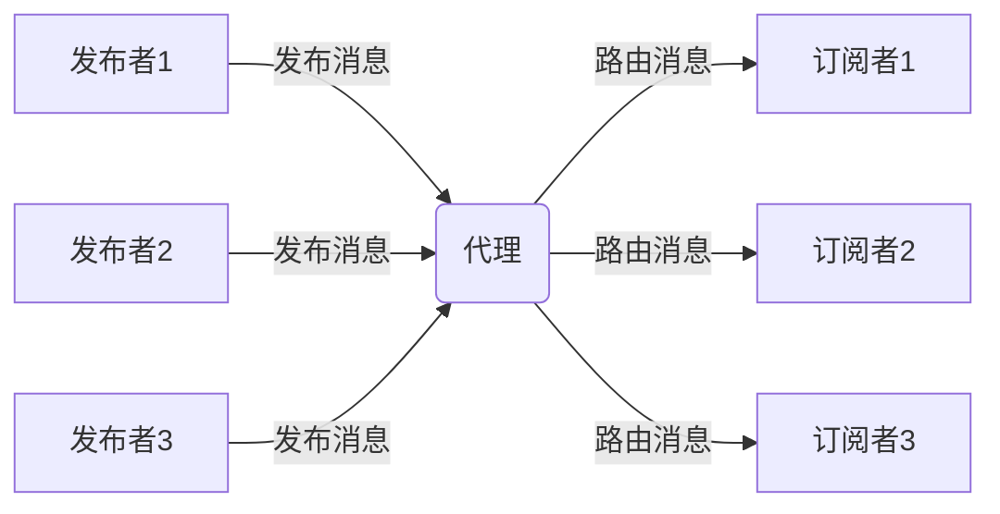
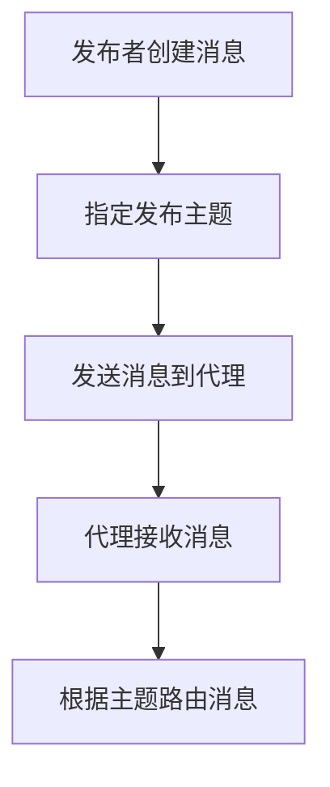
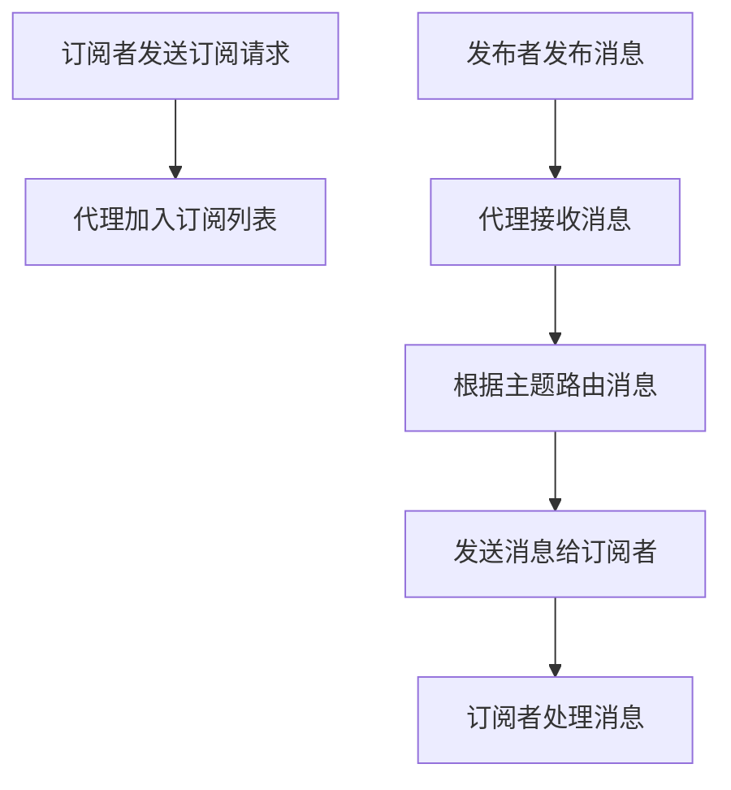

# 【AI大数据计算原理与代码实例讲解】发布订阅

## 1.背景介绍

### 1.1 什么是发布订阅模式

发布订阅模式(Publish/Subscribe Pattern)是一种消息传递模式,它将发送消息的发布者与接收消息的订阅者进行了解耦。发布者不需要知道谁是订阅者,只需要将消息发布出去;订阅者也不需要知道谁是发布者,只需要订阅感兴趣的消息主题即可。这种模式常用于构建可伸缩、松耦合的分布式系统。

### 1.2 发布订阅模式的优势

- **解耦性**:发布者和订阅者不需要直接相互了解,只需关注消息主题即可,实现了松耦合。
- **异步通信**:发布者不需要等待订阅者处理完消息,可以继续执行其他操作,提高了系统吞吐量。
- **可扩展性**:新增发布者或订阅者时,不需要修改已有代码,有利于系统扩展。
- **广播能力**:消息可以被广播给所有订阅了该主题的订阅者。

### 1.3 发布订阅模式的应用场景

- **物联网(IoT)系统**:传感器作为发布者,应用程序作为订阅者,实现实时数据采集和处理。
- **实时监控系统**:监控数据作为发布者,报警系统、数据分析系统作为订阅者。
- **消息中间件**:如RabbitMQ、Kafka等,广泛应用于企业应用集成。
- **社交网络**:用户发布状态更新,好友作为订阅者实时接收。

## 2.核心概念与联系

### 2.1 核心概念

- **主题(Topic)**:消息的分类,订阅者订阅感兴趣的主题。
- **发布者(Publisher)**:生产消息并发布到指定主题的应用程序。
- **订阅者(Subscriber)**:订阅感兴趣主题,从中接收消息并进行处理的应用程序。
- **代理(Broker)**:消息中转站,负责消息路由、存储转发等。



### 2.2 核心概念关系

1. 发布者将消息发布到指定主题。
2. 代理接收发布者的消息,并根据主题路由给订阅了该主题的订阅者。
3. 订阅者接收感兴趣主题的消息并进行处理。

发布订阅模式的核心是通过主题对消息进行分类,发布者和订阅者通过主题实现解耦。代理作为中介,负责消息路由和中转。

## 3.核心算法原理具体操作步骤 

发布订阅模式的核心算法包括两个主要部分:发布算法和订阅算法。

### 3.1 发布算法

发布算法的主要步骤如下:

1. 发布者创建消息。
2. 发布者指定消息要发布到的主题。
3. 发布者将消息发送给代理。
4. 代理接收到消息后,会根据主题进行消息路由。



### 3.2 订阅算法

订阅算法的主要步骤如下:

1. 订阅者向代理发送订阅请求,指定感兴趣的主题。
2. 代理将订阅者信息加入到相应主题的订阅列表中。
3. 当有新消息到达该主题时,代理会将消息发送给订阅列表中的所有订阅者。
4. 订阅者接收到消息后进行处理。



这些算法步骤保证了发布订阅模式的核心功能:发布者和订阅者通过主题实现解耦,代理负责消息路由和中转。

## 4.数学模型和公式详细讲解举例说明

在发布订阅模式中,我们可以使用一些数学模型和公式来描述和优化系统性能。

### 4.1 小世界模型

发布订阅系统可以被抽象为一个无向图$G=(V,E)$,其中$V$表示所有主题和节点(发布者、订阅者、代理),而$E$表示节点之间的连接关系。我们可以使用小世界模型来描述这个网络结构。

小世界模型的两个重要指标是:

- 平均路径长度(Average Path Length) $L$:$$L=\frac{1}{n(n-1)}\sum_{i\neq j}d(v_i,v_j)$$
其中$n$是节点数量,$d(v_i,v_j)$是节点$v_i$和$v_j$之间的最短路径长度。

- clustering coefficient 聚类系数 $C$:$$C=\frac{3 \times \text{Number of triangles in G}}{\text{Number of connected triples in G}}$$
它描述了节点邻居之间连接的紧密程度。

在小世界网络中,$L$较小且$C$较大,这意味着消息可以通过较短路径到达目标节点,同时节点之间也有较好的聚类特性。因此,发布订阅系统应该尽量减小$L$并增大$C$,以提高消息传递效率和可靠性。

### 4.2 流量控制

为了防止发布者发送过多消息导致代理或订阅者超载,需要进行流量控制。我们可以使用令牌桶算法(Token Bucket)来对发布者的发送速率进行限制。

令牌桶算法模型如下:

- 令牌以固定速率$r$进入桶中,最多可以存储$b$个令牌。
- 发布者每发送一条消息,需要从桶中取出一个令牌。
- 如果桶中没有令牌,发布者需要等待,直到有新令牌进入桶中。

令牌桶算法可以用以下公式描述:

$$
N(t+\Delta t) = \min(N(t)+r\Delta t, b)
$$

其中$N(t)$表示时刻$t$桶中的令牌数,$r$是令牌进入速率,$b$是桶的最大容量。

通过合理设置$r$和$b$,可以控制发布者的发送速率,避免过载情况发生。

## 5.项目实践:代码实例和详细解释说明

为了更好地理解发布订阅模式,我们使用Python编写一个简单的示例程序。这个程序使用Redis作为消息代理,通过发布/订阅Redis的频道(Channel)来模拟发布订阅模式。

### 5.1 安装依赖库

```
pip install redis
```

### 5.2 发布者代码

```python
import redis
import time

# 创建Redis连接
r = redis.Redis(host='localhost', port=6379, db=0)

# 发布主题和消息
topic = 'channel_1'
message = 'Hello, World!'

while True:
    # 发布消息
    r.publish(topic, message)
    print(f'Published: {message}')
    
    # 等待5秒
    time.sleep(5)
```

发布者代码每5秒向`channel_1`主题发布一条`Hello, World!`消息。

### 5.3 订阅者代码

```python
import redis

# 创建Redis连接
r = redis.Redis(host='localhost', port=6379, db=0)

# 订阅主题
topic = 'channel_1'
pubsub = r.pubsub()
pubsub.subscribe(topic)

# 处理接收到的消息
for message in pubsub.listen():
    if message['type'] == 'message':
        print(f"Received: {message['data']}")
```

订阅者代码订阅了`channel_1`主题,当接收到消息时,会打印出消息内容。

### 5.4 运行示例

1. 启动订阅者:

```
$ python subscriber.py
```

2. 启动发布者:

```
$ python publisher.py
Published: Hello, World!
Published: Hello, World!
Published: Hello, World!
...
```

3. 订阅者输出:

```
Received: b'Hello, World!'
Received: b'Hello, World!'
Received: b'Hello, World!'
...
```

可以看到,发布者发布的消息被订阅者成功接收和处理。

通过这个简单的示例,我们可以更好地理解发布订阅模式的工作原理和代码实现。在实际项目中,可以使用更加强大和可靠的消息队列系统(如RabbitMQ、Kafka等)来实现发布订阅模式。

## 6.实际应用场景

发布订阅模式在许多实际应用场景中发挥着重要作用,下面列举了一些典型的应用场景:

### 6.1 物联网(IoT)系统

在物联网系统中,各种传感器设备可以作为发布者,将采集到的数据(如温度、湿度、压力等)发布到对应的主题。而监控系统、数据分析系统等则作为订阅者,订阅感兴趣的主题,实时接收和处理这些数据。发布订阅模式可以很好地支持物联网系统的可扩展性和异构性。

### 6.2 实时监控系统

实时监控系统需要实时收集被监控对象(如服务器、网络设备等)的运行状态数据。发布订阅模式可以将被监控对象作为发布者,将状态数据发布到对应的主题;而监控系统作为订阅者,订阅这些主题,实时接收状态数据,并进行报警、可视化等操作。

### 6.3 企业应用集成(EAI)

在现代企业中,通常存在许多异构的应用系统需要进行集成和数据共享。发布订阅模式可以作为企业服务总线(Enterprise Service Bus, ESB)的核心,各个应用系统作为发布者和订阅者,通过发布订阅消息实现应用集成。

### 6.4 社交网络

在社交网络中,用户发布的状态更新、照片、视频等内容可以看作是发布到对应主题的消息。而用户的好友则是这些主题的订阅者,可以实时接收到好友发布的内容。发布订阅模式可以很好地支持社交网络的实时性和可扩展性。

## 7.工具和资源推荐

实现发布订阅模式有多种工具和框架可以选择,下面列出了一些常用的工具和资源:

### 7.1 消息队列

- **RabbitMQ**: 基于AMQP协议的开源消息队列,支持发布订阅模式。
- **Apache Kafka**: 分布式流处理平台,常用于构建实时数据管道。
- **Redis**: 支持发布订阅功能的内存数据库,适合小规模应用。

### 7.2 框架和库

- **NATS**: 一个高性能的开源消息队列,支持多种消息模式。
- **ZeroMQ**: 一个轻量级的异步消息库,支持多种消息模式。
- **Apache Kafka Streams**: Kafka的流处理客户端库,支持发布订阅模式。
- **RxJava/RxJS**: 响应式编程库,支持观察者模式(类似于发布订阅)。

### 7.3 在线资源

- **RabbitMQ官方文档**: https://www.rabbitmq.com/documentation.html
- **Apache Kafka官方文档**: https://kafka.apache.org/documentation/
- **NATS文档**: https://docs.nats.io/
- **ZeroMQ指南**: http://zguide.zeromq.org/

## 8.总结:未来发展趋势与挑战

发布订阅模式在分布式系统、实时数据处理等领域发挥着重要作用,并将继续演化以适应未来的需求和挑战。

### 8.1 未来发展趋势

- **云原生架构**:随着云计算和容器技术的发展,发布订阅模式需要与云原生架构更好地集成,提供更好的可扩展性和弹性。
- **流式处理**:实时数据流处理需求不断增加,发布订阅模式需要与流式处理框架(如Apache Kafka Streams