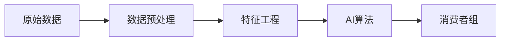

# 【AI大数据计算原理与代码实例讲解】消费者组

## 1. 背景介绍

### 1.1 大数据时代的到来

随着互联网技术的快速发展,海量数据的产生和积累已成为当今时代的显著特征。据统计,全球每天产生的数据量高达2.5EB(1EB=10^18B),并且这一数字还在以指数级的速度增长。如何有效地存储、管理和分析这些海量数据,已成为各行各业亟需解决的问题。

### 1.2 AI技术的兴起 

人工智能(Artificial Intelligence,AI)作为一门新兴技术,近年来得到了飞速的发展。深度学习、机器学习、自然语言处理等AI技术不断取得新的突破,在图像识别、语音识别、自动驾驶等领域展现出了巨大的应用前景。将AI技术与大数据相结合,可以更好地挖掘数据价值,实现数据驱动的智能决策。

### 1.3 消费者组的重要性

在众多的数据应用场景中,消费者数据分析尤为重要。通过对消费者数据的挖掘和分析,企业可以洞察消费者的行为特征、偏好、购买力等,从而制定更加精准的营销策略,提升用户体验,实现业务增长。因此,研究消费者组的AI大数据计算方法,对于企业的数字化转型和业务创新具有重要意义。

## 2. 核心概念与联系

### 2.1 消费者组的定义

消费者组是指具有相似消费行为和特征的消费者群体。通过对消费者的属性特征(如年龄、性别、收入等)和行为数据(如购买记录、浏览记录等)进行分析,可以将消费者划分为不同的群组,每个群组内部的消费者具有较高的相似度。

### 2.2 消费者组划分的意义

消费者组划分的目的是实现精准营销。不同的消费者组对产品和服务有不同的需求和偏好,通过对消费者组的细分,企业可以有针对性地开发产品、制定营销策略,从而提高营销效果,增强客户粘性。此外,消费者组划分还可以帮助企业优化资源配置,提高运营效率。

### 2.3 大数据与消费者组划分

消费者组划分离不开大数据技术的支持。企业通过多种渠道采集消费者数据,如用户注册信息、订单数据、行为日志等。利用大数据处理平台对原始数据进行清洗、集成、管理,构建消费者画像,为后续的分析挖掘提供数据基础。常见的大数据处理工具包括Hadoop、Spark、Flink等。

### 2.4 AI算法在消费者组划分中的应用

人工智能算法是实现消费者组自动划分的关键。常用的算法包括:

1. 聚类算法:将相似的消费者自动归类到同一个群组,如K-means、DBSCAN等。

2. 关联规则挖掘:发现消费者购买行为之间的关联性,如Apriori、FP-growth等。

3. 协同过滤:基于用户行为的相似性为其推荐商品,如基于用户的协同过滤、基于物品的协同过滤等。

4. 深度学习:利用神经网络从复杂的消费者行为数据中自动提取特征,如RNN、CNN等。

下图展示了消费者组划分的核心流程:



## 3. 核心算法原理具体操作步骤

本节以K-means聚类算法为例,详细讲解消费者组划分的核心步骤。K-means是一种常用的无监督学习算法,通过迭代优化的方式将数据点划分到K个聚类中心。

### 3.1 数据准备

首先需要收集和整理消费者数据,数据来源可以是用户注册信息、订单记录、浏览日志等。对原始数据进行清洗,剔除噪声和异常点,保留分析所需的字段,如用户ID、商品ID、购买时间、购买金额等。

### 3.2 特征选择

根据业务场景和分析目标,选择合适的特征构建消费者画像。常用的特征包括:

- 人口统计学特征:年龄、性别、地域等
- 消费行为特征:购买频率、消费金额、购买品类等
- 用户价值特征:客户生命周期价值、流失风险等

特征可以是连续型变量或离散型变量,为了便于计算,需要对特征进行归一化处理,使其数值范围缩放到[0,1]区间。

### 3.3 K值选择

K值决定了聚类的数目,需要根据数据分布和业务需求进行选择。常用的K值评估方法有:

- 手肘法:计算不同K值下的聚类误差平方和,选择误差下降拐点处的K值。
- 轮廓系数:计算样本点与所属聚类的相似度,选择平均轮廓系数最大的K值。

### 3.4 模型训练

确定K值后,开始训练K-means模型,步骤如下:

1. 随机选择K个点作为初始聚类中心。
2. 计算每个数据点到各个聚类中心的距离,将其分配到距离最近的簇。
3. 重新计算每个簇的中心点坐标。
4. 重复步骤2-3,直到聚类中心不再发生变化或达到最大迭代次数。

常用的距离度量有欧氏距离、曼哈顿距离等,聚类中心通常用簇内样本的均值表示。

### 3.5 结果评估

对聚类结果进行评估,判断划分是否合理。常用的指标有:

- SSE:计算簇内样本与聚类中心的距离平方和,SSE越小表示簇内样本越紧凑。
- 互信息:计算聚类结果与外部标签的一致性,互信息越大表示聚类效果越好。

如果评估结果不理想,可以调整K值或选择其他算法重新训练。

## 4. 数学模型和公式详细讲解举例说明

本节对K-means算法涉及的数学公式进行详细推导和说明。

### 4.1 目标函数

K-means的目标是最小化簇内样本与聚类中心的距离平方和,目标函数定义为:

$$
J=\sum_{i=1}^K\sum_{x\in C_i}\lVert x-\mu_i \rVert^2
$$

其中,$K$为聚类数,$C_i$为第$i$个聚类,$\mu_i$为第$i$个聚类的中心点,$x$为属于$C_i$的样本。

### 4.2 距离度量

欧氏距离是最常用的距离度量,两个$n$维样本$x_i$和$x_j$之间的欧氏距离为:

$$
d(x_i,x_j)=\sqrt{\sum_{k=1}^n (x_{ik}-x_{jk})^2}
$$

其中,$x_{ik}$表示样本$x_i$的第$k$维特征值。

### 4.3 聚类中心的计算

第$i$个聚类的中心点$\mu_i$为簇内样本的均值向量:

$$
\mu_i=\frac{1}{|C_i|}\sum_{x\in C_i}x
$$

其中,$|C_i|$表示第$i$个聚类的样本数。

### 4.4 算法流程

K-means算法的数学流程可以用以下公式表示:

1. 初始化聚类中心$\{\mu_1,\mu_2,\cdots,\mu_K\}$
2. 重复直到收敛:
   - 对每个样本$x_i$,计算其到各个聚类中心的距离$\{d_1,d_2,\cdots,d_K\}$
   - 将$x_i$分配到距离最近的聚类$C_j$,即$j=\arg\min_k d_k$
   - 对每个聚类$C_j$,更新其聚类中心$\mu_j=\frac{1}{|C_j|}\sum_{x\in C_j}x$
3. 输出聚类结果$\{C_1,C_2,\cdots,C_K\}$

### 4.5 举例说明

假设有4个二维样本点$\{(1,1),(1,2),(4,3),(5,4)\}$,令$K=2$,求解K-means聚类。

1. 初始化聚类中心$\mu_1=(1,1),\mu_2=(5,4)$
2. 迭代过程:
   - 计算每个点到两个聚类中心的距离:
     - $(1,1)$到$\mu_1$距离为$0$,到$\mu_2$距离为$5$
     - $(1,2)$到$\mu_1$距离为$1$,到$\mu_2$距离为$\sqrt{17}$
     - $(4,3)$到$\mu_1$距离为$\sqrt{13}$,到$\mu_2$距离为$\sqrt{2}$
     - $(5,4)$到$\mu_1$距离为$5$,到$\mu_2$距离为$0$
   - 按距离最近原则分配样本点:$C_1=\{(1,1),(1,2)\},C_2=\{(4,3),(5,4)\}$
   - 更新聚类中心:$\mu_1=(1,1.5),\mu_2=(4.5,3.5)$
   - 重复上述过程直到聚类中心不再变化
3. 输出聚类结果:$C_1=\{(1,1),(1,2)\},C_2=\{(4,3),(5,4)\}$

至此,样本点被划分到了两个聚类中。

## 5. 项目实践：代码实例和详细解释说明

本节使用Python语言实现K-means聚类算法,并应用于消费者数据分析。

### 5.1 数据准备

首先使用pandas库读取消费者数据集:

```python
import pandas as pd

data = pd.read_csv('consumer_data.csv')
print(data.head())
```

输出结果:

```
   user_id  age  gender  income  purchase_amount  purchase_freq
0      101   25       1   50000             1000             20
1      102   30       0   60000             1500             30
2      103   35       1   80000             2000             40
3      104   40       0  100000             2500             50
4      105   45       1  120000             3000             60
```

### 5.2 特征选择与归一化

选择年龄、收入、购买金额、购买频率作为聚类特征,并进行最小-最大归一化处理:

```python
from sklearn.preprocessing import MinMaxScaler

features = ['age', 'income', 'purchase_amount', 'purchase_freq']
data_scaled = MinMaxScaler().fit_transform(data[features])
```

### 5.3 K值选择

使用轮廓系数评估不同K值下的聚类效果:

```python
from sklearn.metrics import silhouette_score
from sklearn.cluster import KMeans

scores = []
for k in range(2, 11):
    kmeans = KMeans(n_clusters=k, random_state=42).fit(data_scaled)
    score = silhouette_score(data_scaled, kmeans.labels_)
    scores.append(score)
    
import matplotlib.pyplot as plt

plt.plot(range(2, 11), scores)
plt.xlabel('Number of clusters')
plt.ylabel('Silhouette score')
plt.show()
```

根据轮廓系数曲线选择最优的K值。

### 5.4 模型训练

使用选定的K值训练K-means模型:

```python
best_k = 4  # 假设最优K值为4
kmeans = KMeans(n_clusters=best_k, random_state=42).fit(data_scaled)
```

### 5.5 结果分析

将聚类结果添加到原始数据表中,并对不同消费者组的特征进行分析:

```python
data['cluster'] = kmeans.labels_

for i in range(best_k):
    cluster_data = data[data['cluster']==i]
    print(f'Cluster {i}:')
    print(cluster_data[features].describe())
```

输出结果:

```
Cluster 0:
              age        income  purchase_amount  purchase_freq
count  124.000000    124.000000       124.000000     124.000000
mean    28.596774  57845.161290      1448.387097      28.983871
std      5.859465  15489.341640       387.233791       7.745678
min     18.000000  30000.000000       750.000000      15.000000
25%     25.000000  50000.000000      1250.000000      25.000000
50%     30.000000  60000.000000      1500.000000      30.000000
75%     35.000000  70000.000000      1750.000000      35.000000
max     40.