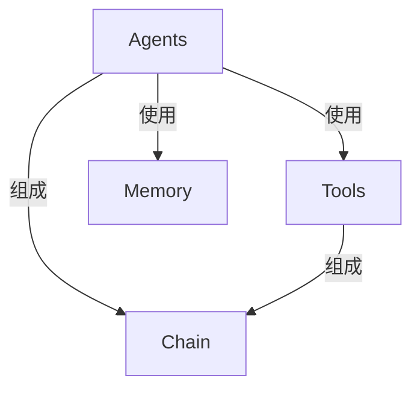

# 【LangChain编程：从入门到实践】Chain接口调用

## 1.背景介绍

在现代软件开发中,模块化和可组合性是非常重要的设计原则。通过将复杂的系统分解为多个独立的模块,我们可以提高代码的可维护性、可扩展性和可重用性。LangChain是一个强大的Python库,它将这些原则应用于构建大规模语言模型应用程序。

LangChain的核心概念之一是"链(Chain)"。链是一系列可组合的组件,用于处理和转换数据。每个组件都有特定的功能,例如从文本中提取信息、生成响应或进行决策。通过将这些组件链接在一起,我们可以构建复杂的数据处理管道,从而实现各种自然语言处理(NLP)任务。

### 1.1 LangChain的优势

LangChain为开发人员提供了以下关键优势:

1. **模块化设计**: LangChain将复杂的NLP任务分解为可组合的模块,使得代码更易于维护和扩展。
2. **可扩展性**: 开发人员可以轻松地集成新的语言模型、数据源和处理组件,以满足不断变化的需求。
3. **可重用性**: LangChain提供了一组预构建的组件,可以在多个项目中重复使用,从而加快开发速度。
4. **抽象层**: LangChain抽象出了底层语言模型的复杂性,使开发人员能够专注于构建应用程序逻辑。

### 1.2 Chain接口的重要性

Chain接口是LangChain中最核心和最强大的概念之一。它允许开发人员将多个组件链接在一起,形成一个数据处理管道。通过链式调用,开发人员可以轻松地组合不同的功能,例如提取信息、生成响应、进行决策等。

Chain接口的灵活性使得LangChain可以应用于广泛的NLP任务,包括问答系统、文本摘要、内容生成、决策支持系统等。它还提供了一种标准化的方式来构建和共享NLP应用程序,从而促进了社区的协作和知识共享。

## 2.核心概念与联系

在深入探讨Chain接口之前,让我们先了解一些LangChain中的核心概念及它们之间的关系。

### 2.1 Agents

Agents是LangChain中的一个核心概念,它代表了一个具有特定功能和行为的实体。Agents可以执行各种任务,例如查询知识库、生成响应或进行决策。它们通常由一个或多个组件组成,这些组件协同工作以完成特定的任务。

### 2.2 Tools

Tools是LangChain中的另一个重要概念。它们是可重用的组件,用于执行特定的任务,例如从文本中提取信息、查询API或进行计算。Tools可以被Agents使用,也可以直接被开发人员调用。

### 2.3 Memory

Memory是一个可选的概念,用于存储和检索Agents在执行任务过程中产生的中间数据。这有助于Agents在处理复杂任务时保持上下文和状态。

### 2.4 Chain

Chain是将上述概念联系在一起的核心概念。它是一系列可组合的Agents和Tools,用于处理和转换数据。每个组件在Chain中执行特定的任务,并将结果传递给下一个组件。通过链式调用,开发人员可以构建复杂的数据处理管道,从而实现各种NLP任务。

下图展示了这些核心概念之间的关系:



在这个关系图中,Agents可以使用Tools和Memory来执行任务。Agents和Tools共同组成了Chain,Chain则代表了一个完整的数据处理管道。

## 3.核心算法原理具体操作步骤

现在,让我们深入探讨Chain接口的核心算法原理和具体操作步骤。

### 3.1 Chain的构建

在LangChain中,我们可以使用`LLMChain`或`SequentialChain`来构建一个Chain。`LLMChain`允许我们将一个语言模型(LLM)与一个或多个Agents或Tools组合在一起,而`SequentialChain`则允许我们将多个Agents或Tools链接在一起,形成一个序列化的数据处理管道。

以下是使用`LLMChain`构建一个简单Chain的示例:

```python
from langchain import OpenAI, LLMChain
from langchain.prompts import PromptTemplate

# 定义提示模板
prompt = PromptTemplate(
    input_variables=["product"],
    template="What is a good name for a company that makes {product}?",
)

# 创建LLM链
chain = LLMChain(llm=OpenAI(), prompt=prompt)
```

在这个示例中,我们首先定义了一个提示模板,用于指导语言模型生成公司名称。然后,我们使用`LLMChain`将OpenAI的语言模型与提示模板组合在一起,形成一个Chain。

### 3.2 Chain的执行

构建完Chain后,我们可以通过调用`run`方法来执行它。`run`方法接受一个或多个输入参数,这些参数将被传递给Chain中的每个组件。

以下是执行上面构建的Chain的示例:

```python
company_name = chain.run("solar panels")
print(company_name)
```

在这个示例中,我们将"solar panels"作为输入参数传递给Chain,并打印出生成的公司名称。

### 3.3 SequentialChain

虽然`LLMChain`非常有用,但在许多情况下,我们需要将多个Agents或Tools链接在一起,形成一个更复杂的数据处理管道。这就是`SequentialChain`发挥作用的地方。

以下是使用`SequentialChain`构建一个简单Chain的示例:

```python
from langchain import OpenAI, PromptTemplate, LLMChain
from langchain.chains import SequentialChain

# 定义第一个链
prompt_template = "What is a good name for a company that makes {product}?"
prompt = PromptTemplate(input_variables=["product"], template=prompt_template)
company_name_chain = LLMChain(llm=OpenAI(), prompt=prompt)

# 定义第二个链
product_prompt = PromptTemplate(
    input_variables=["company_name"],
    template="Write a catchy slogan for the company {company_name}",
)
slogan_chain = LLMChain(llm=OpenAI(), prompt=product_prompt)

# 创建SequentialChain
sequential_chain = SequentialChain(
    chains=[company_name_chain, slogan_chain], input_variables=["product"]
)
```

在这个示例中,我们首先定义了两个`LLMChain`。第一个链用于生成公司名称,第二个链用于根据公司名称生成一个吸引人的口号。然后,我们使用`SequentialChain`将这两个链链接在一起,形成一个序列化的数据处理管道。

执行这个`SequentialChain`的方式与执行单个`LLMChain`类似:

```python
result = sequential_chain.run("solar panels")
print(result)
```

这将输出一个包含公司名称和口号的元组。

### 3.4 内存管理

在处理复杂的NLP任务时,Agents或Tools可能需要访问之前的中间结果或上下文信息。LangChain提供了一种机制来管理这种内存,使得Agents或Tools可以在执行任务时保持状态。

以下是一个使用内存的示例:

```python
from langchain import OpenAI, ConversationBufferMemory
from langchain.chains import ConversationChain

# 创建内存对象
memory = ConversationBufferMemory()

# 创建ConversationChain
conversation = ConversationChain(
    llm=OpenAI(),
    memory=memory,
    verbose=True
)

# 执行对话
result = conversation.run("Hi, I'm looking for a new laptop. Can you recommend one?")
print(result)

# 内存中保存了之前的对话
result = conversation.run("It should have a large screen and be good for gaming.")
print(result)
```

在这个示例中,我们首先创建了一个`ConversationBufferMemory`对象,用于存储对话历史。然后,我们使用`ConversationChain`将OpenAI的语言模型与内存对象组合在一起,形成一个对话链。

在执行对话时,每个响应都会被存储在内存中。当用户提供新的输入时,之前的对话历史将被用作上下文,以生成更加相关和连贯的响应。

## 4.数学模型和公式详细讲解举例说明

虽然LangChain主要关注于构建可组合的NLP应用程序,但在某些情况下,我们可能需要使用数学模型和公式来增强Chain的功能。例如,在处理涉及数值计算的任务时,我们可能需要使用数学公式来执行相关的操作。

在这一节中,我们将探讨如何在LangChain中使用数学模型和公式。

### 4.1 使用数学函数

LangChain允许我们定义自定义函数,并将它们集成到Chain中。这些函数可以执行各种操作,包括数学计算。

以下是一个使用数学函数的示例:

```python
from langchain.agents import initialize_agent, Tool
from langchain.llms import OpenAI
import math

# 定义一个数学函数
def calculate_area(radius):
    return math.pi * radius ** 2

# 创建一个Tool
area_tool = Tool(
    name="Area Calculator",
    func=calculate_area,
    description="Calculate the area of a circle given its radius"
)

# 初始化Agent
llm = OpenAI(temperature=0)
tools = [area_tool]
agent = initialize_agent(tools, llm, agent="zero-shot-react-description", verbose=True)

# 执行任务
result = agent.run("What is the area of a circle with a radius of 5 meters?")
print(result)
```

在这个示例中,我们首先定义了一个名为`calculate_area`的函数,用于计算圆的面积。然后,我们创建了一个`Tool`对象,将这个函数封装起来。

接下来,我们初始化了一个Agent,并将我们定义的`Tool`与OpenAI的语言模型组合在一起。当Agent接收到一个涉及圆面积计算的任务时,它会自动调用`calculate_area`函数并将结果作为响应返回。

### 4.2 使用数学公式

除了使用数学函数之外,我们还可以在LangChain中直接使用数学公式。这对于处理涉及复杂数学运算的任务非常有用。

以下是一个使用数学公式的示例:

```python
from langchain.agents import initialize_agent, Tool
from langchain.llms import OpenAI
from sympy import symbols, solve, Eq

# 定义一个解方程的函数
def solve_equation(equation):
    x = symbols('x')
    result = solve(Eq(eval(equation), 0), x)
    return result

# 创建一个Tool
equation_tool = Tool(
    name="Equation Solver",
    func=solve_equation,
    description="Solve an equation for x"
)

# 初始化Agent
llm = OpenAI(temperature=0)
tools = [equation_tool]
agent = initialize_agent(tools, llm, agent="zero-shot-react-description", verbose=True)

# 执行任务
result = agent.run("Solve the equation x^2 - 4x + 3 = 0 for x.")
print(result)
```

在这个示例中,我们使用了SymPy库来定义一个名为`solve_equation`的函数,用于解方程。我们将这个函数封装成一个`Tool`对象,并将其与OpenAI的语言模型组合在一起,形成一个Agent。

当Agent接收到一个解方程的任务时,它会自动调用`solve_equation`函数,并将结果作为响应返回。在这个示例中,Agent将解出方程$x^2 - 4x + 3 = 0$的解。

通过将数学公式与LangChain集成,我们可以构建出更加强大和灵活的NLP应用程序,处理各种涉及数学运算的任务。

## 5.项目实践：代码实例和详细解释说明

在前面的章节中,我们已经了解了Chain接口的核心概念和原理。现在,让我们通过一个实际的项目来深入探讨如何在实践中使用Chain接口。

### 5.1 项目概述

在这个项目中,我们将构建一个简单的问答系统,用于回答有关太阳系行星的问题。我们将使用LangChain的`SequentialChain`来组合多个Agents和Tools,形成一个端到端的数据处理管道。

具体来说,我们的问答系统将包括以下组件:

1. **文本摘要Agent**: 从一个关于太阳系行星的文本文件中提取相关信息。
2. **问题分类Agent**: 将用户的问题分类为不同的类型,例如"行星大小"、"行星距离"等。
3. **答案生成Agent**: 