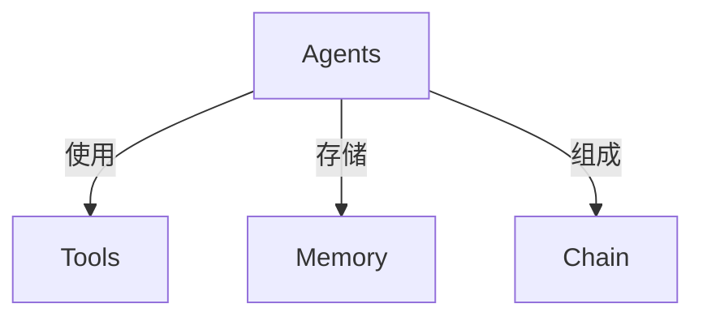
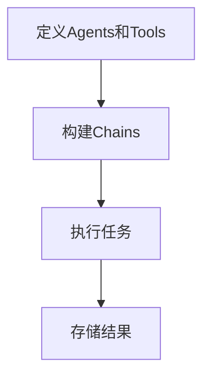
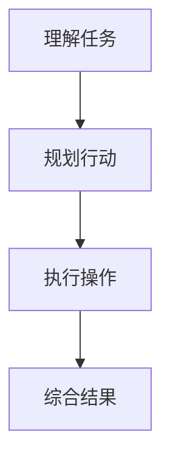

# 【LangChain编程：从入门到实践】LangChain初体验

## 1. 背景介绍

### 1.1 人工智能时代的到来

在过去的几十年里，人工智能(AI)技术发展迅猛，已经深深地融入到我们的日常生活中。从语音助手到自动驾驶汽车，从推荐系统到医疗诊断，AI无处不在。随着计算能力的不断提升和算法的持续优化,AI正在改变着我们的工作和生活方式。

### 1.2 大语言模型的兴起

近年来,大型语言模型(Large Language Models, LLMs)的出现引起了广泛关注。这些模型通过在海量文本数据上进行训练,能够生成看似人类写作的自然语言文本。GPT-3、PaLM、ChatGPT等模型展现出了令人惊叹的语言生成能力,在各个领域都有着广阔的应用前景。

### 1.3 LangChain:连接人工智能与现实世界

尽管大语言模型展现出了强大的能力,但将它们应用于实际场景并非一件易事。LangChain旨在解决这一问题,它是一个用于构建应用程序的框架,可以将大型语言模型与其他系统(如数据库、API等)无缝集成,从而实现更加智能和有用的应用程序。

## 2. 核心概念与联系

### 2.1 LangChain的核心概念

LangChain的核心概念包括:

- **Agents(智能体)**: 代表一个具有特定功能的实体,可以执行各种任务。
- **Tools(工具)**: 代表可供Agents使用的外部资源,如数据库、API等。
- **Memory(记忆)**: 用于存储Agents在执行任务过程中的中间状态和结果。
- **Chain(链)**: 将多个Agents和Tools组合在一起,形成复杂的工作流程。



### 2.2 LangChain与其他技术的联系

LangChain与多种技术密切相关,包括:

- **大型语言模型**: LangChain可以与各种大型语言模型(如GPT-3、PaLM等)集成,利用它们的强大语言生成能力。
- **知识库**: LangChain支持将各种知识库(如维基百科、文档等)作为工具集成进来,为智能体提供背景知识。
- **数据库和API**: LangChain可以与各种数据库和API接口集成,实现对外部数据源的访问和操作。

通过将这些技术有机结合,LangChain可以构建出功能强大、智能化程度高的应用程序。

## 3. 核心算法原理具体操作步骤

### 3.1 LangChain的工作流程

LangChain的工作流程可以概括为以下几个步骤:

1. **定义Agents和Tools**: 根据应用场景,定义所需的智能体和可用工具。
2. **构建Chains**: 将Agents和Tools按照特定的逻辑组合成Chains。
3. **执行任务**: 将输入提供给Chain,由Chain协调Agents和Tools完成任务。
4. **存储结果**: 将任务执行过程中的中间状态和最终结果存储在Memory中。



### 3.2 Agents的执行逻辑

Agents在执行任务时,通常会遵循以下逻辑:

1. **理解任务**: 通过语言模型分析输入,理解任务的目标和要求。
2. **规划行动**: 根据可用的Tools,规划出完成任务所需的一系列操作步骤。
3. **执行操作**: 按照规划,调用相应的Tools执行操作,获取所需的中间结果。
4. **综合结果**: 将各个步骤的中间结果综合起来,形成最终的任务输出。



### 3.3 Chains的组合逻辑

Chains可以通过多种方式组合,实现更加复杂的任务流程:

- **顺序链(Sequential Chain)**: 将多个Agents或Tools按顺序执行。
- **并行链(Parallel Chain)**: 同时执行多个Agents或Tools,并汇总结果。
- **条件链(Conditional Chain)**: 根据特定条件,选择执行不同的分支。
- **反馈链(Feedback Chain)**: 将上一步的输出作为下一步的输入,形成闭环。

通过灵活组合这些基本模式,可以构建出满足各种需求的复杂Chains。

## 4. 数学模型和公式详细讲解举例说明

虽然LangChain主要是一个框架,但它的某些组件(如代理决策模块)也会使用一些数学模型和公式。以下是一些常见的模型和公式:

### 4.1 马尔可夫决策过程(MDP)

马尔可夫决策过程(Markov Decision Process, MDP)是一种用于描述序列决策问题的数学框架。它可以用于建模智能体在不确定环境中的决策过程。

MDP由以下几个要素组成:

- 状态集合 $\mathcal{S}$
- 动作集合 $\mathcal{A}$
- 转移概率 $\mathcal{P}_{ss'}^a = \mathcal{P}(s' \mid s, a)$
- 奖励函数 $\mathcal{R}_s^a$

目标是找到一个策略 $\pi: \mathcal{S} \rightarrow \mathcal{A}$,使得在给定的初始状态下,期望的累积奖励最大化:

$$
\max_\pi \mathbb{E}_\pi \left[ \sum_{t=0}^\infty \gamma^t R(s_t, a_t) \right]
$$

其中 $\gamma \in [0, 1)$ 是折现因子,用于权衡即时奖励和长期奖励的重要性。

在LangChain中,MDP可以用于建模智能体在执行任务时的决策过程,并寻找最优的行动策略。

### 4.2 多臂老虎机问题

多臂老虎机问题(Multi-Armed Bandit Problem)是一种经典的强化学习问题,它描述了一个需要在多个选择中进行决策的场景。

假设有 $K$ 个老虎机臂,每次拉动一个臂会获得一定的奖励,奖励服从某种未知的概率分布。目标是在有限的试验次数内,最大化累积奖励。

常见的解决方法包括:

- $\epsilon$-贪婪算法
- 上置信界(UCB)算法
- 汤普森采样算法

这些算法在探索(尝试新的选择)和利用(选择已知最优选择)之间寻求平衡,以期获得最大的累积奖励。

在LangChain中,多臂老虎机问题可以用于建模智能体在选择工具时的决策过程,帮助它们在探索新工具和利用已知工具之间做出权衡。

### 4.3 其他模型和公式

除了上述模型和公式外,LangChain还可能使用其他一些数学工具,例如:

- 贝叶斯网络: 用于建模不确定性和因果关系
- 概率图模型: 用于表示复杂的概率分布
- 优化算法: 用于寻找最优解

这些模型和算法为LangChain提供了强大的数学基础,使其能够更好地处理复杂的决策和推理问题。

## 5. 项目实践: 代码实例和详细解释说明

为了更好地理解LangChain的使用,让我们通过一个实际的代码示例来探索它的功能。在这个示例中,我们将构建一个简单的问答系统,它可以从维基百科中检索相关信息,并根据用户的问题生成回答。

### 5.1 导入必要的库

```python
from langchain.agents import initialize_agent, Tool
from langchain.llms import OpenAI
from langchain.utilities import WikipediaAPIWrapper
```

我们首先导入了一些必要的库:

- `initialize_agent`: 用于初始化智能体
- `Tool`: 用于定义工具
- `OpenAI`: 用于与OpenAI的语言模型进行交互
- `WikipediaAPIWrapper`: 用于访问维基百科API

### 5.2 定义工具

接下来,我们定义了两个工具:语言模型和维基百科API。

```python
# 初始化语言模型
llm = OpenAI(temperature=0)

# 定义维基百科工具
wikipedia = WikipediaAPIWrapper()
tools = [
    Tool(
        name="Wikipedia",
        func=wikipedia.run,
        description="Useful for answering questions about topics covered on Wikipedia"
    )
]
```

我们使用`OpenAI`初始化了一个语言模型,并将其温度设置为0,以获得更加确定的输出。然后,我们定义了一个`WikipediaAPIWrapper`实例作为工具,用于从维基百科中检索信息。

### 5.3 初始化智能体

现在,我们可以使用定义好的工具来初始化一个智能体:

```python
agent = initialize_agent(tools, llm, agent="conversational-react-description", verbose=True)
```

我们使用`initialize_agent`函数创建了一个智能体实例,并将之前定义的工具和语言模型传递给它。我们还指定了`agent="conversational-react-description"`参数,以使用一种更加对话式的智能体类型。`verbose=True`参数可以让智能体在执行任务时输出更多的调试信息。

### 5.4 与智能体交互

最后,我们可以与智能体进行交互,提出问题并获取回答:

```python
query = "What is the capital of France?"
response = agent.run(query)
print(response)
```

在这个示例中,我们提出了一个关于法国首都的问题。智能体会首先尝试使用语言模型直接回答这个问题。如果语言模型无法给出满意的答复,智能体会调用维基百科工具,从中检索相关信息,并综合生成最终的回答。

通过这个简单的示例,我们可以看到LangChain如何将语言模型与外部工具无缝集成,构建出更加智能和有用的应用程序。

## 6. 实际应用场景

LangChain的应用场景非常广泛,几乎涵盖了所有需要将人工智能与现实世界数据和系统集成的领域。以下是一些典型的应用场景:

### 6.1 智能助手

通过将语言模型与各种数据源和API集成,LangChain可以构建出功能强大的智能助手。这些助手可以回答各种问题、执行任务、提供建议等,极大地提高了人机交互的效率和质量。

### 6.2 知识管理

LangChain可以用于构建智能知识管理系统,将分散的知识源(如文档、数据库等)整合起来,并提供智能的检索、推理和问答功能。这对于企业内部知识的管理和利用非常有帮助。

### 6.3 自动化流程

在许多领域,都存在一些需要人工执行的重复性任务,如数据处理、报告生成等。LangChain可以通过将这些任务自动化,大幅提高工作效率,释放人力资源。

### 6.4 决策支持系统

LangChain可以用于构建智能的决策支持系统,通过综合各种数据源和知识库,为决策者提供全面的信息和建议,帮助他们做出更加明智的决策。

### 6.5 个性化推荐

在电子商务、娱乐等领域,个性化推荐系统可以显著提高用户体验。LangChain可以通过分析用户数据和偏好,结合外部知识源,生成更加准确和有见地的推荐。

## 7. 工具和资源推荐

如果你对LangChain感兴趣并希望进一步学习和实践,以下是一些推荐的工具和资源:

### 7.1 官方文档

LangChain的官方文档(https://python.langchain.com/en/latest/index.html)是学习和使用该框架的最佳起点。它包含了详细的概念介绍、API参考、教程和示例代码。

### 7.2 GitHub仓库

LangChain的源代码托管在GitHub上(https://github.com/hwchase17/langchain),你可以在这里查看最新的代码更新、提交issue或Pull Request,并与社区进行交流。

### 7.3 示例项目

LangChain官方提供了一些示例项目(https://github.com/hwchase17/langchain/