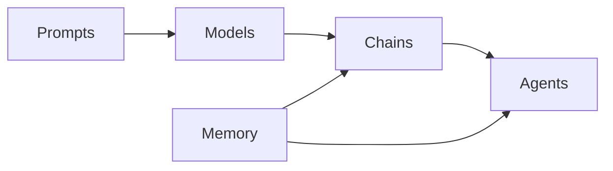

# 【LangChain编程：从入门到实践】专用Chain

## 1. 背景介绍

近年来，随着人工智能技术的快速发展，大语言模型（LLM）的出现为自然语言处理领域带来了革命性的变革。而如何更好地利用这些强大的语言模型来解决实际问题，成为了研究者和开发者关注的焦点。在这个背景下，LangChain应运而生。

LangChain是一个基于Python的开源框架，旨在帮助开发者更轻松地构建基于语言模型的应用程序。它提供了一系列工具和组件，用于与各种LLM进行交互，并将它们集成到实际应用中。通过LangChain，开发者可以快速构建聊天机器人、问答系统、文本生成器等各种应用，大大提高了开发效率。

### 1.1 LangChain的诞生

LangChain由Harrison Chase于2022年创建，旨在简化语言模型应用开发过程。它的灵感来自于现有的自然语言处理框架，如Hugging Face的Transformers库和OpenAI的GPT系列模型。然而，这些框架主要关注模型训练和推理，缺乏对应用开发的直接支持。LangChain填补了这一空白，为开发者提供了一套完整的工具链。

### 1.2 LangChain的特点

LangChain具有以下几个主要特点：

1. **模块化设计**：LangChain采用模块化的架构设计，将各个功能组件解耦，方便开发者根据需求灵活组合。

2. **多模型支持**：LangChain支持多种主流的语言模型，包括OpenAI GPT、Anthropic Claude、Cohere等，开发者可以根据需求选择合适的模型。

3. **丰富的工具链**：LangChain提供了丰富的工具和组件，包括提示模板、内存管理、代理等，帮助开发者快速构建复杂的应用。

4. **可扩展性**：LangChain的设计具有很好的可扩展性，开发者可以方便地添加新的组件和功能，满足特定需求。

### 1.3 LangChain的应用场景

LangChain可以应用于各种基于语言模型的场景，包括但不限于：

1. 聊天机器人：利用LangChain构建智能对话系统，实现人机交互。

2. 问答系统：基于LangChain实现知识库问答，回答用户提出的各种问题。 

3. 文本生成：使用LangChain生成各种文本内容，如文章、评论、诗歌等。

4. 文本摘要：利用LangChain对长文本进行自动摘要，提取关键信息。

5. 代码生成：结合LangChain和代码生成模型，自动生成代码片段或完整程序。

## 2. 核心概念与联系

在深入探讨LangChain的技术细节之前，我们需要了解其核心概念以及它们之间的关系。

### 2.1 Prompts

Prompts（提示）是LangChain中的一个核心概念，它定义了如何与语言模型进行交互。Prompts通常包含一些说明文本和用户输入，用于指导模型生成所需的输出。LangChain提供了PromptTemplate类，用于定义和管理各种类型的提示。

### 2.2 Models

Models（模型）是指LangChain所支持的各种语言模型，如OpenAI GPT、Anthropic Claude等。这些模型是应用的核心，负责对输入进行理解和生成相应的输出。LangChain通过统一的接口对这些模型进行封装，使得开发者可以方便地切换和使用不同的模型。

### 2.3 Chains

Chains（链）是LangChain中用于组织多个组件的一种方式。它将多个组件按照特定的逻辑串联起来，形成一个完整的处理流程。常见的Chain类型包括LLMChain（用于处理单个提示）、SequentialChain（用于按顺序执行多个链）和TransformChain（用于对输入进行转换）等。

### 2.4 Agents

Agents（代理）是LangChain中的一个高级概念，它封装了一个完整的任务执行流程。Agent接收用户输入，根据一定的策略选择合适的工具（如搜索引擎、计算器等），并使用这些工具生成最终的输出。LangChain提供了多种Agent实现，如ZeroShotAgent和ConversationalAgent等。

### 2.5 Memory

Memory（记忆）是指在多轮对话中保持状态信息的机制。LangChain提供了多种Memory实现，如ConversationBufferMemory（用于存储对话历史）和ConversationSummaryMemory（用于存储对话摘要）等。通过Memory，可以实现上下文感知的对话系统。

下图展示了LangChain中核心概念之间的关系：



## 3. 核心算法原理与具体操作步骤

在这一部分，我们将详细介绍LangChain的核心算法原理以及如何使用LangChain构建应用的具体步骤。

### 3.1 Prompts的构建与优化

构建优质的Prompts是使用LangChain的关键。一个好的Prompt应该能够清晰地表达任务目标，并为模型提供足够的上下文信息。LangChain提供了PromptTemplate类，用于定义和管理Prompts。下面是一个使用PromptTemplate的示例：

```python
from langchain import PromptTemplate

template = """
你是一个智能助手，请根据以下信息回答问题。

{context}

问题：{question}
"""

prompt = PromptTemplate(
    input_variables=["context", "question"],
    template=template,
)
```

在上述代码中，我们定义了一个包含`context`和`question`两个变量的Prompt模板。在实际使用时，我们可以将具体的上下文信息和问题传递给`prompt`对象，生成最终的Prompt文本。

为了优化Prompt的性能，我们可以采取以下策略：

1. 提供足够的上下文信息，帮助模型更好地理解任务。
2. 使用清晰、简洁的语言描述任务目标，避免歧义。
3. 对于复杂任务，可以将其拆分为多个子任务，分别构建Prompt。
4. 对Prompt进行迭代优化，根据模型的输出结果不断调整和改进。

### 3.2 Chains的构建与执行

Chains是LangChain中用于组织多个组件的核心概念。通过将多个组件串联起来，我们可以构建复杂的应用逻辑。LangChain提供了多种Chain类型，如LLMChain、SequentialChain和TransformChain等。

下面是一个使用LLMChain的示例：

```python
from langchain.chains import LLMChain
from langchain.llms import OpenAI

llm = OpenAI(temperature=0.9)
chain = LLMChain(llm=llm, prompt=prompt)

result = chain.run(context="...", question="...")
print(result)
```

在上述代码中，我们首先创建了一个OpenAI模型对象`llm`，并将其与之前定义的`prompt`对象传递给LLMChain构造函数，创建了一个LLMChain对象`chain`。然后，我们可以通过调用`chain.run()`方法，传入具体的`context`和`question`参数，执行该Chain，并获取输出结果。

对于更复杂的应用，我们可以使用SequentialChain将多个Chain按顺序串联起来，形成一个完整的处理流程。例如：

```python
from langchain.chains import SequentialChain

chain1 = ...  # 第一个Chain
chain2 = ...  # 第二个Chain

overall_chain = SequentialChain(chains=[chain1, chain2])

result = overall_chain.run(...)
```

### 3.3 Agents的创建与应用

Agents是LangChain中用于封装完整任务执行流程的高级概念。它接收用户输入，根据一定的策略选择合适的工具，并使用这些工具生成最终的输出。LangChain提供了多种Agent实现，如ZeroShotAgent和ConversationalAgent等。

下面是一个使用ZeroShotAgent的示例：

```python
from langchain.agents import ZeroShotAgent, Tool
from langchain.llms import OpenAI

tools = [
    Tool(
        name="Search",
        func=lambda x: "搜索结果：...",
        description="在网络上搜索信息",
    ),
    Tool(
        name="Calculator",
        func=lambda x: "计算结果：...",
        description="执行数学计算",
    ),
]

llm = OpenAI(temperature=0)
agent = ZeroShotAgent(llm=llm, tools=tools)

result = agent.run("用户输入的问题或指令")
print(result)
```

在上述代码中，我们首先定义了两个工具`Search`和`Calculator`，分别用于执行搜索和计算任务。然后，我们创建了一个OpenAI模型对象`llm`，并将其与`tools`列表传递给ZeroShotAgent构造函数，创建了一个ZeroShotAgent对象`agent`。最后，我们可以通过调用`agent.run()`方法，传入用户输入的问题或指令，让Agent自动选择合适的工具并生成最终的输出结果。

### 3.4 Memory的使用与管理

在许多应用场景中，尤其是在多轮对话中，保持状态信息非常重要。LangChain提供了多种Memory实现，用于存储和管理对话历史、摘要等状态信息。

下面是一个使用ConversationBufferMemory的示例：

```python
from langchain.memory import ConversationBufferMemory
from langchain.chains import ConversationChain
from langchain.llms import OpenAI

llm = OpenAI(temperature=0)
memory = ConversationBufferMemory()
conversation = ConversationChain(llm=llm, memory=memory)

while True:
    user_input = input("用户：")
    result = conversation.predict(input=user_input)
    print(f"助手：{result}")
```

在上述代码中，我们创建了一个ConversationBufferMemory对象`memory`，用于存储对话历史。然后，我们将`llm`和`memory`传递给ConversationChain构造函数，创建了一个ConversationChain对象`conversation`。在对话循环中，我们不断接收用户输入，并调用`conversation.predict()`方法生成助手的回复。ConversationBufferMemory会自动存储每轮对话的历史记录，使得助手能够根据上下文生成更合适的回复。

## 4. 数学模型和公式详细讲解举例说明

在LangChain中，主要涉及的数学模型是语言模型。语言模型是一种用于计算给定文本序列概率的统计模型。给定一个文本序列 $x_1, x_2, \dots, x_n$，语言模型的目标是估计该序列的概率分布 $P(x_1, x_2, \dots, x_n)$。

根据概率论的链式法则，我们可以将联合概率分解为一系列条件概率的乘积：

$$
P(x_1, x_2, \dots, x_n) = P(x_1) \cdot P(x_2 \mid x_1) \cdot P(x_3 \mid x_1, x_2) \cdot \ldots \cdot P(x_n \mid x_1, x_2, \dots, x_{n-1})
$$

其中，$P(x_i \mid x_1, x_2, \dots, x_{i-1})$ 表示在给定前 $i-1$ 个词的情况下，第 $i$ 个词为 $x_i$ 的条件概率。

在实践中，语言模型通常使用神经网络来学习这些条件概率分布。以Transformer架构为例，其核心是自注意力机制（Self-Attention）和前馈神经网络（Feed-Forward Neural Network）。

给定一个输入序列 $\mathbf{x} = (x_1, x_2, \dots, x_n)$，Transformer首先将每个词 $x_i$ 映射为一个词嵌入向量 $\mathbf{e}_i \in \mathbb{R}^d$。然后，通过自注意力机制计算每个位置的表示：

$$
\mathbf{z}_i = \sum_{j=1}^n \alpha_{ij} \mathbf{e}_j
$$

其中，$\alpha_{ij}$ 是位置 $i$ 和 $j$ 之间的注意力权重，通过以下公式计算：

$$
\alpha_{ij} = \frac{\exp((\mathbf{W}_q\mathbf{e}_i)^T (\mathbf{W}_k\mathbf{e}_j))}{\sum_{k=1}^n \exp((\mathbf{W}_q\mathbf{e}_i)^T (\mathbf{W}_k\mathbf{e}_k))}
$$

$\mathbf{W}_q$ 和 $\mathbf{W}_k$