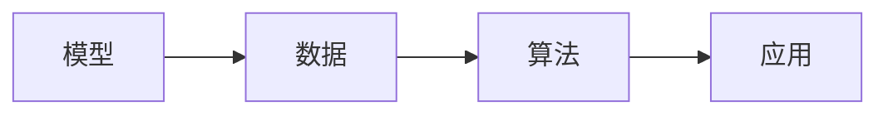
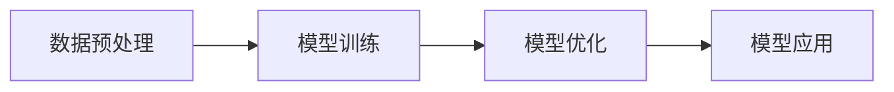

## 1.背景介绍

在当前的计算机科学领域，我们正在经历一场由人工智能驱动的革命。其中，一种名为LangChain的编程语言正逐渐崭露头角。LangChain不仅具有强大的功能，而且易于学习和使用。本文将深入介绍LangChain的核心原理和实践应用。

## 2.核心概念与联系

LangChain是一种基于大模型的编程语言，它的核心概念包括模型、数据、算法和应用。其中，模型是LangChain的基础，数据是模型的输入，算法是模型的运行机制，应用则是模型的输出。



## 3.核心算法原理具体操作步骤

LangChain的核心算法基于深度学习，包括以下几个步骤：

1. 数据预处理：将原始数据转换为模型可以接受的格式。
2. 模型训练：使用训练数据对模型进行训练。
3. 模型优化：通过调整模型参数来优化模型的性能。
4. 模型应用：将优化后的模型应用到实际问题中。



## 4.数学模型和公式详细讲解举例说明

LangChain的核心算法基于深度学习，其数学模型可以表示为：

$$
f(x) = Wx + b
$$

其中，$x$是输入数据，$W$是模型的权重，$b$是模型的偏置，$f(x)$是模型的输出。

在模型训练过程中，我们需要最小化损失函数：

$$
L = \frac{1}{n}\sum_{i=1}^{n}(y_i - f(x_i))^2
$$

其中，$n$是训练数据的数量，$y_i$是第$i$个数据的真实值，$f(x_i)$是模型对第$i$个数据的预测值。

## 5.项目实践：代码实例和详细解释说明

下面是一个简单的LangChain编程示例：

```langchain
def hello_world():
  print("Hello, World!")
```

在这个示例中，我们定义了一个名为`hello_world`的函数，这个函数的功能是打印一条消息"Hello, World!"。

## 6.实际应用场景

LangChain可以应用于各种场景，包括：

1. 数据分析：使用LangChain进行数据预处理、分析和可视化。
2. 机器学习：使用LangChain构建和训练机器学习模型。
3. 自动化测试：使用LangChain编写自动化测试脚本。

## 7.工具和资源推荐

以下是一些推荐的LangChain学习和开发资源：

1. LangChain官方文档：提供详细的语言规范和API参考。
2. LangChain在线编程平台：提供在线编程和调试工具。
3. LangChain社区：可以在这里找到许多优秀的教程和项目。

## 8.总结：未来发展趋势与挑战

随着人工智能的发展，LangChain的应用前景十分广阔。然而，LangChain也面临一些挑战，包括如何提高模型的性能，如何处理大规模数据，以及如何保证模型的安全性和可靠性。

## 9.附录：常见问题与解答

1. 问题：LangChain适合初学者学习吗？
答：LangChain的语法简单易懂，非常适合初学者学习。

2. 问题：如何优化LangChain模型？
答：优化LangChain模型主要包括选择合适的模型参数，使用更复杂的模型结构，以及使用更先进的优化算法。

作者：禅与计算机程序设计艺术 / Zen and the Art of Computer Programming
