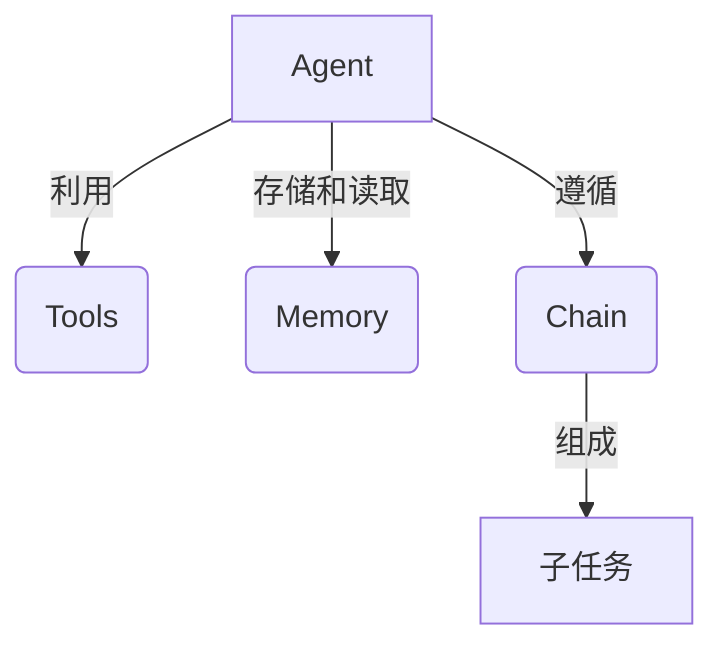
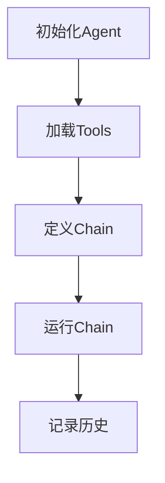
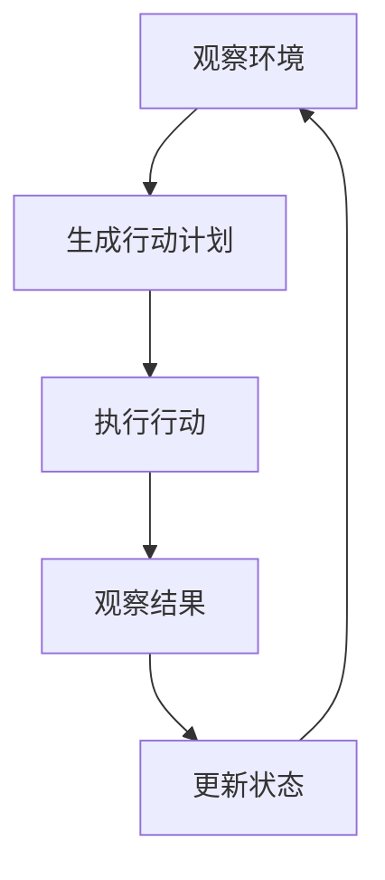

# 【LangChain编程：从入门到实践】大模型技术浪潮

## 1.背景介绍

### 1.1 人工智能的新时代

人工智能(AI)技术在过去几年经历了飞速发展,尤其是大型语言模型(Large Language Models,LLMs)的出现,为人工智能带来了新的里程碑。这些模型通过机器学习算法训练出强大的自然语言处理能力,可以理解和生成人类可读的文本,为广泛的应用场景带来了革命性的变化。

### 1.2 大模型技术的兴起

大模型是指包含数十亿甚至上万亿参数的深度学习模型,通过消化海量数据进行训练而获得强大的推理和生成能力。代表性的大模型有OpenAI的GPT-3、谷歌的PaLM、DeepMind的Chinchilla等。这些模型展现出惊人的语言理解、推理、创作等能力,在自然语言处理、问答系统、内容生成等领域取得了突破性进展。

### 1.3 LangChain:打通大模型与传统系统

尽管大模型技术前景广阔,但将其集成到实际应用中仍面临诸多挑战。LangChain作为一个强大的框架应运而生,旨在简化大模型的应用开发过程。它提供了一系列模块化的构建块,使开发人员能够轻松地将大模型与其他系统(如数据库、API等)集成,构建智能化的应用程序。

## 2.核心概念与联系

### 2.1 LangChain的核心概念

LangChain的核心概念包括Agent、Tool、Memory和Chain等,它们协同工作以实现智能化的任务处理流程。

- **Agent**: 代表一个具有特定能力和目标的智能体,通常由大型语言模型驱动。
- **Tool**: 封装了各种外部系统(如数据库、API等)的接口,供Agent调用以完成特定任务。
- **Memory**: 用于存储Agent与用户的交互历史,提供上下文信息以支持连贯的对话。
- **Chain**: 定义了一系列步骤或子任务,描述了Agent如何利用Tools和Memory来实现目标。

这些概念的有机结合,使LangChain能够构建出灵活、可扩展的智能应用程序。



### 2.2 LangChain与其他系统的集成

LangChain的强大之处在于它可以与各种外部系统无缝集成,包括:

- **数据库**: 如PostgreSQL、MySQL、MongoDB等,用于存储和检索结构化数据。
- **API**: 如OpenAI、Anthropic、Hugging Face等,提供各种AI服务和模型。
- **文件系统**: 如本地文件、云存储等,用于管理非结构化数据。
- **Web服务**: 如Wikipedia、新闻网站等,提供丰富的在线信息资源。

通过将这些异构系统与大模型相结合,LangChain可以构建出功能强大、智能化的应用程序,满足各种复杂的业务需求。

## 3.核心算法原理具体操作步骤

### 3.1 LangChain的工作流程

LangChain的工作流程可以概括为以下几个步骤:

1. **初始化Agent**: 根据任务需求,选择合适的大型语言模型并初始化Agent。
2. **加载Tools**: 根据任务需求,加载所需的Tools,如数据库连接、API客户端等。
3. **定义Chain**: 设计一个Chain,描述Agent如何利用Tools来完成任务。
4. **运行Chain**: 执行Chain,Agent将按照预定义的步骤与Tools交互,完成任务。
5. **记录历史**: 将Agent与用户的交互历史记录在Memory中,为后续对话提供上下文信息。



### 3.2 Agent的工作原理

Agent是LangChain中最核心的组件,它基于大型语言模型,通过与Tools和Memory的交互来完成各种任务。Agent的工作原理可以简化为以下几个步骤:

1. **观察环境**: Agent观察当前的任务状态,包括用户的输入、Memory中的历史信息等。
2. **生成行动计划**: 基于观察到的信息,Agent利用语言模型生成一个行动计划,描述如何利用Tools来完成任务。
3. **执行行动**: Agent执行生成的行动计划,调用相应的Tools,获取所需的信息或执行特定操作。
4. **观察结果**: Agent观察执行行动后的结果,包括Tools返回的数据、任务完成度等。
5. **更新状态**: 根据观察到的结果,Agent更新任务状态和Memory,准备进入下一个循环。



这种基于观察-规划-行动-观察的循环,使Agent能够灵活地处理各种复杂任务,并通过与Tools和Memory的交互不断优化自身的决策过程。

## 4.数学模型和公式详细讲解举例说明

### 4.1 语言模型的基础:N-gram模型

N-gram模型是自然语言处理中一种常用的统计语言模型,它根据前面的N-1个词来预测下一个词的概率。N-gram模型的核心是计算条件概率 $P(w_n|w_1,w_2,...,w_{n-1})$,即给定前面的词序列,预测第n个词的概率。

由于直接计算上述条件概率是非常困难的,因此N-gram模型通常采用马尔可夫假设,即只考虑最近的N-1个词,从而将条件概率简化为:

$$P(w_n|w_1,w_2,...,w_{n-1}) \approx P(w_n|w_{n-N+1},...,w_{n-1})$$

这种近似方法大大降低了计算复杂度,使得N-gram模型在实践中变得可行。

### 4.2 神经网络语言模型

尽管N-gram模型在某些场景下表现不错,但它存在一些固有的局限性,如无法捕捉长距离依赖关系、词表有限等。为了克服这些缺陷,神经网络语言模型(Neural Language Model,NLM)应运而生。

NLM通常采用循环神经网络(RNN)或transformer等神经网络架构,直接从原始词序列中学习语言模式。它们不再依赖于N-gram的马尔可夫假设,而是通过神经网络的参数来捕捉词与词之间的复杂关系。

对于给定的词序列 $w_1,w_2,...,w_n$,NLM的目标是最大化序列的概率 $P(w_1,w_2,...,w_n)$,这可以通过最小化负对数似然损失函数来实现:

$$\mathcal{L} = -\sum_{i=1}^n \log P(w_i|w_1,...,w_{i-1};\theta)$$

其中 $\theta$ 表示神经网络的参数,通过梯度下降等优化算法进行训练。

NLM展现出了强大的语言理解和生成能力,为大型语言模型的发展奠定了基础。

### 4.3 transformer和自注意力机制

Transformer是一种革命性的神经网络架构,它完全基于注意力机制,不再依赖于循环神经网络。Transformer的核心是自注意力(Self-Attention)机制,它允许模型在计算每个词的表示时,直接关注整个输入序列中的所有词,捕捉长距离依赖关系。

自注意力机制可以形式化为:

$$\mathrm{Attention}(Q, K, V) = \mathrm{softmax}(\frac{QK^T}{\sqrt{d_k}})V$$

其中 $Q$、$K$、$V$ 分别表示查询(Query)、键(Key)和值(Value)向量,它们都是输入序列在不同线性投影下的表示。$d_k$ 是缩放因子,用于防止点积过大导致梯度消失。

通过计算查询向量与所有键向量的点积,并对结果进行softmax归一化,自注意力机制可以自适应地为每个词分配不同的注意力权重,从而捕捉输入序列中的重要信息。

Transformer架构的另一个关键创新是多头注意力(Multi-Head Attention),它允许模型从不同的表示子空间中捕捉不同的信息,进一步提高了模型的表现力。

$$\mathrm{MultiHead}(Q, K, V) = \mathrm{Concat}(head_1, ..., head_h)W^O$$
$$\text{where } head_i = \mathrm{Attention}(QW_i^Q, KW_i^K, VW_i^V)$$

这些创新使得Transformer能够高效地建模长距离依赖关系,成为当前大型语言模型的主流架构。

## 5.项目实践:代码实例和详细解释说明

### 5.1 安装LangChain

LangChain可以通过pip轻松安装:

```bash
pip install langchain
```

### 5.2 初始化Agent

我们首先需要初始化一个Agent,以下代码示例使用OpenAI的text-davinci-003模型:

```python
from langchain.llms import OpenAI
from langchain.agents import initialize_agent

# 初始化语言模型
llm = OpenAI(temperature=0)

# 初始化Agent
agent = initialize_agent(llm, agent="zero-shot-react-description", verbose=True)
```

### 5.3 加载Tools

接下来,我们加载一些Tools,如Wikipedia搜索和Python REPL:

```python
from langchain.tools import WikipediaSearchRun, PythonREPLTool

# 初始化Tools
search = WikipediaSearchRun()
python_repl = PythonREPLTool()

# 将Tools传递给Agent
agent.add_tool(search)
agent.add_tool(python_repl)
```

### 5.4 运行Agent

现在我们可以让Agent执行任务了,以下示例是一个简单的Python代码解释任务:

```python
agent.run("""
以下是一段Python代码:

import math

def calculate_area(radius):
    return math.pi * radius ** 2

radius = 5
area = calculate_area(radius)
print(f"The area of a circle with radius {radius} is {area}")

请解释这段代码的作用,并分析其中的关键步骤。
""")
```

Agent将利用加载的Tools(如Wikipedia搜索和Python REPL)来理解和分析给定的代码,并生成一个详细的解释。

```
> 输入: 以下是一段Python代码:

import math

def calculate_area(radius):
    return math.pi * radius ** 2

radius = 5
area = calculate_area(radius)
print(f"The area of a circle with radius {radius} is {area}")

请解释这段代码的作用,并分析其中的关键步骤。

思考: 要解释这段Python代码的作用和关键步骤,我需要理解代码的每一部分是做什么的。让我首先搜索一些背景知识来帮助理解代码。

行动: 搜索维基百科上关于"Python math模块"和"Python函数"的信息
...
(搜索结果省略)

思考: 根据搜索结果,我现在对代码有了更好的理解。这段代码的主要目的是计算给定半径的圆的面积,并打印结果。关键步骤包括:

1. 导入math模块,以便使用math.pi获取圆周率π的值。
2. 定义一个名为calculate_area的函数,它接受一个参数radius(半径),并返回使用公式πr^2计算得到的圆的面积。
3. 将radius设置为5。
4. 调用calculate_area函数,将5作为参数传入,并将返回的面积值存储在area变量中。
5. 使用f-string格式化字符串,打印出半径和计算得到的面积。

让我用Python REPL工具运行这段代码,验证一下结果。

行动: 在Python REPL中运行代码
```python
import math

def calculate_area(radius):
    return math.pi * radius ** 2

radius = 5
area = calculate_area(radius)
print(f"The area of a circle with radius {radius} is {area}")
```
```
The area of a circle with radius 5 is 78.53981633974483
```

思考: 代码运行结果正确,面积计算无误。总的来说,这段代码通过定义一个计算圆面积的函数,并将给定的半径值传入该函数来计算并打印出圆的面积。它展示了如何在Python中导入模块、定义函数、使用数学运算以及格式