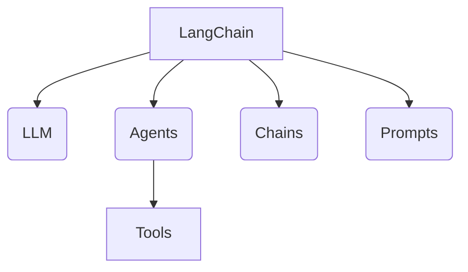
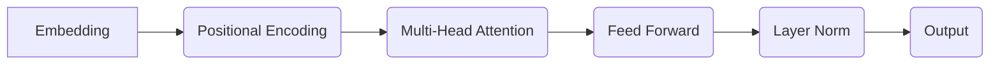
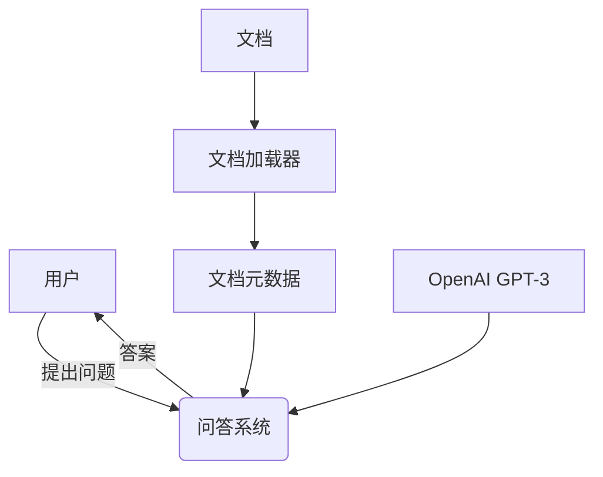

# 【LangChain编程：从入门到实践】应用部署

## 1. 背景介绍

### 1.1 人工智能的崛起

在过去的几十年里,人工智能(Artificial Intelligence, AI)技术取得了长足的进步,已经广泛应用于各个领域,如计算机视觉、自然语言处理、推理系统等。随着深度学习、强化学习等技术的不断发展,AI系统的性能不断提高,在很多领域已经超越了人类水平。

### 1.2 LangChain 简介

LangChain 是一个用 Python 编写的开源框架,旨在构建应用程序与语言模型(LLM)的接口。它提供了一套模块化的基元,用于增强语言模型的能力,例如数据加载、文本拆分、结果分析等。LangChain 支持与各种语言模型(如 GPT-3、BLOOM 等)集成,使开发人员能够轻松构建基于 LLM 的应用程序。

### 1.3 LangChain 的应用场景

LangChain 可用于构建各种基于语言的应用程序,例如:

- 问答系统
- 智能助手
- 文本摘要
- 代码生成
- 数据分析
- 内容创作
- ...

## 2. 核心概念与联系

### 2.1 LLM (Language Model)

LLM 是 LangChain 的核心组件。它是一种基于深度学习的语言模型,可以生成自然语言文本。常见的 LLM 包括 GPT-3、PaLM、BLOOM 等。LangChain 支持与多种 LLM 集成。

### 2.2 Agents

Agents 是 LangChain 中的智能代理,它们可以根据给定的目标自主地规划和执行一系列操作。Agents 可以利用各种工具(Tools)来完成复杂的任务。

### 2.3 Tools

Tools 是 Agents 可以使用的各种功能组件,例如搜索引擎、数据库、API 等。Agents 可以根据任务需求,组合使用多种 Tools 来完成目标。

### 2.4 Chains

Chains 是一系列预定义的组件序列,用于执行特定的任务。LangChain 提供了多种预构建的 Chains,如问答链(Question Answering Chain)、汇总链(Summarization Chain)等。开发人员也可以自定义链。

### 2.5 Prompts

Prompts 是向 LLM 提供的指令或上下文,用于指导 LLM 生成所需的输出。LangChain 提供了多种 Prompt 模板和工具,以优化 LLM 的输出质量。

### 2.6 Mermaid 架构流程图



## 3. 核心算法原理具体操作步骤  

### 3.1 LLM 集成

LangChain 支持与多种 LLM 集成,包括 OpenAI 的 GPT-3、Anthropic 的 Claude、Google 的 PaLM 等。集成步骤通常包括:

1. 安装相应的 Python 包
2. 获取 API 密钥(如果需要)
3. 创建 LLM 对象
4. 调用 LLM 生成文本

示例代码(使用 OpenAI GPT-3):

```python
from langchain.llms import OpenAI

# 替换为您的 OpenAI API 密钥
openai_api_key = "YOUR_OPENAI_API_KEY"

# 创建 LLM 对象
llm = OpenAI(openai_api_key=openai_api_key)

# 生成文本
text = llm.generate([prompt])
print(text)
```

### 3.2 Agents 使用

Agents 可以自主规划和执行操作序列,以完成复杂的任务。创建 Agent 的步骤包括:

1. 定义 Tools
2. 初始化 Agent
3. 运行 Agent

示例代码(使用 Wikipedia 搜索 Tool):

```python
from langchain.agents import initialize_agent, Tool
from langchain.llms import OpenAI
import os

# 创建 Wikipedia 搜索 Tool
search = Tool(
    name="Wikipedia Search",
    func=lambda query: wikipedia.search(query),
    description="Searches Wikipedia for the given query"
)

# 创建 LLM 对象
llm = OpenAI(openai_api_key=os.environ["OPENAI_API_KEY"])

# 初始化 Agent
agent = initialize_agent([search], llm, agent="conversational-react-description", verbose=True)

# 运行 Agent
agent.run("What is the capital of France?")
```

### 3.3 Chains 使用

Chains 是一系列预定义的组件序列,用于执行特定的任务。LangChain 提供了多种预构建的 Chains,也可以自定义 Chains。

示例代码(使用问答链):

```python
from langchain.chains import RetrievalQA
from langchain.llms import OpenAI
from langchain.document_loaders import TextLoader

# 加载文档
loader = TextLoader('document.txt')
documents = loader.load()

# 创建 LLM 对象
llm = OpenAI(openai_api_key=os.environ["OPENAI_API_KEY"])

# 初始化问答链
qa = RetrievalQA.from_chain_type(llm, chain_type="stuff", retriever=documents.metadata)

# 运行问答链
query = "What is the capital of France?"
result = qa({"query": query})
print(result['result'])
```

### 3.4 Prompts 工程

Prompts 对于 LLM 的输出质量至关重要。LangChain 提供了多种 Prompt 模板和工具,用于优化 Prompts。

示例代码(使用 PromptTemplate):

```python
from langchain.prompts import PromptTemplate

# 定义 Prompt 模板
prompt_template = """
下面是一个关于{subject}的问题:
{query}

请给出一个简洁的回答。
"""

# 创建 PromptTemplate 对象
prompt = PromptTemplate(template=prompt_template, input_variables=["subject", "query"])

# 生成 Prompt
subject = "法国"
query = "法国的首都是什么?"
prompt_text = prompt.format(subject=subject, query=query)

# 将 Prompt 输入 LLM
llm = OpenAI(openai_api_key=os.environ["OPENAI_API_KEY"])
result = llm(prompt_text)
print(result)
```

## 4. 数学模型和公式详细讲解举例说明

在 LangChain 中,数学模型和公式主要用于 LLM 的训练和优化。常见的数学模型包括:

### 4.1 Transformer 模型

Transformer 是一种基于注意力机制的序列到序列模型,广泛应用于自然语言处理任务。它的核心思想是通过自注意力机制捕获输入序列中任意两个位置之间的依赖关系。

Transformer 的自注意力机制可以用以下公式表示:

$$
\text{Attention}(Q, K, V) = \text{softmax}\left(\frac{QK^T}{\sqrt{d_k}}\right)V
$$

其中,$$Q$$、$$K$$、$$V$$分别表示查询(Query)、键(Key)和值(Value)。$$d_k$$是缩放因子,用于防止点积过大导致梯度消失。

Transformer 的编码器和解码器结构如下:



### 4.2 语言模型微调

语言模型微调(Language Model Fine-tuning)是一种常见的技术,可以通过在特定任务上进行额外训练,来调整预训练语言模型的参数,从而提高模型在该任务上的性能。

微调过程通常包括以下步骤:

1. 加载预训练语言模型
2. 准备训练数据
3. 定义损失函数和优化器
4. 训练模型
5. 评估模型性能

微调过程中常用的损失函数包括交叉熵损失(Cross-Entropy Loss)和最大似然估计(Maximum Likelihood Estimation, MLE)。

交叉熵损失可以用以下公式表示:

$$
\mathcal{L}(\theta) = -\frac{1}{N}\sum_{i=1}^{N}\sum_{j=1}^{T}y_{ij}\log p_\theta(x_{ij}|x_{i,<j})
$$

其中,$$\theta$$表示模型参数,$$N$$是训练样本数量,$$T$$是序列长度,$$y_{ij}$$是真实标签,$$p_\theta(x_{ij}|x_{i,<j})$$是模型预测的概率分布。

最大似然估计的目标是最大化训练数据的对数似然:

$$
\mathcal{L}(\theta) = \frac{1}{N}\sum_{i=1}^{N}\log p_\theta(x_i)
$$

其中,$$p_\theta(x_i)$$是模型对训练样本$$x_i$$的概率分布。

## 5. 项目实践: 代码实例和详细解释说明

在这一部分,我们将通过一个实际项目来演示如何使用 LangChain 构建一个问答系统。

### 5.1 项目概述

我们将构建一个基于 LangChain 的问答系统,可以从给定的文本文档中回答相关问题。该系统将使用 OpenAI 的 GPT-3 作为 LLM,并利用 RetrievalQA 链来处理问题和文档。

### 5.2 安装依赖

首先,我们需要安装所需的 Python 包:

```
pip install langchain openai
```

### 5.3 加载文档

我们将使用一个名为 `document.txt` 的文本文件作为知识库。可以使用 `TextLoader` 加载文件:

```python
from langchain.document_loaders import TextLoader

loader = TextLoader('document.txt')
documents = loader.load()
```

### 5.4 初始化 LLM 和链

接下来,我们需要初始化 OpenAI GPT-3 LLM 对象,并创建一个 RetrievalQA 链:

```python
from langchain.llms import OpenAI
from langchain.chains import RetrievalQA

# 替换为您的 OpenAI API 密钥
openai_api_key = "YOUR_OPENAI_API_KEY"

# 创建 LLM 对象
llm = OpenAI(openai_api_key=openai_api_key)

# 初始化问答链
qa = RetrievalQA.from_chain_type(llm, chain_type="stuff", retriever=documents.metadata)
```

### 5.5 运行问答系统

现在,我们可以向问答系统提出问题,并获取答案:

```python
query = "What is the capital of France?"
result = qa({"query": query})
print(result['result'])
```

输出结果将是对于给定问题的答案,基于文档中的信息。

### 5.6 Mermaid 流程图

以下是问答系统的 Mermaid 流程图:



## 6. 实际应用场景

LangChain 可以应用于各种场景,包括但不限于:

### 6.1 智能助手

利用 LangChain,我们可以构建智能助手系统,为用户提供个性化的问答、任务协助等服务。这些助手可以集成多种功能,如日程管理、信息查询、内容创作等。

### 6.2 知识库构建

LangChain 可以帮助我们从各种数据源(如文档、网页、数据库等)中提取和组织知识,构建知识库。这些知识库可以用于问答系统、内容生成等应用。

### 6.3 代码生成

利用 LangChain 和 LLM,我们可以开发代码生成系统,根据用户需求自动生成代码片段或完整程序。这对于提高开发效率和降低编码门槛非常有帮助。

### 6.4 数据分析

LangChain 可以与数据分析工具相结合,用于自动化数据分析流程。例如,我们可以构建系统来回答与数据相关的问题、生成数据报告等。

### 6.5 内容创作

LangChain 可以辅助内容创作,如文章写作、故事创作、广告文案生成等。LLM 可以根据提示生成初始内容,人工编辑和优化后即可获得高质量的内容。

## 7. 工具和资源推荐

### 7.1 LangChain 官方资源

- [LangChain 官网](https://python.langchain.com/en/latest/index.html)
- [LangChain GitHub 仓库](https://github.com/hwchase17/langchain)
- [LangChain 文档](https://python.langchain.com/