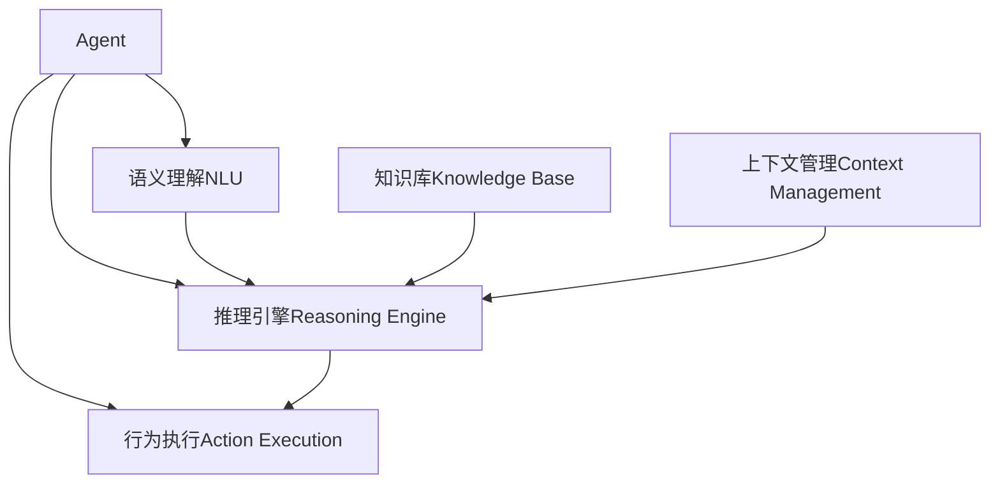

# 【大模型应用开发 动手做AI Agent】Agent的推理引擎：ReAct框架

## 1. 背景介绍

### 1.1 大模型时代的到来

随着人工智能技术的不断发展,特别是大规模语言模型(如GPT-3、ChatGPT等)的出现,我们正式步入了大模型时代。这些大模型能够通过海量数据训练,掌握丰富的知识和语义理解能力,为各种应用场景提供强大的支持。

### 1.2 智能Agent的需求

在大模型时代,单纯的问答系统或对话系统已经无法满足复杂应用场景的需求。我们需要一种更智能、更主动、更具备推理和决策能力的Agent,能够根据用户需求自主地规划和执行任务。

### 1.3 ReAct框架的作用

ReAct(Reasoning and Acting)框架旨在为大模型提供推理和行为决策的能力,使其能够根据用户意图和上下文信息进行推理,并作出合理的行为决策和执行。它是构建智能Agent不可或缺的核心组件。

## 2. 核心概念与联系

### 2.1 Agent

Agent是一个具备感知、推理和行为能力的智能体,能够根据环境状态和用户意图作出合理的决策和行为。在ReAct框架中,Agent是最顶层的概念,包含了其他核心组件。

### 2.2 语义理解(NLU)

语义理解(Natural Language Understanding)模块负责从用户输入的自然语言中提取意图(Intent)和实体(Entity),为后续的推理和决策提供基础。

### 2.3 推理引擎(Reasoning Engine)

推理引擎是ReAct框架的核心,它根据语义理解的结果、上下文信息和知识库,进行复杂的推理过程,生成合理的行为计划。

### 2.4 行为执行(Action Execution)

行为执行模块负责将推理引擎生成的行为计划转化为具体的操作,如查询数据库、调用API、控制外部设备等。

### 2.5 知识库(Knowledge Base)

知识库存储了Agent所需的各种结构化和非结构化知识,为推理引擎提供支持。

### 2.6 上下文管理(Context Management)

上下文管理模块跟踪和维护对话的上下文信息,包括对话历史、用户偏好等,为推理引擎提供必要的上下文支持。

### 2.7 核心概念关系

这些核心概念相互关联、相互支撑,共同构建了一个完整的智能Agent系统。下面是它们之间的关系示意图:



## 3. 核心算法原理具体操作步骤

ReAct框架的核心是推理引擎,它采用了一种基于规则的推理算法,具体操作步骤如下:

### 3.1 输入处理

1) 从语义理解模块获取用户意图和相关实体
2) 从上下文管理模块获取对话历史和其他上下文信息
3) 从知识库获取与当前意图和实体相关的知识

### 3.2 规则匹配

1) 遍历推理规则库,找到与当前意图和实体相匹配的规则
2) 对匹配的规则进行优先级排序

### 3.3 规则执行

1) 按优先级执行匹配的规则
2) 规则可能需要从知识库查询额外信息
3) 规则可能会触发新的子意图,需要递归执行子规则

### 3.4 结果生成

1) 根据规则执行的结果,生成行为计划
2) 将行为计划传递给行为执行模块

### 3.5 状态更新

1) 将当前对话状态保存到上下文管理模块
2) 根据需要更新知识库

该算法的优点是简单、高效,易于构建和维护。但也存在一些局限性,比如规则的表达能力有限、难以处理复杂场景等。因此,在某些应用场景下,我们可能需要采用基于机器学习的推理算法。

## 4. 数学模型和公式详细讲解举例说明

在ReAct框架的推理过程中,我们可以使用一些数学模型来量化和优化决策过程。下面是一些常用的数学模型和公式:

### 4.1 规则匹配度量

我们可以为每个规则定义一个匹配度量,用于衡量当前输入与规则的匹配程度。一种常用的匹配度量是基于TF-IDF(Term Frequency-Inverse Document Frequency)的相似度计算:

$$
\text{sim}(q, r) = \sum_{t \in q \cap r} \text{tfidf}(t, q) \cdot \text{tfidf}(t, r)
$$

其中,
- $q$是用户查询
- $r$是规则描述
- $t$是查询和规则中共同的词项
- $\text{tfidf}(t, x)$是词项$t$在文本$x$中的TF-IDF值

匹配度量越高,表示规则与当前输入越匹配。

### 4.2 规则优先级计算

在多个规则匹配的情况下,我们需要确定执行顺序。一种方法是为每个规则指定一个静态优先级。另一种方法是动态计算优先级,例如基于规则的置信度:

$$
\text{priority}(r) = \text{confidence}(r) \cdot \text{sim}(q, r)
$$

其中,
- $\text{confidence}(r)$是规则$r$的置信度,可以根据历史数据学习得到
- $\text{sim}(q, r)$是规则与当前查询的匹配度量

优先级高的规则将优先执行。

### 4.3 规则执行成本估计

在执行规则时,我们可以估计每个规则的执行成本,例如时间复杂度、计算资源消耗等。这有助于在资源受限的情况下,优化执行策略。

$$
\text{cost}(r) = \sum_i w_i \cdot f_i(r)
$$

其中,
- $f_i$是表示第$i$种成本的特征函数
- $w_i$是对应特征的权重

通过调整权重,我们可以根据实际需求确定成本估计的重点。

### 4.4 行为效用评估

对于每个可能的行为计划,我们可以估计其效用,即满足用户需求的程度。这可以帮助Agent选择最优的行为方案。

$$
\text{utility}(a) = \sum_i w_i \cdot f_i(a, c)
$$

其中,
- $a$是行为计划
- $c$是当前上下文
- $f_i$是表示第$i$种效用的特征函数,如准确性、完整性、响应时间等
- $w_i$是对应特征的权重

通过调整权重,我们可以根据不同场景的需求,确定效用评估的重点。

以上数学模型和公式为ReAct框架的推理过程提供了量化支持,有助于提高决策的准确性和效率。在实际应用中,我们可以根据具体需求对这些模型进行调整和优化。

## 5. 项目实践: 代码实例和详细解释说明

为了帮助读者更好地理解ReAct框架的实现,我们提供了一个简单的Python示例项目。该项目实现了一个基于规则的天气查询Agent,可以根据用户的查询意图返回相应的天气信息。

### 5.1 项目结构

```
weather_agent/
├── agent.py        # Agent主类
├── nlu.py          # 语义理解模块
├── reasoning.py    # 推理引擎模块
├── action.py       # 行为执行模块
├── knowledge.py    # 知识库模块
├── context.py      # 上下文管理模块
├── rules.yml       # 推理规则配置文件
└── data/           # 天气数据文件
```

### 5.2 核心代码解释

#### 5.2.1 语义理解模块(nlu.py)

该模块使用基于规则的方法从用户查询中提取意图和实体。

```python
def extract_intent_entity(query):
    # 使用正则表达式匹配查询意图
    if re.search(r'(什么|怎么|如何).*?(天气|气温)', query):
        intent = 'query_weather'
    elif re.search(r'(几度|温度|多少度)', query):
        intent = 'query_temperature'
    else:
        return None, None

    # 使用正则表达式提取实体
    loc_pattern = r'(在|的|位于)?([^，。？！]+?)(市|县|区|乡|镇|地|省|国|国家)?'
    match = re.search(loc_pattern, query)
    location = match.group(2) if match else None

    return intent, location
```

#### 5.2.2 推理引擎模块(reasoning.py)

该模块实现了基于规则的推理算法,根据意图和实体执行对应的规则。

```python
def reason(intent, entity, context, kb):
    # 加载推理规则
    with open('rules.yml', 'r') as f:
        rules = yaml.safe_load(f)

    # 匹配并执行规则
    for rule in rules.get(intent, []):
        if rule['entity'] is None or entity == rule['entity']:
            return rule['action'](entity, context, kb)

    # 未匹配到规则,返回默认响应
    return "抱歉,我无法回答这个问题。"
```

#### 5.2.3 行为执行模块(action.py)

该模块定义了不同的行为函数,用于查询天气数据并生成响应。

```python
def get_weather_info(location, context, kb):
    # 从知识库查询天气数据
    data = kb.get_weather_data(location)
    if data:
        return f"{location}的天气是{data['weather']},温度是{data['temperature']}度。"
    else:
        return f"抱歉,我没有{location}的天气信息。"

def get_temperature(location, context, kb):
    # 从知识库查询温度数据
    data = kb.get_weather_data(location)
    if data:
        return f"{location}的温度是{data['temperature']}度。"
    else:
        return f"抱歉,我没有{location}的温度信息。"
```

#### 5.2.4 知识库模块(knowledge.py)

该模块提供了从本地文件加载天气数据的功能。

```python
class WeatherKB:
    def __init__(self, data_dir):
        self.data_dir = data_dir
        self.data = {}
        self.load_data()

    def load_data(self):
        # 从文件加载天气数据
        for file in os.listdir(self.data_dir):
            location = file.split('.')[0]
            with open(os.path.join(self.data_dir, file), 'r') as f:
                data = json.load(f)
                self.data[location] = data

    def get_weather_data(self, location):
        # 查询天气数据
        return self.data.get(location, None)
```

#### 5.2.5 Agent主类(agent.py)

该类集成了上述各个模块,提供了与用户交互的接口。

```python
class WeatherAgent:
    def __init__(self, kb_dir):
        self.kb = WeatherKB(kb_dir)
        self.context = {}

    def run(self):
        while True:
            query = input('您有什么问题吗? ')
            intent, entity = extract_intent_entity(query)
            if intent:
                response = reason(intent, entity, self.context, self.kb)
                print(response)
            else:
                print("抱歉,我没有理解您的问题。")
```

### 5.3 运行示例

```
$ python agent.py
您有什么问题吗? 上海天气怎么样
上海的天气是晴天,温度是25度。
您有什么问题吗? 北京温度多少度
北京的温度是18度。
您有什么问题吗? 纽约的天气情况
抱歉,我没有纽约的天气信息。
```

通过这个简单的示例,我们可以看到ReAct框架的基本实现流程。在实际应用中,我们需要根据具体需求,对各个模块进行扩展和优化,以支持更复杂的场景。

## 6. 实际应用场景

ReAct框架可以应用于各种需要智能Agent的场景,例如:

### 6.1 智能助理

智能助手是ReAct框架的典型应用场景。通过语音或文本交互,用户可以让智能助手执行各种任务,如查询信息、控制家居设备、管理日程等。

### 6.2 客户服务

在客户服务领域,ReAct框架可以用于构建智能客服系统。该系统能够理解用户的问题,并根据知识库和