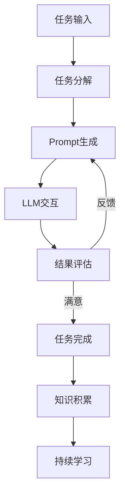

# 【大模型应用开发 动手做AI Agent】AutoGPT实战

## 1.背景介绍

随着人工智能技术的不断发展,大型语言模型(Large Language Model,LLM)已经成为当前最炙手可热的AI技术之一。作为基于自然语言处理(NLP)和深度学习技术的核心模型,LLM具有强大的语言理解和生成能力,可以在多种任务中发挥重要作用,包括问答系统、内容生成、智能写作辅助等。

其中,OpenAI推出的GPT-3是目前最知名的大型语言模型之一。GPT-3拥有1750亿个参数,通过大规模的语料训练,展现出令人惊叹的语言生成能力。GPT-3的出现,使得构建复杂的对话AI系统、智能助理等应用成为可能。

AutoGPT是一个基于GPT-3的开源AI代理框架,旨在通过提示(Prompt)技术,指导GPT-3执行各种复杂任务。AutoGPT的核心思想是将人类的指令转化为一系列连贯的Prompt,反复迭代地与GPT-3交互,实现任务的自主完成。AutoGPT可被视为一个通用的AI代理,具备持续学习、自我反馈的能力,有望在未来发展成为真正的"通用人工智能"(Artificial General Intelligence,AGI)系统。

本文将深入探讨AutoGPT的核心技术原理,介绍其架构设计、算法流程,并通过实例讲解如何基于AutoGPT开发智能AI代理应用。我们将一步步手把手地开发一个简单的AI助理,帮助读者更好地理解和掌握AutoGPT的使用方法。

## 2.核心概念与联系

在深入AutoGPT的技术细节之前,我们先来了解一些核心概念,为后续内容的理解打下基础。

### 2.1 大型语言模型(LLM)

大型语言模型(LLM)是一种基于深度学习的NLP模型,通过在海量文本数据上训练,学习语言的语义和上下文信息。LLM具有强大的语言理解和生成能力,可以用于多种NLP任务,如文本生成、问答、机器翻译等。

目前常见的LLM包括GPT-3、BERT、XLNet等。其中,GPT-3因其庞大的参数量(1750亿)和出色的性能而备受关注。

### 2.2 Prompt技术

Prompt技术是指通过精心设计的文本提示,引导LLM生成所需的输出。Prompt可以是一个问题、一段上下文描述或一个任务指令,LLM会根据Prompt生成相应的回复或执行相应的操作。

Prompt技术是利用LLM强大的语言理解和生成能力的关键。通过不断优化Prompt的表达方式,可以指导LLM完成更加复杂的任务。

### 2.3 AI代理(Agent)

AI代理是一种自主系统,能够感知环境、执行操作并与环境交互,以实现特定目标。在AutoGPT中,AI代理是指基于LLM(如GPT-3)构建的智能系统,能够理解和执行人类的指令,并通过与LLM的交互完成各种任务。

AI代理的核心在于如何将人类的高层次指令转化为LLM可以理解和执行的Prompt序列,并根据LLM的输出反馈,持续优化Prompt,最终完成预期任务。

### 2.4 AutoGPT

AutoGPT是一个开源的AI代理框架,旨在通过与LLM(如GPT-3)的交互,自主完成各种复杂任务。AutoGPT的核心思想是将人类的高层次指令分解为一系列Prompt,反复与LLM交互并根据反馈进行调整,直至完成整个任务。

AutoGPT具有以下关键特性:

- **任务分解**:将复杂任务分解为一系列子任务,并生成对应的Prompt序列。
- **自我反馈**:根据LLM的输出,评估当前Prompt的有效性,并进行自我调整和优化。
- **持续学习**:通过与LLM的交互,不断积累新的知识和经验,提高任务完成能力。
- **开放式架构**:支持插件化扩展,可以集成各种工具和服务,实现更强大的功能。

AutoGPT的目标是构建一个通用的AI代理系统,能够自主学习和执行各种复杂任务,为未来的AGI(通用人工智能)系统奠定基础。

## 3.核心算法原理具体操作步骤

AutoGPT的核心算法流程可以概括为以下几个关键步骤:

1. **任务分解**
2. **Prompt生成**
3. **LLM交互**
4. **结果评估**
5. **自我反馈**
6. **知识积累**

我们通过一个具体的示例来详细解释每个步骤的原理和操作流程。

假设我们希望开发一个AI助理,能够根据用户的需求,自动规划一个旅行路线并给出建议。我们将按照上述步骤,利用AutoGPT框架实现这个AI助理。



### 3.1 任务分解

首先,我们需要将高层次的"规划旅行路线"任务分解为一系列具体的子任务。这个过程可以由AutoGPT自动完成,也可以由人工进行辅助。

一种可能的分解方式如下:

1. 确定旅行目的地
2. 收集目的地的旅游景点信息
3. 规划景点游览路线和时间安排
4. 查找交通和住宿信息
5. 整理旅行建议和注意事项

通过任务分解,我们将一个复杂的旅行规划任务拆分为多个具体的子任务,为后续的Prompt生成做好准备。

### 3.2 Prompt生成

对于每个子任务,AutoGPT需要生成对应的Prompt,以引导LLM(如GPT-3)执行相应的操作。Prompt的生成过程需要综合考虑任务的具体要求、LLM的能力限制以及上下文信息等多方面因素。

以"确定旅行目的地"这个子任务为例,AutoGPT可能会生成如下Prompt:

```
你是一名旅行规划师,需要为一位客户规划一次旅行路线。请根据以下信息,推荐一个合适的旅行目的地:

客户信息:
- 来自北京,计划7天左右的国内旅行
- 喜欢自然风光和历史人文,不太适应高强度活动
- 预算在5000元左右

请给出你的目的地推荐,并简要说明理由。
```

这个Prompt向LLM提供了必要的背景信息和任务要求,LLM就可以根据这些信息生成相应的回复,如推荐"云南丽江"作为目的地,并解释原因。

### 3.3 LLM交互

获得Prompt后,AutoGPT将其发送给LLM(如GPT-3),并获取LLM生成的回复。这个过程实际上是AutoGPT与LLM进行交互和对话的关键环节。

以上一步生成的Prompt为例,GPT-3可能会生成如下回复:

```
根据您提供的信息,我推荐云南丽江作为这次7天左右的国内旅行目的地。

理由如下:
1. 丽江拥有独特的纳西族文化和建筑风格,能满足您对历史人文的偏好。
2. 丽江坐拥jade龙雪山、蓝月谷等自然风光,适合欣赏自然景观。
3. 丽江的旅游活动多为观光游览,强度适中,符合您的需求。
4. 丽江旅游价格相对合理,7天左右的行程预算5000元左右可以较为充裕。

总的来说,丽江兼具人文和自然景观,且旅游强度适中、性价比较高,非常适合这次旅行。如果您有其他考虑因素,也可以进一步告知,我会重新推荐目的地。
```

AutoGPT会获取并分析这个回复,判断它是否满足了"确定旅行目的地"这个子任务的要求。如果满足,就可以进入下一步;否则,AutoGPT需要优化Prompt,再次与LLM交互,直到获得满意的结果。

### 3.4 结果评估

对于LLM生成的每个回复,AutoGPT都需要进行评估,判断它是否满足了当前子任务的要求。评估的依据包括:

- 回复内容是否与任务目标相关
- 回复是否包含所需的关键信息
- 回复是否符合预期的格式和质量标准

评估过程可以由人工执行,也可以由AutoGPT自身的评估模块自动完成。自动评估通常基于一些预定义的规则和指标,如关键词匹配、语义相似度计算等。

如果评估结果不理想,AutoGPT会根据反馈对Prompt进行优化,再次与LLM交互,直到获得满意的结果。这个自我反馈和迭代优化的过程是AutoGPT的核心特征之一。

### 3.5 自我反馈

当LLM的回复未能满足当前子任务要求时,AutoGPT需要对Prompt进行优化和调整,以获得更好的结果。这个过程被称为"自我反馈"。

自我反馈的实现方式有多种,包括:

1. **Prompt改写**: 根据LLM回复的不足之处,修改Prompt的表述方式,使其更加清晰、具体。
2. **上下文补充**: 为Prompt补充更多的背景信息和约束条件,引导LLM生成更准确的回复。
3. **结构优化**: 调整Prompt的结构和组织方式,使其更加符合LLM的理解能力。
4. **反馈学习**: 将LLM的回复作为反馈,训练AutoGPT自身的Prompt优化模型,提高后续Prompt生成的质量。

自我反馈的目标是不断优化Prompt,直到LLM生成的回复能够满足当前子任务的要求。这个过程需要反复尝试和迭代,直到达到预期效果。

### 3.6 知识积累

在完成每个子任务后,AutoGPT会将LLM生成的有效回复作为新的知识进行存储和积累。这些知识不仅包括任务相关的实体信息(如景点名称、交通信息等),还包括LLM在执行任务过程中获得的经验和技巧。

知识积累的目的是为了让AutoGPT在处理后续相似任务时,可以利用先前获得的知识和经验,提高任务完成的效率和质量。这种持续学习的能力是AutoGPT区别于传统规则系统的关键优势之一。

在我们的旅行规划示例中,AutoGPT可以积累诸如"丽江是一个适合自然和人文游的旅游目的地"、"7天左右的丽江游需要注意天气变化"等知识,为后续的路线规划和建议提供有价值的参考。

通过上述6个步骤的反复执行,AutoGPT就可以逐步完成整个"规划旅行路线"的复杂任务。每个步骤都有其关键作用,相互协作、相互促进,最终实现了AI代理的自主学习和任务执行能力。

## 4.数学模型和公式详细讲解举例说明

在AutoGPT的实现过程中,数学模型和公式发挥着重要作用,尤其是在Prompt优化、结果评估和知识积累等环节。下面我们将详细介绍一些核心的数学模型和公式。

### 4.1 语义相似度计算

语义相似度是衡量两段文本在语义上的相似程度的一种指标。在AutoGPT中,语义相似度计算被广泛应用于以下场景:

- 评估LLM生成回复与任务要求的相关性
- 判断新获得的知识与已有知识库的重复程度
- 根据语义相似度对知识进行聚类和组织

常用的语义相似度计算方法有余弦相似度、Word Mover's Distance等。以余弦相似度为例,其计算公式如下:

$$\text{sim}(X, Y) = \cos(\theta) = \frac{X \cdot Y}{\|X\|\|Y\|} = \frac{\sum\limits_{i=1}^{n}{X