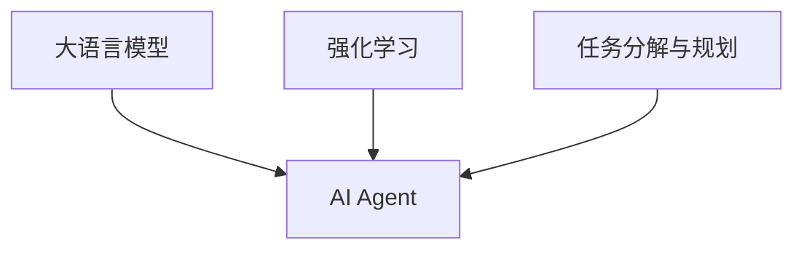

# 【大模型应用开发 动手做AI Agent】BabyAGI简介

## 1. 背景介绍
### 1.1 人工智能的发展历程
#### 1.1.1 早期的人工智能
#### 1.1.2 机器学习的兴起  
#### 1.1.3 深度学习的突破

### 1.2 大语言模型的崛起
#### 1.2.1 Transformer 架构的提出
#### 1.2.2 GPT 系列模型的发展
#### 1.2.3 ChatGPT 的广泛应用

### 1.3 AI Agent 的概念与意义
#### 1.3.1 AI Agent 的定义
#### 1.3.2 AI Agent 的特点
#### 1.3.3 AI Agent 的应用前景

## 2. 核心概念与联系
### 2.1 大语言模型
#### 2.1.1 大语言模型的定义
#### 2.1.2 大语言模型的特点
#### 2.1.3 大语言模型的训练方法

### 2.2 强化学习
#### 2.2.1 强化学习的基本概念  
#### 2.2.2 强化学习的主要算法
#### 2.2.3 强化学习在 AI Agent 中的应用

### 2.3 任务分解与规划
#### 2.3.1 任务分解的概念
#### 2.3.2 任务规划的方法
#### 2.3.3 任务分解与规划在 AI Agent 中的作用



## 3. 核心算法原理具体操作步骤
### 3.1 BabyAGI 的整体架构
#### 3.1.1 BabyAGI 的组成部分
#### 3.1.2 BabyAGI 的工作流程
#### 3.1.3 BabyAGI 的优缺点分析

### 3.2 任务分解算法
#### 3.2.1 任务分解算法的输入与输出
#### 3.2.2 任务分解算法的具体步骤
#### 3.2.3 任务分解算法的优化方法

### 3.3 任务执行与反馈
#### 3.3.1 任务执行的过程
#### 3.3.2 反馈信息的获取与处理
#### 3.3.3 基于反馈的任务调整策略

## 4. 数学模型和公式详细讲解举例说明
### 4.1 强化学习的数学模型
#### 4.1.1 马尔可夫决策过程（MDP）
MDP 可以用一个五元组 $\langle S, A, P, R, \gamma \rangle$ 来表示：

- $S$：状态空间，表示智能体所处的环境状态集合。
- $A$：动作空间，表示智能体可以采取的行动集合。
- $P$：状态转移概率，$P(s'|s,a)$ 表示在状态 $s$ 下执行动作 $a$ 后转移到状态 $s'$ 的概率。
- $R$：奖励函数，$R(s,a)$ 表示在状态 $s$ 下执行动作 $a$ 后获得的即时奖励。
- $\gamma$：折扣因子，$\gamma \in [0,1]$，表示未来奖励的折扣程度。

#### 4.1.2 值函数与贝尔曼方程
- 状态值函数：$V^\pi(s)=\mathbb{E}^\pi[\sum_{t=0}^{\infty}\gamma^t R(s_t,a_t)|s_0=s]$
- 状态-动作值函数：$Q^\pi(s,a)=\mathbb{E}^\pi[\sum_{t=0}^{\infty}\gamma^t R(s_t,a_t)|s_0=s,a_0=a]$
- 贝尔曼方程：
$$V^\pi(s)=\sum_{a \in A}\pi(a|s)\sum_{s' \in S}P(s'|s,a)[R(s,a)+\gamma V^\pi(s')]$$
$$Q^\pi(s,a)=\sum_{s' \in S}P(s'|s,a)[R(s,a)+\gamma \sum_{a' \in A}\pi(a'|s')Q^\pi(s',a')]$$

### 4.2 任务分解的数学模型
#### 4.2.1 层次化任务网络（HTN）
HTN 可以用一个六元组 $\langle S, O, M, \mathcal{T}, \mathcal{D}, \mathcal{C} \rangle$ 来表示：

- $S$：状态空间，表示任务执行过程中的状态集合。
- $O$：操作符集合，表示可执行的原子任务。
- $M$：方法集合，表示将复合任务分解为子任务的方法。
- $\mathcal{T}$：任务集合，包括原子任务和复合任务。
- $\mathcal{D}$：任务分解关系，表示复合任务与子任务之间的分解关系。
- $\mathcal{C}$：约束条件，表示任务执行过程中需要满足的条件。

#### 4.2.2 任务分解算法
任务分解算法可以用如下的伪代码来表示：

```
function DecomposeTask(task, state)
    if task is atomic then
        return [task]
    else
        for each method m applicable to task in state do
            subtasks ← ApplyMethod(m, state)
            plan ← []
            for each subtask in subtasks do
                subplan ← DecomposeTask(subtask, state)
                if subplan = failure then
                    break
                else
                    plan ← plan + subplan
            if plan != failure then
                return plan
        return failure
```

## 5. 项目实践：代码实例和详细解释说明
### 5.1 BabyAGI 的 Python 实现
#### 5.1.1 环境配置与依赖库安装
#### 5.1.2 核心类与函数的实现
#### 5.1.3 任务分解与执行流程的代码实现

### 5.2 使用 BabyAGI 解决实际问题
#### 5.2.1 定义问题与目标
#### 5.2.2 设计任务分解策略
#### 5.2.3 运行 BabyAGI 并分析结果

### 5.3 BabyAGI 的改进与优化
#### 5.3.1 引入更高效的任务分解算法
#### 5.3.2 优化任务执行与反馈机制
#### 5.3.3 增强 BabyAGI 的鲁棒性与适应性

## 6. 实际应用场景
### 6.1 智能客服
#### 6.1.1 客户问题的自动分类与分发
#### 6.1.2 基于知识库的问题解答
#### 6.1.3 客户满意度的实时评估与反馈

### 6.2 个性化推荐
#### 6.2.1 用户画像的自动构建
#### 6.2.2 基于用户兴趣的商品推荐
#### 6.2.3 推荐结果的实时调整与优化

### 6.3 自动化办公
#### 6.3.1 智能日程管理与安排
#### 6.3.2 文档的自动生成与归类
#### 6.3.3 会议纪要的自动总结与分发

## 7. 工具和资源推荐
### 7.1 开发工具
#### 7.1.1 Python 及其主要库
#### 7.1.2 PyTorch 深度学习框架
#### 7.1.3 OpenAI Gym 强化学习环境

### 7.2 数据集与预训练模型
#### 7.2.1 Wikipedia 文本数据集
#### 7.2.2 GPT 系列预训练模型
#### 7.2.3 BERT 预训练模型

### 7.3 学习资源
#### 7.3.1 在线课程与教程
#### 7.3.2 学术论文与研究报告
#### 7.3.3 开源项目与代码仓库

## 8. 总结：未来发展趋势与挑战
### 8.1 AI Agent 的发展趋势
#### 8.1.1 更大规模的预训练模型
#### 8.1.2 多模态信息的融合处理
#### 8.1.3 人机协作的新范式

### 8.2 AI Agent 面临的挑战
#### 8.2.1 数据隐私与安全问题
#### 8.2.2 算法的可解释性与公平性
#### 8.2.3 人工智能的伦理与法律问题

### 8.3 未来研究方向
#### 8.3.1 基于因果推理的 AI Agent
#### 8.3.2 元学习与终身学习
#### 8.3.3 人机协同智能

## 9. 附录：常见问题与解答
### 9.1 BabyAGI 与其他 AI Agent 的区别
### 9.2 如何选择合适的任务分解粒度
### 9.3 BabyAGI 的计算资源需求与优化
### 9.4 如何处理任务执行过程中的异常情况
### 9.5 BabyAGI 的可扩展性与模块化设计

作者：禅与计算机程序设计艺术 / Zen and the Art of Computer Programming