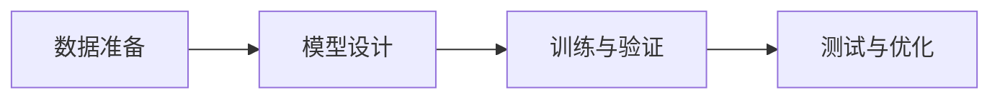

## 1. 背景介绍

随着人工智能技术的飞速发展，大模型已经成为了AI领域的一个热点。Gartner作为全球知名的研究和顾问公司，对AI的未来趋势有着深刻的洞察。在最近的一份报告中，Gartner提出了关于大模型应用开发的8项重要预测，这些预测不仅指明了未来AI技术的发展方向，也为AI Agent的开发提供了宝贵的指导。

## 2. 核心概念与联系

在深入探讨Gartner的预测之前，我们需要明确几个核心概念及其之间的联系：

- **大模型（Large Models）**：指的是具有大量参数的深度学习模型，能够处理复杂的任务，如自然语言处理和图像识别。
- **AI Agent**：是一种能够自动执行任务的智能系统，通常基于大模型来实现其智能功能。
- **应用开发**：指的是将AI Agent集成到实际应用中，以提供智能服务。

这三个概念之间的联系是：大模型作为AI Agent智能核心的基础，而应用开发则是将这种智能通过AI Agent带入实际使用场景。

## 3. 核心算法原理具体操作步骤

在构建大模型时，我们通常遵循以下步骤：

1. **数据准备**：收集和预处理大量的数据，以供模型学习。
2. **模型设计**：设计模型架构，包括选择合适的神经网络层和激活函数。
3. **训练与验证**：使用大规模计算资源进行模型训练，并通过验证集调整模型参数。
4. **测试与优化**：在测试集上评估模型性能，并进行必要的优化。



## 4. 数学模型和公式详细讲解举例说明

以深度学习中的卷积神经网络（CNN）为例，其数学模型可以表示为：

$$
f(x) = \sigma(W * x + b)
$$

其中，$x$ 是输入数据，$W$ 是卷积核的权重矩阵，$b$ 是偏置项，$*$ 表示卷积操作，$\sigma$ 是激活函数。

举例来说，如果我们在图像识别任务中使用CNN，输入$x$将是图像的像素矩阵，通过卷积操作提取特征，并通过激活函数增加非线性，从而使模型能够学习到更复杂的图像特征。

## 5. 项目实践：代码实例和详细解释说明

以TensorFlow为例，构建一个简单的CNN模型的代码如下：

```python
import tensorflow as tf

model = tf.keras.models.Sequential([
    tf.keras.layers.Conv2D(32, (3, 3), activation='relu', input_shape=(28, 28, 1)),
    tf.keras.layers.MaxPooling2D((2, 2)),
    tf.keras.layers.Flatten(),
    tf.keras.layers.Dense(128, activation='relu'),
    tf.keras.layers.Dense(10, activation='softmax')
])

model.compile(optimizer='adam',
              loss='sparse_categorical_crossentropy',
              metrics=['accuracy'])

# 这里省略了数据加载和预处理的代码
# train_images, train_labels 为训练数据和标签
model.fit(train_images, train_labels, epochs=5)
```

在这段代码中，我们首先使用`Conv2D`层来进行卷积操作，接着使用`MaxPooling2D`层进行池化操作，然后将数据扁平化并通过全连接层进行分类。

## 6. 实际应用场景

大模型在多个领域都有广泛的应用，例如：

- **自然语言处理**：如机器翻译、情感分析、文本生成等。
- **图像识别**：如面部识别、医学影像分析、自动驾驶车辆的视觉系统等。
- **推荐系统**：如电商平台的商品推荐、音乐推荐等。

## 7. 工具和资源推荐

- **TensorFlow**：一个广泛使用的深度学习框架，适合构建和训练大模型。
- **PyTorch**：另一个流行的深度学习框架，以其动态计算图而受到许多研究者的青睐。
- **Hugging Face Transformers**：一个提供预训练模型的库，可以极大地简化自然语言处理任务的开发。

## 8. 总结：未来发展趋势与挑战

未来，大模型将继续在AI领域扮演重要角色，但也面临着如计算资源消耗大、模型泛化能力、数据隐私和安全等挑战。Gartner的预测为我们指明了未来的发展方向，我们需要不断探索新的模型架构、优化算法和应用场景，以克服这些挑战。

## 9. 附录：常见问题与解答

- **Q1：大模型的训练成本是否很高？**
  - A1：是的，大模型通常需要大量的计算资源和时间进行训练，这也是目前AI领域面临的一个重要问题。

- **Q2：如何选择合适的深度学习框架？**
  - A2：选择深度学习框架时，需要考虑框架的功能、社区支持、文档完整性以及个人的熟悉程度等因素。

- **Q3：大模型是否总是比小模型好？**
  - A3：并非如此，大模型虽然有更强的学习能力，但也可能导致过拟合。在某些情况下，小模型可能更适合。

作者：禅与计算机程序设计艺术 / Zen and the Art of Computer Programming