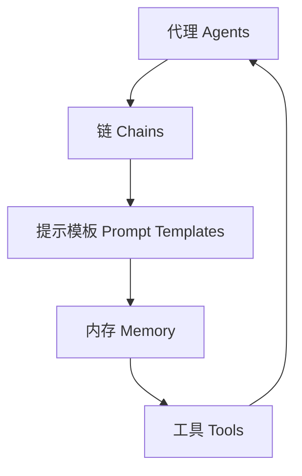
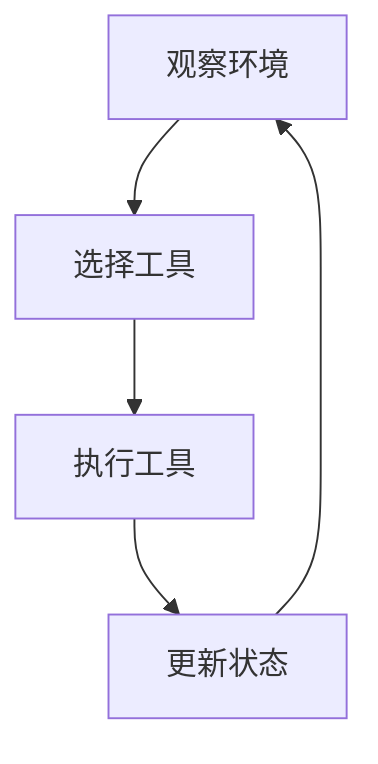

# 【大模型应用开发 动手做AI Agent】LangChain中的工具和工具包

## 1. 背景介绍

### 1.1 大模型时代的到来

近年来,大型语言模型(Large Language Models, LLMs)在自然语言处理(NLP)领域取得了令人瞩目的进展。模型如GPT-3、PaLM、ChatGPT等展现出了强大的语言生成和理解能力,为构建智能对话系统、问答系统、写作辅助等应用提供了新的可能性。

随着模型规模和计算能力的不断提升,大模型正在成为推动人工智能(AI)发展的核心动力。然而,仅依靠大模型本身是远远不够的,我们需要一种灵活、可扩展的方式来组织和利用这些模型,以解决复杂的现实问题。这就是LangChain的用武之地。

### 1.2 LangChain简介

LangChain是一个用于构建大型语言模型应用程序的Python库。它提供了一套模块化的基础设施,允许开发人员轻松组合不同的组件(如模型、数据源、工具等),从而创建强大的AI应用程序。

LangChain的核心理念是将大模型视为一种"智能编程助手",通过将其与外部数据源、工具和服务相结合,扩展其功能和应用范围。这种方法使得开发人员能够快速构建和迭代AI应用程序,而不必从头开始训练复杂的模型。

## 2. 核心概念与联系

### 2.1 LangChain的核心概念

LangChain的核心概念包括代理(Agents)、链(Chains)、提示模板(Prompt Templates)、内存(Memory)和工具(Tools)。这些概念相互关联,共同构建了LangChain的应用程序框架。



1. **代理(Agents)**: 代理是LangChain中最高层次的抽象,它封装了应用程序的逻辑。代理可以与链、工具和内存进行交互,以完成特定的任务。

2. **链(Chains)**: 链是一系列可组合的序列,用于处理和转换数据。它们可以包含提示模板、内存和其他链,形成复杂的数据处理管道。

3. **提示模板(Prompt Templates)**: 提示模板定义了如何将输入数据格式化为大模型可以理解的提示。它们可以包含静态文本、动态变量和其他模板,以生成富有表现力的提示。

4. **内存(Memory)**: 内存用于存储代理或链的状态和历史信息,以支持对话式交互和上下文理解。

5. **工具(Tools)**: 工具是外部功能的包装器,如Web API、数据库查询或计算函数。代理可以调用这些工具来扩展其功能,实现更复杂的任务。

### 2.2 LangChain的应用场景

LangChain可以应用于各种场景,包括但不限于:

- **智能助手**: 构建具有上下文理解和任务执行能力的对话式AI助手。
- **问答系统**: 利用大模型和外部知识源构建强大的问答系统。
- **写作辅助**: 使用大模型生成高质量的文本内容,如文章、报告、代码等。
- **数据分析**: 将大模型与数据源和分析工具相结合,进行数据探索和见解发现。
- **自动化工作流**: 通过将大模型与各种工具和API集成,实现复杂的自动化工作流程。

## 3. 核心算法原理具体操作步骤

LangChain的核心算法原理是基于代理-工具范式(Agent-Tool Paradigm)。该范式将智能代理与外部工具相结合,以扩展大模型的功能和应用范围。

### 3.1 代理-工具范式概述

代理-工具范式由以下几个关键步骤组成:

1. **观察环境**: 代理观察当前的环境状态,包括任务描述、上下文信息等。
2. **选择工具**: 代理根据当前状态和任务目标,选择合适的工具来执行。
3. **执行工具**: 代理调用选定的工具,并将工具的输出作为新的观察结果。
4. **更新状态**: 代理根据工具的输出更新内部状态和记忆。
5. **重复上述步骤**: 代理重复执行上述步骤,直到完成任务或达到终止条件。



### 3.2 代理-工具范式实现

在LangChain中,代理-工具范式通过以下核心组件实现:

1. **代理(Agent)**: 代理是一个封装了任务逻辑的高级抽象。它负责观察环境、选择工具、执行工具和更新状态。LangChain提供了多种预定义的代理类型,如序列代理(SequentialAgent)、反思代理(ReflectingAgent)等。

2. **工具(Tool)**: 工具是对外部功能的封装,如Web API、数据库查询或计算函数。代理可以调用这些工具来扩展其功能。LangChain提供了许多预构建的工具,如Wikipedia查询工具、Python REPL工具等。

3. **内存(Memory)**: 内存用于存储代理的状态和历史信息,以支持对话式交互和上下文理解。LangChain支持多种内存类型,如基于向量的内存(VectorMemory)和基于缓存的内存(ConversationBufferMemory)。

4. **链(Chain)**: 链是一系列可组合的序列,用于处理和转换数据。它们可以包含提示模板、内存和其他链,形成复杂的数据处理管道。LangChain提供了多种预定义的链类型,如序列链(SequentialChain)、转换链(TransformChain)等。

5. **提示模板(Prompt Template)**: 提示模板定义了如何将输入数据格式化为大模型可以理解的提示。它们可以包含静态文本、动态变量和其他模板,以生成富有表现力的提示。LangChain支持多种提示模板类型,如基于模板字符串的提示(PromptTemplate)和基于少示例的提示(FewShotPromptTemplate)。

通过组合和配置这些核心组件,开发人员可以构建各种复杂的AI应用程序,实现从简单的问答系统到复杂的任务自动化的广泛应用场景。

## 4. 数学模型和公式详细讲解举例说明

虽然LangChain主要关注于构建基于大型语言模型的应用程序,但它也支持将数学模型和公式与语言模型相结合,以实现更强大的功能。

### 4.1 语言模型与数学模型的结合

大型语言模型已经展现出了在自然语言处理任务中的出色表现,但在处理数学和符号推理方面仍存在一些挑战。通过将语言模型与专门的数学模型相结合,我们可以利用两者的优势,实现更全面的智能系统。

LangChain提供了一种灵活的方式来集成数学模型,例如符号计算引擎(如SymPy)或数值计算库(如NumPy)。这些模型可以作为工具与代理进行交互,代理可以根据需要调用这些工具来执行数学计算或符号推理。

### 4.2 数学公式的表示和处理

在LangChain中,数学公式可以使用LaTeX语法进行表示。LaTeX是一种广泛使用的标记语言,用于排版科技文档,特别擅长于表示数学公式和符号。

LangChain支持在提示模板中嵌入LaTeX公式,以便将数学表达式传递给语言模型。同时,它也支持从语言模型的输出中解析LaTeX公式,并将其转换为适当的数学对象,以便进一步处理或计算。

以下是一个示例,展示了如何在LangChain中使用LaTeX公式:

```python
from langchain import PromptTemplate

template = """
求解以下方程:
$$\\int_{0}^{1} x^{2} dx = {result}$$
"""

prompt = PromptTemplate(template=template, input_variables=["result"])
output = prompt.format(result="?")
print(output)
```

上述代码将生成以下提示:

```
求解以下方程:
$$\int_{0}^{1} x^{2} dx = ?$$
```

然后,我们可以将这个提示传递给语言模型,并从模型的输出中提取结果。

### 4.3 数学模型的集成示例

下面是一个示例,展示了如何在LangChain中集成SymPy符号计算引擎,以求解积分问题:

```python
import sympy as sp
from langchain.agents import initialize_agent, Tool
from langchain.tools import SymPyTool

# 定义SymPy工具
sympy_tool = SymPyTool()

# 初始化代理并添加SymPy工具
tools = [sympy_tool]
agent = initialize_agent(tools, sympy_tool.name, agent="zero-shot-react-description", verbose=True)

# 定义任务
task = "计算积分 \\int_{0}^{1} x^{2} dx 的值"

# 运行代理
agent.run(task)
```

在这个示例中,我们首先定义了一个`SymPyTool`实例,作为代理可以调用的工具。然后,我们初始化了一个代理,并将`SymPyTool`添加到代理的工具列表中。

接下来,我们定义了一个任务,要求代理计算一个积分的值。代理将观察到这个任务,并根据任务描述选择合适的工具(在这种情况下是`SymPyTool`)来执行计算。

最后,代理将调用`SymPyTool`执行积分计算,并将结果作为输出返回。

通过这种方式,LangChain允许我们将语言模型与各种数学模型和计算库相结合,从而实现更强大的功能和应用场景。

## 5. 项目实践:代码实例和详细解释说明

为了更好地理解LangChain的使用方式,让我们通过一个实际项目来探索它的核心功能和工作流程。在这个示例中,我们将构建一个简单的问答系统,利用语言模型和Wikipedia作为知识源。

### 5.1 项目概述

我们的目标是创建一个问答代理,能够回答各种与Wikipedia相关的问题。该代理将与Wikipedia API交互,检索相关信息并生成答案。我们将使用LangChain提供的各种组件,如代理、工具、链和内存,来构建这个系统。

### 5.2 项目设置

首先,我们需要安装LangChain及其依赖项:

```bash
pip install langchain openai wikipedia
```

接下来,我们导入所需的模块和库:

```python
from langchain.agents import initialize_agent, Tool
from langchain.agents import AgentType
from langchain.memory import ConversationBufferMemory
from langchain.utilities import WikipediaAPIWrapper
```

### 5.3 定义Wikipedia工具

我们将Wikipedia API封装为一个LangChain工具,以便代理可以调用它:

```python
# 初始化Wikipedia工具
wiki_tool = Tool(
    name="Wikipedia Search",
    func=WikipediaAPIWrapper().run,
    description="A Wikipedia API wrapper to search for relevant information."
)
```

### 5.4 初始化代理

接下来,我们初始化一个代理,并将Wikipedia工具添加到其工具列表中:

```python
# 初始化内存
memory = ConversationBufferMemory(memory_key="chat_history")

# 初始化代理
tools = [wiki_tool]
agent = initialize_agent(tools, memory=memory, agent=AgentType.CONVERSATIONAL_REACT_DESCRIPTION, verbose=True)
```

在这个示例中,我们使用了`ConversationBufferMemory`作为代理的内存,以存储对话历史。我们还指定了`AgentType.CONVERSATIONAL_REACT_DESCRIPTION`作为代理类型,这是一种适合对话式交互的代理。

### 5.5 运行代理

现在,我们可以向代理提出问题,并观察它如何利用Wikipedia工具来生成答案:

```python
# 运行代理
query = "什么是人工智能?"
agent.run(query)
```

代理将首先检索与"人工智能"相关的Wikipedia信息,然后根据检索到的信息生成一个答案。整个过程将在控制台中打印出来,以便我们了解代理的思考过程。

### 5.6 代码解释

让我们逐步解释上述代码:

1. 我们首先导入所需的模块和库,包括`langchain.agents`、`langchain.memory`和`langchain.utilities`。

2.