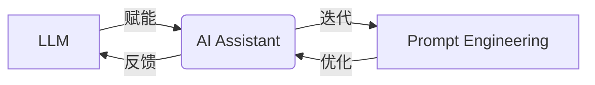

# 【大模型应用开发 动手做AI Agent】不写代码，在Playground中玩Assistants

## 1. 背景介绍

### 1.1 人工智能发展现状

近年来,人工智能(Artificial Intelligence, AI)技术取得了突飞猛进的发展。从图像识别、语音交互到自然语言处理,AI已经渗透到我们生活的方方面面。尤其是随着深度学习、大数据等技术的不断成熟,AI正在从感知智能走向认知智能,从专用智能走向通用智能。

### 1.2 大语言模型的崛起  

在AI技术发展的浪潮中,大语言模型(Large Language Model, LLM)无疑是最引人瞩目的明星。LLM是一种基于海量文本数据训练的语言模型,通过学习文本中的词汇、语法、语义等知识,可以生成连贯、通顺的文本。从2018年的BERT、GPT到2020年的GPT-3,再到2022年的PaLM、BLOOM等,LLM的参数规模和性能不断刷新纪录,展现出了惊人的能力。

### 1.3 AI助手的应用前景

LLM强大的语言理解和生成能力,为开发智能AI助手(AI Assistant)提供了坚实的基础。AI助手可以作为人们的贴身助理,提供问答、写作、分析、规划等各种服务,大大提高工作和生活效率。微软的Copilot、Anthropic的Claude、OpenAI的ChatGPT等,就是利用LLM打造的新一代AI助手的杰出代表。可以预见,AI助手将在教育、金融、医疗、客服等领域得到广泛应用,成为数字经济时代的重要生产力。

## 2. 核心概念与联系

### 2.1 大语言模型(LLM)

LLM本质上是一个基于深度神经网络的语言模型,通过在大规模文本语料上进行预训练,学习到丰富的语言知识。主流的LLM一般采用Transformer等注意力机制的网络结构,利用自监督学习从海量无标注文本中习得通用语言表征。LLM的参数量动辄上百亿甚至上千亿,需要强大的算力支持。

### 2.2 提示工程(Prompt Engineering)

Prompt Engineering是指如何设计输入给LLM的提示(Prompt),以引导模型生成我们期望的输出。通过精心构造Prompt中的指令、任务描述、示例等,可以激发LLM的语义理解和推理能力,使其更好地完成特定任务。优秀的Prompt不仅能提高LLM的效果,还能扩展其应用范围。可以说,Prompt Engineering是LLM应用开发的核心所在。

### 2.3 AI助手(AI Assistant)

AI助手是一种基于LLM等AI技术,为用户提供个性化智能服务的应用。它通过自然语言交互,理解用户意图,并给出相应的回答、建议或行动。现代AI助手一般采用Retrieval+LLM的技术架构,即先从知识库检索相关信息,再利用LLM生成最终回复。AI助手的核心能力包括语义理解、逻辑推理、多轮对话、个性塑造等。

### 2.4 概念联系

LLM、Prompt Engineering和AI Assistant三者紧密相关,构成了大模型应用开发的核心要素:



LLM为AI助手提供语言理解和生成能力的底层引擎,Prompt Engineering则是驱动LLM为AI助手赋能的关键。二者相辅相成,共同推动AI助手的进化和落地。同时,AI助手的应用实践也为LLM和Prompt Engineering的改进提供了方向和动力,形成良性循环。

## 3. 核心算法原理具体操作步骤

### 3.1 LLM预训练

LLM的预训练一般采用自回归语言模型(Auto-regressive Language Model)的范式,即根据前面的词预测下一个词。以GPT-3为例,其预训练的核心步骤如下:

1. 准备大规模高质量的无标注文本语料,进行清洗和预处理
2. 将文本进行Tokenization,转换为词表中的Token ID序列  
3. 将Token ID序列划分为固定长度的训练样本,如512
4. 使用Transformer Decoder作为骨干网络,输入为Token ID序列,输出为下一个Token的概率分布
5. 计算输出与真实下一个Token的交叉熵损失,并使用Adam等优化器更新模型参数
6. 重复步骤4-5,直到模型收敛或达到预设的训练步数

通过这种自监督学习,LLM可以习得Token之间的依赖关系和语义信息,建立起强大的语言理解和生成能力。

### 3.2 Prompt Engineering设计

一个好的Prompt需要包含明确的指令、必要的背景知识、输入输出格式、恰当的例子等。以常见的问答任务为例,其Prompt设计的具体步骤如下:

1. 明确任务目标,例如回答用户提出的问题
2. 设计指令,引导模型执行任务,如"请回答下面的问题:"
3. 提供必要的背景知识,让模型了解问题的上下文,如"基于以下材料"
4. 指定输入输出格式,方便模型理解和生成,如"问题:xxx\n答案:"
5. 给出恰当的例子,启发模型遵循期望的思路,如"问题:xxx\n答案:xxx"
6. 在实际数据上测试Prompt,并根据反馈迭代优化

一个优质的Prompt不仅能提升模型的表现,还能引导其生成符合伦理、安全、可控的结果。

### 3.3 AI助手开发

利用LLM和Prompt Engineering构建AI助手,一般需要以下几个步骤:

1. 明确助手的定位和功能,如聊天助手、写作助手等
2. 搭建Retrieval+LLM的系统架构,选择合适的LLM和检索模型
3. 准备高质量的知识库,作为助手的背景知识来源
4. 针对不同功能设计对应的Prompt,引导LLM生成期望的输出
5. 开发对话管理模块,实现多轮交互和上下文理解
6. 设计个性化的语料和Prompt,赋予助手鲜明的性格特征
7. 在真实用户的反馈中不断迭代优化助手的各项能力

一个成功的AI助手需要在技术、产品、运营等方面进行精细打磨,最终为用户带去智能、高效、个性化的体验。

## 4. 数学模型和公式详细讲解举例说明

### 4.1 语言模型的概率公式

LLM本质上是一个概率语言模型,它估计一个句子 $X=(x_1,x_2,...,x_T)$ 的概率。假设 $x_t$ 只与其之前的词相关,则有:

$$P(X)=\prod_{t=1}^TP(x_t|x_1,x_2,...,x_{t-1})$$

其中, $P(x_t|x_1,x_2,...,x_{t-1})$ 表示根据前 $t-1$ 个词预测第 $t$ 个词 $x_t$ 的条件概率。

以 "我爱自然语言处理" 这个句子为例,语言模型估计其概率的过程如下:

$$\begin{aligned}
P(我爱自然语言处理) &= P(我) \cdot P(爱|我) \cdot P(自然|我,爱) \\
                  &\quad \cdot P(语言|我,爱,自然) \cdot P(处理|我,爱,自然,语言)
\end{aligned}$$

可见,语言模型通过将句子概率分解为一系列条件概率的乘积,并利用前文信息估计下一个词的概率。

### 4.2 Transformer 的注意力机制

Transformer 是LLM的主流架构,其核心是自注意力(Self-attention)机制。以 GPT 中的 Transformer Decoder为例,第 $l$ 层第 $i$ 个位置的Self-attention可以表示为:

$$\begin{aligned}
Q_i^l &= X_i^{l-1}W_Q^l \\
K_i^l &= X_i^{l-1}W_K^l \\
V_i^l &= X_i^{l-1}W_V^l \\
\text{Attention}(Q_i^l, K^l, V^l) &= \text{softmax}(\frac{Q_i^l{K^l}^T}{\sqrt{d_k}})V^l
\end{aligned}$$

其中, $X_i^{l-1}$ 是上一层第 $i$ 个位置的输出, $W_Q^l, W_K^l, W_V^l$ 是可学习的参数矩阵, $d_k$ 是 $K$ 的维度。

直观地理解,Self-attention 计算了当前位置 $Q_i^l$ 与所有位置 $K^l$ 的相似度,并将其作为权重对 $V^l$ 进行加权求和。这使得模型能够捕捉到不同位置之间的长距离依赖关系,从而建模全局语义。

## 5. 项目实践:代码实例和详细解释说明

在实际开发中,我们一般会使用现有的LLM如GPT-3作为基座,通过Prompt Engineering进行微调。以下是使用OpenAI API和Python实现一个简单问答助手的示例代码:

```python
import openai

openai.api_key = "your_api_key"  # 替换为你的API Key

def ask_assistant(prompt):
    completions = openai.Completion.create(
        engine="text-davinci-003",  # 选择GPT-3的引擎
        prompt=prompt,
        max_tokens=1024,
        n=1,
        stop=None,
        temperature=0.5,
    )
    message = completions.choices[0].text
    return message.strip()

prompt = """
请你扮演一位智能助手,用以下格式回答用户的问题。
问题:用户输入的问题
回答:助手的回答

问题:自然语言处理包括哪些任务?
回答:自然语言处理主要包括以下任务:
1. 分词:将文本划分为词的序列
2. 词性标注:标记每个词的词性,如名词、动词等
3. 命名实体识别:识别文本中的实体,如人名、地名等
4. 句法分析:分析句子的语法结构,生成句法树
5. 语义角色标注:标注句子中的语义角色,如施事、受事等
6. 指代消解:确定代词所指代的对象
7. 情感分析:判断文本的情感倾向,如正面、负面、中性
8. 文本分类:将文本分到预定义的类别中
9. 文本生成:根据上文或提示生成下一段文本
10. 机器翻译:将一种语言的文本翻译成另一种语言

以上任务涵盖了NLP从词汇到语义的多个层次,综合利用这些技术,可以开发出智能对话、信息抽取、文本挖掘等实际应用。

问题:{}
回答:
""".format(input("请输入你的问题:"))

reply = ask_assistant(prompt)
print(reply)
```

这段代码的解释如下:

1. 首先导入openai库,并设置API Key
2. 定义ask_assistant函数,用于向OpenAI发送Prompt并获取回复
   - engine参数指定使用davinci模型
   - prompt参数传入我们设计的Prompt
   - max_tokens限制生成的最大Token数
   - temperature控制生成的多样性
3. 在Prompt中,我们提供了明确的角色定位、输入输出格式和一个例子
4. 将用户输入的问题插入到Prompt的问题部分
5. 调用ask_assistant函数,获取GPT-3生成的回答并打印出来

运行这段代码,就可以与我们的问答助手进行简单的对话了。通过不断优化Prompt和迭代功能,我们可以打造出更加智能和个性化的AI助手。

## 6. 实际应用场景

基于LLM和Prompt Engineering构建的AI助手可以应用于多个领域,为人们的工作和生活带来便利。下面列举几个有代表性的应用场景:

### 6.1 智能客服

传统客服面临着24小时全天候服务、客户问题千奇百怪等挑战。而AI助手可以作为客服的得力助手,快速准确地解答客户的常见问题,大大减轻人工客服的压力。当遇到AI助手无法回答的问题时,再转交人工处理,实现人机协同。

### 6.2 个