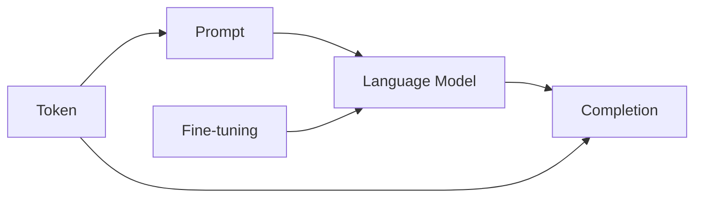

# 【大模型应用开发 动手做AI Agent】何谓OpenAI API

## 1. 背景介绍
### 1.1 人工智能的发展历程
#### 1.1.1 早期人工智能
#### 1.1.2 机器学习时代 
#### 1.1.3 深度学习的崛起

### 1.2 大语言模型的出现
#### 1.2.1 Transformer模型的诞生
#### 1.2.2 GPT系列模型的发展
#### 1.2.3 ChatGPT的问世

### 1.3 OpenAI的崛起
#### 1.3.1 OpenAI的成立背景
#### 1.3.2 OpenAI的研究方向
#### 1.3.3 OpenAI API的推出

## 2. 核心概念与联系
### 2.1 什么是OpenAI
#### 2.1.1 OpenAI的定义
#### 2.1.2 OpenAI的愿景
#### 2.1.3 OpenAI的业务模式

### 2.2 OpenAI API概述
#### 2.2.1 OpenAI API的定义
OpenAI API是由OpenAI推出的一个应用程序接口，它允许开发者访问OpenAI训练的大型语言模型，如GPT-3，并将其集成到自己的应用程序中。通过OpenAI API，开发者可以利用强大的自然语言处理能力来构建各种创新的应用，如聊天机器人、内容生成、语言翻译等。

#### 2.2.2 OpenAI API的特点
- 强大的自然语言处理能力：基于GPT-3等先进的语言模型，OpenAI API能够理解和生成接近人类水平的自然语言。
- 灵活的应用场景：OpenAI API可以应用于各种领域，如客户服务、教育、游戏、写作等。
- 易于集成：通过RESTful API接口，开发者可以方便地将OpenAI API集成到自己的应用程序中。
- 按使用付费：OpenAI API采用按使用量计费的定价模式，开发者可以根据自己的需求灵活选择。

#### 2.2.3 OpenAI API与其他NLP API的比较
与Google Cloud Natural Language API、IBM Watson等其他自然语言处理API相比，OpenAI API的主要优势在于其基于大规模语言模型的强大能力。GPT-3拥有1750亿个参数，是目前最大的语言模型之一，能够生成高质量、连贯的文本。同时，OpenAI API的定价也相对更加灵活和实惠。

### 2.3 OpenAI API的核心概念
#### 2.3.1 Prompt
Prompt是指输入给语言模型的文本，用于指导模型生成所需的输出。设计好的Prompt可以引导模型生成高质量、符合需求的文本。

#### 2.3.2 Completion
Completion是指语言模型根据给定的Prompt生成的文本输出。OpenAI API支持多种参数来控制Completion的生成，如最大长度、温度等。

#### 2.3.3 Token
Token是指构成输入和输出文本的基本单元。OpenAI API使用基于字节对编码（Byte Pair Encoding, BPE）的分词方式，每个Token可能是一个单词、词缀或标点符号。API的定价也是基于Token的数量计算的。

#### 2.3.4 Fine-tuning
Fine-tuning是指在特定领域数据上对预训练的语言模型进行微调，使其更好地适应特定任务。OpenAI支持在自己的数据集上对模型进行Fine-tuning，以获得更好的性能。

### 2.4 核心概念之间的关系



上图展示了OpenAI API的核心概念之间的关系。用户提供Prompt作为输入，语言模型根据Prompt生成Completion作为输出。Prompt和Completion都由Token序列构成。通过Fine-tuning可以优化语言模型在特定任务上的表现。

## 3. 核心算法原理具体操作步骤
### 3.1 GPT模型的基本原理
#### 3.1.1 Transformer架构
GPT模型基于Transformer架构，其核心是自注意力机制（Self-Attention）和前馈神经网络（Feed-Forward Neural Network）。自注意力机制允许模型在处理当前Token时关注输入序列中的任意位置，捕捉Token之间的长距离依赖关系。

#### 3.1.2 无监督预训练
GPT模型采用无监督预训练的方式，在大规模文本数据上学习语言的统计规律和模式。预训练的目标是最大化下一个Token的概率，即根据给定的前几个Token预测下一个最可能出现的Token。

#### 3.1.3 迁移学习
预训练得到的GPT模型可以通过迁移学习应用于下游任务，如文本分类、问答等。具体方法是在下游任务的数据上对预训练模型进行Fine-tuning，调整模型参数以适应特定任务。

### 3.2 使用OpenAI API的步骤
#### 3.2.1 注册和认证
首先需要在OpenAI官网注册一个账号，并获取API密钥（API Key）。API密钥用于验证身份和计费。

#### 3.2.2 选择合适的模型
OpenAI API提供了多个预训练的语言模型，如davinci、curie、babbage和ada。不同的模型在能力和成本上有所差异，需要根据任务需求选择合适的模型。

#### 3.2.3 设计Prompt
设计一个好的Prompt对于获得高质量的输出至关重要。Prompt应该清晰、具体，包含足够的上下文信息，引导模型生成所需的内容。

#### 3.2.4 调用API生成Completion
使用HTTP请求调用OpenAI API，发送Prompt并指定相关参数，如模型、温度、最大长度等。API将返回生成的Completion。

#### 3.2.5 解析和应用结果
对API返回的Completion进行解析和后处理，将其集成到应用程序的业务逻辑中。

### 3.3 Fine-tuning模型的步骤
#### 3.3.1 准备数据集
收集和准备与目标任务相关的高质量数据集，包括输入文本和期望的输出。数据集应该足够大且覆盖diverse的场景。

#### 3.3.2 数据预处理
将数据集转换为OpenAI API要求的JSONL格式，每行表示一个训练样本，包含prompt和completion字段。

#### 3.3.3 上传数据集
使用OpenAI CLI工具将JSONL格式的数据集上传到OpenAI服务器。

#### 3.3.4 启动Fine-tuning作业
通过OpenAI API创建一个Fine-tuning作业，指定预训练模型和上传的数据集。Fine-tuning过程可能需要几个小时到几天的时间，具体取决于数据集的大小和模型的复杂度。

#### 3.3.5 使用Fine-tuned模型
Fine-tuning完成后，可以通过API调用Fine-tuned模型，就像使用预训练模型一样。Fine-tuned模型在目标任务上通常会有更好的表现。

## 4. 数学模型和公式详细讲解举例说明
### 4.1 Transformer的自注意力机制
Transformer的核心是自注意力机制，它允许模型在处理当前Token时关注输入序列中的任意位置。对于输入序列$X = (x_1, x_2, ..., x_n)$，自注意力机制的计算过程如下：

1. 将输入序列$X$通过三个线性变换得到查询向量$Q$、键向量$K$和值向量$V$：

$$
\begin{aligned}
Q &= XW^Q \\
K &= XW^K \\
V &= XW^V
\end{aligned}
$$

其中$W^Q$、$W^K$和$W^V$是可学习的参数矩阵。

2. 计算查询向量$Q$与所有键向量$K$的注意力分数：

$$
A = \text{softmax}(\frac{QK^T}{\sqrt{d_k}})
$$

其中$d_k$是查询向量和键向量的维度，用于缩放点积结果。

3. 将注意力分数$A$与值向量$V$相乘，得到自注意力的输出：

$$
\text{Attention}(Q, K, V) = AV
$$

自注意力机制通过学习查询、键和值的表示，使模型能够动态地关注输入序列中的不同位置，捕捉Token之间的依赖关系。

### 4.2 语言模型的概率公式
GPT模型作为一种语言模型，其目标是估计给定前几个Token的情况下，下一个Token的条件概率分布。对于Token序列$X = (x_1, x_2, ..., x_n)$，语言模型的概率公式可以表示为：

$$
P(X) = \prod_{i=1}^n P(x_i | x_1, x_2, ..., x_{i-1})
$$

其中$P(x_i | x_1, x_2, ..., x_{i-1})$表示在给定前$i-1$个Token的情况下，第$i$个Token为$x_i$的条件概率。

在实际应用中，语言模型通常使用softmax函数将模型的输出转换为概率分布：

$$
P(x_i | x_1, x_2, ..., x_{i-1}) = \text{softmax}(f(x_1, x_2, ..., x_{i-1}))
$$

其中$f$表示语言模型的前向计算过程，将前$i-1$个Token映射为一个向量，softmax函数将该向量转换为下一个Token的概率分布。

通过最大化训练数据的似然概率，语言模型学习到了自然语言的统计规律和模式，可以生成连贯、合理的文本。

## 5. 项目实践：代码实例和详细解释说明
下面是一个使用Python和OpenAI API生成文本的简单示例：

```python
import openai

openai.api_key = "your_api_key"

prompt = "Once upon a time"

response = openai.Completion.create(
    engine="davinci",
    prompt=prompt,
    max_tokens=100,
    n=1,
    stop=None,
    temperature=0.7,
)

generated_text = response.choices[0].text.strip()
print(generated_text)
```

代码解释：

1. 首先导入`openai`库，并设置API密钥`openai.api_key`。

2. 定义一个Prompt，这里使用"Once upon a time"作为故事的开头。

3. 调用`openai.Completion.create()`方法，传入以下参数：
   - `engine`：使用的模型，这里选择"davinci"。
   - `prompt`：输入的Prompt。
   - `max_tokens`：生成文本的最大Token数，这里设置为100。
   - `n`：生成的Completion数量，这里设置为1。
   - `stop`：停止生成的标志，这里设置为None，表示由模型自行决定何时停止。
   - `temperature`：控制生成文本的创造性和多样性，取值范围为0到1，这里设置为0.7。

4. 从API返回的响应中提取生成的文本，并打印出来。

运行该代码，可能会得到类似下面的输出：

```
Once upon a time, in a small village nestled in the heart of a lush forest, there lived a young girl named Lily. She was known throughout the village for her kind heart and her love for animals. Every day, Lily would venture into the woods, seeking out creatures in need of help.

One particularly sunny morning, as Lily was walking along her usual path, she heard a faint whimper coming from a nearby bush. Curious, she carefully parted the leaves and found a tiny, injured fox kit. The poor creature had a deep gash on its leg and was clearly in pain.
```

这个示例展示了如何使用OpenAI API生成连贯、富有创意的文本。通过调整Prompt和其他参数，可以控制生成文本的风格和内容。

## 6. 实际应用场景
OpenAI API可以应用于各种场景，下面是一些具体的例子：

### 6.1 聊天机器人
利用OpenAI API，可以构建智能的聊天机器人，与用户进行自然、连贯的对话。聊天机器人可以应用于客户服务、心理咨询、教育等领域，提供24/7的服务。

### 6.2 内容生成
OpenAI API可以根据给定的主题、关键词或上下文，自动生成高质量的文章、故事、诗歌等内容。这可以帮助内容创作者提高效率，同时确保内容的质量和原创性。

### 6.3 代码生成
OpenAI API不仅可以处理自然语言，还可以生成代码。通过提供代码的注释或描述，API可以自动生成对应的代码片段，帮助开发者提高编程效率。

### 6.4 语言翻译
利用OpenAI API强大的语言理解能力，可以构建高质量的机器翻译系