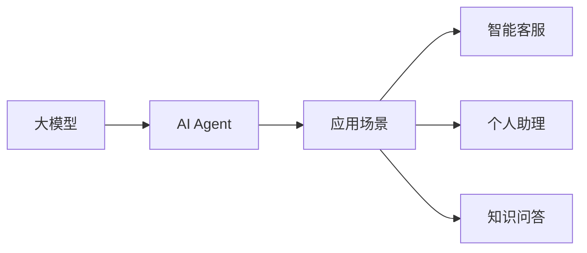
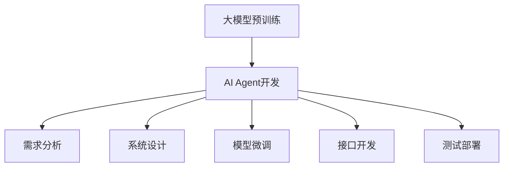

# 【大模型应用开发 动手做AI Agent】思维树

## 1. 背景介绍

### 1.1 人工智能发展历程回顾
#### 1.1.1 人工智能的起源与发展
#### 1.1.2 人工智能的三次浪潮
#### 1.1.3 人工智能的现状与挑战

### 1.2 大语言模型的崛起 
#### 1.2.1 大语言模型的概念与特点
#### 1.2.2 大语言模型的发展历程
#### 1.2.3 大语言模型的应用前景

### 1.3 AI Agent的兴起
#### 1.3.1 AI Agent的定义与内涵
#### 1.3.2 AI Agent的发展现状
#### 1.3.3 AI Agent的应用场景

## 2. 核心概念与联系

### 2.1 大模型
#### 2.1.1 大模型的定义
#### 2.1.2 大模型的特点
#### 2.1.3 大模型的分类

### 2.2 AI Agent
#### 2.2.1 AI Agent的定义
#### 2.2.2 AI Agent的组成要素
#### 2.2.3 AI Agent的分类

### 2.3 大模型与AI Agent的关系
#### 2.3.1 大模型是AI Agent的基础
#### 2.3.2 AI Agent赋予大模型应用价值
#### 2.3.3 二者相辅相成、互为补充

### 2.4 Mermaid流程图


## 3. 核心算法原理具体操作步骤

### 3.1 大模型预训练
#### 3.1.1 数据准备
#### 3.1.2 模型选择
#### 3.1.3 训练过程

### 3.2 AI Agent开发
#### 3.2.1 需求分析
#### 3.2.2 系统设计
#### 3.2.3 模型微调
#### 3.2.4 接口开发
#### 3.2.5 测试部署

### 3.3 Mermaid流程图


## 4. 数学模型和公式详细讲解举例说明

### 4.1 Transformer模型
#### 4.1.1 Transformer的网络结构
#### 4.1.2 Self-Attention机制
#### 4.1.3 位置编码

Transformer的核心是Self-Attention机制，其数学表达式为：

$$Attention(Q,K,V) = softmax(\frac{QK^T}{\sqrt{d_k}})V$$

其中，$Q$、$K$、$V$分别表示Query、Key、Value，$d_k$为Key的维度。

### 4.2 BERT模型
#### 4.2.1 BERT的网络结构  
#### 4.2.2 Masked Language Model
#### 4.2.3 Next Sentence Prediction

BERT的目标函数包括Masked Language Model和Next Sentence Prediction两部分，其数学表达式为：

$$\mathcal{L}_{BERT} = \mathcal{L}_{MLM} + \mathcal{L}_{NSP}$$

其中，$\mathcal{L}_{MLM}$表示Masked Language Model的损失，$\mathcal{L}_{NSP}$表示Next Sentence Prediction的损失。

## 5. 项目实践：代码实例和详细解释说明

### 5.1 环境准备
#### 5.1.1 硬件要求
#### 5.1.2 软件环境
#### 5.1.3 数据集

### 5.2 模型训练
#### 5.2.1 模型定义
#### 5.2.2 数据预处理
#### 5.2.3 训练过程

以下是使用PyTorch训练BERT模型的代码示例：

```python
import torch
from transformers import BertTokenizer, BertForMaskedLM

# 加载预训练模型和分词器
tokenizer = BertTokenizer.from_pretrained('bert-base-uncased')
model = BertForMaskedLM.from_pretrained('bert-base-uncased')

# 准备数据
text = "Hello I'm a [MASK] model."
input_ids = tokenizer.encode(text, return_tensors='pt')

# 模型推理
with torch.no_grad():
    outputs = model(input_ids)
    predictions = outputs[0]
    predicted_index = torch.argmax(predictions[0, 4]).item()
    predicted_token = tokenizer.convert_ids_to_tokens([predicted_index])[0]

print(predicted_token)  # 输出: language
```

### 5.3 模型应用
#### 5.3.1 模型部署
#### 5.3.2 接口设计
#### 5.3.3 应用示例

## 6. 实际应用场景

### 6.1 智能客服
#### 6.1.1 客户意图识别
#### 6.1.2 问题自动应答
#### 6.1.3 客户情绪分析

### 6.2 个人助理
#### 6.2.1 日程管理
#### 6.2.2 信息检索
#### 6.2.3 任务自动化

### 6.3 知识问答
#### 6.3.1 知识图谱构建
#### 6.3.2 问题理解与匹配
#### 6.3.3 答案生成

## 7. 工具和资源推荐

### 7.1 开源框架
#### 7.1.1 TensorFlow
#### 7.1.2 PyTorch
#### 7.1.3 Hugging Face Transformers

### 7.2 预训练模型
#### 7.2.1 BERT
#### 7.2.2 GPT-3
#### 7.2.3 T5

### 7.3 数据集
#### 7.3.1 Wikipedia
#### 7.3.2 BookCorpus
#### 7.3.3 Common Crawl

## 8. 总结：未来发展趋势与挑战

### 8.1 大模型的发展趋势
#### 8.1.1 模型规模不断增大
#### 8.1.2 模型结构不断创新
#### 8.1.3 预训练范式不断丰富

### 8.2 AI Agent的发展趋势
#### 8.2.1 多模态交互能力增强  
#### 8.2.2 个性化定制服务普及
#### 8.2.3 行业知识融合加深

### 8.3 未来挑战
#### 8.3.1 数据隐私与安全
#### 8.3.2 模型可解释性
#### 8.3.3 模型公平性

## 9. 附录：常见问题与解答

### 9.1 大模型和小模型的区别是什么？
大模型通常指参数量在亿级以上的模型，如GPT-3有1750亿参数；而小模型一般指参数量在千万到亿级之间。大模型能够学习到更丰富的知识，生成更加流畅、连贯的文本，但训练成本高昂。小模型训练速度快，部署更灵活，在特定任务上表现也可以优于大模型。

### 9.2 AI Agent能否最终取代人工客服？ 
AI Agent在回答高频问题、7x24小时无间断服务等方面具有优势，但面对复杂个性化需求时，仍需人工客服介入处理。AI Agent是对人工客服的补充，二者将长期共存。随着AI Agent的不断发展，其能够承担的工作会越来越多。

### 9.3 如何防止AI Agent生成有害内容？
可以从数据、算法、应用多个层面着手。在数据方面，训练数据要进行严格清洗，确保没有危险、极端内容。算法方面，可以设置文本生成的边界，避免生成特定类型的内容。应用层面，可以对AI Agent生成的内容进行实时检测，对有害内容进行过滤。


作者：禅与计算机程序设计艺术 / Zen and the Art of Computer Programming